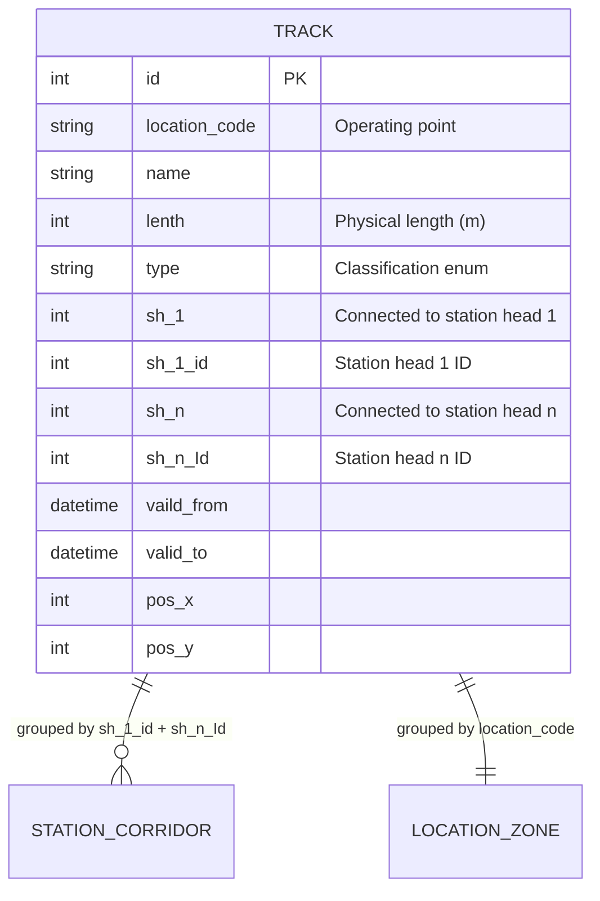
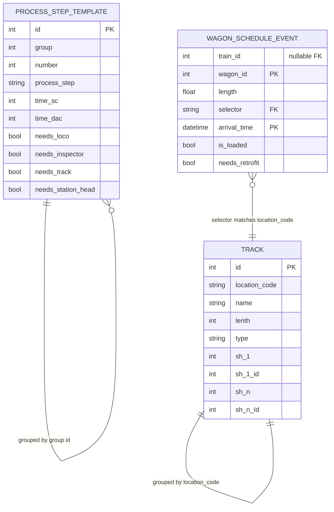

# Examples Documentation

## Overview

This explains and visualizes railway track data structures for simulation purposes. It includes example CSV files containing track details, process timing templates, and wagon scheduling data, along with documentation describing the data relationships.
To understand it better review this README for conceptual understanding of entities and relationships and examine the CSV files in the example_secnario_251027 directory for real world data.

## Example Files

- Example Scenario:
  - [`.example_secnario_251027/track_list_medium_251027.csv`](examples/track_list_medium_251027.csv) - Track infrastructure definitions
  - [`.example_secnario_251027/process_times_medium_251027.csv`](examples/process_times_medium_251027.csv) - Process step timing templates
  - [`.example_secnario_251027/test_train_schedule_medium_2025_10_23.csv`](examples/test_train_schedule_medium_2025_10_23.csv) - Wagon arrival schedule with train assignments

## Data Model & Relationships

### 1. Track Infrastructure ([`track_list_medium_251027.csv`](examples/track_list_medium_251027.csv))

**Purpose:** Defines the physical railway tracks and their properties.

**Columns** (preserving source typos):
- `id` (int) – Unique track identifier
- `location_code` (string) – Operating point or grouping code (Betriebsstelle oder Gruppierungscode)
- `name` (string) – Human-readable track name (e.g., B1, Hump, Track_5)
- `lenth` (int) – Physical track length in meters *(typo in source)*
- `type` (string) – Track classification (see types below)
- `sh_1` (0/1) – Indicates if track is connected to station head 1 (entry point)
- `sh_1_id` (int) – ID of the first station head this track connects to
- `sh_n` (0/1) – Indicates if track is connected to station head n (exit point)
- `sh_n_Id` (int) – ID of the last station head this track connects to
- `vaild_from`, `valid_to` (datetime) – Temporal validity window *(typo in source)*
- `pos_x`, `pos_y` (int) – Coordinates for visualization

**Track Types:**
- `workshop` – Workshop (tent for retrofitting operations / Werkstatt/Zelt für Umrüstungen)
- `to_be_retroffitted` – Feeder track before the workshop (Zuführungsgleis vor dem Workshop) *(typo in source)*
- `retrofitted` – Track after retrofit completion, post-workshop (Gleis nach der Umrüstung nach dem Workshop)
- `station_head_1` / `station_head_n` – Station head connecting element (Bahnhofskopf verbindendes Element)
- `circulating_track` – Track for shunting movements (Gleis für Rangierfahrten)
- `parking` – Parking position after retrofit completion (Abstellplatz nach Umrüstung wenn fertiggestellt)
- `collection` – Track where selector has assembled wagons together (Gleis nach dem Selektor die Wagen zusammengestellt hat)
- `selector` – Hump yard / classification track where wagons pass for retrofit selection (Ablaufberg - Gleis auf dem Wagen zur Umrüstungsauswahl vorbeikommen)
- `dispenser` – Not relevant (nicht relevant)

**Key Concepts:**
- **Station Corridor:** All tracks sharing the same (`sh_1_id`, `sh_n_Id`) pair form a corridor between two station heads
- **Location Code:** Groups tracks into logical operating points or operational zones (Betriebsstelle)
- **Retrofit Workflow:** Wagons requiring retrofit flow through this sequence:
  1. `selector` – Classification at hump yard (wagon arrives for retrofit selection)
  2. `collection` – Assembly track after selection
  3. `to_be_retroffitted` – Feeder track before workshop
  4. `workshop` – Retrofit operations performed
  5. `retrofitted` – Post-workshop holding track
  6. `parking` – Final parking position when retrofit complete

**Diagram:**

*Note: STATION_CORRIDOR and LOCATION_ZONE are logical groupings, not separate database tables.*

### 2. Process Timing Templates ([`process_times_medium_251027.csv`](examples/process_times_medium_251027.csv))

**Purpose:** Defines time durations for standard railway operations and required resources.

**Columns:**
- `id`, `group`, `number` – Hierarchical step identifiers
- `location` – Location scope (0 = general, specific codes for location-specific times)
- `process_step` – Operation name (e.g., `train_arrival`, `train_preparation_base`, `shunting_movement`)
- `time_sc`, `time_dac` – Duration in minutes under two different scenarios
- `other unit` – Alternative measurement unit (rarely used)
- `loco` (0/1) – Requires locomotive resource
- `inspector` (0/1) – Requires inspector resource
- `track` (0/1) – Occupies track resource
- `station_head` (0/1) – Requires station head capacity
- `comment` – Human-readable description

**Process Groups:**
1. **Train Operations** (group 1): Arrival, coupling, departure sequences
2. **Shunting** (group 2): Locomotive movements, wagon rearrangement
3. **Workshop** (group 3): Maintenance processing
4. **Delays & Timing** (group 4): Waiting periods, readiness thresholds

**Resource Consumption:**
- Each process step declares which resources it needs (loco, inspector, track, station_head)
- Simulation must ensure resource availability before executing steps
- Some steps scale with wagon count (e.g., `train_perparation_add_per_wagon`)

### 3. Wagon Schedule ([`test_train_schedule_medium_2025_10_23.csv`](examples/test_train_schedule_medium_2025_10_23.csv))

**Purpose:** Lists wagon arrival events with train assignments and routing information.

**Columns:**
- `train_id` (int, nullable) – Train grouping; empty means unassigned wagon
- `wagon_id` (int) – Unique wagon identifier
- `length` (float) – Wagon length in meters *(appears twice - data quality issue)*
- `selector` (string) – Target yard code (matches `location_code` in tracks)
- `arrival_time` (datetime) – When wagon enters the system
- `is_loaded` (bool) – Cargo status (affects processing time)
- `needs_retrofit` (bool) – Must undergo retrofit workflow

**Data Patterns:**
- **Multiple events per wagon:** Same `wagon_id` appears at different `arrival_time` values → represents wagon lifecycle (arrival, re-handling, departure)
- **Empty train_id:** Leading semicolon indicates free/unassigned wagons that will later be grouped into trains
- **Selector routing:** `selector` field determines which yard (`location_code`) receives the wagon

**Logical Entities (not physically in CSV):**
- **Wagon:** Identified by `wagon_id`; has properties `length`, `is_loaded`, `needs_retrofit`
- **Train:** Identified by `train_id`; aggregates multiple wagons
- **Schedule Event:** Each CSV row; links wagon to arrival time and location

### 4. Complete Data Relationship Model

This diagram shows how all three CSV files relate conceptually:

**Key Relationships:**

1. **WAGON_SCHEDULE_EVENT → TRACK**
   - `selector` field links to `location_code` (many-to-one)
   - Determines which yard receives the wagon

2. **WAGON_SCHEDULE_EVENT (train_id)**
   - Multiple schedule events with same `train_id` form a train composition
   - Nullable: unassigned wagons have empty `train_id`

3. **TRACK (corridor grouping)**
   - Tracks with matching (`sh_1_id`, `sh_n_Id`) form operational corridors
   - Tracks with matching `location_code` belong to same operating point

4. **PROCESS_STEP_TEMPLATE (independent)**
   - No direct foreign keys to tracks or wagons
   - Applied at simulation runtime based on operation type

### 5. Data Quality Notes

**Known Issues:**
- **Typos:** `lenth` (length), `vaild_from` (valid), `to_be_retroffitted` (retrofitted), `train_perparation` (preparation)
- **Duplicate columns:** `length` appears twice in schedule file with identical values
- **Missing values:** Some schedule rows lack `train_id` or `arrival_time`
- **Whitespace:** `selector` codes have inconsistent spacing (e.g., "DEF F" vs "ABC_D")

**Validation Recommendations:**
- Trim and normalize `selector` values before matching to `location_code`
- Treat `train_id` as optional in data loading logic
- Validate `arrival_time` is not null before processing

### 6. Example Workflow: Wagon Lifecycle

**Scenario:** A loaded wagon needing retrofit arrives at yard ABC_D

1. **Arrival Event**
   - CSV row: `;12345;20.82;ABC_D;2031-07-20 10:00:00;20.82;true;true`
   - Wagon 12345 arrives at location ABC_D, no train assigned yet
   - `is_loaded=true`, `needs_retrofit=true`

2. **Selector Classification**
   - Wagon passes over `selector` track (hump yard)
   - System evaluates: empty wagon needed for retrofit
   - Decision: route to retrofit workflow

3. **Collection Track**
   - Wagon moves to `collection` track where classified wagons are assembled
   - Waits for shunting locomotive availability

4. **Retrofit Routing**
   - System finds available `to_be_retroffitted` track (feeder before workshop)
   - Shunting locomotive moves wagon when track is free
   - Applies process steps from group 2 (shunting operations)

5. **Workshop Processing**
   - Wagon enters `workshop` track
   - Applies process steps from group 3 (workshop operations)
   - Resources needed: track occupancy, possibly inspector

6. **Post-Retrofit Holding**
   - Wagon moved to `retrofitted` track after workshop completion
   - Status changes: `needs_retrofit=false`

7. **Parking Assignment**
   - When ready for service, wagon moves to `parking` track
   - Available for train formation

8. **Train Assembly**
   - Multiple wagons grouped with same `train_id` value
   - New schedule event: `241243;12345;20.82;ABC_D;2031-07-22 08:00:00;20.82;true;false`
   - Now assigned to train 241243

9. **Departure Preparation**
   - Process steps from group 1 applied: `train_preparation_base` + `train_perparation_add_per_wagon` × wagon count
   - Resources: locomotive, inspector, track, station_head
   - Uses timing from [`process_times_medium_251027.csv`](examples/process_times_medium_251027.csv)

10. **Departure**
    - `train_departure` step frees track and station_head resources
    - Wagon/train leaves system or transitions to next location

### 7. Business Rules

#### Selector Condition (Retrofit Classification)

A wagon is routed to the retrofit workflow when **all** conditions are true:
- Selector track (`type=selector`) is available
- Collection track (`type=collection`) is free
- Wagon is empty (`is_loaded=false`)
- Wagon needs retrofit AND has not been retrofitted yet (`needs_retrofit=true`)

#### Shunting Locomotive Dispatch

A shunting locomotive is dispatched from collection track to feeder track when **all** conditions are met:
- Number of wagons on collection track ≥ configured threshold (configurable parameter)
- Shunting locomotive is available (resource check)
- Target `to_be_retroffitted` track is free (capacity check)

### 8. Future Enhancements

**Normalization Suggestions:**
- Create `WAGON` master table (separate from schedule events)
- Create `TRAIN` composition table linking `train_id` to `wagon_id`
- Create `CORRIDOR` table grouping tracks by (`sh_1_id`, `sh_n_Id`)
- Add `TRACK_TYPE` enum table with descriptions
- Version `PROCESS_STEP_TEMPLATE` table by date ranges

**Additional Data Needs:**
- Track capacity constraints (max wagons per track)
- Resource availability schedules (locomotive/inspector rosters)
- Route definitions (explicit path sequences between tracks)
- Configurable thresholds for business rules (e.g., minimum wagon count for shunting)
- Resource pools (number of available shunting locomotives, inspectors)

### 9. Event Trigger

**Selector condition true**

Wagonb on selector track + collection track free + wagon empty + needs retrofit / retrofit not done yet

**Shunting Locomotive move**
Number for retorfit batch reached on collection track + shunting locomotive available + to be retrofitted track free
