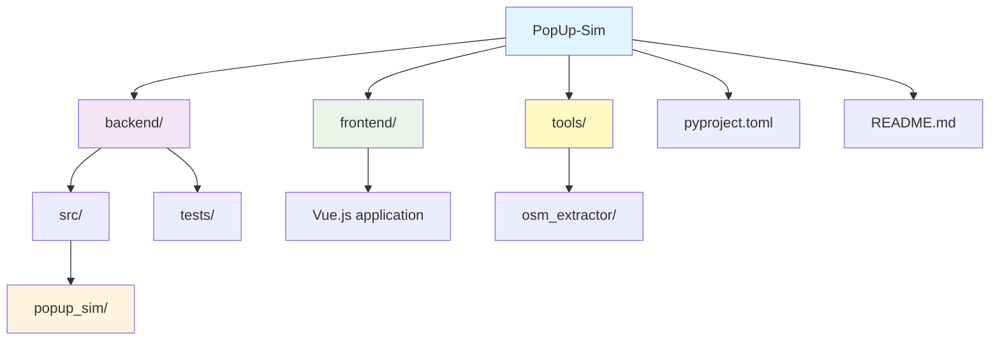

# PopUp-Sim

PopUp-Sim is a microscopic simulation tool that models the European freight rail industry's transition to Digital Automatic Couplers (DAC), simulating the complex logistics of retrofitting 500,000 freight wagons during a critical 3-week "big bang" migration period. The tool helps railway operators test different scenarios for temporary "pop-up" workshops, optimize locomotive schedules, and identify bottlenecks before real-world implementation to avoid costly mistakes during the actual migration.

## Installation
Currently installation is only possible from source. Installation using PyPi maybe added in the future.

### From Source

**Using uv:**
```bash
git clone https://github.com/jhw-db/PopUp-Sim.git
cd PopUp-Sim
uv sync --frozen
```

## Development Setup

### Prerequisites

- Python 3.13 or higher
- [uv](https://docs.astral.sh/uv/) package manager

### Setup Development Environment

1. **Clone the repository:**
   ```bash
   git clone https://github.com/jhw-db/PopUp-Sim.git
   cd PopUp-Sim
   ```

2. **Install uv (if not already installed):**
   ```bash
   # On macOS and Linux
   curl -LsSf https://astral.sh/uv/install.sh | sh

   # On Windows
   powershell -c "irm https://astral.sh/uv/install.ps1 | iex"
   ```

3. **Install dependencies:**
   ```bash
   uv sync --all-extras --dev
   ```

4. **Activate the virtual environment:**
   ```bash
   # On Unix/macOS
   source .venv/bin/activate

   # On Windows
   .venv\Scripts\activate
   ```

5. **Install pre-commit hooks:**
   ```bash
   uv run pre-commit install
   ```

6. **Setup dev hooks:**
  ```bash
  uv run ./setup/dev/set_commit_msg_hooks.py
   ```

### Development Commands

- **Run tests:**
  ```bash
  uv run pytest
  
  # Run tests for specific tool
  uv run pytest tools/osm_extractor/tests/
  uv run pytest tools/osm2popupsim/tests/
  ```

- **Format code:**
  ```bash
  uv run ruff format .
  ```

- **Lint code:**
  ```bash
  uv run ruff check .
  ```

- **Type checking:**
  ```bash
  uv run mypy backend/src/
  ```

- **Code quality analysis:**
  ```bash
  uv run pylint backend/src/
  ```

- **Run all checks (format, lint, type check, test):**
  ```bash
  uv run ruff format . && uv run ruff check . && uv run mypy backend/src/ && uv run pylint backend/src/ && uv run pytest
  ```

### Code Quality & Pre-commit Hooks

The project uses pre-commit hooks to ensure code quality. These run automatically on every commit:

- **File checks:** Trailing whitespace, end-of-file fixes, YAML/TOML validation
- **Code formatting:** Ruff formatter (tabs, single quotes, 120 char lines)
- **Linting:** Ruff linter with complexity metrics (bugs, unused code, simplifications, McCabe complexity)
- **Type checking:** MyPy for static type analysis with error codes and column numbers
- **Code quality:** Pylint for comprehensive code quality analysis

**Manual pre-commit run:**
```bash
uv run pre-commit run --all-files
```

### Testing

Both tools include pytest test suites:

**osm_extractor:**
- Comprehensive unit and integration tests
- High test coverage
- Mocked external dependencies

**osm2popupsim:**
- CLI command tests
- Conversion and plotting tests

**Run tests:**
```bash
# All tests
uv run pytest

# Specific tool
uv run pytest tools/osm_extractor/tests/ -v
uv run pytest tools/osm2popupsim/tests/ -v

# With coverage
uv run pytest --cov=tools/osm_extractor/src --cov=tools/osm2popupsim/src
```

### Project Structure



## Tools

The project includes two specialized tools for railway data extraction and conversion:

### 1. OSM Railway Data Extractor

A comprehensive tool for extracting, processing, and visualizing railway infrastructure data from OpenStreetMap.

**Features:**
- Extract railway data from OSM using Overpass API
- Clip data to precise geographic boundaries (bounding box or polygon)
- Project coordinates to Cartesian system (elliptical Mercator)
- Visualize railway networks with specialized markers
- Filter by railway types and node types
- Include/exclude disused and razed tracks

**Documentation:** [tools/osm_extractor/README.md](tools/osm_extractor/README.md)

**Quick Start:**
```bash
# Install dependencies
uv sync --group osm-extractor

# Extract railway data with projection and clipping
uv run --group osm-extractor osm-extractor extract \
  "47.37,8.54,47.39,8.56" -t bbox -o railway_data.json --project --clip

# Visualize with labels
uv run --group osm-extractor osm-extractor plot railway_data.json \
  -o network.png --labels --switch-labels
```

### 2. OSM to PopUpSim Converter

Convert OpenStreetMap railway data to PopUpSim network format for microscopic simulation.

**Features:**
- Convert OSM data to PopUpSim topology format
- Extract track definitions from OSM ref tags
- Automatic switch topology detection using angle analysis
- Plot networks with track type visualization
- Animate train movements (Folium HTML or Matplotlib GIF)

**Documentation:** [tools/osm2popupsim/README.md](tools/osm2popupsim/README.md)

**Quick Start:**
```bash
# Install dependencies
uv sync --group osm2popupsim

# Convert OSM to PopUpSim topology
uv run osm2popupsim convert railway_data.json -o topology.yaml -d "Yard name"

# Extract tracks from OSM ref tags
uv run osm2popupsim extract-tracks railway_data.json topology.yaml -o tracks.yaml

# Plot network
uv run osm2popupsim plot topology.yaml -t tracks.yaml -o network.png
```

### Complete Pipeline: OSM to PopUpSim

```bash
# 1. Extract from OSM with projection
uv run --group osm-extractor osm-extractor extract \
  "52.276235,11.426263 52.276402,11.426447 52.278037,11.421849 52.280368,11.416562" \
  -t polygon -o railway_data.json --project --clip

# 2. Convert to PopUpSim format
uv run osm2popupsim convert railway_data.json -o topology.yaml -d "My Yard"

# 3. Extract tracks
uv run osm2popupsim extract-tracks railway_data.json topology.yaml -o tracks.yaml

# 4. Visualize
uv run osm2popupsim plot topology.yaml -t tracks.yaml -o network.png
```

## Contributing

1. Fork the repository
2. Create a feature branch (`git checkout -b feature/amazing-feature`)
3. Make your changes
4. Run the development checks to ensure code quality
5. Commit your changes (`git commit -m 'Add amazing feature'`)
6. Push to the branch (`git push origin feature/amazing-feature`)
7. Open a Pull Request

## License

This project is licensed under the Apache 2.0 License - see the [LICENSE](LICENSE) file for details.

## Acknowledgments

- The initial version used as foundation was created during Dreiländerhack 2024 with support of ÖBB, DB, and SBB
