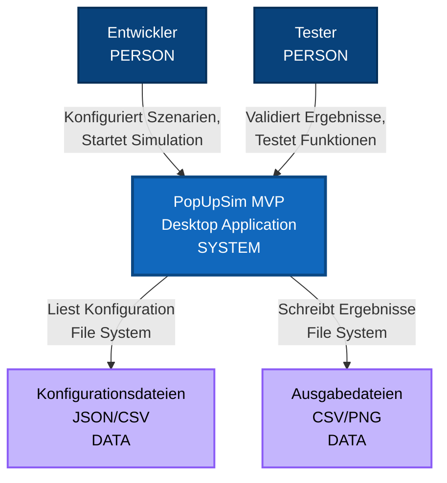
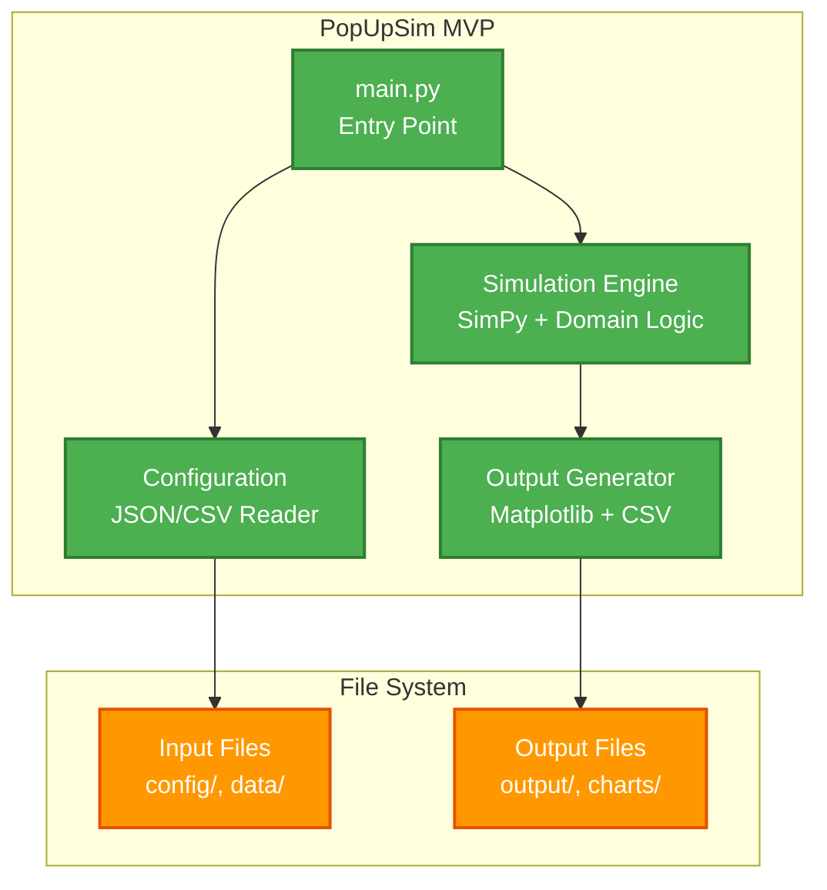
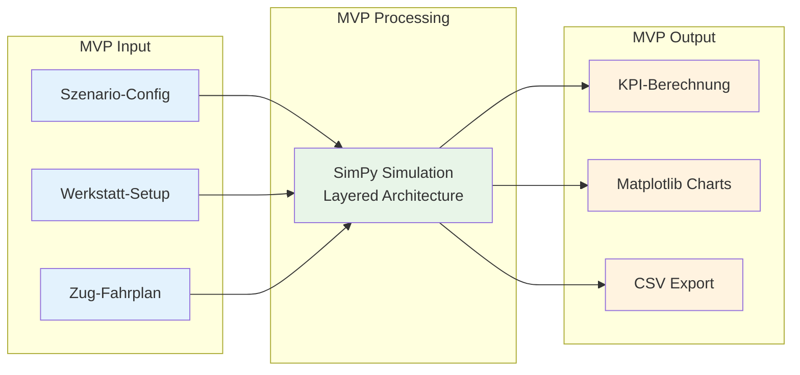
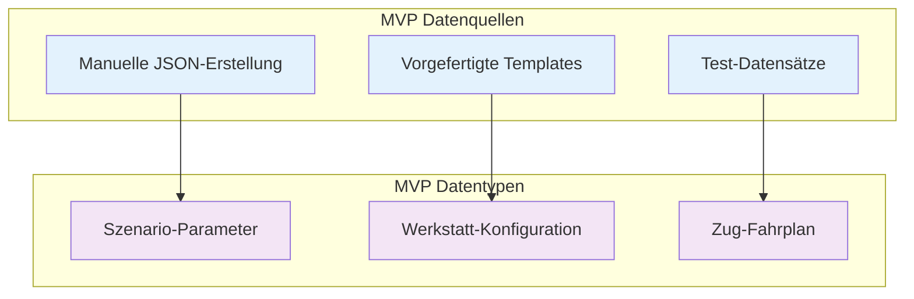
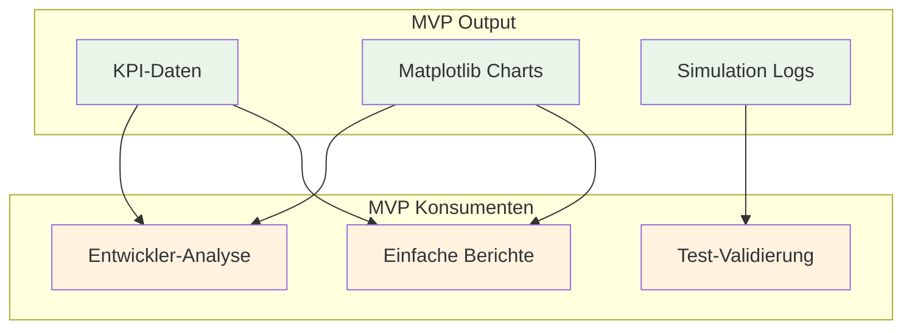

# 3. Kontextabgrenzung (MVP)

## 3.1 MVP Fachlicher Kontext

### MVP System Context Diagramm (C4 Level 1)



### MVP Akteure und Schnittstellen

#### Primäre MVP Akteure (Benutzer)

| Akteur | MVP Rolle | Interaktion | Erwartung |
|--------|-----------|-------------|-----------|
| **Entwickler** | MVP Entwicklung und Testing | Konfiguriert JSON-Dateien, startet Python-Script | Funktionsfähige Simulation, CSV-Output |
| **Tester** | Validierung der Simulationslogik | Führt Testszenarien durch, prüft Ergebnisse | Korrekte KPI-Berechnung, Matplotlib-Charts |

#### MVP Datenquellen und -senken

| System | MVP Zweck | Schnittstelle | Datenformat |
|--------|-----------|---------------|-------------|
| **Konfigurationsdateien** | Szenario-Definition | File System | JSON (Parameter), CSV (Daten) |
| **Ausgabedateien** | Simulationsergebnisse | File System | CSV (KPIs), PNG (Charts) |

## 3.2 MVP Technischer Kontext

### MVP Schnittstellen-Übersicht



### MVP Datei-Schnittstellen

#### Input Files (Konfiguration)

| Datei | Format | MVP Zweck | Schema |
|-------|--------|-----------|--------|
| **scenario.json** | JSON | Simulationsparameter | [mvp-scenario-schema.json] |
| **workshop_config.csv** | CSV | Werkstatt-Konfiguration | [mvp-workshop-schema.csv] |
| **train_schedule.csv** | CSV | Eingehende Züge | [mvp-trains-schema.csv] |

#### Output Files (Ergebnisse)

| Datei | Format | MVP Zweck | Inhalt |
|-------|--------|-----------|--------|
| **simulation_results.csv** | CSV | KPI-Daten | Durchsatz, Auslastung, Wartezeiten |
| **kpi_charts.png** | PNG | Matplotlib-Visualisierung | Balken- und Liniendiagramme |
| **simulation_log.json** | JSON | Event-Timeline | Simulationsereignisse |

## 3.3 MVP Fachliche Kontextabgrenzung

### Was MVP PopUpSim verarbeitet



### MVP Fachliche Grenzen

#### Innerhalb des MVP Kontexts (Was MVP MACHT)
- ✅ **Grundlegende Bahnhofssimulation**: Vereinfachte Rangieroperationen
- ✅ **DAK-Umrüstungssimulation**: Werkstatt-Prozesse
- ✅ **KPI-Berechnung**: Durchsatz, Auslastung, Wartezeiten
- ✅ **Matplotlib-Visualisierung**: Einfache Charts und Diagramme
- ✅ **CSV-Export**: Strukturierte Datenausgabe

#### Außerhalb des MVP Kontexts (Was MVP NICHT macht)
- ❌ **Web-Interface**: Nur Desktop-Anwendung
- ❌ **Real-time Updates**: Batch-Verarbeitung
- ❌ **Event-driven Architecture**: Direkte Service-Aufrufe

## 3.4 MVP Datenfluss-Kontext

### MVP Eingangsdaten



### MVP Ausgangsdaten



## 3.5 MVP Externe Abhängigkeiten

### MVP Kritische Abhängigkeiten

| System | Kritikalität | MVP Ausfallverhalten | Mitigation |
|--------|--------------|---------------------|------------|
| **JSON/CSV Dateien** | Hoch | Simulation nicht startbar | Validierung, Beispiel-Dateien |
| **Python Environment** | Hoch | Anwendung läuft nicht | Requirements.txt, Virtual Environment |
| **SimPy Framework** | Hoch | Simulation nicht möglich | Framework-Abstraktion vorbereiten |

### MVP Optionale Abhängigkeiten

| System | Nutzen | MVP Ausfallverhalten | Workaround |
|--------|--------|---------------------|------------|
| **Matplotlib** | Visualisierung | Nur CSV-Output | Externe Chart-Tools |
| **Pandas** | Datenverarbeitung | Manuelle CSV-Verarbeitung | Native Python CSV |

## 3.6 MVP File System Structure

### MVP Verzeichnisstruktur

```
popupsim-mvp/
├── config/
│   ├── scenario.json          # Simulationsparameter
│   ├── workshop_config.csv    # Werkstatt-Setup
│   └── train_schedule.csv     # Zug-Fahrplan
├── data/
│   └── templates/             # Vorgefertigte Konfigurationen
├── output/
│   └── scenario_xxx           # Name des Szenarios
│       ├── simulation_results.csv # KPI-Daten
│       ├── kpi_charts.png         # Matplotlib-Charts
│       └── simulation_log.json    # Event-Timeline

├── src/
│   ├── main.py               # Entry Point
│   ├── configuration/        # Configuration Layer
│   ├── simulation/           # Business Logic Layer
│   └── output/               # Output Layer
└── requirements.txt          # Python Dependencies
```

### MVP Konfigurationsdateien

#### scenario.json (Beispiel)
```json
{
  "scenario_id": "scenario_001",
  "start_date": "2025-10-15",
  "end_date": "2025-10-16",
  "random_seed": 42,
  "workshop": {
    "tracks": [
      {"id": "TRACK01", "capacity": 5, "retrofit_time_min": 30},
      {"id": "TRACK02", "capacity": 3, "retrofit_time_min": 45}
    ]
  },
  "train_schedule_file": "train_schedule.csv"
}
```

#### workshop_tracks.csv (Beispiel)
```csv
track_id,capacity,retrofit_time_min
TRACK01,5,30
TRACK02,3,45
TRACK03,4,35
```

#### train_schedule.csv (Beispiel)
```csv
train_id,arrival_date,arrival_time,wagon_id,length,is_loaded,needs_retrofit
TRAIN001,2025-10-15,08:00,W001_01,15.5,true,true
TRAIN001,2025-10-15,08:00,W001_02,15.5,false,true
TRAIN002,2025-10-15,10:30,W002_01,18.0,true,true
```

---

**Navigation:** [← MVP Randbedingungen](02-constraints.md) | [MVP Lösungsstrategie →](04-solution-strategy.md)