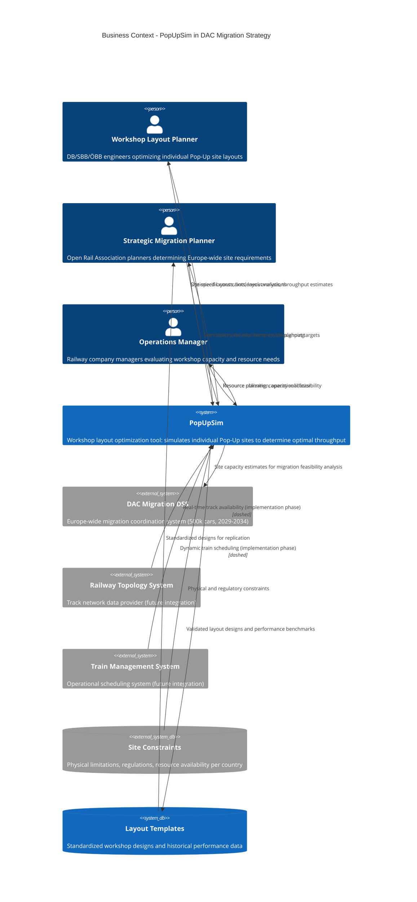
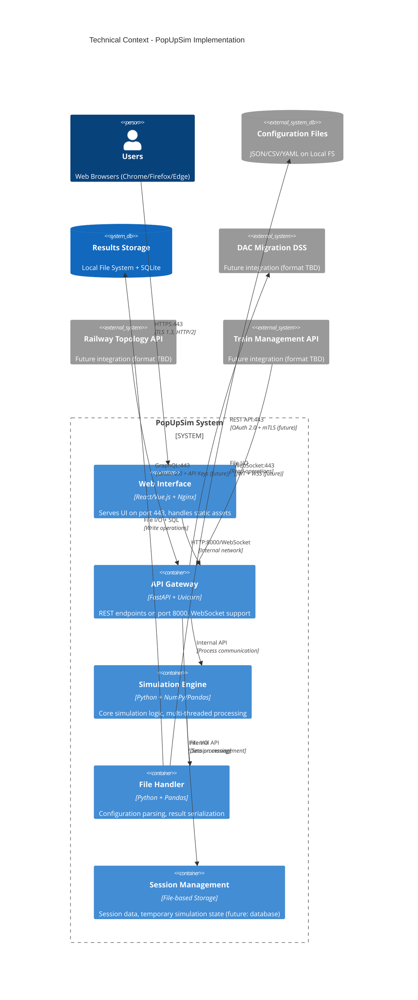
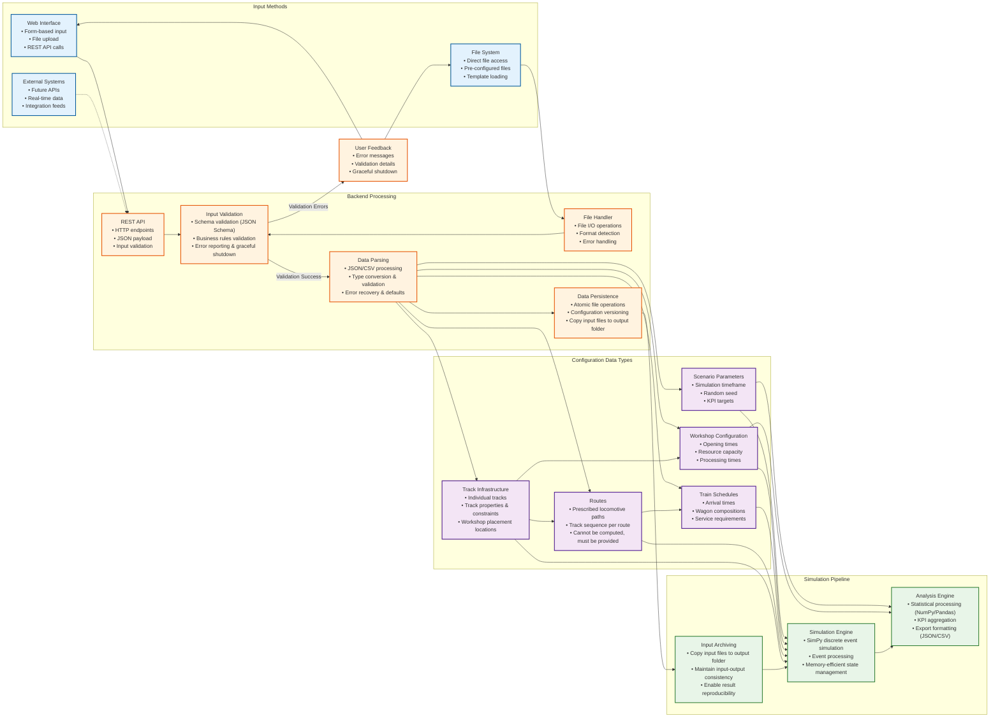
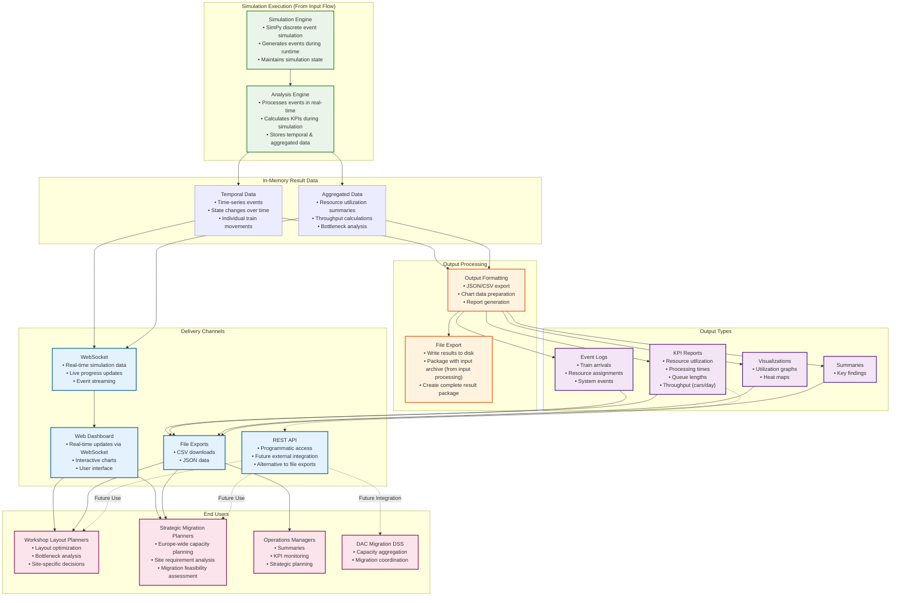

# 3. System Scope and Context

## 3.1 Business Context

**PopUpSim's Role in DAC Migration Strategy:**

PopUpSim is a **workshop layout optimization tool** within Europe's 500,000-car DAC retrofit program (2029-2034). The tool helps determine if the migration strategy is feasible by optimizing individual Pop-Up workshop layouts and calculating their throughput capacity.

**Strategic Business Logic:**
1. **Europe must retrofit 500,000 cars** by 2034 using temporary Pop-Up workshop sites
2. **PopUpSim simulates individual workshop layouts** to determine optimal throughput (cars/day)
3. **Strategic planners use results** to calculate: "How many sites with Layout X do we need for 500k cars?"
4. **Layout optimization directly impacts** the feasibility and economics of the entire migration program

**Business Impact Examples:**
- **Layout A**: 30 cars/day → Need 45+ sites across Europe
- **Layout B**: 50 cars/day → Need 27+ sites across Europe
- **Layout C**: 70 cars/day → Need 19+ sites across Europe

**Business Value Proposition:**
- **Feasibility Validation**: Determines if 500k car migration is achievable with proposed infrastructure
- **Cost Optimization**: Minimizes number of required Pop-Up sites through layout optimization
- **Risk Mitigation**: Identifies bottlenecks and capacity constraints before site construction
- **Standardization**: Enables reusable workshop designs across European railway companies

### 3.1.1 Communication Partners

| External Entity | Input to PopUpSim | Output from PopUpSim | Business Purpose |
|-----------------|-------------------|----------------------|------------------|
| **Workshop Layout Planner** | Site constraints, layout variations, resource limits | Optimized layouts, throughput estimates, bottleneck analysis | Optimize individual Pop-Up workshop sites for maximum car processing capacity |
| **Strategic Migration Planner** | Standardization requirements, throughput targets | Site capacity data, layout templates, feasibility analysis | Determine total number of Pop-Up sites needed across Europe for 500k car migration |
| **Operations Manager** | Resource availability, operational constraints | Resource utilization reports, operational feasibility assessment | Validate that proposed layouts are operationally viable with available resources |
| **DAC Migration DSS** | - | Aggregated capacity estimates, site requirements | Integrate individual site capacities into Europe-wide migration planning |

### 3.1.2 Data Sources & Outputs

| Entity | Type | Content | Business Purpose |
|--------|------|---------|------------------|
| **Site Constraint Files** | Input | Track topology, physical limitations, regulatory requirements | Define realistic constraints for each Pop-Up workshop location |
| **Workshop Configuration** | Input | Resource capacity, processing times, operating schedules | Model workshop operations and resource availability |
| **Train Schedule Data** | Input | Wagon arrival patterns, service requirements, routing | Simulate realistic workload for capacity planning |
| **Throughput Analysis** | Output | Cars/day capacity, resource utilization, bottleneck identification | Determine optimal layout performance for strategic planning |
| **Layout Comparison Reports** | Output | Side-by-side layout performance, cost-benefit analysis | Support decision-making for standardized workshop designs |
| **Capacity Estimates** | Output | Site-specific throughput data for DAC Migration DSS | Enable Europe-wide migration feasibility assessment |
| **Input File Archive** | Output | Copy of original configuration files with simulation results | Ensure reproducibility and maintain input-output consistency |

### 3.1.3 Future Extensions (Implementation Phase)

| External Entity | Input to PopUpSim | Business Value |
|-----------------|-------------------|----------------|
| **Railway Topology System** | Real-time track availability, maintenance windows | Enable dynamic layout optimization based on actual network conditions |
| **Train Management System** | Live train schedules, dynamic arrivals | Support real-time workshop operations during actual DAC migration |
| **Multi-Site Coordination** | Cross-site capacity sharing, overflow management | Optimize workshop network performance across multiple Pop-Up sites |

## 3.2 Technical Context

### 3.2.1 Technical Channels and Transmission Media

**Current Technical Interfaces:**

| Channel | Transmission Media | Protocol/Format | Direction | Description |
|---------|-------------------|-----------------|-----------|-------------|
| **Web Interface** | TCP/IP Network | HTTPS (Port 443) | Bidirectional | User access via web browsers |
| **Configuration Input** | Local File System | File I/O (JSON/CSV/YAML) | Input | Static scenario configuration files (formats under specification) |
| **Results Output** | Local File System | File I/O (JSON/CSV) | Output | Simulation results and exports (formats under specification, future: Parquet for snapshots) |
| **Internal Communication** | Process Memory | HTTP/WebSocket | Internal | API Gateway to Simulation Engine |

**Future Technical Interfaces (To Be Determined):**

| Channel | Transmission Media | Protocol/Format | Direction | Description |
|---------|-------------------|-----------------|-----------|-------------|
| **DAC Integration** | TCP/IP Network | TBD (possibly no integration needed) | Output | Capacity estimates, layout performance data (if required) |
| **Railway Topology** | TCP/IP Network | TBD | Input | Track definitions, constraints, maintenance windows |
| **Train Management** | TCP/IP Network | TBD | Input | Real-time train arrivals, schedule updates |

### 3.2.2 Functional to Technical Mapping

**Current Implementation:**

| Functional Interface | Technical Channel | Transmission Media | Security |
|---------------------|-------------------|-------------------|----------|
| **Web-based Configuration** | Web Browser → HTTP/HTTPS → REST API → Backend | Localhost (127.0.0.1) | Input validation, CSRF protection |
| **File-based Configuration** | Configuration Files → File I/O → File Handler | Local File System | Input validation, schema validation |
| **Results Export** | Simulation Engine → File I/O → Results Storage | Local File System | OS file permissions |
| **Real-time Updates** | Simulation Engine → WebSocket → Web Interface | Localhost (127.0.0.1) | No authentication needed |

**Future Extensions (Technical Details TBD):**

| Functional Interface | Technical Channel | Transmission Media | Security |
|---------------------|-------------------|-------------------|----------|
| External Data Integration | Railway APIs → API Gateway | TCP/IP Network | TBD (authentication method to be determined) |
| Result Sharing | Simulation Engine → DAC Migration DSS | TCP/IP Network | TBD (may not be needed) |
| Dynamic Input | Train Management → Real-time Processing | TCP/IP Network | TBD |

### 3.2.3 Security and Quality Requirements

**Local Deployment Security (Single User):**
- **HTTP/HTTPS** for web interface (TLS optional for local deployment)
- **Localhost binding** (127.0.0.1) to prevent external network access
- **No authentication required** for local single-user access

**Data Protection:**
- **Input validation** with schema validation and file size limits
- **Output sanitization** preventing XSS in web interface
- **File system permissions** using standard OS user permissions
- **No data encryption needed** for local configuration files

**Future External Integration Security:**
- **TLS 1.3** for external API connections (when implemented)
- **Authentication** for external systems (method TBD)
- **Certificate validation** for external API connections

### 3.2.4 Operational Considerations

**Local Application Management:**
- **Error logging** to local files for debugging simulation issues
- **Progress indicators** for long-running simulations
- **Input file archiving** (automatic copy to output folder for reproducibility)

**User Responsibilities:**
- **File management** for configuration and results storage
- **Resource monitoring** using OS task manager (Windows/macOS/Linux)
- **Software updates** through standard installation process
- **Data backup** of important results (if needed - user's choice)

**Future External Integration (When Implemented):**
- **Connection status** for external API availability
- **Error handling** for network connectivity issues

## 3.3 Data Flow Context

### 3.3.1 Input Data Flow

### 3.3.2 Output Data Flow

During simulation execution, the simulation engine and analysis engine work together to continuously generate result data in memory (both temporal and aggregated data).

## 3.4 Critical Dependencies Analysis

### 3.4.1 Current Critical Dependencies

| Dependency | Criticality | Failure Impact | Mitigation Strategy |
|------------|-------------|----------------|--------------------|
| **Python Runtime (3.13+)** | High | System inoperable | Containerization, version pinning, startup checks |
| **SimPy Library** | High | Simulation engine fails | Version pinning, fallback simulation modes, dependency monitoring |
| **NumPy/Pandas** | High | Analysis engine fails | Version compatibility testing, alternative calculation methods |
| **Web Browser (Modern)** | High | Users cannot access system | Progressive enhancement, browser testing, fallback UI |
| **Operating System (Windows/Linux/macOS)** | High | Cross-platform compatibility issues | OS-specific testing, path abstraction, permission handling |
| **File System Access** | High | Cannot save/load configurations or results | Backup strategies, redundant storage, recovery procedures |
| **File Path Handling** | High | Path separator issues, invalid characters | Cross-platform path libraries (pathlib), input sanitization |
| **Memory (8GB+ RAM)** | Medium | Performance degradation with large simulations | User manually monitors via OS task manager, simulation size warnings in UI |
| **Disk Space (1GB+ free)** | Medium | Cannot save large simulation results | Disk space checks, result compression, cleanup utilities |

### 3.4.2 Future Critical Dependencies (Implementation Phase - TBD)

| Dependency | Criticality | Failure Impact | Mitigation Strategy |
|------------|-------------|----------------|--------------------|
| **DAC Migration DSS** | TBD | TBD (integration may not be needed) | Manual export capabilities, file-based data sharing |
| **Railway Topology API** | TBD | Must use static topology data | Cached topology data, manual configuration updates |
| **Train Management API** | TBD | Cannot simulate dynamic arrivals | Use historical patterns, static scheduling data |

### 3.4.3 Dependency Categories

**Runtime Dependencies:**
- **Core Platform**: Python 3.13+, operating system (Windows/Linux/macOS)
- **Simulation Libraries**: SimPy, NumPy, Pandas
- **User Interface**: Modern web browser, localhost network interface

**System Resources:**
- **File System**: Read/write access, cross-platform path handling
- **Memory**: 8GB+ RAM recommended for large simulations
- **Storage**: 1GB+ free disk space for results

**Future Integration Dependencies:**
- **External APIs**: DAC Migration DSS, Railway Topology API, Train Management API (all TBD)
- **Data Formats**: API specifications and data exchange protocols (to be determined)

*Note: Risk analysis and mitigation strategies for these dependencies are detailed in [Chapter 11 - Risks and Technical Debt](11-technical-risks.md).*

**Navigation:**
[← Architecture and constraints](02-architecture-constraints.md)