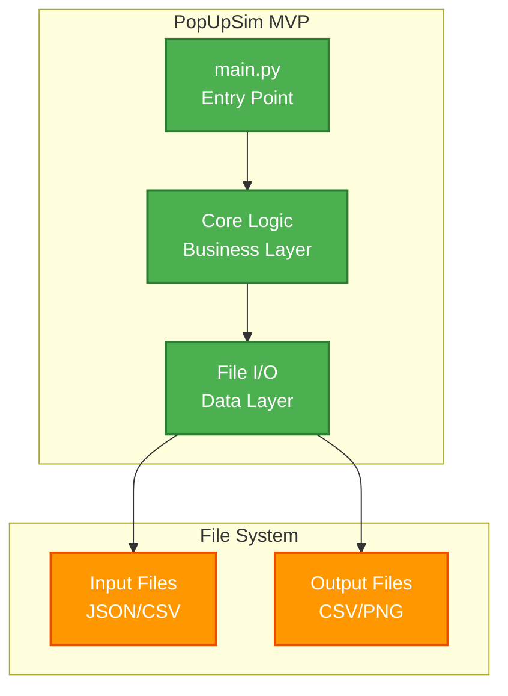
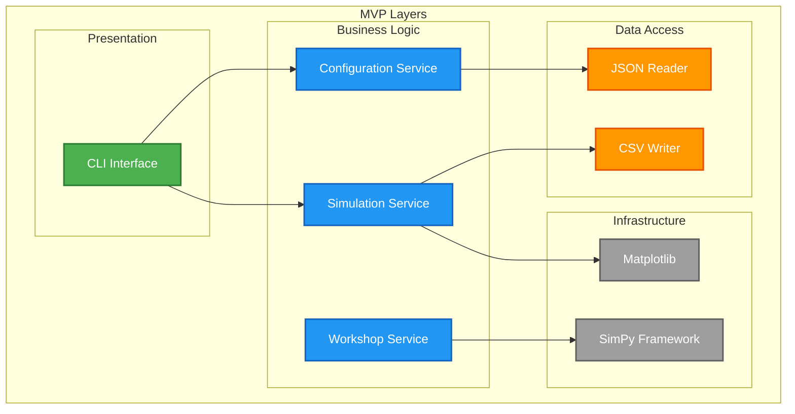

# 5. Bausteinsicht (MVP)

## 5.1 MVP System-Überblick

### MVP Container Diagramm



## 5.2 MVP Layered Architecture

### MVP Layer Struktur



## 5.3 MVP Context-Struktur

### Configuration Context (MVP)

```python
class ConfigurationService:
    def load_scenario(self, path: str) -> ScenarioConfig:
        # Load JSON/CSV files
        pass

    def validate_config(self, config: ScenarioConfig) -> List[str]:
        # Basic validation
        pass
```

### Workshop Context (MVP)

```python
class WorkshopService:
    def setup_workshop(self, config: WorkshopConfig) -> Workshop:
        # Create workshop with stations
        pass

    def run_simulation(self, env: simpy.Environment) -> None:
        # SimPy processes
        pass
```

### Simulation Control Context (MVP)

```python
class SimulationService:
    def orchestrate_simulation(self) -> SimulationResults:
        # Coordinate all contexts
        pass

    def generate_output(self, results: SimulationResults) -> None:
        # CSV + Matplotlib output
        pass
```

---

**Navigation:** [← MVP Lösungsstrategie](04-solution-strategy.md) | [MVP Laufzeitsicht →](06-runtime.md)
