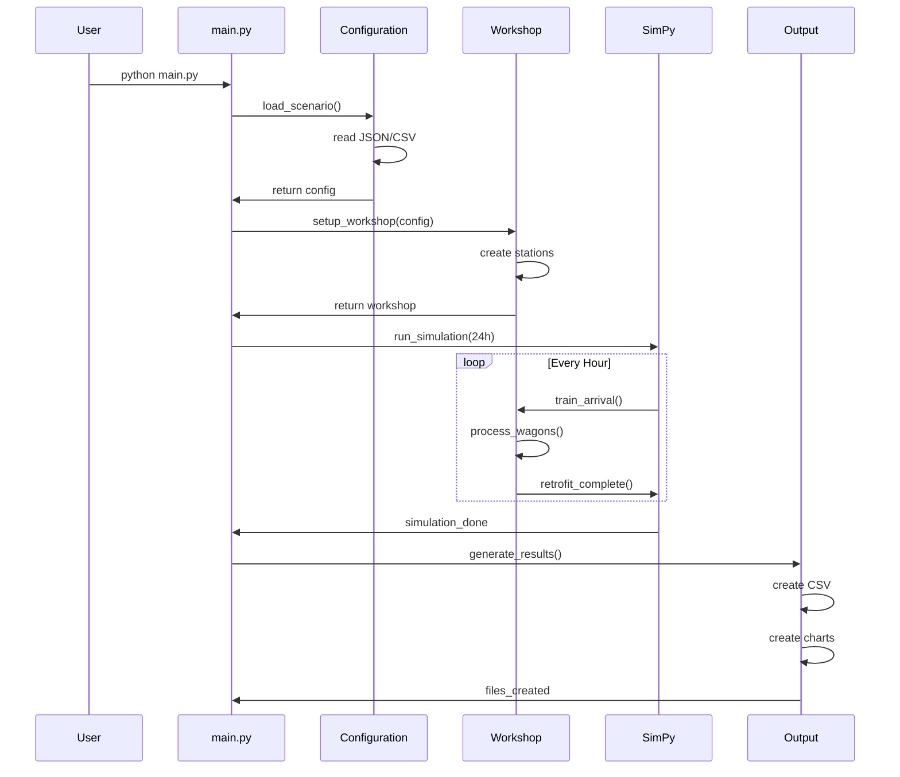

# 6. Laufzeitsicht (MVP)

## 6.1 MVP Simulation Flow

### MVP Execution Sequence

## 6.2 MVP Szenario: Basis-Simulation

### 24h Simulation mit 4 Stationen

**Input:**
- 4 Werkstatt-Stationen
- Stündliche Zugankünfte
- 20 Wagen pro Zug

**Ablauf:**
1. **Konfiguration laden** (0.1s)
2. **Workshop setup** (0.1s)
3. **24h Simulation** (10-30s)
4. **Ergebnisse generieren** (2-5s)

**Output:**
- `simulation_results.csv` - KPI Daten
- `kpi_charts.png` - Matplotlib Charts
- `simulation_log.json` - Event Timeline

## 6.3 MVP Performance

### Timing Breakdown

| Phase | Duration | Aktivität |
|-------|----------|-----------|
| Configuration | 0.1s | JSON/CSV laden |
| Setup | 0.1s | Workshop erstellen |
| Simulation | 10-30s | SimPy ausführen |
| Output | 2-5s | CSV + Charts |

### Skalierbarkeit

- **Klein**: 100 Wagen < 5s
- **Mittel**: 1000 Wagen < 30s  
- **Groß**: 5000 Wagen < 2min
- **MVP Limit**: 10000 Wagen < 5min

---

**Navigation:** [← MVP Bausteinsicht](05-building-blocks.md) | [MVP Verteilungssicht →](07-deployment.md)