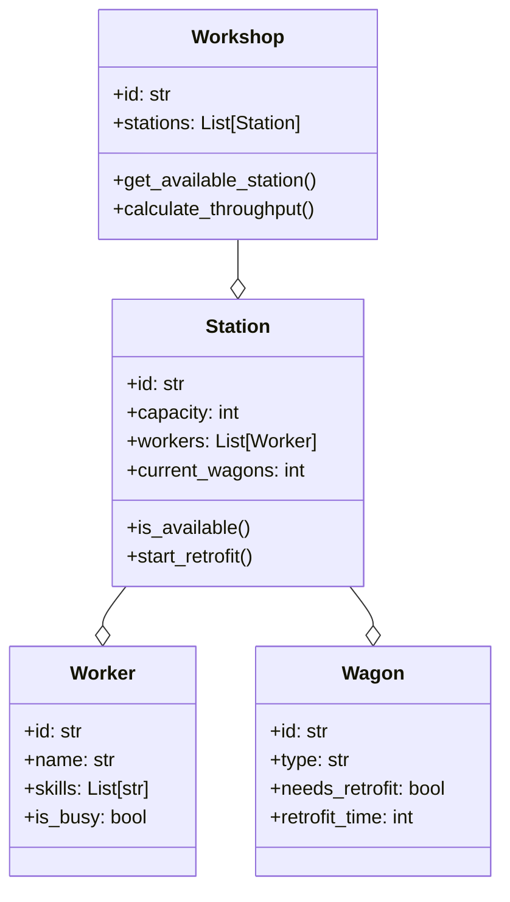
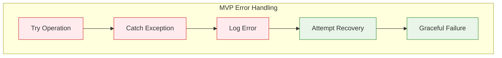
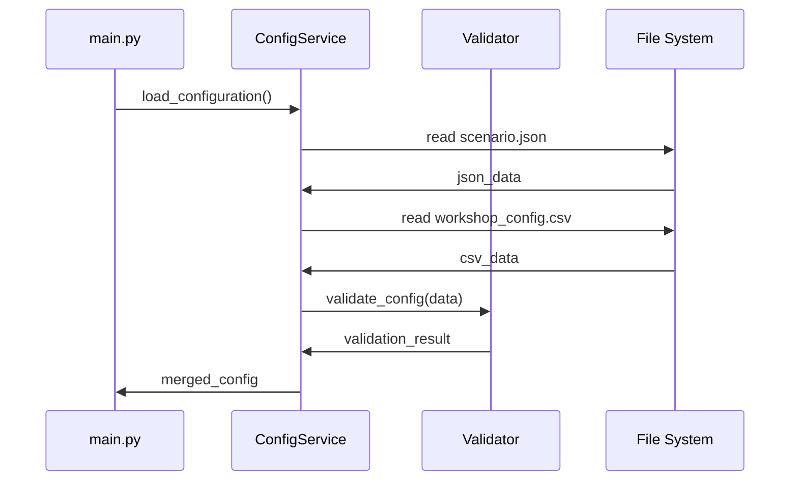
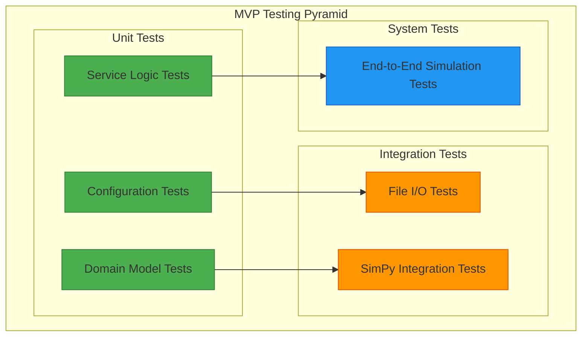

# 8. Querschnittliche Konzepte (MVP)

## 8.1 MVP Domain Model

### MVP Kern-Entitäten



## 8.2 MVP Datenmodell

### MVP Configuration Models

```python
from pydantic import BaseModel
from typing import List

class ScenarioConfig(BaseModel):
    duration_hours: int = 24
    random_seed: int = 42

class WorkshopConfig(BaseModel):
    stations: int = 4
    workers_per_station: int = 2
    retrofit_time_minutes: int = 45

class TrainConfig(BaseModel):
    arrival_interval_minutes: int = 60
    wagons_per_train: int = 20
```

### MVP Result Models

```python
class SimulationResults(BaseModel):
    total_wagons_processed: int
    simulation_duration_hours: float
    throughput_per_hour: float
    average_waiting_time: float
    station_utilization: float

class KPIData(BaseModel):
    timestamp: str
    throughput: float
    utilization: float
    queue_length: int
    waiting_time: float
```

## 8.3 MVP Fehlerbehandlung

### MVP Exception Hierarchy

```python
class PopUpSimError(Exception):
    """Base exception for PopUpSim MVP"""
    pass

class ConfigurationError(PopUpSimError):
    """Configuration loading/validation errors"""
    pass

class SimulationError(PopUpSimError):
    """Simulation runtime errors"""
    pass

class OutputError(PopUpSimError):
    """Output generation errors"""
    pass
```

### MVP Error Handling Strategy



## 8.4 MVP Logging Konzept

### MVP Logging Levels

| Level | MVP Verwendung | Beispiel |
|-------|----------------|----------|
| **DEBUG** | Detaillierte Entwicklungsinfos | SimPy event details |
| **INFO** | Normale Programmausführung | "Simulation started" |
| **WARNING** | Potentielle Probleme | "High queue length detected" |
| **ERROR** | Fehler mit Recovery | "Config file not found, using defaults" |
| **CRITICAL** | Schwere Fehler | "Simulation failed completely" |

### MVP Log Format

```python
# MVP Log Configuration
LOG_FORMAT = '%(asctime)s - %(name)s - %(levelname)s - %(message)s'

# Example log output:
# 2025-10-15 10:00:00,123 - ConfigService - INFO - Loading scenario.json
# 2025-10-15 10:00:01,456 - WorkshopService - INFO - Created 4 stations
# 2025-10-15 10:00:02,789 - SimulationService - INFO - Starting simulation
# 2025-10-15 10:05:30,012 - SimulationService - WARNING - Queue length: 25
# 2025-10-15 10:10:45,345 - OutputService - INFO - Generated results.csv
```

## 8.5 MVP Konfigurationsmanagement

### MVP Configuration Loading



### MVP Configuration Validation

```python
def validate_scenario_config(config: dict) -> List[str]:
    """MVP Configuration Validation"""
    errors = []

    # Basic validation rules
    if config.get('duration_hours', 0) <= 0:
        errors.append("Duration must be positive")

    if config.get('stations', 0) < 1:
        errors.append("At least one station required")

    if config.get('workers_per_station', 0) < 1:
        errors.append("At least one worker per station required")

    return errors
```

## 8.6 MVP Testing Konzept

### MVP Test Strategy



### MVP Test Examples

```python
# Unit Test Beispiel
def test_workshop_station_availability():
    station = Station(id="WS001", capacity=2, workers=[], current_wagons=1)
    assert station.is_available() == True

    station.current_wagons = 2
    assert station.is_available() == False

# Integrationstest Beispiel
def test_configuration_loading():
    config_service = ConfigurationService()
    config = config_service.load_scenario("test_data/")
    assert config.duration_hours > 0
    assert len(config.workshop.stations) > 0
```

## 8.7 MVP Performance Konzept

### MVP Performance Monitoring

```python
import time
from functools import wraps

def measure_time(func):
    """MVP Performance Decorator"""
    @wraps(func)
    def wrapper(*args, **kwargs):
        start_time = time.time()
        result = func(*args, **kwargs)
        end_time = time.time()

        duration = end_time - start_time
        logging.info(f"{func.__name__} took {duration:.2f} seconds")

        return result
    return wrapper

# Usage
@measure_time
def run_simulation(duration_hours: int):
    # Simulationslogik
    pass
```

### MVP Memory Management

```python
import gc
import psutil
import os

def log_memory_usage(phase: str):
    """MVP Memory Monitoring"""
    process = psutil.Process(os.getpid())
    memory_mb = process.memory_info().rss / 1024 / 1024

    logging.info(f"Memory usage in {phase}: {memory_mb:.1f} MB")

    # Force garbage collection for MVP
    gc.collect()
```

## 8.8 MVP Datenvalidierung

### MVP Input Validation

```python
from pydantic import BaseModel, validator

class WorkshopStation(BaseModel):
    id: str
    capacity: int
    workers: int
    retrofit_time_min: int

    @validator('capacity')
    def capacity_must_be_positive(cls, v):
        if v <= 0:
            raise ValueError('Capacity must be positive')
        return v

    @validator('retrofit_time_min')
    def retrofit_time_reasonable(cls, v):
        if v < 10 or v > 300:
            raise ValueError('Retrofit time must be between 10-300 minutes')
        return v
```

### MVP Output Validation

```python
def validate_simulation_results(results: SimulationResults) -> bool:
    """MVP Result Validation"""

    # Plausibilitätsprüfungen für MVP
    if results.throughput_per_hour < 0:
        logging.error("Negativer Durchsatz erkannt")
        return False

    if results.station_utilization > 1.0:
        logging.warning("Stationsauslastung > 100%")

    if results.total_wagons_processed == 0:
        logging.error("Keine Wagen verarbeitet")
        return False

    return True
```

## 8.9 MVP Sicherheitskonzept

### MVP Security Considerations

| Bereich | MVP Maßnahme | Begründung |
|---------|--------------|------------|
| **Input Validation** | Pydantic Models | Verhindert ungültige Daten |
| **File Access** | Relative Paths Only | Verhindert Directory Traversal |
| **Error Messages** | Keine Systempfade | Verhindert Information Disclosure |
| **Logging** | Keine Credentials | Verhindert Credential Leakage |

### MVP File Security

```python
import os
from pathlib import Path

def safe_file_path(base_dir: str, filename: str) -> Path:
    """MVP Safe File Path Resolution"""
    base_path = Path(base_dir).resolve()
    file_path = (base_path / filename).resolve()

    # Sicherstellen, dass Datei innerhalb des Basisverzeichnisses liegt
    if not str(file_path).startswith(str(base_path)):
        raise ValueError(f"Ungültiger Dateipfad: {filename}")

    return file_path
```

---

**Navigation:** [← MVP Verteilungssicht](07-deployment.md) | [MVP Architekturentscheidungen →](09-architecture-decisions.md)