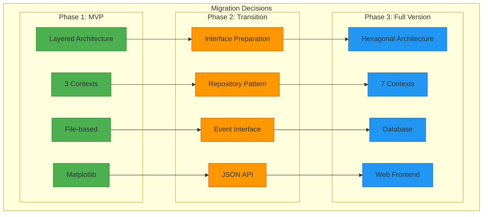

# 9. Architekturentscheidungen (MVP)

## 9.1 MVP Architekturentscheidungen Überblick

### MVP ADR Status

| ADR | Titel | Status | Auswirkung |
|-----|-------|--------|------------|
| **MVP-001** | Layered Architecture für MVP | ✅ Accepted | Einfache Entwicklung |
| **MVP-002** | 3 Contexts statt 7 | ✅ Accepted | Reduzierte Komplexität |
| **MVP-003** | Dateibasierte Datenhaltung | ✅ Accepted | Keine DB-Installation |
| **MVP-004** | Matplotlib statt Web-UI | ✅ Accepted | Schnellere Entwicklung |
| **MVP-005** | Direkte Service-Aufrufe | ✅ Accepted | Einfache Integration |

## 9.2 ADR MVP-001: Layered Architecture für MVP

### Status
**Accepted** - 2025-10-13

### Kontext
Für das MVP benötigen wir eine einfache, schnell entwickelbare Architektur, die später zur Hexagonal Architecture migriert werden kann.

### Entscheidung
Wir verwenden eine **4-Layer Architecture** für das MVP:
- **Presentation Layer**: CLI + File Output
- **Business Logic Layer**: Domain Services
- **Data Access Layer**: File I/O
- **Infrastructure Layer**: SimPy + Matplotlib

### Begründung
- ✅ **Schnelle Entwicklung**: Einfache Layer-Struktur
- ✅ **Bekanntes Pattern**: Team-Erfahrung vorhanden
- ✅ **Migration-Ready**: Vorbereitung für Hexagonal Architecture
- ✅ **Testbarkeit**: Business Logic isolierbar

### Konsequenzen
- **Positiv**: Schnelle MVP-Entwicklung möglich
- **Negativ**: Weniger Framework-Unabhängigkeit als Hexagonal
- **Risiko**: Mögliche Refactoring-Aufwände bei Migration

## 9.3 ADR MVP-002: 3 Contexts statt 7

### Status
**Accepted** - 2025-10-13

### Kontext
Die Vollversion hat 7 Bounded Contexts. Für das MVP ist dies zu komplex und zeitaufwändig.

### Entscheidung
MVP verwendet nur **3 Bounded Contexts**:
1. **Configuration Context** - JSON/CSV Import
2. **Workshop Context** - DAK-Umrüstung + SimPy
3. **Simulation Control Context** - Orchestration + Output

### Begründung
- ✅ **Zeitersparnis**: 4-5 Wochen Entwicklungszeit eingehalten
- ✅ **Fokus**: Nur essenzielle Funktionalität
- ✅ **Team-Größe**: 3 Entwickler = 3 Contexts
- ✅ **Erweiterbarkeit**: Ausbau zu 7 Contexts möglich

### Konsequenzen
- **Positiv**: Schnelle MVP-Fertigstellung
- **Negativ**: Weniger fachliche Trennung
- **Migration**: Spätere Aufspaltung in 7 Contexts erforderlich

## 9.4 ADR MVP-003: Dateibasierte Datenhaltung

### Status
**Accepted** - 2025-10-13

### Kontext
Vollversion nutzt Datenbank. Für MVP ist DB-Setup zu aufwändig und nicht erforderlich.

### Entscheidung
MVP nutzt **dateibasierte Datenhaltung**:
- **Input**: JSON/CSV Dateien
- **Output**: CSV/PNG/JSON Dateien
- **Keine Datenbank** erforderlich

### Begründung
- ✅ **Einfache Installation**: Keine DB-Setup
- ✅ **Portabilität**: Dateien einfach kopierbar
- ✅ **Transparenz**: Lesbare Formate (CSV/JSON)
- ✅ **Versionskontrolle**: Git-freundlich

### Konsequenzen
- **Positiv**: Keine Installation-Komplexität
- **Negativ**: Begrenzte Skalierbarkeit
- **Migration**: Repository Pattern für DB-Migration vorbereitet

## 9.5 ADR MVP-004: Matplotlib statt Web-UI

### Status
**Accepted** - 2025-10-13

### Kontext
Vollversion hat Vue.js Web-Frontend. Für MVP ist Web-Entwicklung zu zeitaufwändig.

### Entscheidung
MVP nutzt **Matplotlib für Visualisierung**:
- **Charts**: PNG-Dateien statt interaktive Web-Charts
- **Kein Frontend-Entwickler** erforderlich
- **Desktop-Anwendung** statt Web-App

### Begründung
- ✅ **Team-Fokus**: Nur Backend-Entwickler verfügbar
- ✅ **Zeitersparnis**: Keine Frontend-Entwicklung
- ✅ **Einfachheit**: Matplotlib in Python integriert
- ✅ **Ausreichend**: Charts erfüllen MVP-Anforderungen

### Konsequenzen
- **Positiv**: Schnelle Visualisierung ohne Frontend-Komplexität
- **Negativ**: Keine interaktive Benutzeroberfläche
- **Migration**: JSON-API für späteres Frontend vorbereitet

## 9.6 ADR MVP-005: Direkte Service-Aufrufe

### Status
**Accepted** - 2025-10-13

### Kontext
Vollversion nutzt Event-driven Architecture. Für MVP ist dies zu komplex.

### Entscheidung
MVP nutzt **direkte Service-Aufrufe**:
- **Keine Events**: Direkte Methodenaufrufe zwischen Services
- **Synchrone Verarbeitung**: Einfacher Kontrollfluss
- **Monolithische Integration**: Alles in einem Prozess

### Begründung
- ✅ **Einfachheit**: Keine Event-Bus Implementierung
- ✅ **Debugging**: Einfacher nachvollziehbarer Ablauf
- ✅ **Performance**: Keine Event-Overhead
- ✅ **Schnelle Entwicklung**: Weniger Abstraktionen

### Konsequenzen
- **Positiv**: Einfache Implementierung und Debugging
- **Negativ**: Höhere Kopplung zwischen Services
- **Migration**: Interface-Vorbereitung für Event-driven Architecture

## 9.7 Verworfene Alternativen

### Verworfene Architektur-Optionen

| Alternative | Grund für Verwerfung | MVP Entscheidung |
|-------------|---------------------|------------------|
| **Hexagonal Architecture** | Zu komplex für MVP-Zeitrahmen | Layered Architecture |
| **Microservices** | Deployment-Komplexität | Monolith |
| **Event-driven** | Implementierungsaufwand | Direkte Aufrufe |
| **Web-Frontend** | Frontend-Entwickler fehlt | Matplotlib |
| **Datenbank** | Installation-Komplexität | Dateien |

### Verworfene Technologie-Optionen

| Technologie | Grund für Verwerfung | MVP Alternative |
|-------------|---------------------|-----------------|
| **FastAPI** | Web-API nicht erforderlich | Direkte Python-Aufrufe |
| **PostgreSQL** | DB-Setup zu aufwändig | CSV/JSON Dateien |
| **Docker** | Container-Overhead | Native Python |
| **Vue.js** | Frontend-Entwicklung | Matplotlib PNG |
| **WebSocket** | Real-time nicht erforderlich | Batch-Verarbeitung |

## 9.8 Migration-Entscheidungen

### MVP → Vollversion Migration Path



### Interface-Vorbereitung für Migration

```python
# MVP: Direct Implementation
class WorkshopService:
    def process_wagon(self, wagon: Wagon) -> None:
        # Direct SimPy integration
        pass

# Prepared: Interface for Migration
from abc import ABC, abstractmethod

class SimulationEnginePort(ABC):
    @abstractmethod
    def schedule_event(self, event: Event, delay: float) -> None:
        pass

class WorkshopService:
    def __init__(self, sim_engine: SimulationEnginePort):
        self._sim_engine = sim_engine  # Ready for Hexagonal
```

## 9.9 Risiken und Mitigation

### MVP Architektur-Risiken

| Risiko | Wahrscheinlichkeit | Auswirkung | Mitigation |
|--------|-------------------|------------|------------|
| **Migration-Aufwand zu hoch** | Mittel | Hoch | Interface-Vorbereitung |
| **Performance-Probleme** | Niedrig | Mittel | Profiling + Optimierung |
| **Skalierbarkeits-Grenzen** | Hoch | Niedrig | Akzeptiert für MVP |
| **Wartbarkeits-Probleme** | Niedrig | Mittel | Saubere Layer-Trennung |

### Technische Schulden

| Schuld | Priorität | Vollversion-Lösung |
|--------|-----------|-------------------|
| **Direkte SimPy-Abhängigkeit** | Hoch | Hexagonal Architecture |
| **Fehlende Event-Architektur** | Mittel | Event-driven Architecture |
| **Dateibasierte Persistierung** | Niedrig | Database Integration |
| **Fehlende Web-UI** | Niedrig | Vue.js Frontend |

---

**Navigation:** [← MVP Querschnittliche Konzepte](08-concepts.md) | [MVP Qualitätsanforderungen →](10-quality-requirements.md)