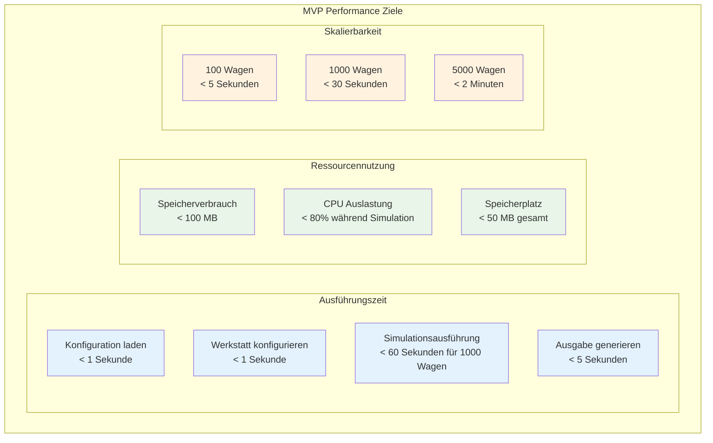
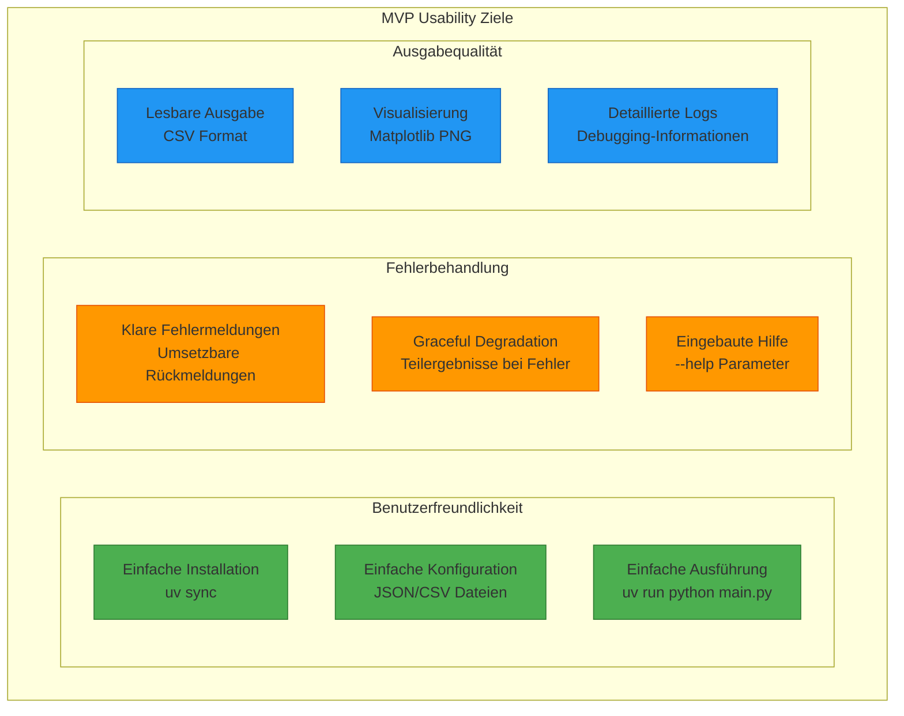
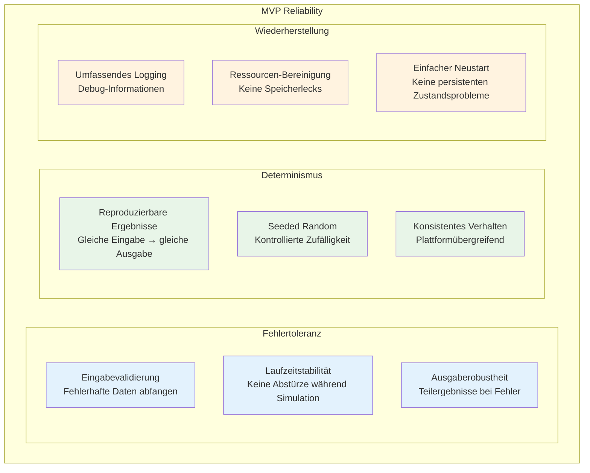
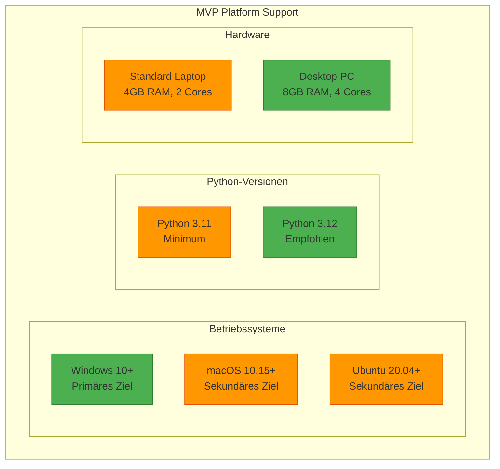
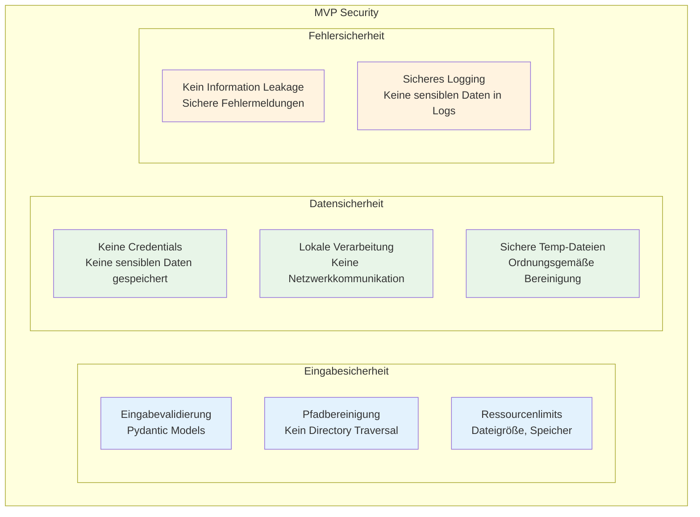
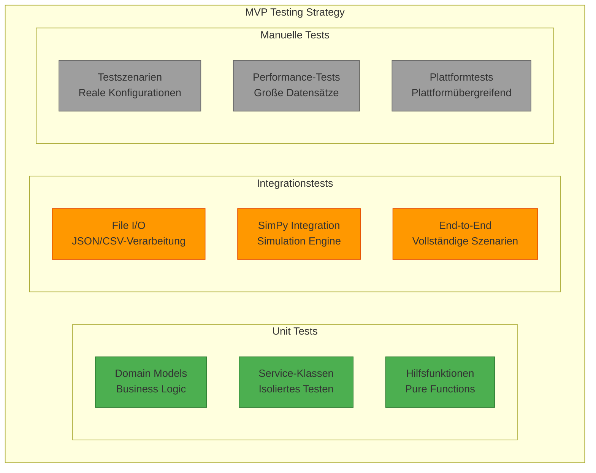

# 10. Qualitätsanforderungen (MVP)

## 10.1 MVP Qualitätsziele

### MVP Qualitäts-Prioritäten

| Priorität | Qualitätsziel | MVP Szenario | Messbarkeit |
|-----------|---------------|--------------|-------------|
| **1** | **Schnelle Entwicklung** | MVP in 4-5 Wochen entwickelbar | Funktionsfähiger Prototyp |
| **2** | **Determinismus** | Gleiche Eingaben → identische Ergebnisse | Reproduzierbare Simulationsläufe |
| **3** | **Einfachheit** | Keine komplexe Installation | Single Python Script |
| **4** | **Testbarkeit** | Business Logic isoliert testbar | Unit Tests möglich |
| **5** | **Erweiterbarkeit** | Migration zur Vollversion | Saubere Architektur-Basis |

## 10.2 MVP Performance-Anforderungen

### MVP Performance-Ziele



### MVP Performance-Messungen

| Metrik | MVP Ziel | Messmethode | Akzeptanzkriterium |
|--------|----------|-------------|-------------------|
| **Startzeit** | < 2 Sekunden | `time python main.py --help` | Unter 2s auf Standard-Laptop |
| **Konfiguration laden** | < 1 Sekunde | Logging-Timestamps | JSON/CSV Parsing |
| **Simulationsgeschwindigkeit** | 1000 Wagen < 30s | SimPy-Profiling | Discrete Event Processing |
| **Arbeitsspeicherverbrauch** | < 100 MB | `psutil` Monitoring | Maximaler Speicherverbrauch |
| **Ausgabegenerierung** | < 5 Sekunden | Dateierstellungszeit | CSV + PNG Generierung |

## 10.3 MVP Usability-Anforderungen

### MVP Benutzerfreundlichkeit



### MVP Usability-Kriterien

| Aspekt | MVP Anforderung | Messkriterium |
|--------|-----------------|---------------|
| **Installation** | < 5 Minuten Einrichtung | Dokumentierte Schritte |
| **Konfiguration** | Beispieldateien verfügbar | Template-Dateien |
| **Ausführung** | Ein Kommando startet Simulation | `uv run python main.py` |
| **Fehlermeldungen** | Verständliche Beschreibungen | Keine technischen Details |
| **Hilfe** | Integrierte Dokumentation | `--help` Parameter |

## 10.4 MVP Reliability-Anforderungen

### MVP Zuverlässigkeit



### MVP Reliability-Metriken

| Kategorie | MVP Ziel | Messmethode |
|-----------|----------|-------------|
| **Absturzrate** | < 1% bei gültigen Eingaben | Automatisierte Tests |
| **Determinismus** | 100% identische Ergebnisse | Wiederholte Ausführung |
| **Fehlerbehandlung** | Graceful Handling aller Eingabefehler | Negative Tests |
| **Speicherlecks** | Keine Speicherlecks | Memory Profiling |

## 10.5 MVP Maintainability-Anforderungen

### MVP Wartbarkeit

```python
# MVP Code Quality Standards
class CodeQualityMetrics:
    MAX_FUNCTION_LENGTH = 50      # Zeilen pro Funktion
    MAX_CLASS_LENGTH = 200        # Zeilen pro Klasse
    MAX_COMPLEXITY = 10           # Zyklomatische Komplexität
    MIN_TEST_COVERAGE = 70        # Prozent
    MAX_DEPENDENCIES = 5          # Pro Modul
```

### MVP Wartbarkeits-Ziele

| Aspekt | MVP Ziel | Messmethode |
|--------|----------|-------------|
| **Code Coverage** | > 70% für Business Logic | pytest-cov |
| **Dokumentation** | Alle öffentlichen APIs dokumentiert | Docstring-Coverage |
| **Komplexität** | Zyklomatische Komplexität < 10 | radon |
| **Abhängigkeiten** | < 10 externe Pakete | pyproject.toml |
| **Refactoring** | Einfache Erweiterung möglich | Architektur-Review |

## 10.6 MVP Portability-Anforderungen

### MVP Plattform-Unterstützung



### MVP Portability-Tests

| Plattform | Teststatus | Kritische Features |
|----------|-------------|-------------------|
| **Windows 10** | ✅ Primär | Dateipfade, CSV-Encoding |
| **macOS** | ✅ Primär | Pfadtrenner, matplotlib |
| **Ubuntu 20.04** | ✅ Primär | Abhängigkeiten, Dateiberechtigungen |

## 10.7 MVP Security-Anforderungen

### MVP Sicherheits-Ziele



### MVP Security-Maßnahmen

| Bereich | MVP Maßnahme | Implementierung |
|---------|--------------|-----------------|
| **Eingabevalidierung** | Pydantic Models | Automatische Typ-Validierung |
| **Dateizugriff** | Nur relative Pfade | Pfadbereinigung |
| **Fehlerbehandlung** | Sichere Fehlermeldungen | Keine Systempfade in Fehlern |
| **Logging** | Keine sensiblen Daten | Gefiltertes Logging |
| **Abhängigkeiten** | Nur bekannte Pakete | pyproject.toml mit Versionen |

## 10.8 MVP Testability-Anforderungen

### MVP Test-Strategie



### MVP Test-Metriken

| Test-Typ | MVP Ziel | Automatisierung |
|----------|----------|-----------------|
| **Unit Tests** | > 80% Coverage | ✅ pytest |
| **Integrationstests** | Alle Hauptpfade | ✅ pytest |
| **Performance-Tests** | Benchmark-Szenarien | ⚠️ Manuell |
| **Plattformtests** | Windows + Linux + MacOs | ⚠️ Manuell |
Die Plattformtests können ggf. direkt in der GitHub Pipeline automatisiert werden. Z.B. ein Matrix Job, der nicht über Python-Versionen läuft sondern über unterschiedliche Beriebssysteme.

---

**Navigation:** [← MVP Architekturentscheidungen](09-architecture-decisions.md) | [MVP Risiken →](11-risks-technical-debt.md)