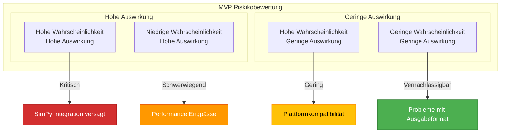
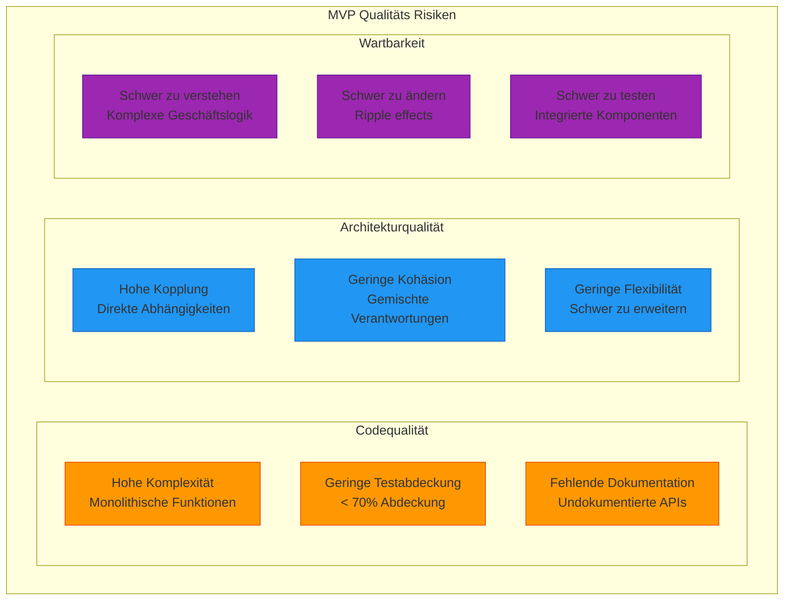
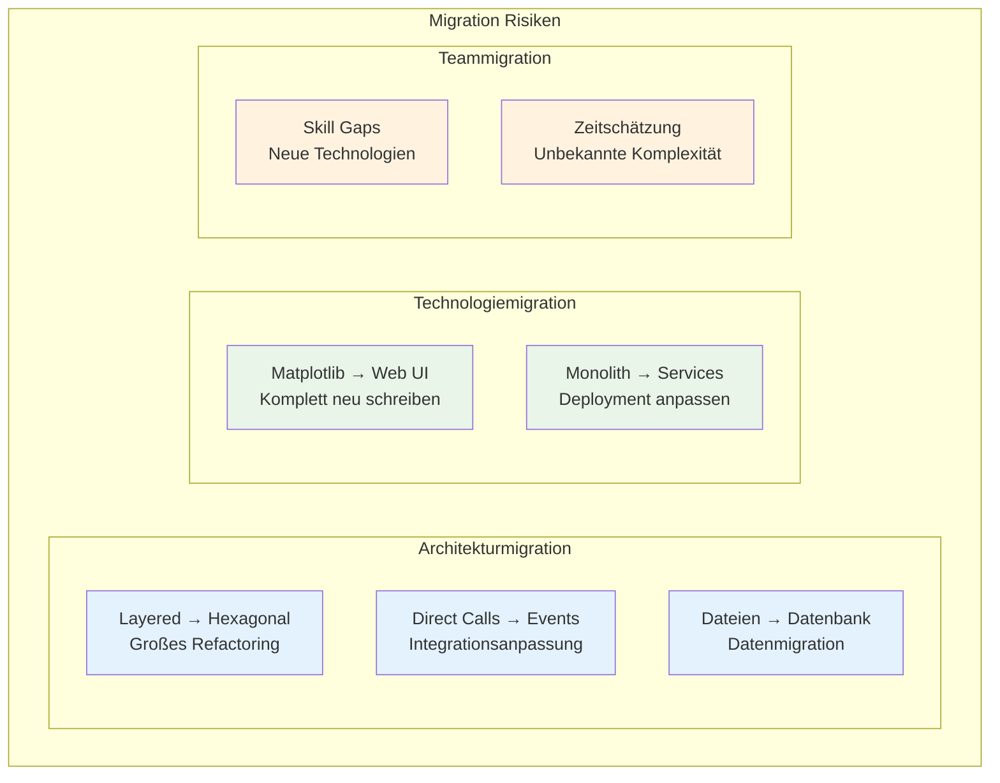
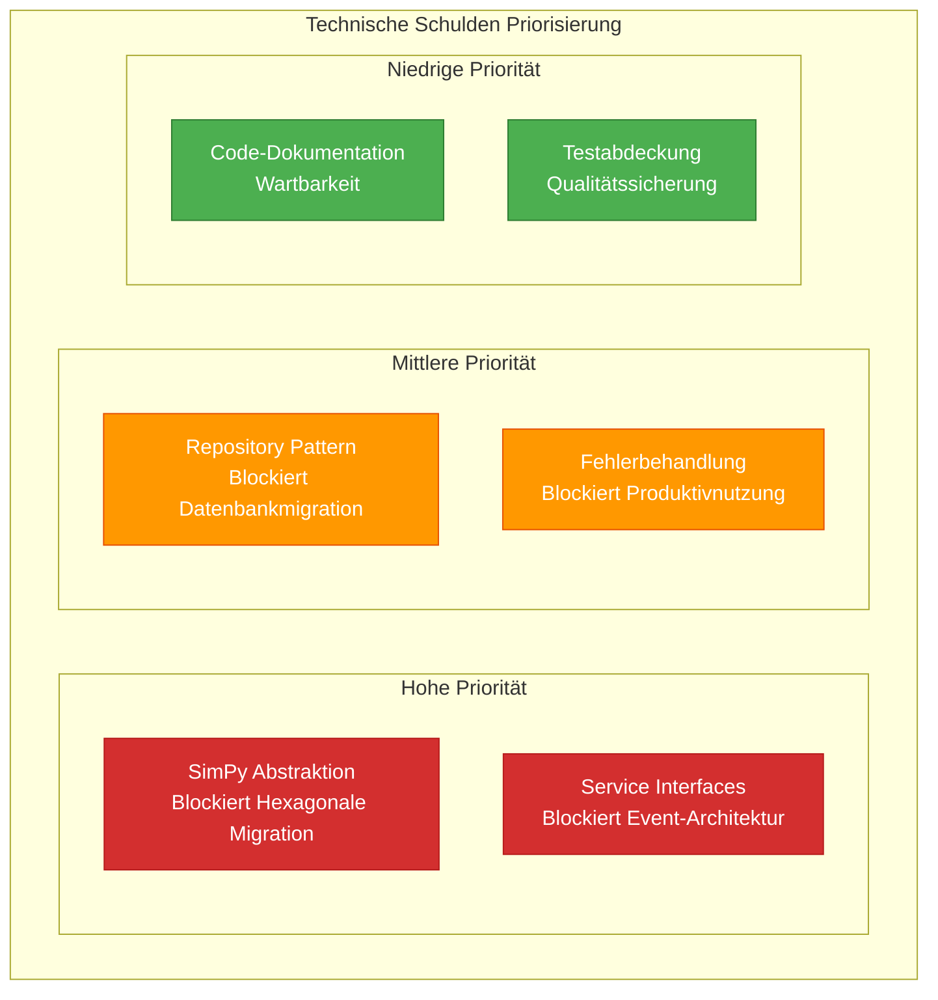

# 11. Risiken und technische Schulden (MVP)

## 11.1 MVP Risiko-Überblick

### MVP Risiko-Matrix



## 11.2 MVP Technische Risiken

### Risiko 1: SimPy Integration Komplexität

| Aspekt | Details |
|--------|---------|
| **Beschreibung** | Direkte SimPy-Integration könnte zu komplex werden |
| **Wahrscheinlichkeit** | Mittel (40%) |
| **Auswirkung** | Hoch - Simulation funktioniert nicht |
| **Symptome** | Unerwartetes SimPy-Verhalten, schwer debugbare Prozesse |

**Mitigation:**
- ✅ **Einfache SimPy-Prozesse**: Nur grundlegende Events verwenden
- ✅ **Frühes Prototyping**: SimPy-Integration zuerst implementieren
- ✅ **Dokumentation**: SimPy-Patterns dokumentieren
- ✅ **Fallback**: Vereinfachte Simulation ohne SimPy als Backup

### Risiko 2: Performance-Probleme bei größeren Szenarien

| Aspekt | Details |
|--------|---------|
| **Beschreibung** | MVP könnte bei > 1000 Wagen zu langsam werden |
| **Wahrscheinlichkeit** | Mittel (30%) |
| **Auswirkung** | Mittel - Begrenzte Szenario-Größe |
| **Symptome** | Lange Ausführungszeiten, hoher Speicherverbrauch |

**Mitigation:**
- ✅ **Profiling**: Frühe Performance-Messungen
- ✅ **Optimierung**: Algorithmus-Verbesserungen
- ✅ **Limits**: Akzeptierte Szenario-Größen definieren
- ✅ **Monitoring**: Memory/CPU-Überwachung

### Risiko 3: Zeitplan-Überschreitung

| Aspekt | Details |
|--------|---------|
| **Beschreibung** | 4-5 Wochen Entwicklungszeit könnte nicht ausreichen |
| **Wahrscheinlichkeit** | Hoch (60%) |
| **Auswirkung** | Hoch - MVP-Ziele nicht erreicht |
| **Symptome** | Verzögerungen in Meilensteinen, unfertige Features |

**Mitigation:**
- ✅ **Scope-Reduktion**: Weitere Features streichen wenn nötig
- ✅ **Parallele Entwicklung**: Team-Koordination optimieren
- ✅ **Wöchentliche Reviews**: Frühe Risiko-Erkennung
- ✅ **Minimum-MVP**: Absolut minimale Funktionalität definieren

## 11.3 MVP Technische Schulden

### Schuld 1: Direkte Framework-Abhängigkeiten

```python
# MVP: Direkte SimPy-Nutzung (Technical Debt)
import simpy

class WorkshopService:
    def __init__(self):
        self.env = simpy.Environment()  # Direkte Abhängigkeit

    def run_process(self):
        self.env.process(self.retrofit_process())  # Enge Kopplung

# Zukunft: Abstrahiertes Interface
class WorkshopService:
    def __init__(self, simulation_engine: SimulationEnginePort):
        self._sim_engine = simulation_engine  # Dependency Injection
```

**Schuld-Details:**
- **Typ**: Architektur-Schuld
- **Priorität**: Hoch
- **Aufwand**: 2-3 Tage Refactoring
- **Vollversion-Lösung**: Hexagonal Architecture mit Ports

### Schuld 2: Fehlende Event-Architektur

```python
# MVP: Direkte Service-Aufrufe (Technical Debt)
class SimulationService:
    def run(self):
        config = self.config_service.load()  # Direkter Aufruf
        workshop = self.workshop_service.setup(config)  # Direkter Aufruf
        results = self.workshop_service.run(workshop)  # Direkter Aufruf

# Zukunft: Event-Driven
class SimulationService:
    def run(self):
        self.event_bus.publish(ConfigurationRequested())
        # Asynchrone Event-Behandlung
```

**Schuld-Details:**
- **Typ**: Integration-Schuld
- **Priorität**: Mittel
- **Aufwand**: 1-2 Wochen Refactoring
- **Vollversion-Lösung**: Event-driven Architecture

### Schuld 3: Dateibasierte Persistierung

```python
# MVP: Dateibasierte Speicherung (Technical Debt)
class ConfigurationService:
    def load_scenario(self, path: str):
        with open(f"{path}/scenario.json") as f:  # Direkter Dateizugriff
            return json.load(f)

# Zukunft: Repository Pattern
class ConfigurationService:
    def __init__(self, repo: ConfigurationRepository):
        self._repo = repo  # Abstrahierte Speicherung

    def load_scenario(self, id: str):
        return self._repo.find_by_id(id)  # Speicher-agnostisch
```

**Schuld-Details:**
- **Typ**: Persistierung-Schuld
- **Priorität**: Niedrig
- **Aufwand**: 3-5 Tage Refactoring
- **Vollversion-Lösung**: Database + Repository Pattern

## 11.4 MVP Qualitäts-Risiken

### Code-Qualitäts-Risiken



### Qualitäts-Metriken Überwachung

| Metrik | MVP Ziel | Aktueller Status | Risiko |
|--------|----------|------------------|--------|
| **Zyklomatische Komplexität** | < 10 | TBD | Mittel |
| **Testabdeckung** | > 70% | TBD | Hoch |
| **Dokumentationsabdeckung** | > 80% | TBD | Niedrig |
| **Anzahl Abhängigkeiten** | < 10 | 4 | Niedrig |

## 11.5 MVP Migrations-Risiken

### Migration zur Vollversion



### Migrations-Aufwand Schätzung

| Migration | Aufwand | Risiko | Mitigation |
|-----------|---------|--------|------------|
| **Layered → Hexagonal** | 2-3 Wochen | Hoch | Interface-Vorbereitung |
| **Direct → Event-driven** | 1-2 Wochen | Mittel | Event-Interface definieren |
| **Dateien → Datenbank** | 3-5 Tage | Niedrig | Repository Pattern |
| **Matplotlib → Web** | 4-6 Wochen | Hoch | JSON-API vorbereiten |

## 11.6 MVP Risiko-Mitigation

### Risiko-Monitoring

```python
# MVP Risk Monitoring
class RiskMonitor:
    def check_performance_risk(self, execution_time: float):
        if execution_time > 60:  # Sekunden
            logging.warning(f"Performance-Risiko: {execution_time}s Ausführung")

    def check_memory_risk(self, memory_mb: float):
        if memory_mb > 100:  # MB
            logging.warning(f"Speicher-Risiko: {memory_mb}MB Nutzung")

    def check_complexity_risk(self, function_lines: int):
        if function_lines > 50:
            logging.warning(f"Komplexitäts-Risiko: {function_lines} Zeilen")
```

### Kontinuierliche Risiko-Bewertung

| Woche | Risiko-Review | Maßnahmen |
|-------|---------------|-----------|
| **Woche 1** | SimPy Integration | Prototyp erstellen |
| **Woche 2** | Performance Tests | Erste Benchmarks |
| **Woche 3** | Code Qualität | Refactoring wenn nötig |
| **Woche 4** | Migration Vorbereitungen | Interface-Vorbereitung |
| **Woche 5** | Final Review | Schulden dokumentieren |

## 11.7 MVP Schulden-Rückzahlung

### Schulden-Priorisierung



### Schulden-Rückzahlungsplan

| Phase | Schulden | Aufwand | Nutzen |
|-------|----------|---------|--------|
| **Post-MVP** | SimPy Abstraktion | ca. 3 Tage | Hexagonal Architecture möglich |
| **Pre-Full** | Service Interfaces | ca. 5 Tage | Event-driven Architecture möglich |
| **Full-Dev** | Repository Pattern | ca. 3 Tage | Database Integration möglich |
| **Produktion** | Error Handling | ca. 2 Tage | Produktionstauglichkeit |

---

**Navigation:** [← MVP Qualitätsanforderungen](10-quality-requirements.md) | [MVP Glossar →](12-glossary.md)
