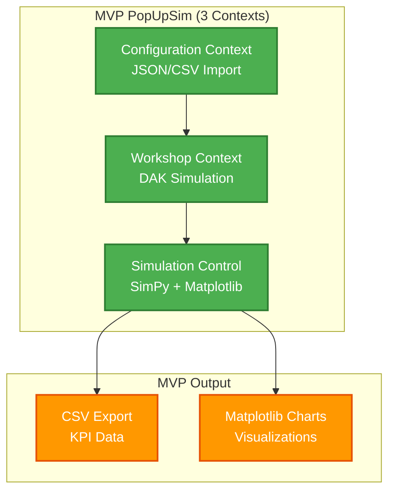
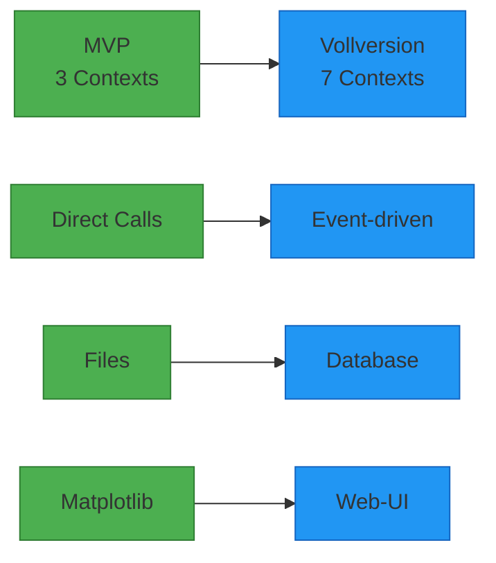

# PopUpSim MVP - arc42 Dokumentation

## Übersicht

Diese Dokumentation beschreibt die **MVP (Minimum Viable Product) Version** von PopUpSim - eine vereinfachte, dateibasierte Implementierung für schnelle Prototypenerstellung.

## MVP vs. Vollversion

| Aspekt | MVP | Vollversion |
|--------|-----|-------------|
| **Entwicklungszeit** | 4-5 Wochen | 3-6 Monate |
| **Team** | 3 Backend Entwickler | Full-Stack Team |
| **Architektur** | 3 Bounded Contexts | 7 Bounded Contexts |
| **UI** | Matplotlib Charts | Vue.js Web-App |
| **Datenhaltung** | CSV/JSON Dateien | Database + Event Store |
| **Integration** | Direkte Service-Aufrufe | Event-driven Architecture |

## MVP Dokumentation

### Kern-Kapitel
1. **[Einführung und Ziele](01-introduction-goals.md)** - MVP Scope und Vereinfachungen
2. **[Randbedingungen](02-constraints.md)** - MVP Technische Beschränkungen
3. **[Kontextabgrenzung](03-context.md)** - MVP System-Grenzen
4. **[Lösungsstrategie](04-solution-strategy.md)** - MVP Architektur-Entscheidungen
5. **[Bausteinsicht](05-building-blocks.md)** - MVP 3-Context Architektur

### Ergänzende Kapitel
6. **[Laufzeitsicht](06-runtime.md)** - MVP Simulation Flow
7. **[Verteilungssicht](07-deployment.md)** - MVP Desktop Deployment
8. **[Querschnittliche Konzepte](08-concepts.md)** - MVP Design Patterns
9. **[Architekturentscheidungen](09-architecture-decisions.md)** - MVP ADRs
10. **[Qualitätsanforderungen](10-quality-requirements.md)** - MVP Qualitätsziele
11. **[Risiken und technische Schulden](11-risks-technical-debt.md)** - MVP Risiken
12. **[Glossar](12-glossary.md)** - MVP Begriffe

## MVP Architektur-Überblick

## MVP Entwicklungsstrategie

### Phase 1: Foundation
- **Configuration Context**: JSON/CSV Import und Validierung
- **Grundarchitektur**: Domain Models und Services
- **File I/O**: Dateibasierte Repositories

### Phase 2: Core Logic
- **Workshop Context**: DAK-Umrüstungslogik
- **SimPy Integration**: Discrete Event Simulation
- **Domain Services**: Geschäftslogik-Implementierung

### Phase 3: Integration
- **Simulation Control**: Orchestrierung aller Contexts
- **Event Flow**: Simulation von Ankunft bis Abfahrt
- **Integration Testing**: End-to-End Tests

### Phase 4: Analytics
- **KPI Calculation**: Performance-Metriken
- **Matplotlib Output**: Charts und Visualisierungen
- **CSV Export**: Strukturierte Datenausgabe

## Migration zur Vollversion

## Referenzen

- **[Vollversion Dokumentation](../README.md)** - Komplette arc42 Dokumentation
- **[MVP Architektur](../../mvp/)** - Detaillierte MVP-Dokumentation (Contexts, Domain Models, etc.)
- **[MVP Context Map](../../mvp/context-map-mvp.md)** - 3 Bounded Contexts im Detail
- **[MVP Simplifications](../../mvp/mvp-simplifications.md)** - Vereinfachungen gegenüber Vollversion
- **[ADRs](../../adr/)** - Architekturentscheidungen (inkl. MVP-spezifische)

---

**Status:** 🚧 In Entwicklung | **Version:** MVP 1.0 | **Team:** 3 Backend Entwickler
