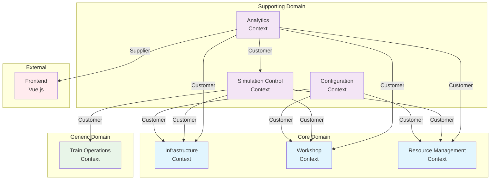

# Bounded Contexts Übersicht

Die aktuellen Boundend Context sind aus dem Event-Storming im Rahmen des Skydeck Accelerators erstanden.

## Vorhandene Bounded Contexts

### Core Contexts
1. **[Infrastructure Context](bounded-contexts/infrastructure-context.md)** - Gleise, Weichen, Topologie
2. **[Workshop Context](bounded-contexts/workshop-context.md)** - DAK-Umrüstung, Stationen
3. **[Resource Management Context](bounded-contexts/resource-management-context.md)** - Lokomotiven, Personal

### Supporting Contexts
4. **[Configuration Context](bounded-contexts/configuration-context.md)** - Datenimport, Validierung, Templates
5. **[Simulation Control Context](bounded-contexts/simulation-control-context.md)** - Simulationssteuerung, Orchestrierung
6. **[Analytics Context](bounded-contexts/analytics-context-detailed.md)** - **NEU** - KPI-Berechnung, Metriken, Reporting

### Generic Contexts
7. **[Train Operations Context](bounded-contexts/train-operations-context.md)** - Zugankünfte, Rangieroperationen

## Context Map

## Key Principles

### Analytics Context
- **Zentrale KPI-Berechnung** im Backend
- **Frontend nur Visualisierung** - keine Berechnungen
- **Echtzeit-Updates** via WebSocket
- **Engpass-Identifikation** automatisch
- **Supporting Context** für alle anderen

### Context Relationships
- **Configuration** → versorgt Core Contexts mit Daten
- **Simulation Control** → orchestriert alle Contexts
- **Analytics** → sammelt Daten von allen Contexts
- **Frontend** → empfängt nur berechnete KPIs

### MVP Focus
- 7 aktive Contexts
- Analytics Context neu hinzugefügt
- Monitoring/Notification/Rules Engine → Post-MVP
