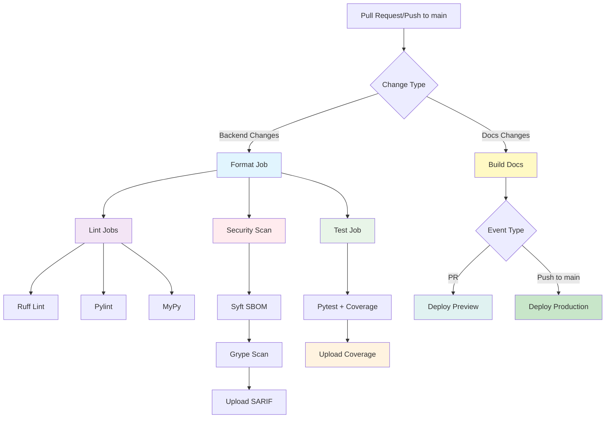
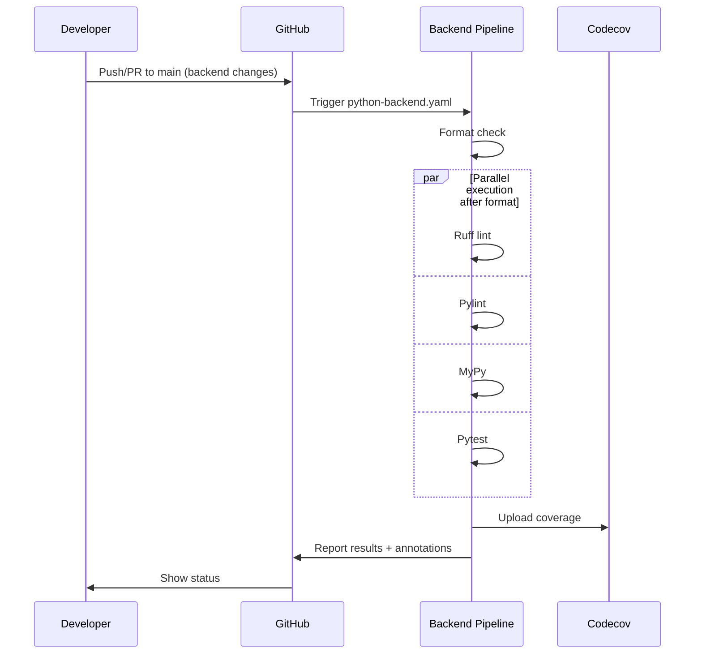
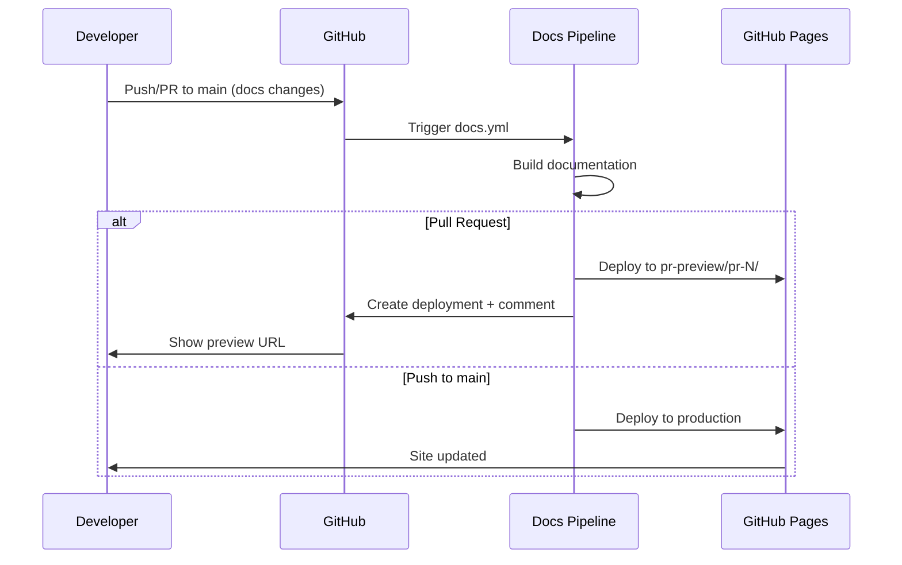
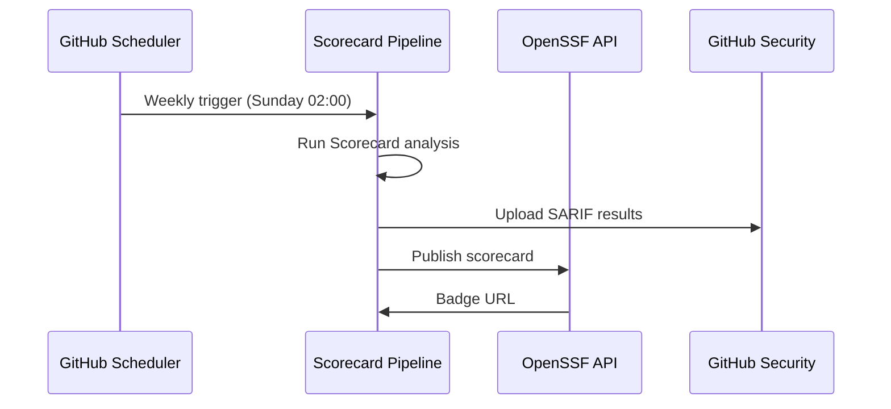

# CI/CD Pipeline Documentation

## Overview

The PopUp-Sim project uses GitHub Actions for continuous integration and deployment. The pipeline ensures code quality through automated formatting, linting, type checking, and testing.

## Workflow Structure



## Backend Pipeline Jobs

### 1. Format Job
**Purpose:** Ensures code formatting consistency across the codebase.


**Steps:**
- Checkout code
- Setup uv with Python version
- Install dependencies with `uv sync --locked --all-extras --dev`
- Run `ruff format --check --diff .`

**Output:** Shows formatting differences if any exist

### 2. Lint Jobs (Parallel)
**Purpose:** Code quality analysis through multiple linters.

**Matrix:** 3 linters (ruff, pylint, mypy)

**Dependencies:** Requires format job to pass first

#### Ruff Linting
- **Command:** `uv run ruff check --output-format=github .`
- **Focus:** Code quality, unused imports, simplifications
- **Output:** GitHub annotations on PR lines

#### Pylint
- **Command:** `uv run pylint backend/src/ --output-format=colorized`
- **Focus:** Additional code quality checks
- **Output:** Colorized terminal output

#### MyPy Type Checking
- **Command:** `uv run mypy backend/src/ --show-error-codes`
- **Focus:** Static type analysis
- **Output:** Type errors with specific error codes

### 3. Security Scan Job
**Purpose:** Software Bill of Materials (SBOM) generation and vulnerability scanning.

**Dependencies:** Requires format job to pass first

**Tools:**
- **Syft:** Generates SBOM in SPDX-JSON format
- **Grype:** Scans SBOM for known vulnerabilities

**Steps:**
- Check if dependencies exist in `pyproject.toml`
- Generate SBOM with Syft (if dependencies exist)
- Scan vulnerabilities with Grype
- Upload SARIF results to GitHub Security tab
- Upload security reports as artifacts

**Output:**
- SBOM file (`sbom.spdx.json`)
- Vulnerability report (SARIF format)
- GitHub Security alerts for found vulnerabilities

**Note:** Scan is skipped if no dependencies are present. Vulnerabilities do not fail the build (`fail-build: false`).

### 4. Test Jobs (Parallel)
**Purpose:** Run test suite with coverage reporting.

**Dependencies:** Requires format job to pass first

**Steps:**
- Run `uv run pytest --tb=short`
- Upload coverage to Codecov

## Documentation Pipeline Jobs

### 1. Build Job
**Purpose:** Build documentation site with MkDocs.

**Triggers:**
- Changes to `docs/**`
- Changes to `mkdocs.yml`
- Changes to `.github/workflows/docs.yml`

**Steps:**
- Checkout code
- Setup Python 3.13
- Install uv
- Install dependencies with `uv sync --group docs`
- Build documentation with `uv run mkdocs build --strict`
- Upload site artifact

**Output:** Built documentation site artifact

### 2. Deploy Preview Job
**Purpose:** Deploy PR preview for documentation changes.

**Triggers:** Pull requests only

**Dependencies:** Requires build job to complete

**Steps:**
- Download site artifact
- Deploy to `gh-pages` branch under `pr-preview/pr-{number}/`
- Create GitHub deployment with preview URL

**Output:** PR preview URL at `https://openrailassociation.github.io/dac-migration-dss-popupsim/pr-preview/pr-{number}/`

### 3. Deploy Production Job
**Purpose:** Deploy documentation to GitHub Pages.

**Triggers:** Push to main branch only

**Dependencies:** Requires build job to complete

**Steps:**
- Download site artifact
- Deploy to GitHub Pages with force orphan

**Output:** Production site at `https://openrailassociation.github.io/dac-migration-dss-popupsim/`

## Scheduled Security Jobs

### OpenSSF Scorecard Job
**Purpose:** Security health metrics and best practices assessment.

**Triggers:**
- Weekly on Sundays at 02:00
- Push to main branch
- Manual workflow dispatch

**Steps:**
- Checkout code with harden-runner
- Run OpenSSF Scorecard analysis
- Upload SARIF results to GitHub Security tab
- Publish results to OpenSSF REST API

**Checks Performed:**
- Security policy presence
- Dependency update tool usage
- Branch protection configuration
- Code review practices
- CI/CD security practices
- Pinned dependencies
- Vulnerability disclosure

**Output:**
- SARIF results in GitHub Security tab
- Public scorecard on OpenSSF REST API
- Security badge for README

## Execution Flows

### Backend Pipeline Flow



### Documentation Pipeline Flow



### Scheduled Security Flow



## Configuration Details

### Triggers
- **Pull Requests:** Any PR targeting `main` branch
- **Push Events:** Direct pushes to `main` branch

### Matrix Strategy
- **Backend Jobs:** 5 (1 format + 3 lint + 1 test)
- **Documentation Jobs:** 3 (1 build + 1 preview + 1 production)
- **Security Jobs:** 1 (OpenSSF Scorecard, commented out: Syft/Grype)

### Dependencies
- Uses `uv.lock` file for reproducible builds
- All jobs use `--locked` flag for consistent dependency versions

### Caching
- uv cache enabled for faster dependency installation
- Automatic caching of Python packages and uv metadata

## Tools Configuration

### Ruff
- **Format:** 120 char lines, single quotes, tabs
- **Lint:** Focus on bugs, unused code, simplifications
- **Output:** GitHub annotations for PR integration

### Pylint
- **Config:** Uses `pyproject.toml` configuration
- **Target:** `backend/src/` directory only
- **Output:** Colorized for better readability

### MyPy
- **Config:** Strict type checking enabled
- **Target:** `backend/src/` and `backend/tests/`
- **Output:** Error codes for easier debugging

### Pytest
- **Config:** Coverage reporting with 90% threshold
- **Output:** Terminal, HTML, and XML reports
- **Upload:** Coverage data sent to Codecov

## Failure Scenarios

### Format Failures
- **Cause:** Code not properly formatted
- **Solution:** Run `uv run ruff format .` locally
- **Impact:** Blocks all other jobs

### Lint Failures
- **Cause:** Code quality issues, type errors
- **Solution:** Fix issues shown in GitHub annotations
- **Impact:** Independent failures, doesn't block tests

### Security Scan Failures
- **Cause:** Known vulnerabilities in dependencies
- **Solution:** Update vulnerable dependencies or review risk
- **Impact:** Does not fail build, creates GitHub Security alerts

### Test Failures
- **Cause:** Failing tests or coverage below threshold
- **Solution:** Fix tests or improve coverage
- **Impact:** Independent of linting and security jobs

## Local Development

To run the same checks locally:

```bash
# Format check
uv run ruff format --check --diff .

# Linting
uv run ruff check .
uv run pylint popupsim/backend/src/
uv run mypy

# Testing
uv run pytest

# Documentation build
uv run mkdocs build --strict
uv run mkdocs serve  # Preview locally at http://127.0.0.1:8000

# Security scanning (requires Syft and Grype installed)
syft popupsim/backend/src -o spdx-json=sbom.spdx.json
grype sbom:sbom.spdx.json
```

## Performance Optimization

- **Parallel execution:** Lint and test jobs run simultaneously
- **Matrix optimization:** Each linter runs in separate job for better visibility
- **Caching:** uv cache reduces dependency installation time
- **Locked dependencies:** Faster installs, no resolution needed

## Security Scanning Details

### Syft (SBOM Generation)
- **Purpose:** Creates Software Bill of Materials
- **Format:** SPDX-JSON (industry standard)
- **Scope:** Scans `popupsim/backend/src` directory
- **Output:** `sbom.spdx.json` artifact

### Grype (Vulnerability Scanning)
- **Purpose:** Identifies known vulnerabilities in dependencies
- **Input:** SBOM from Syft
- **Database:** CVE and security advisory databases
- **Output:** SARIF format for GitHub Security integration
- **Behavior:** Non-blocking (does not fail build)

### Security Reports
- **GitHub Security Tab:** View vulnerability alerts
- **SARIF Upload:** Integrates with GitHub Advanced Security
- **Artifacts:** SBOM and vulnerability reports downloadable

## Dependency Management

### Dependabot
**Purpose:** Automated dependency updates for security and maintenance.

**Configuration:**
- **Python Dependencies (uv):** Weekly updates on Mondays at 06:00
- **GitHub Actions:** Weekly updates on Mondays at 06:00
- **PR Limit:** 10 for Python, 5 for GitHub Actions
- **Auto-assign:** jhw-db, 36b498c8
- **Labels:** dependencies, python/github-actions

**Commit Prefixes:**
- Python deps: `chore(backend): ⬆️ deps`
- Dev deps: `chore(backend): ⬆️ dev deps`
- GitHub Actions: `chore: 💚 ci`

### OpenSSF Scorecard
**Purpose:** Security health metrics and best practices assessment.

**Schedule:**
- Weekly on Sundays at 02:00
- On push to main branch
- Manual trigger available

**Details:** See "Scheduled Security Jobs" section above

## Monitoring

- **GitHub Actions tab:** View detailed logs and job status
- **PR annotations:** Inline code quality feedback
- **GitHub Security tab:** Vulnerability alerts, SBOM, and Scorecard results
- **Codecov dashboard:** Coverage trends and reports
- **Status checks:** Required checks before merge
- **OpenSSF Scorecard:** Security posture metrics and recommendations **OpenSSF Scorecard:** Security posture metrics and recommendations
