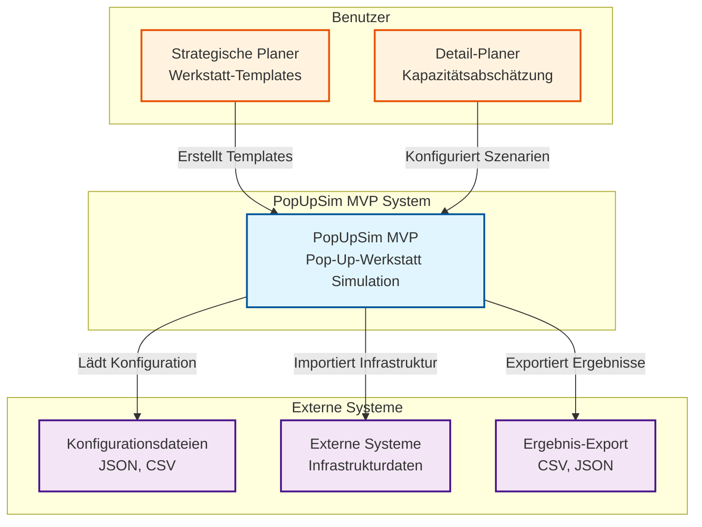
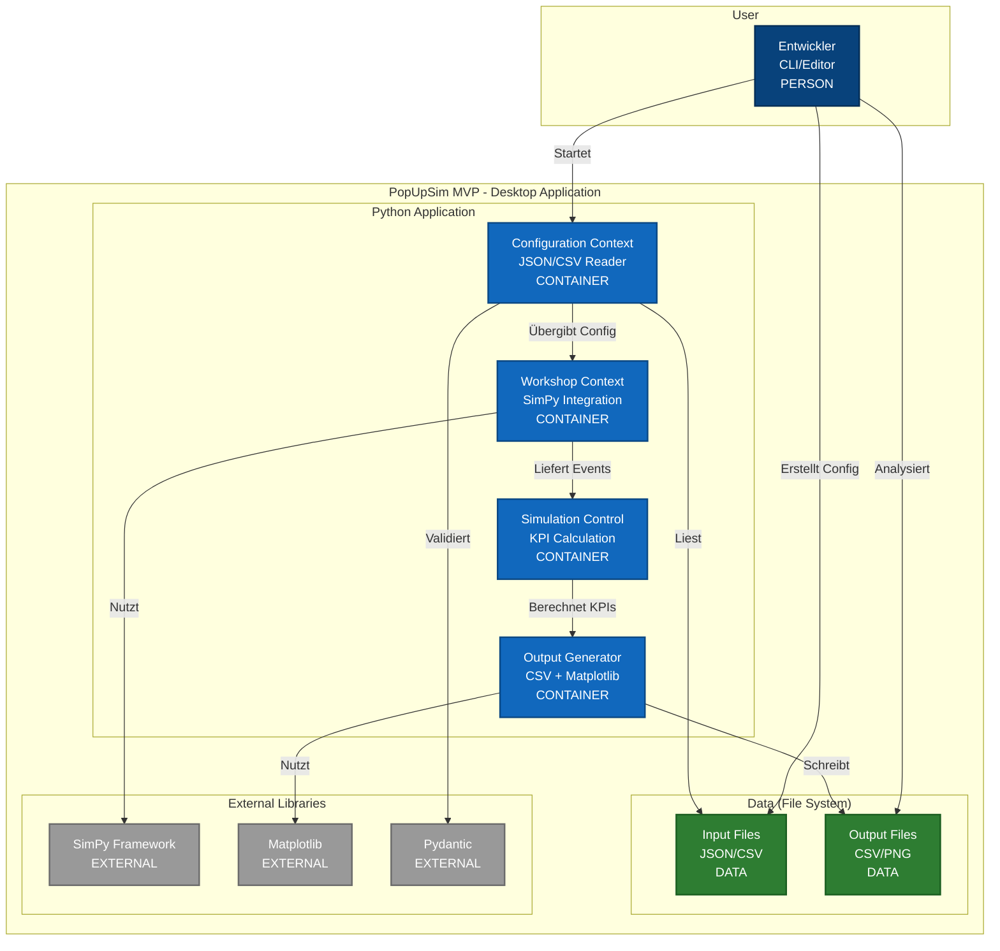
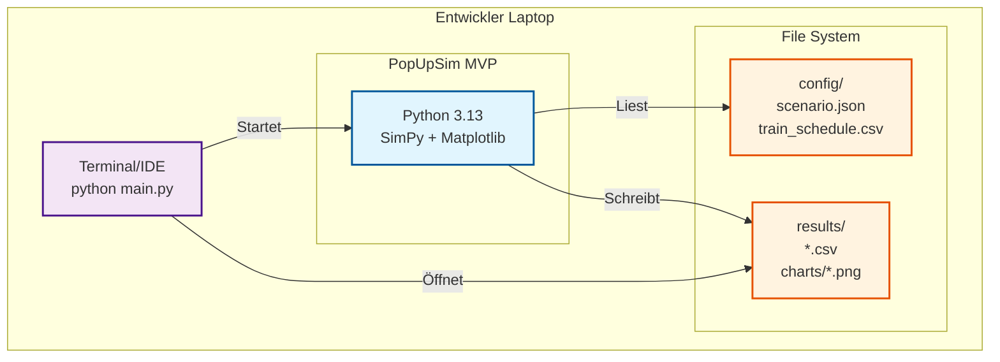

# 1. MVP System-Überblick

## 1.1 MVP Scope und Ziele

### Primäres Ziel
Funktionsfähiger Prototyp für Pop-Up-Werkstatt Simulation, der **reale fachliche Probleme löst** und als Basis für Community-Entwicklung dient.

### MVP User Stories (Priorität 1)
- **US-001**: Standardisierte Pop-Up-Werkstätten entwickeln (Templates)
- **US-002**: Durchsatz-Abschätzung für Werkstatt-Layouts
- **US-003**: Infrastrukturdaten importieren (CSV/JSON)
- **US-004**: Kapazitätsabschätzung für geplante Werkstatt

### Nicht im MVP Scope
- **US-005-008**: Erweiterte Visualisierung und Real-time Features

- **Advanced Security**: Lokale Anwendung ohne Authentifizierung
- **Complex UI**: Datei-basierte Konfiguration

## 1.2 System Context

## 1.3 Container-Architektur (C4 Level 2)

## 1.4 Technologie-Stack

### Core
- **Python 3.13**: Hauptsprache
- **SimPy**: Discrete Event Simulation
- **Pydantic**: Datenvalidierung
- **Matplotlib**: Visualisierung (Charts)
- **Pandas**: Datenverarbeitung (CSV)

### Development
- **uv**: Package Manager
- **pytest**: Testing Framework
- **Black**: Code Formatting
- **mypy**: Type Checking

### Nicht im MVP
- ❌ **Web-Frontend**: Nur CLI/Desktop
- ❌ **REST API**: Direkte Python-Aufrufe

## 1.5 Deployment-Architektur

### Installation Requirements
- **Python 3.13** mit uv
- **4GB RAM** für 1.000 Wagen Szenarien
- **500MB Festplatte** für Installation und Daten
- **Kein Web-Browser** erforderlich

## 1.6 Qualitätsattribute MVP

### Performance Ziele
- **Startup Zeit**: < 5 Sekunden
- **Simulation Speed**: 1.000 Wagen in < 30 Sekunden
- **Chart Generation**: < 5 Sekunden
- **Memory Usage**: < 1GB für typische Szenarien

### Funktionale Ziele
- **Determinismus**: Identische Ergebnisse bei gleichen Eingaben
- **Accuracy**: Plausible Durchsatz-Abschätzungen
- **Completeness**: Alle MVP User Stories abgedeckt
- **Usability**: < 1 Stunde für erstes Szenario

### Technische Ziele
- **Testability**: > 80% Code Coverage für Domain Logic
- **Maintainability**: Klare Trennung zwischen Contexts
- **Extensibility**: Einfache Erweiterung um neue Features
- **Portability**: Läuft auf Windows, macOS, Linux

## 1.7 Constraints und Annahmen

### Technische Constraints
- **Desktop Application**: Keine Web-Oberfläche
- **File-based I/O**: Keine Datenbank
- **CLI-basiert**: Keine grafische Benutzeroberfläche
- **Synchronous Processing**: Keine Async/Parallel Verarbeitung

### Fachliche Constraints
- **Pop-Up-Werkstätten**: Fokus auf DAK-Umrüstung
- **Mikroskopische Simulation**: Einzelne Wagen und Ressourcen
- **Deterministic**: Reproduzierbare Ergebnisse
- **Planning Tool**: Nicht für Real-time Betriebsführung

### Annahmen
- **Benutzer**: Entwickler und technische Planer
- **Datenqualität**: Korrekte und vollständige Eingabedaten
- **Hardware**: Standard Business Laptop (4GB RAM, i5 CPU)
- **Network**: Keine Netzwerk-Abhängigkeiten
- **Editor**: Benutzer können JSON/CSV manuell bearbeiten

## 1.8 Risiken und Mitigation

### Technische Risiken
| Risiko | Wahrscheinlichkeit | Impact | Mitigation |
|--------|-------------------|--------|------------|
| **Performance bei 1.000 Wagen** | Mittel | Hoch | Frühes Benchmarking in Woche 3 |
| **SimPy Learning Curve** | Hoch | Mittel | Prototyping und Dokumentation |
| **Matplotlib Limitierungen** | Niedrig | Niedrig | Einfache 2D Charts ausreichend |

### Fachliche Risiken
| Risiko | Wahrscheinlichkeit | Impact | Mitigation |
|--------|-------------------|--------|------------|
| **Unvollständige Domain Model** | Mittel | Hoch | Enge Abstimmung mit Fachexperten |
| **Unrealistische Ergebnisse** | Mittel | Hoch | Validierung mit realen Daten |
| **User Acceptance** | Niedrig | Hoch | Fokus auf Visualisierung |

## 1.9 Success Criteria

### Erfolgskriterien
- ✅ **Template Creation**: Standardisierte Werkstatt-Templates erstellbar
- ✅ **Throughput Estimation**: Plausible Durchsatz-Berechnungen
- ✅ **Data Import**: CSV/JSON Import funktioniert fehlerfrei
- ✅ **Capacity Analysis**: Kapazitätsengpässe werden identifiziert

### Technische Kriterien
- ✅ **Performance**: 1.000 Wagen Szenario in < 30 Sekunden
- ✅ **Stability**: Mehrere Simulationen hintereinander ohne Crash
- ✅ **Usability**: Entwickler erstellt Szenario in < 30 Minuten
- ✅ **Extensibility**: Neue Werkstatt-Typen einfach hinzufügbar

### Business Kriterien
- ✅ **Expert Validation**: Positive Bewertung durch Fachexperten
- ✅ **Real Usage**: Mindestens 1 echtes Planungsszenario
- ✅ **Next Steps**: Klarer Plan für Post-MVP Entwicklung

---

**Navigation:** [← MVP README](README.md) | [3 Contexts →](02-mvp-contexts.md)
