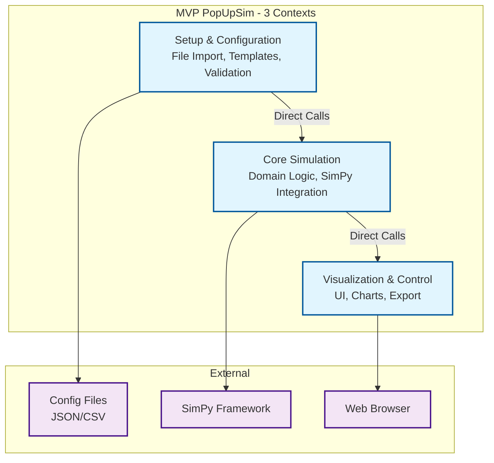
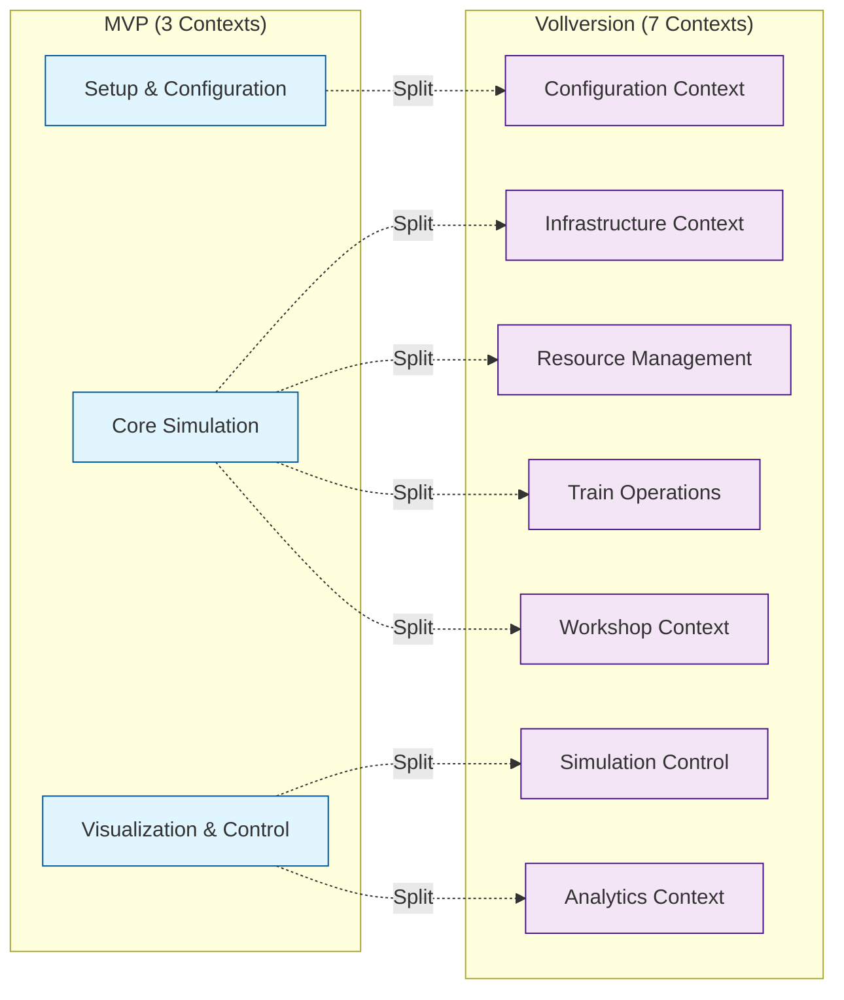

# 2. MVP Bounded Contexts

## 2.1 Context-Übersicht

Das MVP reduziert die 7 Bounded Contexts der Vollversion auf **3 pragmatische Contexts**, die die Kernfunktionalität abdecken:



## 2.2 Setup & Configuration Context

### Verantwortlichkeiten
- **File Import**: JSON/CSV Konfigurationsdateien einlesen
- **Template Management**: Standardisierte Werkstatt-Vorlagen
- **Data Validation**: Plausibilitätsprüfung der Eingabedaten
- **Scenario Building**: Vollständige Szenario-Konfiguration erstellen

### Domain Model

```python
@dataclass
class ScenarioConfig:
    """Vollständige Szenario-Konfiguration"""
    id: str
    name: str
    infrastructure: InfrastructureConfig
    workshops: List[WorkshopConfig]
    resources: ResourceConfig
    simulation_params: SimulationParams

@dataclass
class InfrastructureConfig:
    """Infrastruktur-Konfiguration"""
    tracks: List[TrackConfig]
    connections: List[ConnectionConfig]

@dataclass
class TrackConfig:
    """Gleis-Konfiguration"""
    id: str
    name: str
    length: float
    track_type: str  # "sammelgleis", "werkstattgleis", "parkplatz"
    capacity: int

@dataclass
class WorkshopConfig:
    """Werkstatt-Konfiguration (MVP: Vereinfacht)"""
    tracks: List[WorkshopTrackConfig]

@dataclass
class WorkshopTrackConfig:
    """Werkstattgleis-Konfiguration (MVP: Vereinfacht)"""
    id: str
    capacity: int  # Gesamtkapazität des Gleises (Anzahl Wagen)
    retrofit_time_min: int  # Umrüstzeit pro Wagen in Minuten

@dataclass
class WorkshopTemplate:
    """Wiederverwendbare Werkstatt-Vorlage"""
    template_id: str
    name: str
    category: str  # "small", "medium", "large"
    default_params: Dict[str, Any]
```

### Services

```python
class ConfigurationService:
    """Hauptservice für Konfiguration"""

    def load_scenario_from_file(self, file_path: str) -> ScenarioConfig:
        """Lädt Szenario aus JSON/CSV Datei"""
        pass

    def validate_scenario(self, config: ScenarioConfig) -> ValidationResult:
        """Validiert Szenario-Konfiguration"""
        pass

    def get_workshop_templates(self) -> List[WorkshopTemplate]:
        """Liefert verfügbare Werkstatt-Templates"""
        pass

    def create_scenario_from_template(self, template_id: str,
                                    params: Dict) -> ScenarioConfig:
        """Erstellt Szenario aus Template"""
        pass

class FileImportService:
    """Service für Datei-Import"""

    def import_infrastructure_csv(self, file_path: str) -> InfrastructureConfig:
        """Importiert Infrastruktur aus CSV"""
        pass

    def import_scenario_json(self, file_path: str) -> ScenarioConfig:
        """Importiert vollständiges Szenario aus JSON"""
        pass

class ValidationService:
    """Service für Datenvalidierung"""

    def validate_infrastructure(self, config: InfrastructureConfig) -> List[ValidationError]:
        """Validiert Infrastruktur-Konfiguration"""
        pass

    def validate_workshop_capacity(self, workshop: WorkshopConfig,
                                 infrastructure: InfrastructureConfig) -> List[ValidationWarning]:
        """Prüft Werkstatt-Infrastruktur Kompatibilität"""
        pass
```

### File Formats

**JSON Szenario-Konfiguration:**
```json
{
  "scenario": {
    "id": "small_workshop_demo",
    "name": "Kleine Werkstatt Demo",
    "infrastructure": {
      "tracks": [
        {"id": "GL01", "name": "Sammelgleis 1", "length": 500, "type": "sammelgleis", "capacity": 20},
        {"id": "GL02", "name": "Werkstattgleis", "length": 200, "type": "werkstattgleis", "capacity": 8}
      ]
    },
    "workshops": [
      {
        "id": "WS01",
        "name": "Hauptwerkstatt",
        "tracks": [
          {"id": "TRACK01", "name": "Gleis 1", "capacity": 8, "workers": 4, "processing_time": 45}
        ]
      }
    ]
  }
}
```

**CSV Infrastruktur-Import:**
```csv
track_id,name,length,type,capacity
GL01,Sammelgleis 1,500,sammelgleis,20
GL02,Werkstattgleis,200,werkstattgleis,8
GL03,Parkplatz,300,parkplatz,12
```

## 2.3 Core Simulation Context

### Verantwortlichkeiten
- **Domain Logic**: Geschäftsregeln für Pop-Up-Werkstatt Simulation
- **SimPy Integration**: Thin Adapter für Discrete Event Simulation
- **Resource Management**: Gleise, Werkstätten, Lokomotiven, Personal
- **Process Orchestration**: Wagen-Fluss durch Werkstatt-Prozess

### Domain Model

```python
@dataclass
class Wagon:
    """Einzelner Güterwagen (MVP: Vereinfacht)"""
    id: str
    train_id: str
    length: float
    is_loaded: bool
    needs_retrofit: bool
    current_location: Optional[str] = None
    status: str = "arriving"  # arriving, queued, processing, completed
    arrival_time: Optional[float] = None
    retrofit_start_time: Optional[float] = None
    retrofit_end_time: Optional[float] = None
    track_id: Optional[str] = None

@dataclass
class Train:
    """Zug mit mehreren Wagen"""
    id: str
    arrival_time: datetime
    wagons: List[Wagon]
    origin: str
    destination: str

    def get_total_length(self) -> float:
        return sum(wagon.length for wagon in self.wagons)

    def get_retrofit_wagons(self) -> List[Wagon]:
        return [w for w in self.wagons if w.needs_retrofit]

@dataclass
class Track:
    """Gleis mit Kapazitätsverwaltung"""
    id: str
    name: str
    length: float
    track_type: str
    capacity: int
    current_occupancy: float = 0.0

    def can_accommodate(self, length: float) -> bool:
        return self.current_occupancy + length <= self.length

    def occupy_space(self, length: float) -> None:
        if not self.can_accommodate(length):
            raise InsufficientCapacityError()
        self.current_occupancy += length

@dataclass
class Workshop:
    """Werkstatt mit mehreren Gleisen (MVP: Vereinfacht)"""
    id: str
    name: str
    tracks: List[WorkshopTrack]

@dataclass
class WorkshopTrack:
    """Werkstattgleis mit Verarbeitungskapazität (MVP: Vereinfacht)"""
    id: str
    capacity: int  # Gesamtkapazität (Anzahl Wagen)
    retrofit_time_min: int  # Umrüstzeit pro Wagen
    current_wagons: int = 0
    resource: Optional[Any] = None  # SimPy Resource

    def can_process_wagon(self) -> bool:
        return self.current_wagons < self.capacity

    def start_processing(self, wagon: Wagon) -> None:
        if not self.can_process_wagon():
            raise RuntimeError(f"Track {self.id} is full")
        self.current_wagons += 1
        wagon.status = "processing"
        wagon.track_id = self.id
```

### Services

```python
class SimulationService:
    """Hauptservice für Simulation"""

    def __init__(self, sim_engine: SimulationEnginePort):
        self.sim_engine = sim_engine
        self.trains = {}
        self.tracks = {}
        self.workshops = {}

    def run_simulation(self, scenario: ScenarioConfig,
                      duration_hours: int) -> SimulationResult:
        """Führt komplette Simulation durch"""
        # Setup
        self._setup_infrastructure(scenario.infrastructure)
        self._setup_workshops(scenario.workshops)

        # Run
        self.sim_engine.run_until(duration_hours * 60)  # minutes

        # Results
        return self._collect_results()

    def process_train_arrival(self, train: Train) -> None:
        """Verarbeitet Zug-Ankunft"""
        # Find suitable collection track
        track = self._find_collection_track(train.get_total_length())

        # Occupy track space
        track.occupy_space(train.get_total_length())

        # Schedule wagon processing
        for wagon in train.get_retrofit_wagons():
            self._schedule_wagon_processing(wagon)

    def _schedule_wagon_processing(self, wagon: Wagon) -> None:
        """Plant Wagen-Verarbeitung"""
        workshop = self._find_available_workshop()

        # Schedule processing with SimPy
        self.sim_engine.schedule_event(
            delay=0,  # Immediate
            callback=lambda: self._start_wagon_processing(wagon, workshop)
        )

    def _start_wagon_processing(self, wagon: Wagon, workshop: Workshop) -> None:
        """Startet Wagen-Verarbeitung"""
        workshop.start_processing(wagon)

        # Schedule completion
        self.sim_engine.schedule_event(
            delay=workshop.processing_time_minutes,
            callback=lambda: self._complete_wagon_processing(wagon, workshop)
        )

class ThroughputCalculationService:
    """Service für Durchsatz-Berechnungen"""

    def calculate_theoretical_throughput(self, workshop: WorkshopConfig) -> ThroughputEstimate:
        """Berechnet theoretischen Werkstatt-Durchsatz (MVP: Gleis-basiert)"""
        total_capacity = sum(t.capacity for t in workshop.tracks)
        avg_processing_time = sum(t.processing_time_minutes for t in workshop.tracks) / len(workshop.tracks)
        wagons_per_hour = (total_capacity * 60) / avg_processing_time
        wagons_per_day = wagons_per_hour * 24

        return ThroughputEstimate(
            wagons_per_hour=wagons_per_hour,
            wagons_per_day=wagons_per_day,
            utilization_factor=0.85  # Realistic efficiency
        )

    def identify_bottlenecks(self, scenario: ScenarioConfig) -> List[BottleneckAnalysis]:
        """Identifiziert Kapazitätsengpässe"""
        bottlenecks = []

        # Workshop capacity vs track capacity
        for workshop in scenario.workshops:
            workshop_capacity = self.calculate_theoretical_throughput(workshop)
            track_capacity = self._calculate_track_capacity(scenario.infrastructure)

            if workshop_capacity.wagons_per_day > track_capacity.wagons_per_day:
                bottlenecks.append(BottleneckAnalysis(
                    type="track_capacity",
                    description=f"Gleiskapazität limitiert Werkstatt {workshop.name}",
                    impact_percent=((workshop_capacity.wagons_per_day - track_capacity.wagons_per_day)
                                  / workshop_capacity.wagons_per_day * 100)
                ))

        return bottlenecks
```

### SimPy Integration (Thin Adapter)

```python
class SimulationEnginePort(ABC):
    """Port für Simulation Engine (Thin Interface)"""

    @abstractmethod
    def schedule_event(self, delay: float, callback: Callable) -> None:
        pass

    @abstractmethod
    def run_until(self, end_time: float) -> None:
        pass

    @abstractmethod
    def current_time(self) -> float:
        pass

class SimPyAdapter(SimulationEnginePort):
    """SimPy Adapter Implementation"""

    def __init__(self):
        self.env = simpy.Environment()

    def schedule_event(self, delay: float, callback: Callable) -> None:
        self.env.process(self._delayed_callback(delay, callback))

    def _delayed_callback(self, delay: float, callback: Callable):
        yield self.env.timeout(delay)
        callback()

    def run_until(self, end_time: float) -> None:
        self.env.run(until=end_time)

    def current_time(self) -> float:
        return self.env.now
```

## 2.4 Visualization & Control Context

### Verantwortlichkeiten
- **Web UI**: Vue.js Frontend für Benutzerinteraktion
- **Data Visualization**: Charts und Diagramme für Ergebnisse
- **Simulation Control**: Start, Stop, Parameter-Anpassung
- **Export Functions**: CSV/JSON Export der Ergebnisse

### Components

```python
class VisualizationService:
    """Service für Datenvisualisierung"""

    def generate_throughput_chart(self, results: SimulationResult) -> ChartData:
        """Erstellt Durchsatz-Diagramm"""
        pass

    def generate_capacity_utilization_chart(self, results: SimulationResult) -> ChartData:
        """Erstellt Kapazitätsauslastung-Diagramm"""
        pass

    def generate_track_layout_view(self, infrastructure: InfrastructureConfig) -> LayoutData:
        """Erstellt 2D Gleisplan-Darstellung"""
        pass

class ExportService:
    """Service für Daten-Export"""

    def export_results_csv(self, results: SimulationResult, file_path: str) -> None:
        """Exportiert Ergebnisse als CSV"""
        pass

    def export_scenario_json(self, scenario: ScenarioConfig, file_path: str) -> None:
        """Exportiert Szenario-Konfiguration als JSON"""
        pass

class SimulationControlService:
    """Service für Simulations-Steuerung"""

    def start_simulation(self, scenario_id: str) -> str:
        """Startet Simulation"""
        pass

    def get_simulation_status(self, simulation_id: str) -> SimulationStatus:
        """Liefert aktuellen Simulations-Status"""
        pass

    def get_live_metrics(self, simulation_id: str) -> LiveMetrics:
        """Liefert Live-Metriken während Simulation"""
        pass
```

### REST API Endpoints

```python
# FastAPI Endpoints
@app.post("/api/scenarios")
def create_scenario(scenario_data: ScenarioConfig) -> ScenarioResponse:
    """Erstellt neues Szenario"""
    pass

@app.get("/api/scenarios/{scenario_id}")
def get_scenario(scenario_id: str) -> ScenarioConfig:
    """Liefert Szenario-Konfiguration"""
    pass

@app.post("/api/simulations")
def start_simulation(request: SimulationRequest) -> SimulationResponse:
    """Startet neue Simulation"""
    pass

@app.get("/api/simulations/{simulation_id}/results")
def get_simulation_results(simulation_id: str) -> SimulationResult:
    """Liefert Simulations-Ergebnisse"""
    pass

@app.get("/api/templates")
def get_workshop_templates() -> List[WorkshopTemplate]:
    """Liefert verfügbare Werkstatt-Templates"""
    pass
```

### Frontend Structure

```typescript
// Vue.js Components
interface ScenarioSetupComponent {
  // File upload for configuration
  // Template selection
  // Basic parameter adjustment
}

interface SimulationControlComponent {
  // Start/Stop simulation
  // Progress display
  // Live metrics
}

interface ResultsVisualizationComponent {
  // Throughput charts
  // Capacity utilization
  // Bottleneck analysis
}

interface TrackLayoutComponent {
  // 2D track visualization
  // Wagon positions
  // Resource status
}
```

## 2.5 Context Interactions

### Direct Service Calls (MVP Vereinfachung)

```python
# Statt Event-Driven Architecture: Direct Calls
class PopUpSimApplication:
    """Main Application orchestrating all contexts"""

    def __init__(self):
        self.config_service = ConfigurationService()
        self.simulation_service = SimulationService(SimPyAdapter())
        self.visualization_service = VisualizationService()

    def run_complete_analysis(self, config_file: str) -> AnalysisResult:
        # 1. Setup & Configuration
        scenario = self.config_service.load_scenario_from_file(config_file)
        validation = self.config_service.validate_scenario(scenario)

        if not validation.is_valid:
            raise ValidationError(validation.errors)

        # 2. Core Simulation
        sim_results = self.simulation_service.run_simulation(scenario, duration_hours=24)

        # 3. Visualization & Export
        charts = self.visualization_service.generate_all_charts(sim_results)

        return AnalysisResult(
            scenario=scenario,
            simulation_results=sim_results,
            visualizations=charts
        )
```

## 2.6 Migration Path zu 6 Contexts

Nach MVP können die 3 Contexts schrittweise in die 7 Ziel-Contexts aufgeteilt werden:



**Aufwand für Migration:** 1-2 Wochen nach MVP

---

**Navigation:** [← System-Überblick](01-mvp-overview.md) | [Domain Model →](03-mvp-domain-model.md)
