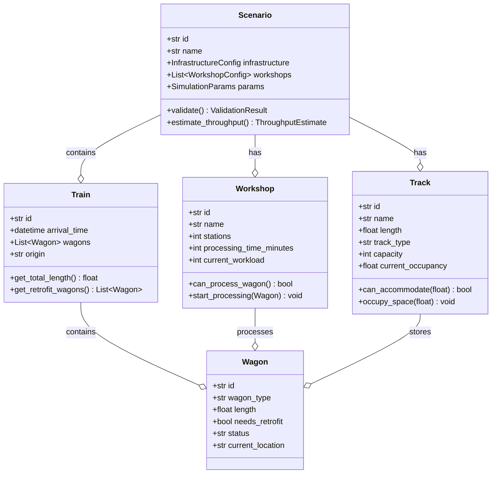

# 3. MVP Domain Model

## 3.1 Domain Model Übersicht

Das MVP Domain Model fokussiert auf die **Kerngeschäftslogik** der Pop-Up-Werkstatt Simulation und verzichtet auf komplexe DDD Patterns zugunsten von Einfachheit und schneller Implementierung.



## 3.2 Core Entities

### Scenario (Aggregate Root)

```python
@dataclass
class Scenario:
    """Hauptaggregat für komplettes Simulations-Szenario"""
    id: str
    name: str
    description: str
    infrastructure: InfrastructureConfig
    workshops: List[WorkshopConfig]
    resources: ResourceConfig
    simulation_params: SimulationParams
    created_at: datetime = field(default_factory=datetime.now)

    def validate(self) -> ValidationResult:
        """Validiert komplettes Szenario"""
        errors = []
        warnings = []

        # Infrastructure validation
        if not self.infrastructure.tracks:
            errors.append("Mindestens ein Gleis erforderlich")

        # Workshop validation
        if not self.workshops:
            errors.append("Mindestens eine Werkstatt erforderlich")

        # Capacity validation
        total_workshop_capacity = sum(w.daily_capacity for w in self.workshops)
        total_track_capacity = sum(t.capacity for t in self.infrastructure.tracks)

        if total_workshop_capacity > total_track_capacity * 1.5:
            warnings.append("Werkstattkapazität übersteigt Gleiskapazität deutlich")

        return ValidationResult(
            is_valid=len(errors) == 0,
            errors=errors,
            warnings=warnings
        )

    def estimate_throughput(self) -> ThroughputEstimate:
        """Schätzt theoretischen Durchsatz"""
        total_stations = sum(w.stations for w in self.workshops)
        avg_processing_time = sum(w.processing_time_minutes for w in self.workshops) / len(self.workshops)

        wagons_per_hour = (total_stations * 60) / avg_processing_time
        wagons_per_day = wagons_per_hour * 24 * 0.85  # 85% efficiency

        return ThroughputEstimate(
            wagons_per_hour=round(wagons_per_hour, 1),
            wagons_per_day=round(wagons_per_day, 0),
            efficiency_factor=0.85
        )

@dataclass
class InfrastructureConfig:
    """Infrastruktur-Konfiguration"""
    tracks: List[TrackConfig]
    connections: List[ConnectionConfig] = field(default_factory=list)

    def get_tracks_by_type(self, track_type: str) -> List[TrackConfig]:
        """Filtert Gleise nach Typ"""
        return [t for t in self.tracks if t.track_type == track_type]

    def get_total_capacity(self) -> int:
        """Berechnet Gesamtkapazität aller Gleise"""
        return sum(t.capacity for t in self.tracks)

@dataclass
class WorkshopConfig:
    """Werkstatt-Konfiguration (MVP: Vereinfacht)"""
    id: str
    name: str
    tracks: List[WorkshopTrackConfig]

@dataclass
class WorkshopTrackConfig:
    """Werkstattgleis-Konfiguration (MVP: Vereinfacht)"""
    id: str
    name: str
    capacity: int  # Gesamtkapazität des Gleises
    workers: int
    processing_time_minutes: int

    def calculate_theoretical_throughput(self) -> float:
        """Berechnet theoretischen Durchsatz"""
        return (self.capacity * 60 * 24) / self.processing_time_minutes
```

### Train and Wagon

```python
@dataclass
class Train:
    """Zug mit mehreren Wagen"""
    id: str
    arrival_time: datetime
    wagons: List[Wagon]
    origin: str
    destination: str
    priority: int = 1  # 1=normal, 2=high, 3=urgent

    def get_total_length(self) -> float:
        """Berechnet Gesamtlänge des Zuges"""
        return sum(wagon.length for wagon in self.wagons)

    def get_total_weight(self) -> float:
        """Berechnet Gesamtgewicht des Zuges"""
        return sum(wagon.weight for wagon in self.wagons)

    def get_retrofit_wagons(self) -> List[Wagon]:
        """Liefert Wagen die umgerüstet werden müssen"""
        return [w for w in self.wagons if w.needs_retrofit]

    def get_non_retrofit_wagons(self) -> List[Wagon]:
        """Liefert Wagen die nicht umgerüstet werden müssen"""
        return [w for w in self.wagons if not w.needs_retrofit]

    def split_by_retrofit_need(self) -> Tuple[List[Wagon], List[Wagon]]:
        """Teilt Zug in umzurüstende und normale Wagen"""
        retrofit = self.get_retrofit_wagons()
        normal = self.get_non_retrofit_wagons()
        return retrofit, normal

@dataclass
class Wagon:
    """Einzelner Güterwagen"""
    id: str
    wagon_type: str  # "Güterwagen", "Kesselwagen", "Containerwagen"
    length: float  # Meter
    weight: float  # Tonnen
    needs_retrofit: bool
    current_location: Optional[str] = None
    status: WagonStatus = WagonStatus.ARRIVING
    processing_start_time: Optional[datetime] = None
    processing_end_time: Optional[datetime] = None

    def start_processing(self, workshop_id: str) -> None:
        """Startet Verarbeitung in Werkstatt"""
        self.status = WagonStatus.PROCESSING
        self.current_location = workshop_id
        self.processing_start_time = datetime.now()

    def complete_processing(self) -> None:
        """Schließt Verarbeitung ab"""
        self.status = WagonStatus.COMPLETED
        self.processing_end_time = datetime.now()
        self.needs_retrofit = False  # Umrüstung abgeschlossen

    def get_processing_duration(self) -> Optional[timedelta]:
        """Berechnet Verarbeitungsdauer"""
        if self.processing_start_time and self.processing_end_time:
            return self.processing_end_time - self.processing_start_time
        return None

class WagonStatus(Enum):
    """Status eines Wagens im Prozess"""
    ARRIVING = "arriving"
    QUEUED = "queued"
    PROCESSING = "processing"
    COMPLETED = "completed"
    DEPARTED = "departed"
```

### Infrastructure

```python
@dataclass
class Track:
    """Gleis mit Kapazitätsverwaltung"""
    id: str
    name: str
    length: float  # Meter
    track_type: TrackType
    capacity: int  # Anzahl Wagen
    current_occupancy: float = 0.0  # Belegte Länge in Meter
    current_wagon_count: int = 0

    def can_accommodate(self, length: float) -> bool:
        """Prüft ob Gleis Länge aufnehmen kann"""
        return self.current_occupancy + length <= self.length

    def can_accommodate_wagon(self) -> bool:
        """Prüft ob Gleis weiteren Wagen aufnehmen kann"""
        return self.current_wagon_count < self.capacity

    def occupy_space(self, length: float) -> None:
        """Belegt Platz auf Gleis"""
        if not self.can_accommodate(length):
            raise InsufficientTrackCapacityError(
                f"Gleis {self.id} kann {length}m nicht aufnehmen. "
                f"Verfügbar: {self.length - self.current_occupancy}m"
            )
        self.current_occupancy += length
        self.current_wagon_count += 1

    def free_space(self, length: float) -> None:
        """Gibt Platz auf Gleis frei"""
        self.current_occupancy = max(0, self.current_occupancy - length)
        self.current_wagon_count = max(0, self.current_wagon_count - 1)

    def get_utilization_percent(self) -> float:
        """Berechnet Auslastung in Prozent"""
        return (self.current_occupancy / self.length) * 100

@dataclass
class TrackConfig:
    """Gleis-Konfiguration (für Setup)"""
    id: str
    name: str
    length: float
    track_type: str
    capacity: int

    def to_track(self) -> Track:
        """Konvertiert zu Track Entity"""
        return Track(
            id=self.id,
            name=self.name,
            length=self.length,
            track_type=TrackType(self.track_type),
            capacity=self.capacity
        )

class TrackType(Enum):
    """Gleis-Typen"""
    SAMMELGLEIS = "sammelgleis"
    ZUFÜHRUNGSGLEIS = "zuführungsgleis"
    WERKSTATTGLEIS = "werkstattgleis"
    PARKPLATZ = "parkplatz"
    ABSTELLGLEIS = "abstellgleis"
```

### Workshop

```python
@dataclass
class Workshop:
    """Werkstatt mit mehreren Gleisen (MVP: Vereinfacht)"""
    id: str
    name: str
    tracks: List[WorkshopTrack]

@dataclass
class WorkshopTrack:
    """Werkstattgleis mit Verarbeitungskapazität (MVP: Vereinfacht)"""
    id: str
    name: str
    capacity: int  # Gesamtkapazität des Gleises
    workers: int
    processing_time_minutes: int
    current_workload: int = 0  # Aktuell bearbeitete Wagen
    total_processed: int = 0  # Gesamt bearbeitete Wagen

    def can_process_wagon(self) -> bool:
        """Prüft ob Gleis Kapazität hat"""
        return self.current_workload < self.capacity

    def start_processing(self, wagon: Wagon) -> None:
        """Startet Verarbeitung eines Wagens"""
        if not self.can_process_wagon():
            raise TrackCapacityExceededError(
                f"Gleis {self.id} ist voll. "
                f"Kapazität: {self.capacity}, Aktuell: {self.current_workload}"
            )

        self.current_workload += 1
        wagon.start_processing(self.id)

    def complete_processing(self, wagon: Wagon) -> None:
        """Schließt Verarbeitung eines Wagens ab"""
        self.current_workload = max(0, self.current_workload - 1)
        self.total_processed += 1
        wagon.complete_processing()

    def get_utilization_percent(self) -> float:
        """Berechnet Auslastung in Prozent"""
        return (self.current_workload / self.capacity) * 100

    def get_theoretical_daily_capacity(self) -> int:
        """Berechnet theoretische Tageskapazität"""
        minutes_per_day = 24 * 60
        return int((self.capacity * minutes_per_day) / self.processing_time_minutes)
```

## 3.3 Value Objects

```python
@dataclass(frozen=True)
class ValidationResult:
    """Ergebnis einer Validierung"""
    is_valid: bool
    errors: List[str]
    warnings: List[str]

    def has_errors(self) -> bool:
        return len(self.errors) > 0

    def has_warnings(self) -> bool:
        return len(self.warnings) > 0

@dataclass(frozen=True)
class ThroughputEstimate:
    """Durchsatz-Schätzung"""
    wagons_per_hour: float
    wagons_per_day: float
    efficiency_factor: float
    bottleneck: Optional[str] = None

    def with_efficiency(self, factor: float) -> 'ThroughputEstimate':
        """Erstellt neue Schätzung mit anderem Effizienzfaktor"""
        return ThroughputEstimate(
            wagons_per_hour=self.wagons_per_hour * factor,
            wagons_per_day=self.wagons_per_day * factor,
            efficiency_factor=factor,
            bottleneck=self.bottleneck
        )

@dataclass(frozen=True)
class SimulationParams:
    """Parameter für Simulation"""
    duration_hours: int = 24
    train_arrival_interval_minutes: int = 60
    random_seed: Optional[int] = None
    efficiency_factor: float = 0.85

    def validate(self) -> List[str]:
        """Validiert Parameter"""
        errors = []
        if self.duration_hours <= 0:
            errors.append("Simulationsdauer muss positiv sein")
        if self.train_arrival_interval_minutes <= 0:
            errors.append("Zug-Ankunftsintervall muss positiv sein")
        if not 0.1 <= self.efficiency_factor <= 1.0:
            errors.append("Effizienzfaktor muss zwischen 0.1 und 1.0 liegen")
        return errors

@dataclass(frozen=True)
class SimulationResult:
    """Ergebnis einer Simulation"""
    scenario_id: str
    duration_hours: int
    total_trains_processed: int
    total_wagons_processed: int
    average_processing_time_minutes: float
    workshop_utilization: Dict[str, float]
    track_utilization: Dict[str, float]
    throughput_per_hour: float
    bottlenecks: List[str]

    def get_efficiency_percent(self) -> float:
        """Berechnet Gesamteffizienz"""
        theoretical_max = self.duration_hours * 60  # Minuten
        actual_processing = self.total_wagons_processed * self.average_processing_time_minutes
        return (actual_processing / theoretical_max) * 100
```

## 3.4 Domain Services

```python
class ThroughputCalculationService:
    """Service für Durchsatz-Berechnungen"""

    def calculate_scenario_throughput(self, scenario: Scenario) -> ThroughputEstimate:
        """Berechnet Durchsatz für gesamtes Szenario"""
        workshop_throughput = self._calculate_workshop_throughput(scenario.workshops)
        track_throughput = self._calculate_track_throughput(scenario.infrastructure)

        # Bottleneck bestimmen
        if workshop_throughput.wagons_per_day < track_throughput.wagons_per_day:
            bottleneck = "workshop_capacity"
            limiting_throughput = workshop_throughput
        else:
            bottleneck = "track_capacity"
            limiting_throughput = track_throughput

        return ThroughputEstimate(
            wagons_per_hour=limiting_throughput.wagons_per_hour,
            wagons_per_day=limiting_throughput.wagons_per_day,
            efficiency_factor=limiting_throughput.efficiency_factor,
            bottleneck=bottleneck
        )

    def _calculate_workshop_throughput(self, workshops: List[WorkshopConfig]) -> ThroughputEstimate:
        """Berechnet Werkstatt-Durchsatz (MVP: Gleis-basiert)"""
        total_capacity = sum(sum(t.capacity for t in w.tracks) for w in workshops)
        all_tracks = [t for w in workshops for t in w.tracks]
        avg_processing_time = sum(t.processing_time_minutes for t in all_tracks) / len(all_tracks)

        wagons_per_hour = (total_capacity * 60) / avg_processing_time
        wagons_per_day = wagons_per_hour * 24

        return ThroughputEstimate(
            wagons_per_hour=wagons_per_hour,
            wagons_per_day=wagons_per_day,
            efficiency_factor=0.85
        )

    def identify_bottlenecks(self, scenario: Scenario) -> List[str]:
        """Identifiziert Engpässe im Szenario"""
        bottlenecks = []

        # Workshop vs Track Capacity
        workshop_capacity = sum(w.daily_capacity for w in scenario.workshops)
        track_capacity = sum(t.capacity for t in scenario.infrastructure.tracks) * 3  # 3 Umschläge/Tag

        if workshop_capacity > track_capacity:
            bottlenecks.append("Gleiskapazität limitiert Werkstatt-Durchsatz")

        # Individual workshop analysis
        for workshop in scenario.workshops:
            theoretical_capacity = workshop.calculate_theoretical_throughput()
            if workshop.daily_capacity < theoretical_capacity * 0.7:
                bottlenecks.append(f"Werkstatt {workshop.name} unterausgelastet")

        return bottlenecks

class ScenarioValidationService:
    """Service für Szenario-Validierung"""

    def validate_complete_scenario(self, scenario: Scenario) -> ValidationResult:
        """Vollständige Szenario-Validierung"""
        errors = []
        warnings = []

        # Basic validation
        basic_result = scenario.validate()
        errors.extend(basic_result.errors)
        warnings.extend(basic_result.warnings)

        # Advanced validation
        advanced_errors, advanced_warnings = self._advanced_validation(scenario)
        errors.extend(advanced_errors)
        warnings.extend(advanced_warnings)

        return ValidationResult(
            is_valid=len(errors) == 0,
            errors=errors,
            warnings=warnings
        )

    def _advanced_validation(self, scenario: Scenario) -> Tuple[List[str], List[str]]:
        """Erweiterte Validierung"""
        errors = []
        warnings = []

        # Check for disconnected infrastructure
        if not self._is_infrastructure_connected(scenario.infrastructure):
            errors.append("Infrastruktur ist nicht vollständig verbunden")

        # Check workshop-track assignment
        workshop_tracks = scenario.infrastructure.get_tracks_by_type("werkstattgleis")
        if len(workshop_tracks) < len(scenario.workshops):
            warnings.append("Weniger Werkstattgleise als Werkstätten vorhanden")

        return errors, warnings

    def _is_infrastructure_connected(self, infrastructure: InfrastructureConfig) -> bool:
        """Prüft ob Infrastruktur verbunden ist"""
        # Vereinfachte Prüfung für MVP
        return len(infrastructure.tracks) > 0 and len(infrastructure.connections) >= len(infrastructure.tracks) - 1
```

## 3.5 Domain Events (Simplified)

```python
@dataclass
class DomainEvent:
    """Basis für Domain Events (vereinfacht für MVP)"""
    event_id: str = field(default_factory=lambda: str(uuid.uuid4()))
    timestamp: datetime = field(default_factory=datetime.now)
    aggregate_id: str = ""

@dataclass
class TrainArrivedEvent(DomainEvent):
    """Zug ist angekommen"""
    train_id: str
    wagon_count: int
    retrofit_wagon_count: int
    total_length: float

@dataclass
class WagonProcessingStartedEvent(DomainEvent):
    """Wagen-Verarbeitung gestartet"""
    wagon_id: str
    workshop_id: str
    estimated_completion_time: datetime

@dataclass
class WagonProcessingCompletedEvent(DomainEvent):
    """Wagen-Verarbeitung abgeschlossen"""
    wagon_id: str
    workshop_id: str
    actual_processing_time_minutes: int

@dataclass
class TrackCapacityExceededEvent(DomainEvent):
    """Gleis-Kapazität überschritten (MVP)"""
    track_id: str
    current_workload: int
    max_capacity: int

# Simplified Event Handling for MVP
class SimpleEventHandler:
    """Vereinfachter Event Handler für MVP"""

    def __init__(self):
        self.handlers: Dict[Type[DomainEvent], List[Callable]] = {}

    def register(self, event_type: Type[DomainEvent], handler: Callable):
        """Registriert Event Handler"""
        if event_type not in self.handlers:
            self.handlers[event_type] = []
        self.handlers[event_type].append(handler)

    def publish(self, event: DomainEvent):
        """Publiziert Event"""
        event_type = type(event)
        if event_type in self.handlers:
            for handler in self.handlers[event_type]:
                handler(event)
```

## 3.6 Exceptions

```python
class PopUpSimDomainError(Exception):
    """Basis für Domain-spezifische Fehler"""
    pass

class InsufficientTrackCapacityError(PopUpSimDomainError):
    """Gleis hat nicht genügend Kapazität"""
    pass

class TrackCapacityExceededError(PopUpSimDomainError):
    """Gleis-Kapazität überschritten (MVP)"""
    pass

class InvalidScenarioConfigurationError(PopUpSimDomainError):
    """Ungültige Szenario-Konfiguration"""
    pass

class SimulationRuntimeError(PopUpSimDomainError):
    """Fehler während Simulation"""
    pass
```

## 3.7 Migration Path

Das vereinfachte MVP Domain Model kann schrittweise zur vollständigen DDD-Implementierung erweitert werden:

### Phase 1 (Post-MVP): Rich Domain Model
- Aggregate Roots mit Invarianten
- Domain Services für komplexe Geschäftslogik
- Repository Pattern für Persistierung

### Phase 2: Event Sourcing
- Event Store Implementation
- Event-driven State Reconstruction
- Temporal Queries

### Phase 3: Advanced DDD
- Specification Pattern für komplexe Queries
- Domain Events mit Saga Pattern
- CQRS für Read/Write Separation

**Aufwand:** 2-3 Wochen für vollständige DDD-Migration

---

**Navigation:** [← 3 Contexts](02-mvp-contexts.md) | [SimPy Integration →](04-mvp-simpy-integration.md)
