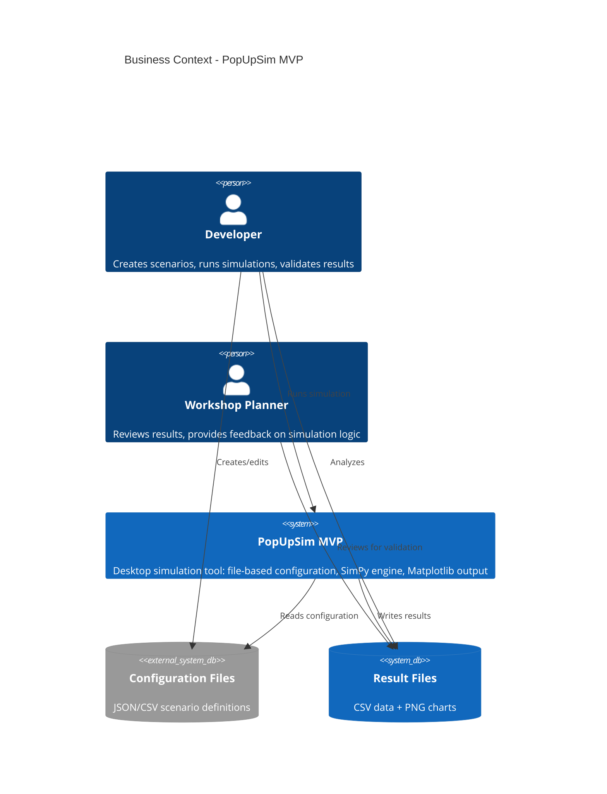
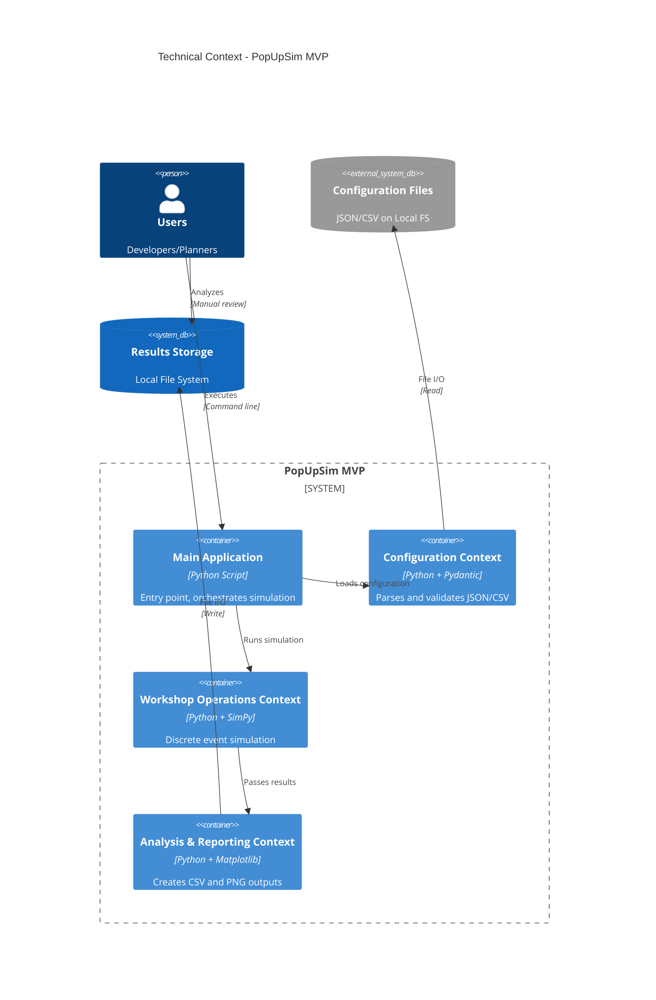
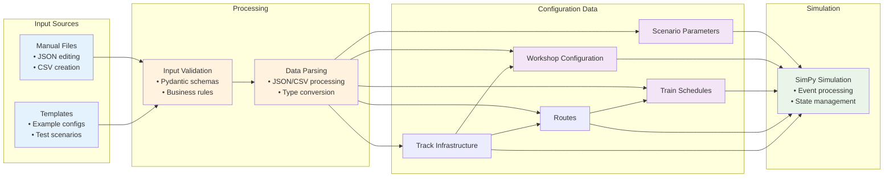
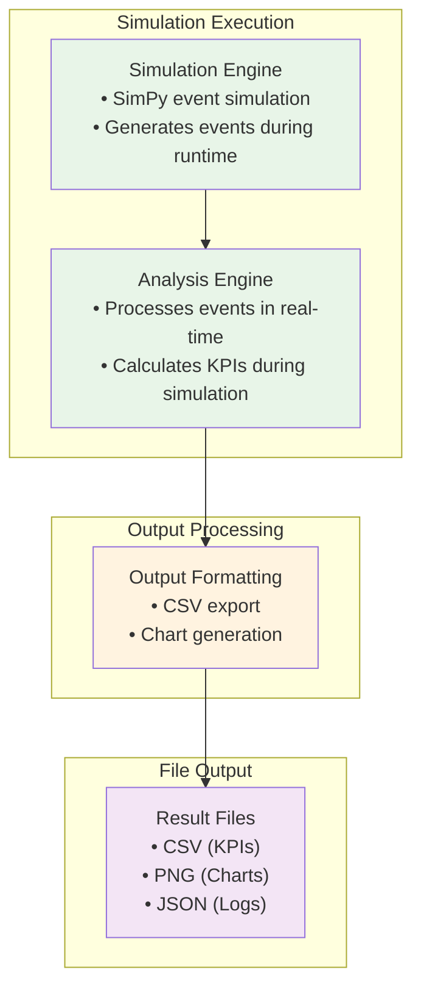

# 3. System Scope and Context (MVP)

## 3.1 Business Context

**PopUpSim MVP's Role:**

PopUpSim MVP is a **proof-of-concept desktop tool** for simulating Pop-Up workshop operations during the DAC migration. The MVP validates the simulation approach with 4 priority use cases before building the full web-based version.

**MVP Business Logic:**
1. **Developers configure scenarios** using JSON/CSV files
2. **MVP simulates retrofit workflow** using SimPy discrete event simulation
3. **Results exported to CSV/PNG** for manual analysis
4. **Validates simulation approach** for full version development

### 3.1.1 Communication Partners

| External Entity | Input to MVP | Output from MVP | Business Purpose |
|-----------------|--------------|-----------------|------------------|
| **Developer** | Scenario configurations, test data | Simulation results, KPI data | Develop and validate simulation logic |
| **Workshop Planner** | Requirements, feedback | Result analysis, throughput estimates | Validate simulation accuracy against real-world expectations |
| **Configuration Files** | Scenario definitions, workshop setup, train schedules | - | Define simulation parameters and input data |
| **Result Files** | - | CSV data, PNG charts, JSON logs | Store simulation results for analysis |

## 3.2 Technical Context

### 3.2.1 Technical Channels

| Channel | Transmission Media | Protocol/Format | Direction | Description |
|---------|-------------------|-----------------|-----------|-------------|
| **Configuration Input** | Local File System | File I/O (JSON/CSV) | Input | Scenario configuration files |
| **Results Output** | Local File System | File I/O (CSV/PNG/JSON) | Output | Simulation results and visualizations |
| **Internal Communication** | Process Memory | Python function calls | Internal | Direct method invocation between components |

### 3.2.2 Security and Quality Requirements

**Local Deployment Security:**
- **Input validation** with Pydantic schema validation
- **File system permissions** using standard OS user permissions
- **No network access** required (fully offline)

**Operational Considerations:**
- **Error logging** to console and log files
- **Progress indicators** for simulation execution
- **Input file validation** before simulation starts

## 3.3 Data Flow Context

### 3.3.1 Input Data Flow

### 3.3.2 Output Data Flow

## 3.4 Critical Dependencies Analysis

### 3.4.1 Current Critical Dependencies

| Dependency | Criticality | Failure Impact | Mitigation Strategy |
|------------|-------------|----------------|--------------------|
| **Python Runtime (3.13+)** | High | System inoperable | Version pinning, startup checks |
| **SimPy Library** | High | Simulation engine fails | Version pinning, dependency monitoring |
| **Configuration Files** | High | Cannot start simulation | Validation, example files, clear error messages |
| **File System Access** | High | Cannot save/load data | Permission checks, error handling |
| **Matplotlib** | Medium | No visualizations | CSV output still available |
| **Pandas** | Medium | Slower CSV processing | Native Python CSV fallback |

---

