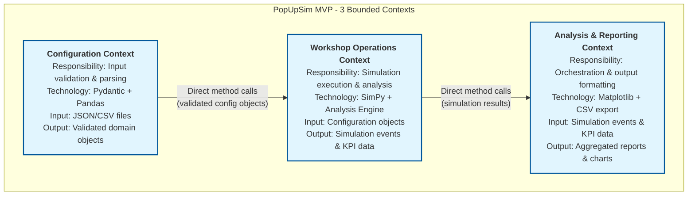
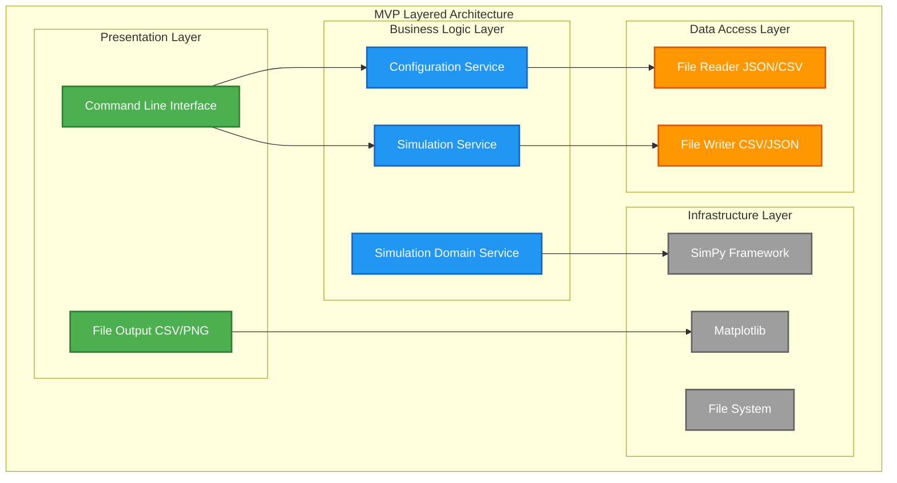
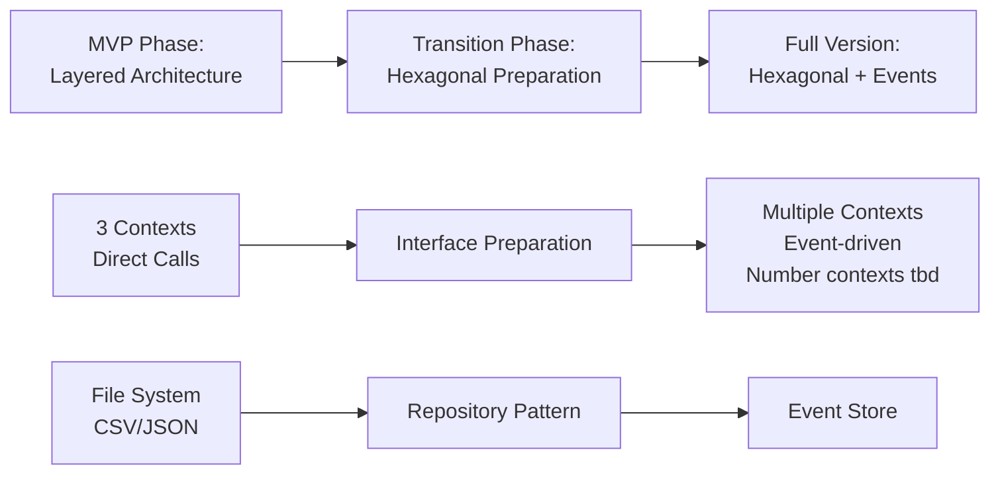

# 4. Solution Strategy (MVP)

## 4.1 Top-Level Decomposition

**Primary Decomposition:** Domain-driven design with 3 bounded contexts.

**Rationale:** Separating concerns by domain responsibility enables:
- Clear ownership of functionality
- Independent development and testing
- Easier migration to full version with all necessary contexts
- Maintainable codebase despite tight MVP timeline

### Context Responsibilities

| Context | Core Responsibility | Key Components | MVP Simplification |
|---------|-------------------|----------------|--------------------|
| **Configuration** | Parse and validate input files | File readers, Pydantic models, validators | Single context vs. multiple specialized contexts in full version (under analysis) |
| **Workshop Operations** | Execute discrete event simulation and real-time analysis | SimPy processes, analysis engine, domain entities (wagons, tracks, workshops), business rules | Simplified domain model, direct calls vs. event-driven |
| **Analysis & Reporting** | Orchestrate simulation and aggregate output | KPI aggregators, output formatters, chart generators | File-based output vs. web interface in full version |

## 4.2 Technology Decisions

**Key Technology Choices:**

| Technology | Purpose | Rationale | ADR |
|------------|---------|-----------|-----|
| **SimPy** | Discrete event simulation | Proven in 3-Länderhack POC, deterministic, Python-native | [ADR MVP-001](09-architecture-decisions.md#adr-mvp-001-simpy-for-discrete-event-simulation) |
| **Pydantic** | Data validation | Type safety, excellent validation, matches project type hint requirements | [ADR MVP-003](09-architecture-decisions.md#adr-mvp-003-pydantic-for-data-validation) |
| **Matplotlib** | Visualization | Simple offline charts, no web server required, sufficient for MVP | [ADR MVP-004](09-architecture-decisions.md#adr-mvp-004-matplotlib-for-visualization) |
| **File-based storage** | Data persistence | Local deployment, small data volume, no database setup | [ADR MVP-002](09-architecture-decisions.md#adr-mvp-002-file-based-data-storage) |

## 4.3 Technical Architecture Pattern

**Decision:** Layered architecture within each bounded context ([ADR MVP-005](09-architecture-decisions.md#adr-mvp-005-layered-architecture))

**Rationale:** Simple layered structure enables:
- Rapid MVP development (5-week timeline)
- Clear separation of concerns within contexts
- Easy testing of business logic
- Foundation for hexagonal architecture in full version

### Layered Structure (Applied to Each Context)

| Layer | Responsibility | MVP Implementation |
|-------|----------------|--------------------|
| **Presentation** | User interaction, file I/O | Command line interface, file readers/writers |
| **Business Logic** | Domain logic, simulation rules | Services, domain entities, SimPy processes |
| **Data Access** | Data persistence | File system operations (JSON/CSV) |
| **Infrastructure** | External frameworks | SimPy, Matplotlib, Pydantic, Pandas |

## 4.4 Context Integration Strategy

**Decision:** Direct method calls between contexts ([ADR MVP-007](09-architecture-decisions.md#adr-mvp-007-direct-method-calls-between-contexts))

**Rationale:**
- Simplest integration for MVP (no message bus, no events)
- Synchronous execution matches file-based workflow
- Clear call chain: Configuration → Workshop Operations → Analysis & Reporting
- Easy to refactor to event-driven in full version

**Benefits:**
- Fast development and easy debugging
- No infrastructure overhead (no message bus, no event store)
- Clear execution flow for troubleshooting

**Limitations:**
- Tight coupling between contexts makes independent deployment impossible
- Cannot scale to distributed architecture
- Refactoring required for event-driven full version

## 4.5 Migration Path: MVP → Full Version

---

