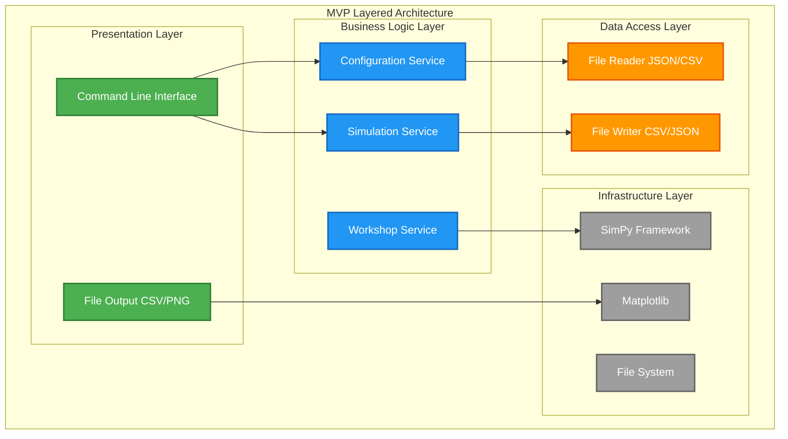
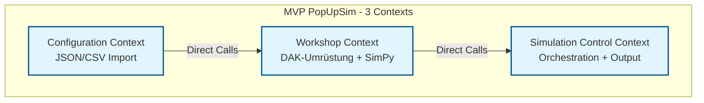
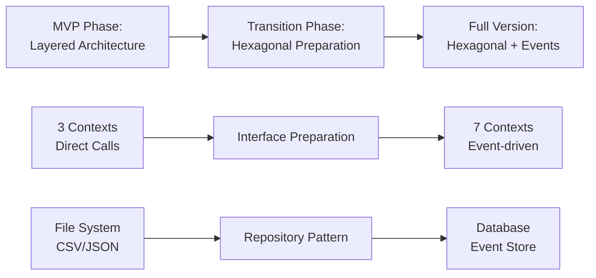

# 4. Lösungsstrategie (MVP)

## 4.1 MVP Architekturmuster

### Layered Architecture (MVP)

**Entscheidung:** Einfache Layered Architecture für schnelle MVP-Entwicklung

## 4.2 MVP Bounded Context Strategie

### 3 Vereinfachte Contexts (MVP)

## 4.3 Migration Path: MVP → Vollversion

---

**Navigation:** [← MVP Kontextabgrenzung](03-context.md) | [MVP Bausteinsicht →](05-building-blocks.md)
