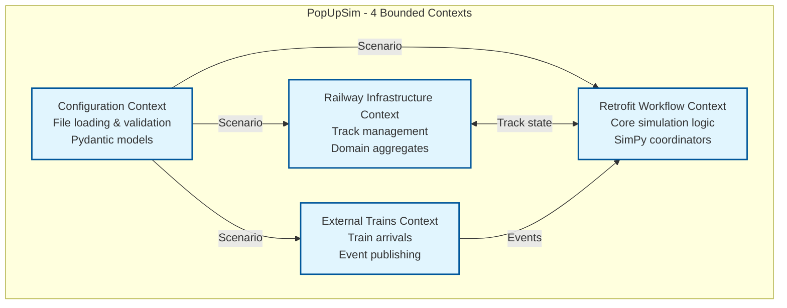
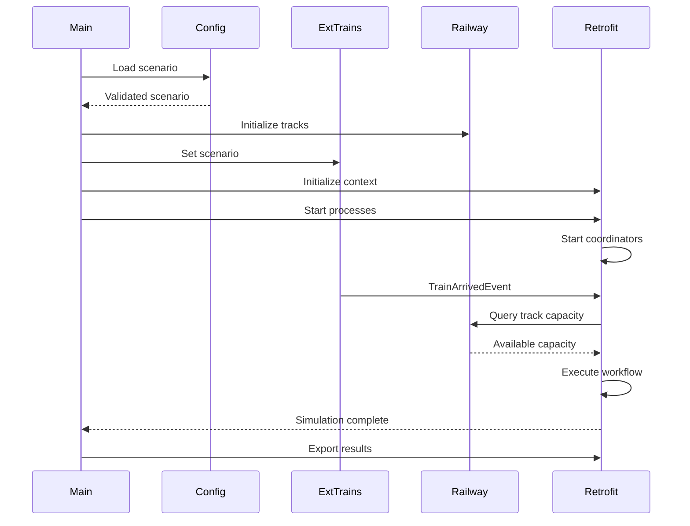

# 4. Solution Strategy

## 4.1 Top-Level Decomposition

**Primary Decomposition:** Domain-Driven Design with 4 bounded contexts.

**Rationale:** Separating concerns by domain responsibility enables:
- Clear ownership of functionality
- Independent development and testing
- Maintainable codebase with explicit boundaries
- Scalable architecture for future enhancements



### Context Responsibilities

| Context | Core Responsibility | Key Components |
|---------|-------------------|----------------|
| **Configuration** | Load and validate scenario files | FileLoader, ConfigurationBuilder, Pydantic models |
| **Retrofit Workflow** | Execute simulation, coordinate wagon flow | 4 coordinators, domain services, resource managers |
| **Railway Infrastructure** | Manage track capacity and occupancy | TrackGroup, Track, TrackOccupancy, TrackSelector |
| **External Trains** | Handle train arrivals, create wagons | TrainSchedule, ExternalTrain, Wagon entities |

## 4.2 Technology Decisions

| Technology | Purpose | Rationale |
|------------|---------|-----------|
| **SimPy** | Discrete event simulation | Deterministic, Python-native, proven in POC |
| **Pydantic 2.0** | Data validation | Type safety, excellent validation, performance |
| **Pandas** | CSV processing | Efficient data loading, train schedule parsing |
| **Matplotlib** | Visualization | Simple charts, no web server required |
| **Typer** | CLI interface | User-friendly command-line interface |
| **uv** | Package management | Fast, reliable dependency management |

## 4.3 Architectural Patterns

### 4.3.1 Bounded Contexts (DDD)

Each context has clear boundaries and responsibilities:
- **Configuration**: Input boundary - loads external data
- **Retrofit Workflow**: Core domain - simulation execution
- **Railway Infrastructure**: Supporting domain - track management
- **External Trains**: Supporting domain - wagon lifecycle

### 4.3.2 Layered Architecture

Within each context:

```
Application Layer    → Coordinators, services, orchestration
Domain Layer         → Entities, aggregates, domain services
Infrastructure Layer → SimPy adapters, resource managers
```

### 4.3.3 Coordinator Pattern

Retrofit Workflow uses 4 specialized coordinators:
1. **ArrivalCoordinator** - Process train arrivals
2. **CollectionCoordinator** - Move wagons to retrofit track
3. **WorkshopCoordinator** - Execute retrofit operations
4. **ParkingCoordinator** - Move completed wagons to parking

Each coordinator runs as independent SimPy process.

### 4.3.4 Domain Services (No SimPy Dependencies)

Business logic isolated from simulation framework:
- **BatchFormationService** - Create wagon batches
- **RakeFormationService** - Form/dissolve wagon rakes
- **TrainFormationService** - Assemble trains
- **WorkshopSchedulingService** - Schedule workshops
- **CouplingService** - Calculate coupling times

Benefits:
- Testable without SimPy
- Reusable across contexts
- Clear business logic

## 4.4 Integration Strategy

### 4.4.1 Event-Driven Communication

Contexts communicate via domain events:
- **TrainArrivedEvent** - External Trains → Retrofit Workflow
- **WagonMovedEvent** - Retrofit Workflow → Railway Infrastructure
- **SimulationLifecycleEvents** - Broadcast to all contexts

### 4.4.2 Direct Dependencies

Some contexts have direct dependencies:
- Retrofit Workflow queries Railway Infrastructure for track capacity
- All contexts receive Scenario from Configuration

### 4.4.3 Single Source of Truth

- **Wagons**: External Trains Context owns wagon entities
- **Tracks**: Railway Infrastructure Context owns track state
- **Simulation State**: Retrofit Workflow Context coordinates execution

## 4.5 Simulation Execution Flow



## 4.6 Key Design Decisions

### 4.6.1 Removed Legacy Code

Cleaned up unused infrastructure:
- Removed step-by-step configuration building (API-driven)
- Removed legacy workflow strategies
- Removed analytics context (metrics in Retrofit Workflow)
- Simplified ConfigurationBuilder to file loading only

### 4.6.2 Coordinator Configuration Pattern

Coordinators use configuration objects:
```python
@dataclass
class CollectionCoordinatorConfig:
    env: Environment
    collection_queue: Store
    retrofit_queue: Store
    batch_service: BatchFormationService
    track_selector: TrackSelectionService
    locomotive_manager: LocomotiveResourceManager
    # ... event publishers, etc.
```

Benefits:
- Clear dependencies
- Easy testing with mocks
- Reduced constructor complexity

### 4.6.3 Resource Management

Three resource managers handle capacity:
- **LocomotiveResourceManager** - SimPy Resource for locomotives
- **TrackCapacityManager** - Track capacity and wagon placement
- **WorkshopResourceManager** - SimPy Resource for workshop stations

### 4.6.4 Metrics Collection

Retrofit Workflow collects metrics during simulation:
- Real-time event collection
- Post-simulation aggregation
- CSV export with summary statistics

## 4.7 Quality Attributes

### 4.7.1 Maintainability
- Clear context boundaries
- Domain services without framework dependencies
- Comprehensive type hints (MyPy strict mode)
- Consistent code formatting (Ruff)

### 4.7.2 Testability
- Unit tests for domain services
- Integration tests for coordinators
- Validation tests for full scenarios
- Mock-friendly architecture

### 4.7.3 Performance
- Deterministic simulation (reproducible results)
- Efficient track capacity queries
- Batch processing for locomotive utilization
- Minimal memory footprint

### 4.7.4 Extensibility
- New coordinators can be added
- Track selection strategies pluggable
- Event-driven allows new subscribers
- Configuration supports new parameters

## 4.8 Technology Stack

```
Python 3.13+          → Latest stable Python
SimPy                 → Discrete event simulation
Pydantic 2.0+         → Data validation
Pandas                → CSV processing
Matplotlib            → Visualization
Typer                 → CLI interface
uv                    → Package management
pytest                → Testing framework
mypy                  → Static type checking
ruff                  → Linting and formatting
pylint                → Code quality analysis
```

## 4.9 Deployment Model

**Single Application Deployment:**
- Desktop application with CLI
- File-based input/output
- No web server required
- No database required
- Runs on Windows/Linux/macOS

**Execution:**
```bash
uv run python src/main.py --scenario path/to/scenario --output path/to/output
```

## 4.10 Future Enhancements

Potential extensions (not in current scope):
- Web interface for configuration and visualization
- Real-time simulation monitoring
- Database persistence for large scenarios
- Distributed simulation for massive scale
- API for integration with other systems
- Advanced optimization algorithms
