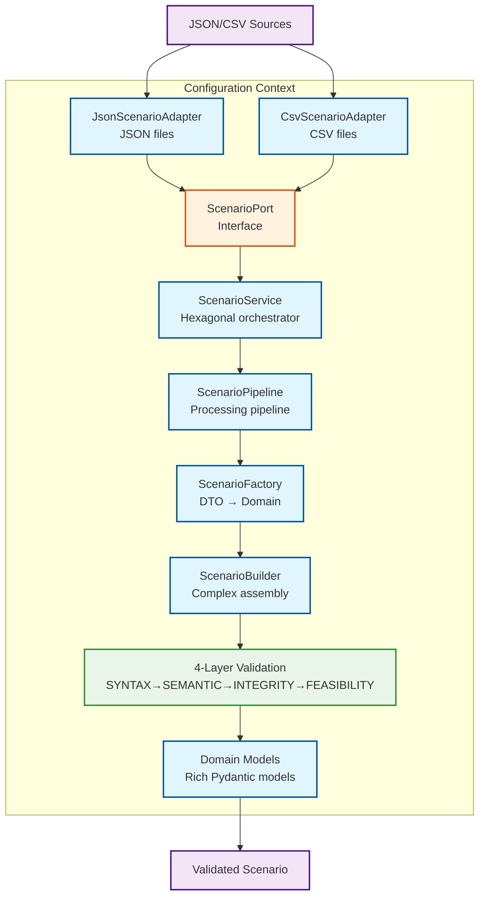
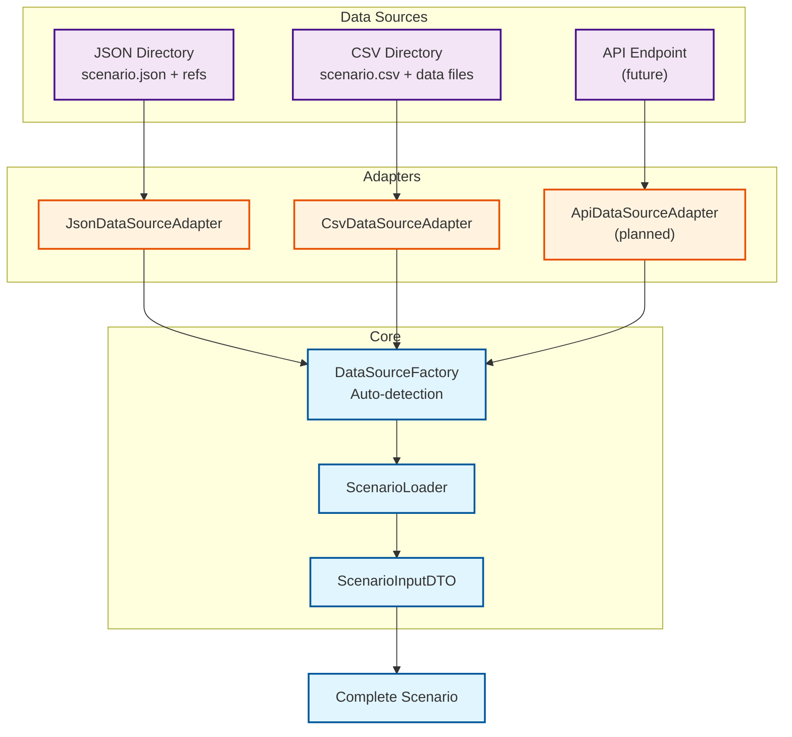
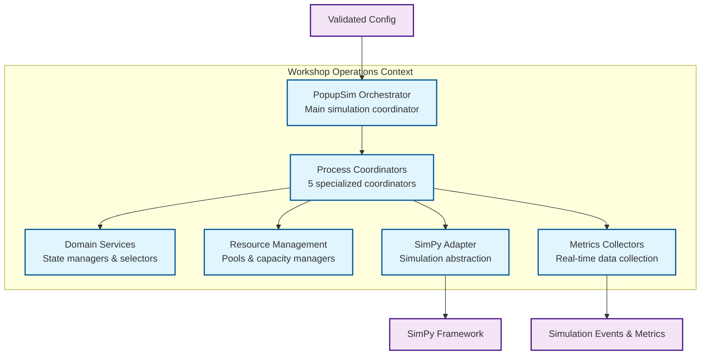
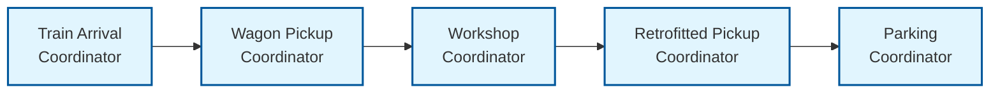
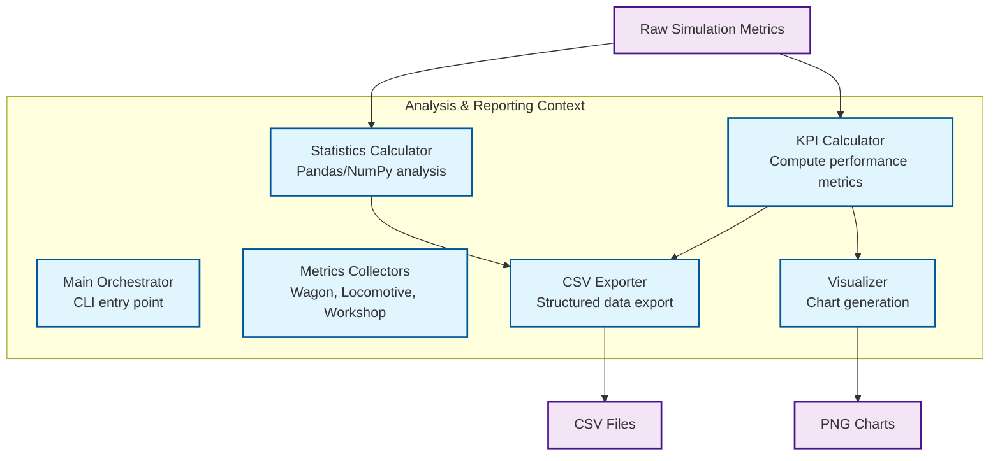
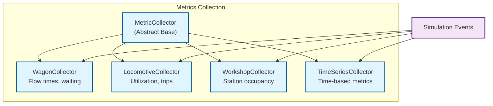

# 5. Building Block View (MVP)

**Note:** For complete Level 3 implementation details including all components, see [Section 5a: Level 3 Implementation Details](05a-level3-implementation.md).

## 5.1 Level 1: System Whitebox

**PopUpSim MVP** consists of 3 bounded contexts that work together to provide simulation capabilities.


### Contained Building Blocks

| Building Block | Responsibility | Reference |
|----------------|----------------|----------|
| **Configuration Context** | Parse and validate input files (JSON/CSV) | [Section 5.2](#52-level-2-configuration-context) |
| **Workshop Operations Context** | Execute discrete event simulation with SimPy and real-time analysis | [Section 5.3](#53-level-2-workshop-operations-context) |
| **Analysis & Reporting Context** | Orchestrate simulation execution and generate aggregated output | [Section 5.4](#54-level-2-analysis--reporting-context) |

### Important Interfaces

| Interface | Source | Target | Description |
|-----------|--------|--------|-------------|
| **Validated Configuration** | Configuration Context | Workshop Operations Context | Pydantic-validated domain objects (scenario, workshop, topology, routes, schedules) |
| **Simulation Results** | Workshop Operations Context | Analysis & Reporting Context | Simulation events and KPI data from analysis engine |
| **File I/O** | All Contexts | File System | JSON/CSV read/write operations |

---

## 5.2 Level 2: Configuration Context

### Whitebox: Configuration Context

**Responsibility:** Load, parse, validate, and build complete scenario configuration using hexagonal architecture with 4-layer validation pipeline.

**Architecture Note:** Implements hexagonal architecture with pluggable data source adapters and enterprise-grade 4-layer validation framework.



### Contained Building Blocks

| Component | Responsibility | Layer | Implementation |
|-----------|----------------|-------|----------------|
| **ScenarioService** | Hexagonal orchestrator with pipeline integration | Application | `application/scenario_service.py` |
| **ScenarioPipeline** | Multi-stage processing with late validation | Application | `application/pipeline/scenario_pipeline.py` |
| **ScenarioPort** | Interface for scenario adapters (hexagonal architecture) | Domain | `domain/ports/scenario_port.py` |
| **JsonScenarioAdapter** | Load scenario data from JSON files | Infrastructure | `infrastructure/adapters/json_scenario_adapter.py` |
| **CsvScenarioAdapter** | Load scenario data from CSV files | Infrastructure | `infrastructure/adapters/csv_scenario_adapter.py` |
| **ScenarioFactory** | Transform DTOs to rich domain models | Domain | `domain/factories/scenario_factory.py` |
| **ScenarioBuilder** | Complex scenario assembly with file references | Application | `application/scenario_builder.py` |
| **4-Layer Validation** | Enterprise validation pipeline with error stacking | Shared | `shared/validation/pipeline.py` |
| **Domain Models** | Rich Pydantic models with business validation | Domain | `domain/models/` |

### Level 3: 4-Layer Validation Pipeline

**Enterprise-grade validation with comprehensive error stacking:**



**CSV Directory Structure:**
```
csv_scenario/
├── scenario.csv      # Basic metadata (ID, dates, seed)
├── trains.csv        # Train schedule with arrival times
├── wagons.csv        # Wagon data linked to trains
├── workshops.csv     # Workshop configuration
├── tracks.csv        # Track definitions
├── routes.csv        # Route definitions
└── locomotives.csv   # Locomotive fleet data
```

### Code Example: Hexagonal Architecture ScenarioLoader

**File:** `popupsim/backend/src/configuration/application/scenario_loader.py`

```python
from pathlib import Path
from typing import Any

from configuration.application.dtos.scenario_input_dto import ScenarioInputDTO
from configuration.domain.exceptions import DataSourceError
from configuration.domain.ports.data_source_port import DataSourcePort
from configuration.infrastructure.adapters.data_source_factory import DataSourceFactory

class ScenarioLoader:
    """Hexagonal architecture scenario loader.
    
    Uses data source adapters to load scenario data from various sources
    while maintaining separation between domain logic and infrastructure.
    """

    def __init__(self, data_source_adapter: DataSourcePort | None = None) -> None:
        """Initialize scenario loader.
        
        Parameters
        ----------
        data_source_adapter : DataSourcePort | None
            Specific adapter to use, or None to auto-detect
        """
        self._adapter = data_source_adapter

    def load_scenario(self, source_identifier: str | Path) -> ScenarioInputDTO:
        """Load scenario data using appropriate adapter.
        
        Parameters
        ----------
        source_identifier : str | Path
            Source identifier (file path, directory, URL, etc.)
            
        Returns
        -------
        ScenarioInputDTO
            Complete scenario data ready for domain model creation
        """
        # Use provided adapter or auto-detect
        adapter = self._adapter or DataSourceFactory.create_adapter(source_identifier)
        
        # Validate source before loading
        if not adapter.validate_source(source_identifier):
            raise DataSourceError(f'Invalid or inaccessible data source: {source_identifier}')
        
        # Load scenario data
        return adapter.load_scenario(source_identifier)

    def get_source_info(self, source_identifier: str | Path) -> dict[str, Any]:
        """Get information about the data source."""
        try:
            adapter = self._adapter or DataSourceFactory.create_adapter(source_identifier)
            metadata = adapter.get_source_metadata(source_identifier)
            metadata['valid'] = adapter.validate_source(source_identifier)
            return metadata
        except DataSourceError as e:
            return {
                'valid': False,
                'error': str(e),
                'source_type': 'unknown',
            }
```

**File:** `popupsim/backend/src/configuration/infrastructure/adapters/csv_data_source_adapter.py`

```python
class CsvDataSourceAdapter(DataSourcePort):
    """CSV data source adapter for loading scenario data from CSV files."""

    def load_scenario(self, source_identifier: str | Path) -> ScenarioInputDTO:
        """Load scenario data from CSV files in a directory."""
        csv_dir = Path(source_identifier)
        if not csv_dir.is_dir():
            raise DataSourceError(f'CSV directory not found: {csv_dir}')

        # Load scenario metadata
        scenario_data = self._load_scenario_metadata(csv_dir)

        return ScenarioInputDTO(
            scenario_id=scenario_data['scenario_id'],
            start_date=scenario_data['start_date'],
            end_date=scenario_data['end_date'],
            random_seed=scenario_data.get('random_seed'),
            train_schedule_file='trains.csv',
            routes_file='routes.csv',
            workshop_tracks_file='workshops.csv',
        )

    def _load_scenario_metadata(self, csv_dir: Path) -> dict[str, Any]:
        """Load scenario metadata from scenario.csv."""
        scenario_file = csv_dir / 'scenario.csv'
        if not scenario_file.exists():
            raise DataSourceError(f'scenario.csv not found in {csv_dir}')

        try:
            import pandas as pd  # pylint: disable=import-outside-toplevel
        except ImportError as e:
            raise DataSourceError('pandas required for CSV processing') from e

        df = pd.read_csv(scenario_file)
        if df.empty:
            raise DataSourceError('scenario.csv is empty')

        row = df.iloc[0]
        return {
            'scenario_id': row['scenario_id'],
            'start_date': row['start_date'],
            'end_date': row['end_date'],
            'random_seed': row.get('random_seed'),
        }
```

### Code Example: Data Transfer Objects (DTOs)

**File:** `popupsim/backend/src/models/scenario.py`

```python
from datetime import datetime
from enum import Enum
from pydantic import BaseModel, Field

class TrackSelectionStrategy(str, Enum):
    """Strategy for selecting tracks."""
    ROUND_ROBIN = 'round_robin'
    LEAST_OCCUPIED = 'least_occupied'
    FIRST_AVAILABLE = 'first_available'
    RANDOM = 'random'

class LocoDeliveryStrategy(str, Enum):
    """Strategy for locomotive delivery."""
    RETURN_TO_PARKING = 'return_to_parking'
    STAY_AT_WORKSHOP = 'stay_at_workshop'

class Scenario(BaseModel):
    """Complete scenario configuration."""
    scenario_id: str
    start_date: datetime
    end_date: datetime
    
    # Optional components loaded from referenced files
    trains: list[Train] | None = None
    tracks: list[Track] | None = None
    workshops: list[Workshop] | None = None
    locomotives: list[Locomotive] | None = None
    routes: list[Route] | None = None
    topology: Topology | None = None
    process_times: ProcessTimes | None = None
    
    # Strategy configurations
    track_selection_strategy: TrackSelectionStrategy = TrackSelectionStrategy.LEAST_OCCUPIED
    retrofit_selection_strategy: TrackSelectionStrategy = TrackSelectionStrategy.LEAST_OCCUPIED
    loco_delivery_strategy: LocoDeliveryStrategy = LocoDeliveryStrategy.RETURN_TO_PARKING

    def validate_simulation_requirements(self) -> None:
        """Validate that all required components are loaded."""
        if not self.trains:
            raise ValueError('Scenario must have trains configured')
        if not self.workshops:
            raise ValueError('Scenario must have workshops configured')
        if not self.routes:
            raise ValueError('Scenario must have routes configured')
```

**File:** `popupsim/backend/src/models/workshop.py`

```python
from pydantic import BaseModel, Field

class Workshop(BaseModel):
    """Workshop configuration."""
    workshop_id: str
    track_id: str
    retrofit_stations: int = Field(gt=0, description="Number of parallel retrofit stations")
    
    # Optional fields
    name: str | None = None
    description: str | None = None
```

### Hexagonal Architecture Benefits

**Key aspects:**
- **Source Independence:** Same domain logic works with JSON, CSV, API, or database sources
- **Testability:** Easy to mock data sources for testing with fake adapters
- **Extensibility:** New data sources can be added without changing core logic
- **Maintainability:** Clear separation between data access and business logic
- **Auto-detection:** Factory pattern automatically selects appropriate adapter
- **Type Safety:** Pydantic DTOs ensure consistent data structure across adapters

**Usage Examples:**
```python
# Auto-detect source type
loader = ScenarioLoader()
scenario = loader.load_scenario('path/to/csv_directory')  # CSV
scenario = loader.load_scenario('path/to/scenario.json')  # JSON

# Use specific adapter
csv_adapter = CsvDataSourceAdapter()
scenario = csv_adapter.load_scenario('csv_directory')

# Get source information
info = loader.get_source_info('data_source')
print(f"Source type: {info['source_type']}")
print(f"Valid: {info['valid']}")
```

**Future API Integration:**
The architecture is designed for future API integration:
- **Pull APIs:** Adapter fetches data from REST endpoints
- **Push APIs:** Adapter receives data via webhooks/events
- **Streaming APIs:** Real-time data updates during simulation

---

## 5.3 Level 2: Workshop Operations Context

### Whitebox: Workshop Operations Context

**Responsibility:** Execute discrete event simulation with real-time metrics collection.

**Architecture Note:** Components follow layered architecture pattern (see [Section 8.1](08-concepts.md#81-layered-architecture)).



### Contained Building Blocks

| Component | Responsibility | Layer | Implementation |
|-----------|----------------|-------|----------------|
| **PopupSim Orchestrator** | Main simulation coordinator, spawns processes | Business Logic | `simulation/popupsim.py` |
| **Process Coordinators** | 5 specialized coordinators for wagon flow | Business Logic | `simulation/coordinators/` |
| **Domain Services** | State managers, selectors, distributors (no SimPy deps) | Domain | `domain/` |
| **Resource Management** | ResourcePool, TrackCapacityManager, WorkshopCapacityManager | Business Logic | `simulation/resource_pool.py`, `simulation/track_capacity.py`, `simulation/workshop_capacity.py` |
| **SimPy Adapter** | Abstraction layer for SimPy operations | Infrastructure | `simulation/sim_adapter.py` |
| **Metrics Collectors** | Real-time event collection during simulation | Business Logic | `analytics/collectors/` |
| **SimPy Framework** | Discrete event simulation engine | Infrastructure | SimPy library |

### Level 3: Process Coordinators

**5 specialized coordinators orchestrate wagon flow:**



| Coordinator | Process Function | Responsibility |
|-------------|------------------|----------------|
| **Train Arrival** | `process_train_arrivals()` | Process arriving trains, select wagons at hump, assign to collection tracks |
| **Wagon Pickup** | `pickup_wagons_to_retrofit()` | Allocate locomotive, pickup wagons from collection, deliver to retrofit tracks |
| **Workshop** | `move_wagons_to_stations()` | Move wagon batches to workshop, decouple sequentially, spawn retrofit processes |
| **Retrofitted Pickup** | `pickup_retrofitted_wagons()` | Pickup completed wagons in batches, move to retrofitted track |
| **Parking** | `move_to_parking()` | Move retrofitted wagons to parking tracks (sequential fill strategy) |

### Code Example: Actual PopupSim Orchestrator

**File:** `popupsim/backend/src/simulation/popupsim.py`

```python
class PopupSim:
    """High-level simulation orchestrator for PopUp-Sim."""

    def __init__(
        self, sim: SimulationAdapter, scenario: Scenario, 
        locomotive_service: LocomotiveService | None = None
    ) -> None:
        self.sim: SimulationAdapter = sim
        self.scenario: Scenario = scenario
        self.locomotive_service = locomotive_service or DefaultLocomotiveService()

        # Resource pools
        self.locomotives = ResourcePool(self.sim, self.locomotives_queue, 'Locomotives')
        
        # Capacity managers
        self.track_capacity = TrackCapacityManager(
            scenario.tracks or [],
            scenario.topology,
            collection_strategy=scenario.track_selection_strategy,
            retrofit_strategy=scenario.retrofit_selection_strategy,
        )
        self.workshop_capacity = WorkshopCapacityManager(sim, self.workshops_queue)

        # Domain services (no SimPy dependencies)
        self.wagon_selector = WagonSelector()
        self.wagon_state = WagonStateManager()
        self.loco_state = LocomotiveStateManager()
        self.workshop_distributor = WorkshopDistributor()

        # Metrics collection
        self.metrics = SimulationMetrics()
        self.metrics.register(WagonCollector())

    def run(self, until: float | None = None) -> None:
        """Run simulation by spawning 5 coordinator processes."""
        self.sim.run_process(process_train_arrivals, self)
        self.sim.run_process(pickup_wagons_to_retrofit, self)
        self.sim.run_process(move_wagons_to_stations, self)
        self.sim.run_process(pickup_retrofitted_wagons, self)
        self.sim.run_process(move_to_parking, self)
        self.sim.run(until)
```

### Code Example: Workshop Coordinator with Batch Processing

**File:** `popupsim/backend/src/simulation/popupsim.py`

```python
def move_wagons_to_stations(popupsim: PopupSim) -> Generator[Any]:
    """Move wagon batches from retrofit track to stations.
    
    Blocks until batch delivered, travels via route, decouples sequentially,
    then spawns independent process for each wagon.
    """
    for track_id in popupsim.wagons_ready_for_stations:
        popupsim.sim.run_process(_process_track_batches, popupsim, track_id)

def _process_track_batches(popupsim: PopupSim, workshop_track_id: str) -> Generator[Any]:
    """Process wagon batches for a single workshop track."""
    workshop = popupsim.workshop_capacity.workshops_by_track[workshop_track_id]
    batch_size = workshop.retrofit_stations

    while True:
        # Collect batch up to batch_size
        batch_wagons, retrofit_track_id = yield from _collect_wagon_batch(
            popupsim, workshop_track_id, batch_size
        )
        
        # Wait until workshop ready (track and stations empty)
        yield from _wait_for_workshop_ready(popupsim, workshop_track_id, workshop)
        
        # Allocate locomotive and deliver batch
        loco = yield from popupsim.locomotive_service.allocate(popupsim)
        yield from _deliver_batch_to_workshop(
            popupsim, loco, batch_wagons, retrofit_track_id, workshop.workshop_id
        )
        
        # Sequentially decouple and spawn processing for each wagon
        yield from _decouple_and_process_wagons(popupsim, batch_wagons, workshop_track_id)
        
        # Return locomotive to parking
        yield from _return_loco_to_parking(popupsim, loco)
        yield from popupsim.locomotive_service.release(popupsim, loco)

def process_single_wagon(popupsim: PopupSim, wagon: Wagon, track_id: str) -> Generator[Any]:
    """Process single wagon at workshop station using SimPy Resource."""
    workshop_resource = popupsim.workshop_capacity.get_resource(track_id)
    process_times = popupsim.scenario.process_times

    with workshop_resource.request() as station_req:
        yield station_req  # Block until station available
        
        # Station acquired - start retrofit
        wagon.status = WagonStatus.RETROFITTING
        wagon.retrofit_start_time = popupsim.sim.current_time()
        
        # Perform retrofit work
        yield popupsim.sim.delay(process_times.wagon_retrofit_time)
        
        # Retrofit complete
        wagon.status = WagonStatus.RETROFITTED
        wagon.coupler_type = CouplerType.DAC
        popupsim.metrics.record_event('wagon_retrofitted', {
            'wagon_id': wagon.wagon_id, 
            'time': popupsim.sim.current_time()
        })
        
        # Signal completion
        yield popupsim.wagons_completed[track_id].put(wagon)
```

**Key aspects:**
- 5 independent coordinator processes run concurrently
- Batch processing for efficient locomotive utilization
- Sequential coupling/decoupling with timing
- SimPy Resources for workshop station capacity
- Real-time metrics collection during simulation
- Domain services isolated from SimPy dependencies

---

## 5.4 Level 2: Analysis & Reporting Context

### Whitebox: Analysis & Reporting Context

**Responsibility:** Orchestrate simulation execution and generate comprehensive output.

**Architecture Note:** Components follow layered architecture pattern (see [Section 8.1](08-concepts.md#81-layered-architecture)).



### Contained Building Blocks

| Component | Responsibility | Layer | Implementation |
|-----------|----------------|-------|----------------|
| **Main Orchestrator** | CLI entry point, coordinates full pipeline | Presentation | `main.py` (Typer CLI) |
| **KPI Calculator** | Calculate throughput, utilization, bottlenecks | Business Logic | `analytics/kpi/calculator.py` |
| **Metrics Collectors** | Real-time event collection (wagon, locomotive, workshop) | Business Logic | `analytics/collectors/` |
| **Statistics Calculator** | Pandas/NumPy statistical analysis | Business Logic | `analytics/reporting/statistics.py` |
| **CSV Exporter** | Export KPIs and metrics to CSV | Presentation | `analytics/reporting/csv_exporter.py` |
| **Visualizer** | Generate Matplotlib charts | Presentation | `analytics/reporting/visualizer.py` |

### Level 3: Metrics Collection Architecture

**Real-time collectors observe simulation events:**



### Code Example: Actual Main Orchestrator

**File:** `popupsim/backend/src/main.py`

```python
from analytics.kpi import KPICalculator
from analytics.reporting import CSVExporter, Visualizer
from builders.scenario_builder import ScenarioBuilder
from simulation.popupsim import PopupSim
from simulation.sim_adapter import SimPyAdapter
import typer

app = typer.Typer(name='popupsim')

@app.command()
def main(
    scenario_path: Path | None = None,
    output_path: Path | None = None,
    verbose: bool = False,
    debug: str = 'INFO',
) -> None:
    """Main entry point for PopUpSim application."""
    # 1. Configuration Context - Load and validate
    scenario = ScenarioBuilder(scenario_path).build()
    typer.echo(f'Scenario loaded: {scenario.scenario_id}')
    
    # 2. Workshop Operations Context - Run simulation
    typer.echo('Starting simulation...')
    sim_adapter = SimPyAdapter.create_simpy_adapter()
    popup_sim = PopupSim(sim_adapter, scenario)
    popup_sim.run()
    
    # Get raw metrics from collectors
    metrics = popup_sim.get_metrics()
    
    # 3. Analysis & Reporting Context - Calculate KPIs
    typer.echo('Calculating KPIs...')
    kpi_calculator = KPICalculator()
    kpi_result = kpi_calculator.calculate_from_simulation(
        metrics,
        scenario,
        popup_sim.wagons_queue,
        popup_sim.rejected_wagons_queue,
        popup_sim.workshops_queue,
    )
    
    # Display KPIs to console
    typer.echo(f'Throughput: {kpi_result.throughput.wagons_per_hour:.2f} wagons/hour')
    
    # Export results to CSV
    csv_exporter = CSVExporter()
    csv_files = csv_exporter.export_all(kpi_result, output_path)
    typer.echo(f'CSV files saved: {len(csv_files)}')
    
    # Generate visualization charts
    visualizer = Visualizer()
    chart_paths = visualizer.generate_all_charts(kpi_result, output_path)
    typer.echo(f'Charts saved: {len(chart_paths)}')
```

### Code Example: KPI Calculator

**File:** `popupsim/backend/src/analytics/kpi/calculator.py`

```python
from analytics.models.kpi_result import KPIResult, ThroughputKPI, UtilizationKPI

class KPICalculator:
    """Calculate KPIs from simulation results."""

    def calculate_from_simulation(
        self,
        metrics: dict[str, list[dict[str, Any]]],
        scenario: Scenario,
        wagons: list[Wagon],
        rejected_wagons: list[Wagon],
        workshops: list[Workshop],
    ) -> KPIResult:
        """Calculate all KPIs from simulation results."""
        throughput = self._calculate_throughput(scenario, wagons, rejected_wagons)
        utilization = self._calculate_utilization(workshops, wagons)
        bottlenecks = self._identify_bottlenecks(throughput, utilization)
        avg_flow_time = self._calculate_avg_flow_time(metrics)
        avg_waiting_time = self._calculate_avg_waiting_time(wagons)

        return KPIResult(
            scenario_id=scenario.scenario_id,
            throughput=throughput,
            utilization=utilization,
            bottlenecks=bottlenecks,
            avg_flow_time_minutes=avg_flow_time,
            avg_waiting_time_minutes=avg_waiting_time,
        )

    def _calculate_throughput(
        self, scenario: Scenario, wagons: list[Wagon], rejected_wagons: list[Wagon]
    ) -> ThroughputKPI:
        """Calculate throughput metrics."""
        duration_hours = (scenario.end_date - scenario.start_date).total_seconds() / 3600.0
        retrofitted = sum(1 for w in wagons if w.status == WagonStatus.RETROFITTED)
        wagons_per_hour = retrofitted / duration_hours if duration_hours > 0 else 0.0

        return ThroughputKPI(
            total_wagons_processed=len(wagons),
            total_wagons_retrofitted=retrofitted,
            total_wagons_rejected=len(rejected_wagons),
            simulation_duration_hours=duration_hours,
            wagons_per_hour=round(wagons_per_hour, 2),
            wagons_per_day=round(wagons_per_hour * 24.0, 2),
        )
```

### Code Example: Metrics Collector Base Class

**File:** `popupsim/backend/src/analytics/collectors/base.py`

```python
from abc import ABC, abstractmethod
from dataclasses import dataclass

@dataclass
class MetricResult:
    """Single metric result."""
    name: str
    value: float | int | str
    unit: str
    category: str

class MetricCollector(ABC):
    """Base class for metric collectors."""

    @abstractmethod
    def record_event(self, event_type: str, data: dict[str, Any]) -> None:
        """Record an event for metric computation."""
        raise NotImplementedError

    @abstractmethod
    def get_results(self) -> list[MetricResult]:
        """Get computed metrics."""
        raise NotImplementedError

    @abstractmethod
    def reset(self) -> None:
        """Reset collector state."""
        raise NotImplementedError
```

**Key aspects:**
- Direct method calls between contexts (MVP simplification)
- Clear pipeline: Configuration → Simulation → KPI Calculation → Export
- Real-time metrics collection during simulation
- Post-simulation KPI aggregation and analysis
- Multiple output formats (console, CSV, PNG charts)
- Typer CLI for user-friendly command-line interface

---
