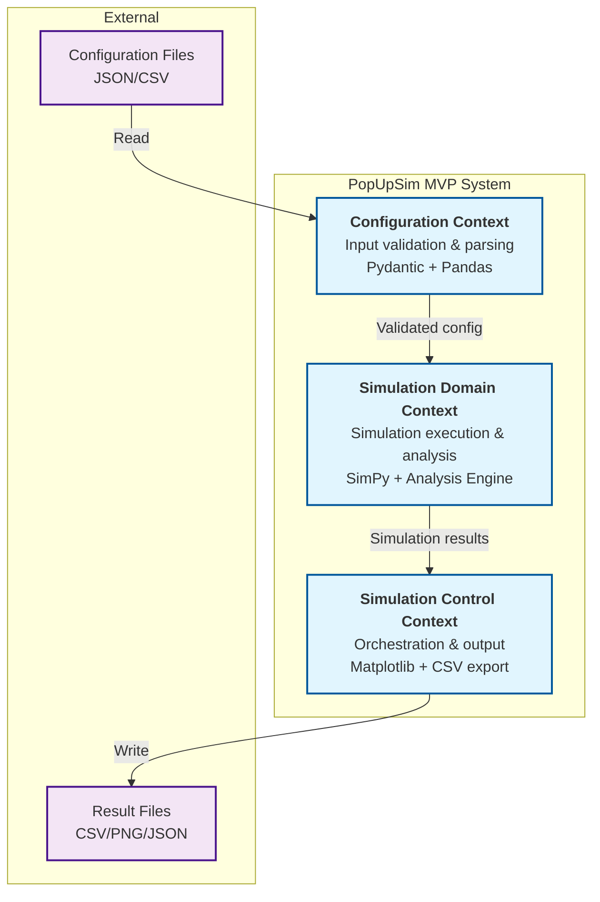
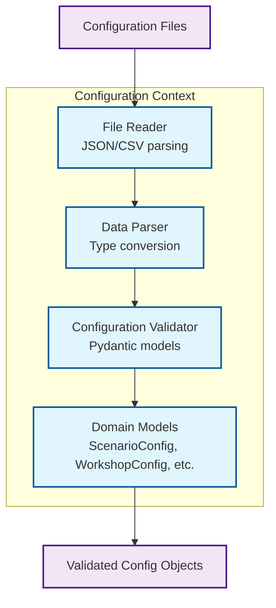
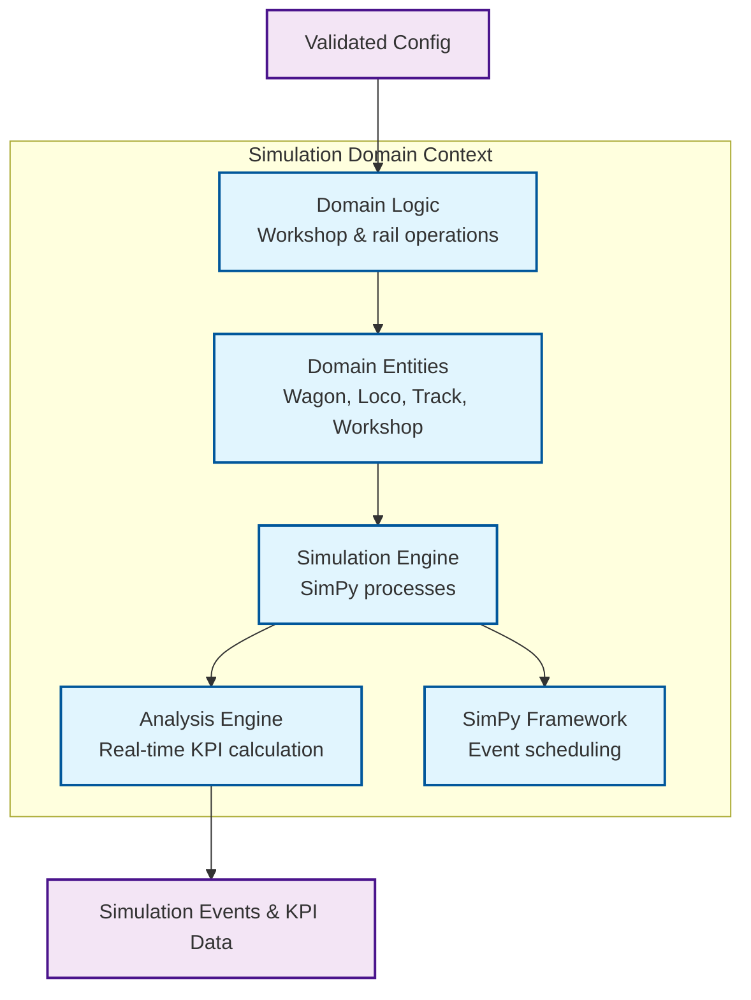
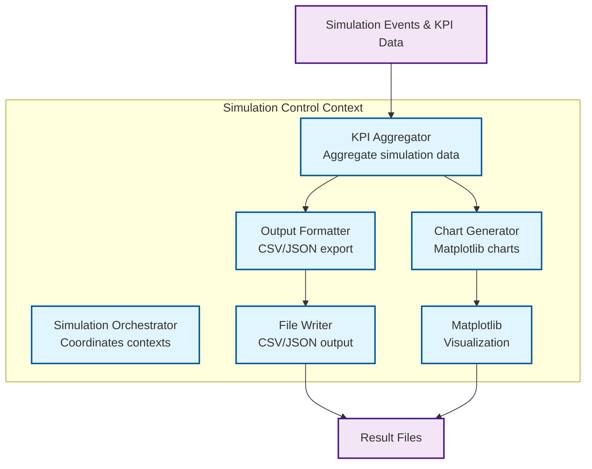

# 5. Building Block View (MVP)

## 5.1 Level 1: System Whitebox

**PopUpSim MVP** consists of 3 bounded contexts that work together to provide simulation capabilities.



### Contained Building Blocks

| Building Block | Responsibility | Reference |
|----------------|----------------|----------|
| **Configuration Context** | Parse and validate input files (JSON/CSV) | [Section 5.2](#52-level-2-configuration-context) |
| **Simulation Domain Context** | Execute discrete event simulation with SimPy and real-time analysis | [Section 5.3](#53-level-2-simulation-domain-context) |
| **Simulation Control Context** | Orchestrate simulation execution and generate aggregated output | [Section 5.4](#54-level-2-simulation-control-context) |

### Important Interfaces

| Interface | Source | Target | Description |
|-----------|--------|--------|-------------|
| **Validated Configuration** | Configuration Context | Simulation Domain Context | Pydantic-validated domain objects (scenario, workshop, topology, routes, schedules) |
| **Simulation Results** | Simulation Domain Context | Simulation Control Context | Simulation events and KPI data from analysis engine |
| **File I/O** | All Contexts | File System | JSON/CSV read/write operations |

---

## 5.2 Level 2: Configuration Context

### Whitebox: Configuration Context

**Responsibility:** Parse, validate, and transform input files into domain objects.

**Architecture Note:** Components follow layered architecture pattern (see [Section 8.1](08-concepts.md#81-layered-architecture)).



### Contained Building Blocks

| Component | Responsibility | Layer | Technology |
|-----------|----------------|-------|------------|
| **File Reader** | Read JSON/CSV files from file system | Presentation | Python pathlib, json, csv |
| **Data Parser** | Parse raw data into Python structures | Business Logic | Pandas for CSV, json for JSON |
| **Configuration Validator** | Validate data against schemas and business rules | Business Logic | Pydantic models |
| **Domain Models** | Type-safe configuration objects | Domain | Pydantic BaseModel classes |

### Code Example: Pydantic Validation

> **Note:** The following code snippet is for illustration only. It demonstrates the approach but is not production-ready code.

```python
from pydantic import BaseModel, Field, field_validator
from typing import List

class WorkshopConfig(BaseModel):
    """Configuration for workshop setup."""
    station_count: int = Field(gt=0, description="Number of retrofit stations")
    workers_per_station: int = Field(gt=0, le=10)
    retrofit_time_minutes: int = Field(gt=0)
    
    @field_validator('station_count')
    @classmethod
    def validate_station_count(cls, v: int) -> int:
        if v > 100:
            raise ValueError('Too many stations for MVP')
        return v
```

**Key aspects:**
- Pydantic enforces type safety and validation rules
- Field constraints prevent invalid configurations
- Custom validators add business logic validation

---

## 5.3 Level 2: Simulation Domain Context

### Whitebox: Simulation Domain Context

**Responsibility:** Execute discrete event simulation and perform real-time analysis.

**Architecture Note:** Components follow layered architecture pattern (see [Section 8.1](08-concepts.md#81-layered-architecture)).



### Contained Building Blocks

| Component | Responsibility | Layer | Technology |
|-----------|----------------|-------|------------|
| **Domain Logic** | Workshop and rail operation rules and business logic | Business Logic | Pure Python domain code |
| **Domain Entities** | Wagon, Locomotive, Track, Workshop, Route models | Domain | Python classes with type hints |
| **Simulation Engine** | Execute SimPy discrete event simulation | Business Logic | SimPy Environment, processes |
| **Analysis Engine** | Calculate KPIs during simulation execution | Business Logic | Python, NumPy |
| **SimPy Framework** | Event scheduling and discrete event simulation | Infrastructure | SimPy library |

### Code Example: SimPy Process

> **Note:** The following code snippet is for illustration only. It demonstrates the approach but is not production-ready code.

```python
import simpy
from typing import Iterator

class Workshop:
    """Workshop with retrofit stations."""
    def __init__(self, env: simpy.Environment, station_count: int) -> None:
        self.env = env
        self.stations = simpy.Resource(env, capacity=station_count)
    
    def retrofit_wagon(self, wagon_id: str, duration: int) -> Iterator[simpy.Event]:
        """SimPy process for wagon retrofit."""
        with self.stations.request() as req:
            yield req  # Wait for available station
            yield self.env.timeout(duration)  # Perform retrofit
```

**Key aspects:**
- SimPy Environment manages discrete event simulation
- Resources model limited capacity (stations)
- Generator functions with `yield` define processes

---

## 5.4 Level 2: Simulation Control Context

### Whitebox: Simulation Control Context

**Responsibility:** Orchestrate simulation execution and generate aggregated output.

**Architecture Note:** Components follow layered architecture pattern (see [Section 8.1](08-concepts.md#81-layered-architecture)).



### Contained Building Blocks

| Component | Responsibility | Layer | Technology |
|-----------|----------------|-------|------------|
| **Simulation Orchestrator** | Coordinate Configuration → Simulation Domain → Output flow | Business Logic | Pure Python |
| **KPI Aggregator** | Aggregate simulation events into summary KPIs | Business Logic | Python, Pandas |
| **Output Formatter** | Format data for CSV/JSON export | Presentation | Python, Pandas |
| **Chart Generator** | Generate visualization charts | Presentation | Matplotlib |
| **Matplotlib** | Visualization library | Infrastructure | Matplotlib library |
| **File Writer** | Write CSV/JSON files to disk | Infrastructure | Python pathlib, json, csv |

### Code Example: Orchestration

> **Note:** The following code snippet is for illustration only. It demonstrates the approach but is not production-ready code.

```python
from typing import Dict, Any

class SimulationOrchestrator:
    """Coordinates simulation execution across contexts."""
    def __init__(self, config_service: Any, domain_service: Any) -> None:
        self.config = config_service
        self.domain = domain_service
    
    def run_simulation(self) -> Dict[str, Any]:
        """Execute full simulation pipeline."""
        # 1. Load and validate configuration
        scenario = self.config.load_scenario()
        
        # 2. Setup simulation domain
        domain = self.domain.setup_domain(scenario)
        
        # 3. Run SimPy simulation
        results = domain.run()
        
        # 4. Return results for output generation
        return results
```

**Key aspects:**
- Direct method calls between contexts (MVP simplification)
- Clear pipeline: Configuration → Domain → Results
- Orchestrator coordinates but doesn't contain business logic

---


