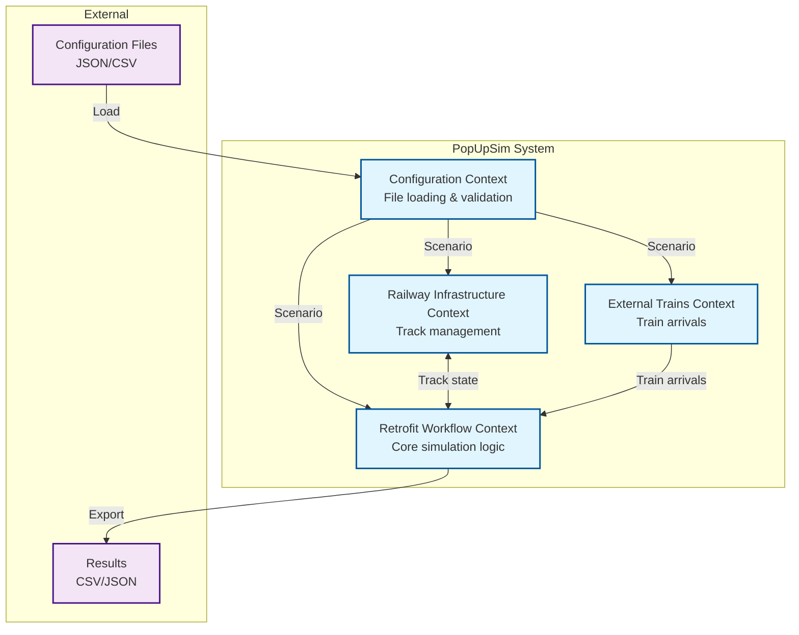
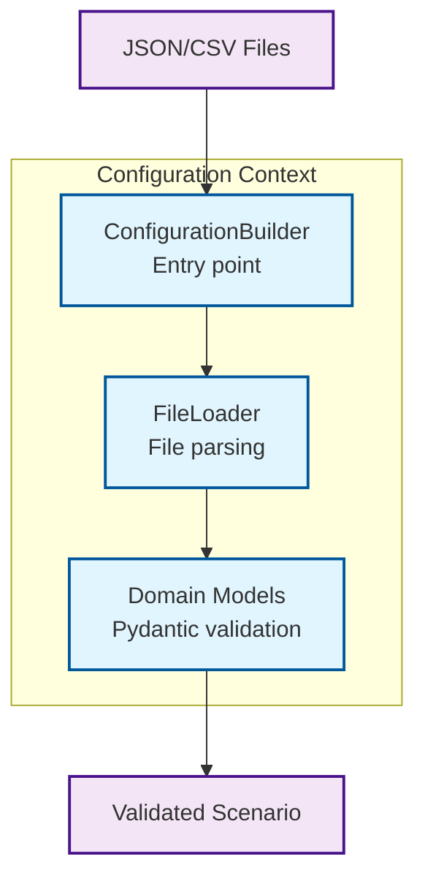
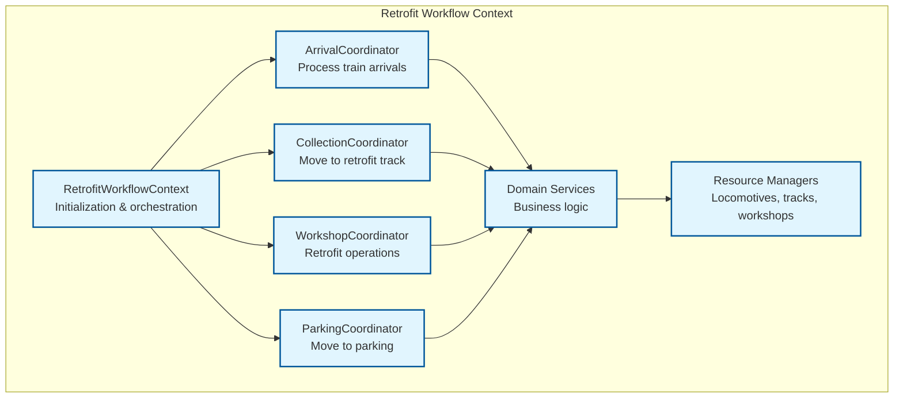
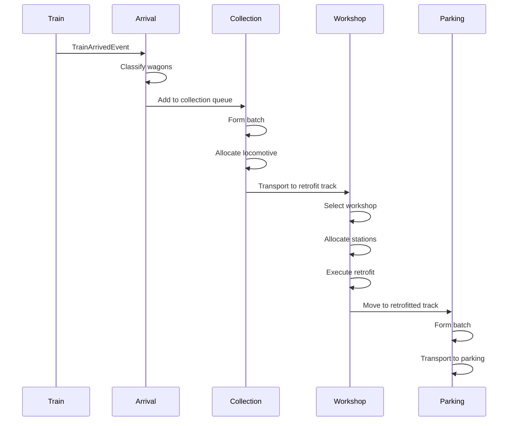
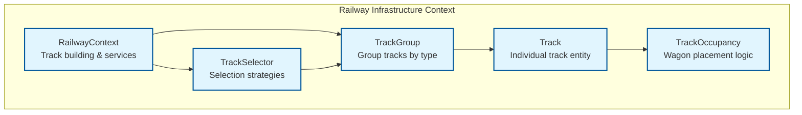
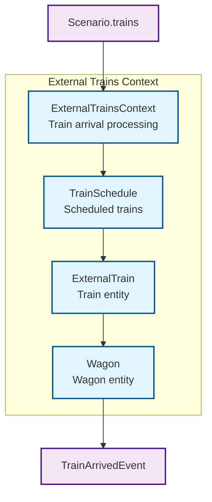

# 5. Building Block View

## 5.1 Level 1: System Context

PopUpSim consists of 4 bounded contexts following Domain-Driven Design principles.



### Contained Building Blocks

| Context | Responsibility | Technology |
|---------|----------------|------------|
| **Configuration** | Load and validate scenario files | Pydantic, Pandas |
| **Retrofit Workflow** | Execute simulation, coordinate wagon flow | SimPy, domain services |
| **Railway Infrastructure** | Manage track capacity and occupancy | Domain aggregates |
| **External Trains** | Handle train arrivals and wagon creation | Event publishing |

### Key Interfaces

| Interface | Source | Target | Description |
|-----------|--------|--------|-------------|
| **Scenario** | Configuration | All contexts | Validated configuration data |
| **Track Operations** | Railway Infrastructure | Retrofit Workflow | Track capacity queries and wagon placement |
| **Train Arrivals** | External Trains | Retrofit Workflow | TrainArrivedEvent with wagons |
| **Event Bus** | All contexts | All contexts | Domain event communication |

---

## 5.2 Level 2: Configuration Context

### Responsibility
Load scenario configuration from files and validate using Pydantic models.



### Components

| Component | Responsibility | Implementation |
|-----------|----------------|----------------|
| **ConfigurationBuilder** | Load scenario from file path | `configuration_builder.py` |
| **FileLoader** | Parse JSON/CSV files, handle references | `file_loader.py` |
| **Scenario** | Root configuration model with validation | `scenario.py` |
| **ProcessTimes** | Timing configuration for operations | `process_times.py` |
| **DTOs** | Input data transfer objects | `dtos/` |

### Code Example

```python
from pathlib import Path
from contexts.configuration.domain.configuration_builder import ConfigurationBuilder

# Load scenario
scenario = ConfigurationBuilder(Path("scenario_dir")).build()

# Access configuration
print(f"Scenario: {scenario.id}")
print(f"Workshops: {len(scenario.workshops)}")
print(f"Trains: {len(scenario.trains)}")
```

---

## 5.3 Level 2: Retrofit Workflow Context

### Responsibility
Execute discrete event simulation coordinating wagon flow through the retrofit process.



### Components

#### Coordinators (Application Layer)
| Coordinator | Responsibility | SimPy Process |
|-------------|----------------|---------------|
| **ArrivalCoordinator** | Receive trains, classify wagons, distribute to collection tracks | Yes |
| **CollectionCoordinator** | Form batches, allocate locomotive, transport to retrofit track | Yes |
| **WorkshopCoordinator** | Assign wagons to workshops, execute retrofit, return to retrofitted track | Yes |
| **ParkingCoordinator** | Transport completed wagons to parking tracks | Yes |

#### Domain Services (No SimPy Dependencies)
| Service | Responsibility |
|---------|----------------|
| **BatchFormationService** | Create wagon batches based on capacity constraints |
| **RakeFormationService** | Form and dissolve wagon rakes with coupling logic |
| **TrainFormationService** | Assemble trains (locomotive + rake) with preparation times |
| **WorkshopSchedulingService** | Schedule wagon batches to available workshops |
| **CouplingService** | Calculate coupling/decoupling times |
| **RouteService** | Provide route durations between tracks |

#### Resource Managers (Infrastructure Layer)
| Manager | Responsibility |
|---------|----------------|
| **LocomotiveResourceManager** | Allocate and release locomotives (SimPy Resource) |
| **TrackCapacityManager** | Manage track capacity and wagon placement |
| **WorkshopResourceManager** | Manage workshop station availability (SimPy Resource) |

### Workflow Sequence



### Code Example: Coordinator Structure

```python
class CollectionCoordinator:
    """Coordinates wagon movement from collection to retrofit track."""
    
    def __init__(self, config: CollectionCoordinatorConfig):
        self.config = config
        self.batch_counter = 0
    
    def start(self) -> None:
        """Start coordinator process."""
        self.config.env.process(self._collection_process())
    
    def _collection_process(self) -> Generator[Any, Any, None]:
        """Main collection process loop."""
        while True:
            # Wait for wagons
            wagon = yield self.config.collection_queue.get()
            
            # Collect batch
            wagons = yield from self._collect_batch(wagon)
            
            # Select retrofit track
            retrofit_track = self.config.track_selector.select_track_with_capacity('retrofit')
            
            # Transport batch
            yield from self._transport_batch(wagons, retrofit_track)
```

---

## 5.4 Level 2: Railway Infrastructure Context

### Responsibility
Manage track capacity, occupancy, and wagon placement using domain aggregates.



### Components

| Component | Responsibility | Pattern |
|-----------|----------------|---------|
| **RailwayContext** | Build tracks from scenario, provide services | Context |
| **TrackGroup** | Group tracks by type (collection, retrofit, parking, workshop) | Aggregate |
| **Track** | Individual track with capacity and fill factor | Entity |
| **TrackOccupancy** | Manage wagon placement and capacity | Aggregate |
| **TrackSelector** | Select tracks using strategies (round-robin, least-occupied, etc.) | Service |

### Track Selection Strategies

| Strategy | Behavior |
|----------|----------|
| **first_available** | Select first track with available capacity |
| **least_occupied** | Select track with lowest utilization |
| **round_robin** | Rotate through tracks sequentially |
| **best_fit** | Select track that best fits wagon length |

---

## 5.5 Level 2: External Trains Context

### Responsibility
Handle train arrivals and create wagon entities as single source of truth.



### Components

| Component | Responsibility |
|-----------|----------------|
| **ExternalTrainsContext** | Process train arrivals, create wagons, publish events |
| **TrainSchedule** | Manage scheduled train arrivals |
| **ExternalTrain** | Train entity with arrival time and wagons |
| **Wagon** | Wagon entity (single source of truth) |

### Code Example

```python
class ExternalTrainsContext:
    """External Trains Context managing train arrivals."""
    
    def __init__(self, event_bus: EventBus):
        self.event_bus = event_bus
        self.scenario: Scenario | None = None
        self._wagons: dict[str, Wagon] = {}  # Single source of truth
    
    def start_processes(self) -> None:
        """Start train arrival processes."""
        if self.infra and self.scenario:
            for train in self.scenario.trains:
                self.infra.engine.schedule_process(
                    self._process_single_train_arrival(train)
                )
    
    def _process_single_train_arrival(self, train: Any) -> Any:
        """Process a single train arrival."""
        # Wait for arrival time
        arrival_delay = datetime_to_ticks(train.arrival_time, self.scenario.start_date)
        yield from self.infra.engine.delay(arrival_delay)
        
        # Create wagons
        train_wagons = [Wagon(...) for wagon_dto in train.wagons]
        
        # Store as single source of truth
        for wagon in train_wagons:
            self._wagons[wagon.id] = wagon
        
        # Publish event
        event = TrainArrivedEvent(
            train_id=train.train_id,
            wagons=train_wagons,
            arrival_track='collection',
            event_timestamp=self.infra.engine.current_time()
        )
        self.event_bus.publish(event)
```

---

## 5.6 Cross-Cutting Concerns

### Event Bus
All contexts communicate via domain events published through the event bus.

**Key Events:**
- `TrainArrivedEvent` - Train arrives with wagons
- `WagonMovedEvent` - Wagon moves between tracks
- `WagonRetrofitCompletedEvent` - Wagon completes retrofit
- `SimulationStartedEvent` - Simulation begins
- `SimulationEndedEvent` - Simulation completes

### Metrics Collection
The Retrofit Workflow Context collects metrics during simulation:
- Wagon journey events (arrived, classified, retrofit started/completed, parked)
- Locomotive movements and allocations
- Batch formation and transport events
- Workshop utilization statistics

### Time Conversion
Shared utilities convert between datetime and SimPy simulation ticks:
- `datetime_to_ticks()` - Convert datetime to simulation time
- `timedelta_to_sim_ticks()` - Convert timedelta to simulation duration

---

## 5.7 Deployment Units

The system is deployed as a single Python application with CLI interface:

```
popupsim/
├── backend/
│   └── src/
│       ├── main.py                    # CLI entry point
│       ├── application/               # Application services
│       ├── contexts/                  # Bounded contexts
│       │   ├── configuration/
│       │   ├── retrofit_workflow/
│       │   ├── railway_infrastructure/
│       │   └── external_trains/
│       ├── shared/                    # Shared kernel
│       └── infrastructure/            # Technical infrastructure
```

**Execution:**
```bash
uv run python src/main.py --scenario path/to/scenario --output path/to/output
```
