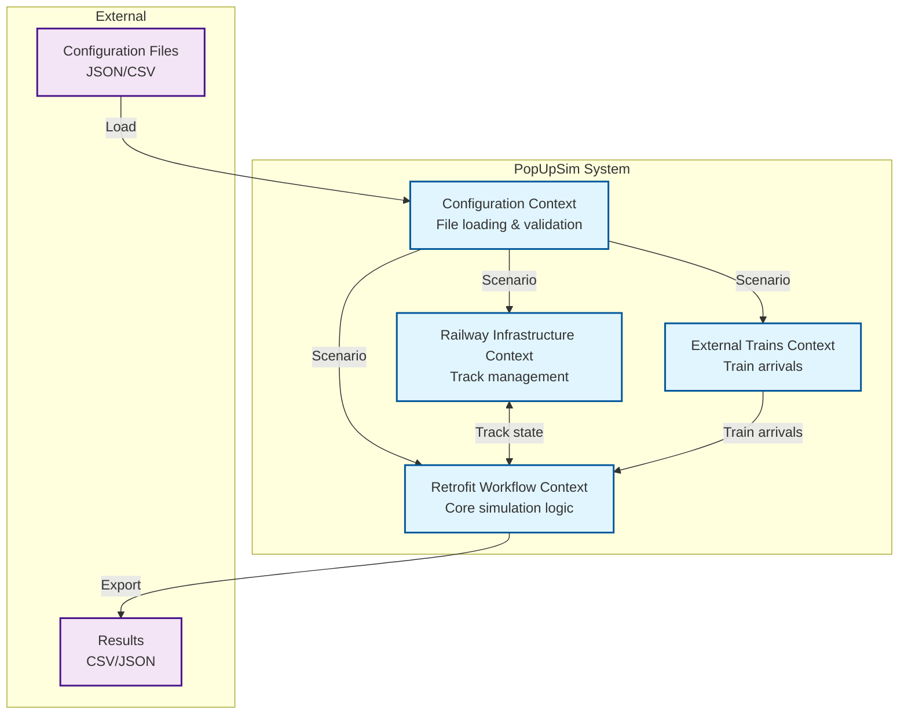
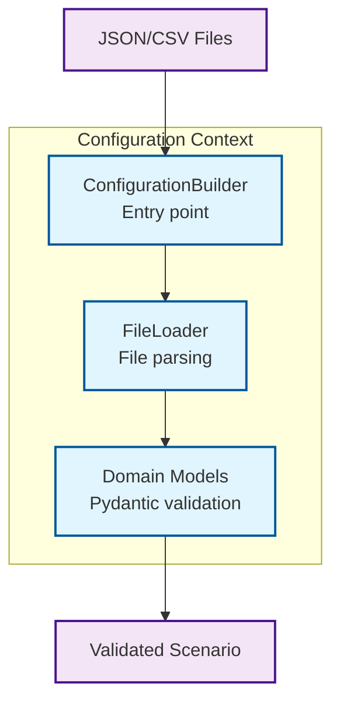
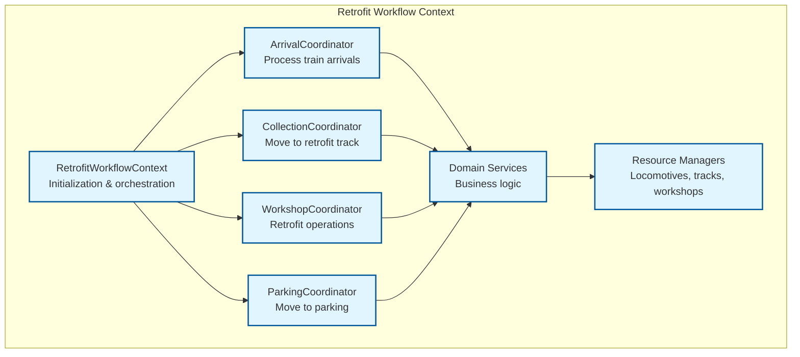
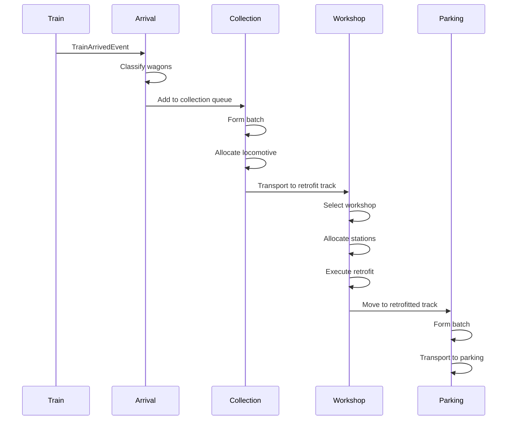
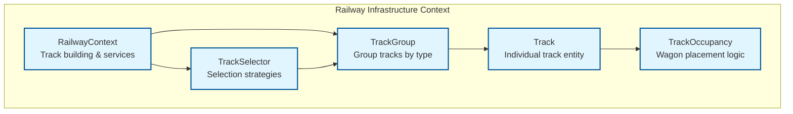
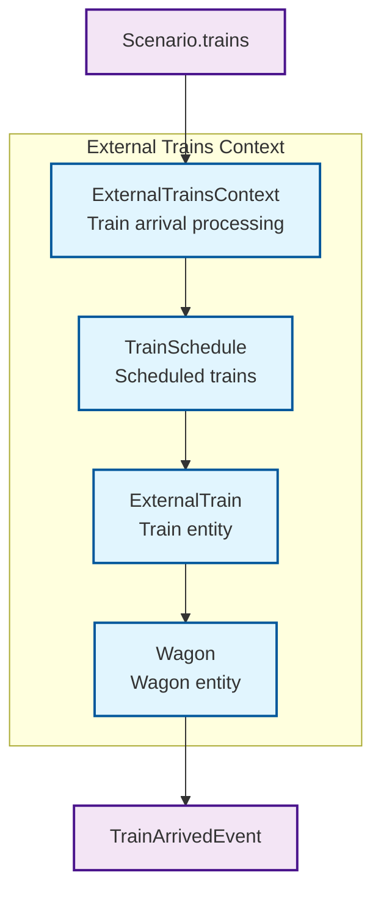

# 5. Building Block View

## 5.1 Level 1: System Context

PopUpSim consists of 4 bounded contexts following Domain-Driven Design principles.


```mermaid
graph TB
    subgraph "PopUpSim System"
        CFG["Configuration Context<br/>File loading & validation"]
        RWF["Retrofit Workflow Context<br/>Core simulation logic"]
        RLY["Railway Infrastructure Context<br/>Track management"]
        EXT["External Trains Context<br/>Train arrivals"]
    end
    
    subgraph "External"
        Files["Configuration Files<br/>JSON/CSV"]
        Output["Results<br/>CSV/JSON"]
    end
    
    Files -->|Load| CFG
    CFG -->|Scenario| RWF
    CFG -->|Scenario| RLY
    CFG -->|Scenario| EXT
    RLY <-->|Track state| RWF
    EXT -->|Train arrivals| RWF
    RWF -->|Export| Output
    
    classDef context fill:#e1f5fe,stroke:#01579b,stroke-width:2px
    classDef external fill:#f3e5f5,stroke:#4a148c,stroke-width:2px
    
    class CFG,RWF,RLY,EXT context
    class Files,Output external
```

### Contained Building Blocks

| Context | Responsibility | Technology |
|---------|----------------|------------|
| **Configuration** | Load and validate scenario files | Pydantic, Pandas |
| **Retrofit Workflow** | Execute simulation, coordinate wagon flow | SimPy, domain services |
| **Railway Infrastructure** | Manage track capacity and occupancy | Domain aggregates |
| **External Trains** | Handle train arrivals and wagon creation | Event publishing |

### Key Interfaces

| Interface | Source | Target | Description |
|-----------|--------|--------|-------------|
| **Scenario** | Configuration | All contexts | Validated configuration data |
| **Track Operations** | Railway Infrastructure | Retrofit Workflow | Track capacity queries and wagon placement |
| **Train Arrivals** | External Trains | Retrofit Workflow | TrainArrivedEvent with wagons |
| **Event Bus** | All contexts | All contexts | Domain event communication |

---

## 5.2 Level 2: Configuration Context

### Responsibility
Load scenario configuration from files and validate using Pydantic models.


```mermaid
graph TB
    subgraph "Configuration Context"
        Builder["ConfigurationBuilder<br/>Entry point"]
        Loader["FileLoader<br/>File parsing"]
        Models["Domain Models<br/>Pydantic validation"]
    end
    
    Files["JSON/CSV Files"] --> Builder
    Builder --> Loader
    Loader --> Models
    Models --> Scenario["Validated Scenario"]
    
    classDef component fill:#e1f5fe,stroke:#01579b,stroke-width:2px
    classDef external fill:#f3e5f5,stroke:#4a148c,stroke-width:2px
    
    class Builder,Loader,Models component
    class Files,Scenario external
```

### Components

| Component | Responsibility | Implementation |
|-----------|----------------|----------------|
| **ConfigurationBuilder** | Load scenario from file path | `configuration_builder.py` |
| **FileLoader** | Parse JSON/CSV files, handle references | `file_loader.py` |
| **Scenario** | Root configuration model with validation | `scenario.py` |
| **ProcessTimes** | Timing configuration for operations | `process_times.py` |
| **DTOs** | Input data transfer objects | `dtos/` |

### Code Example

```python
from pathlib import Path
from contexts.configuration.domain.configuration_builder import ConfigurationBuilder

# Load scenario
scenario = ConfigurationBuilder(Path("scenario_dir")).build()

# Access configuration
print(f"Scenario: {scenario.id}")
print(f"Workshops: {len(scenario.workshops)}")
print(f"Trains: {len(scenario.trains)}")
```

---

## 5.3 Level 2: Retrofit Workflow Context

### Responsibility
Execute discrete event simulation coordinating wagon flow through the retrofit process.


```mermaid
graph TB
    subgraph "Retrofit Workflow Context"
        Context["RetrofitWorkflowContext<br/>Initialization & orchestration"]
        Arrival["ArrivalCoordinator<br/>Process train arrivals"]
        Collection["CollectionCoordinator<br/>Move to retrofit track"]
        Workshop["WorkshopCoordinator<br/>Retrofit operations"]
        Parking["ParkingCoordinator<br/>Move to parking"]
        Services["Domain Services<br/>Business logic"]
        Resources["Resource Managers<br/>Locomotives, tracks, workshops"]
    end
    
    Context --> Arrival
    Context --> Collection
    Context --> Workshop
    Context --> Parking
    Arrival --> Services
    Collection --> Services
    Workshop --> Services
    Parking --> Services
    Services --> Resources
    
    classDef component fill:#e1f5fe,stroke:#01579b,stroke-width:2px
    
    class Context,Arrival,Collection,Workshop,Parking,Services,Resources component
```

### Components

#### Coordinators (Application Layer)
| Coordinator | Responsibility | SimPy Process |
|-------------|----------------|---------------|
| **ArrivalCoordinator** | Receive trains, classify wagons, distribute to collection tracks | Yes |
| **CollectionCoordinator** | Form batches, allocate locomotive, transport to retrofit track | Yes |
| **WorkshopCoordinator** | Assign wagons to workshops, execute retrofit, return to retrofitted track | Yes |
| **ParkingCoordinator** | Transport completed wagons to parking tracks | Yes |

#### Domain Services (No SimPy Dependencies)

**Core Formation Services:**
| Service | Responsibility |
|---------|----------------|
| **BatchFormationService** | Create wagon batches based on capacity constraints |
| **RakeFormationService** | Form and dissolve wagon rakes with coupling logic |
| **TrainFormationService** | Assemble trains (locomotive + rake) with preparation times |

**Scheduling & Assignment:**
| Service | Responsibility |
|---------|----------------|
| **WorkshopSchedulingService** | Schedule wagon batches to available workshops |
| **WorkshopAssignmentService** | Assign wagons to workshop bays |
| **WorkshopAssignmentStrategies** | Workshop assignment strategy implementations |

**Transport & Routing:**
| Service | Responsibility |
|---------|----------------|
| **TransportPlanningService** | Plan transport operations between tracks |
| **RouteService** | Provide route durations between tracks |

**Selection Services:**
| Service | Responsibility |
|---------|----------------|
| **ResourceSelectionService** | Select resources using strategies (first_available, least_occupied, round_robin) |
| **TrackSelectionService** | Select tracks with capacity constraints |
| **ParkingTrackSelectionService** | Select parking tracks for completed wagons |

**Coupling & Assembly:**
| Service | Responsibility |
|---------|----------------|
| **CouplingService** | Calculate coupling/decoupling times based on coupler types |
| **CouplingValidationService** | Validate coupling compatibility between wagons |
| **TrainAssemblyService** | Assemble locomotives to wagon rakes |

**Lifecycle Management:**
| Service | Responsibility |
|---------|----------------|
| **RakeLifecycleManager** | Manage complete rake lifecycle (form, transport, dissolve) |
| **WagonFactoryService** | Create wagon entities from configuration |
| **WagonEligibilityService** | Check wagon eligibility for operations |
| **WagonAccumulationService** | Accumulate wagons for batch formation |

**Event Generation:**
| Service | Responsibility |
|---------|----------------|
| **RejectionEventFactory** | Create rejection events for wagons that cannot be processed |

**Key Principle:** All domain services are pure business logic with no SimPy dependencies.

#### Application Services (Orchestration Layer)

**Operation Services:**
| Service | Responsibility |
|---------|----------------|
| **RakeOperationsService** | Orchestrate rake formation, transport, and dissolution operations |
| **WorkshopOperationsService** | Orchestrate workshop assignment and processing operations |
| **ParkingTransportService** | Orchestrate transport to parking tracks |
| **RailwayOperationsService** | Orchestrate railway infrastructure operations |

**Coordination Services:**
| Service | Responsibility |
|---------|----------------|
| **CoordinationService** | Coordinate between multiple coordinators |
| **LocomotiveCoordinationService** | Coordinate locomotive allocation across operations |

**Metrics & Collection:**
| Service | Responsibility |
|---------|----------------|
| **MetricsAggregator** | Aggregate simulation metrics from all coordinators |
| **EventCollectionService** | Collect and export simulation events |
| **DualStreamCollector** | Collect dual-stream events (state + location) |
| **DualStreamAdapter** | Adapt events to dual-stream format |

#### Resource Managers (Infrastructure Layer)
| Manager | Responsibility |
|---------|----------------|
| **LocomotiveResourceManager** | Allocate and release locomotives using SimPy Resource |
| **TrackCapacityManager** | Manage track capacity and wagon placement using SimPy Container |
| **WorkshopResourceManager** | Manage workshop bay availability using SimPy Resource |

### Workflow Sequence


```mermaid
sequenceDiagram
    participant Train
    participant Arrival
    participant Collection
    participant Workshop
    participant Parking
    
    Train->>Arrival: TrainArrivedEvent
    Arrival->>Arrival: Classify wagons
    Arrival->>Collection: Add to collection queue
    Collection->>Collection: Form batch
    Collection->>Collection: Allocate locomotive
    Collection->>Workshop: Transport to retrofit track
    Workshop->>Workshop: Select workshop
    Workshop->>Workshop: Allocate stations
    Workshop->>Workshop: Execute retrofit
    Workshop->>Parking: Move to retrofitted track
    Parking->>Parking: Form batch
    Parking->>Parking: Transport to parking
```

### Coordinator Configuration Pattern

Each coordinator receives a configuration dataclass with all dependencies:

```python
@dataclass
class CollectionCoordinatorConfig:
    """Configuration for CollectionCoordinator."""
    env: Any
    collection_queue: Any
    retrofit_queue: Any
    track_capacity_manager: TrackCapacityManager
    locomotive_manager: LocomotiveResourceManager
    batch_formation_service: BatchFormationService
    rake_formation_service: RakeFormationService
    train_formation_service: TrainFormationService
    route_service: RouteService
    wagon_event_publisher: Callable[[WagonLifecycleEvent], None]
    locomotive_event_publisher: Callable[[LocomotiveEvent], None]
    resource_event_publisher: Callable[[ResourceEvent], None]
    scenario: Scenario
```

**Benefits:**
- Explicit dependencies
- Easy testing (inject mocks)
- Type-safe configuration
- Clear coordinator requirements

### Code Example: Coordinator Structure

```python
class CollectionCoordinator:
    """Coordinates wagon movement from collection to retrofit track."""
    
    def __init__(self, config: CollectionCoordinatorConfig):
        self.config = config
        self.batch_counter = 0
    
    def start(self) -> None:
        """Start coordinator process."""
        self.config.env.process(self._collection_process())
    
    def _collection_process(self) -> Generator[Any, Any, None]:
        """Main collection process loop."""
        while True:
            # Wait for wagons
            wagon = yield self.config.collection_queue.get()
            
            # Collect batch using domain service
            wagons = yield from self._collect_batch(wagon)
            
            # Select retrofit track using domain service
            retrofit_track = self.config.track_capacity_manager.select_track('retrofit')
            
            # Transport batch
            yield from self._transport_batch(wagons, retrofit_track)
            
            # Publish event
            self.config.wagon_event_publisher(
                WagonLifecycleEvent(
                    wagon_id=wagon.id,
                    event_type="batch_transported",
                    sim_time=self.config.env.now
                )
            )
```

---

## 5.4 Level 2: Railway Infrastructure Context

### Responsibility
Manage track capacity, occupancy, and wagon placement using domain aggregates.


```mermaid
graph TB
    subgraph "Railway Infrastructure Context"
        Context["RailwayContext<br/>Track building & services"]
        TrackGroup["TrackGroup<br/>Group tracks by type"]
        Track["Track<br/>Individual track entity"]
        Occupancy["TrackOccupancy<br/>Wagon placement logic"]
        Selector["TrackSelector<br/>Selection strategies"]
    end
    
    Context --> TrackGroup
    TrackGroup --> Track
    Track --> Occupancy
    Context --> Selector
    Selector --> TrackGroup
    
    classDef component fill:#e1f5fe,stroke:#01579b,stroke-width:2px
    
    class Context,TrackGroup,Track,Occupancy,Selector component
```

### Components

| Component | Responsibility | Pattern |
|-----------|----------------|---------|
| **RailwayContext** | Build tracks from scenario, provide services | Context |
| **TrackGroup** | Group tracks by type (collection, retrofit, parking, workshop) | Aggregate |
| **Track** | Individual track with capacity and fill factor | Entity |
| **TrackOccupancy** | Manage wagon placement and capacity | Aggregate |
| **TrackSelector** | Select tracks using strategies (round-robin, least-occupied, etc.) | Service |

### Track Selection Strategies

| Strategy | Behavior |
|----------|----------|
| **first_available** | Select first track with available capacity |
| **least_occupied** | Select track with lowest utilization |
| **round_robin** | Rotate through tracks sequentially |
| **best_fit** | Select track that best fits wagon length |

---

## 5.5 Level 2: External Trains Context

### Responsibility
Handle train arrivals and create wagon entities as single source of truth.


```mermaid
graph TB
    subgraph "External Trains Context"
        Context["ExternalTrainsContext<br/>Train arrival processing"]
        Schedule["TrainSchedule<br/>Scheduled trains"]
        Train["ExternalTrain<br/>Train entity"]
        Wagon["Wagon<br/>Wagon entity"]
    end
    
    Scenario["Scenario.trains"] --> Context
    Context --> Schedule
    Schedule --> Train
    Train --> Wagon
    Wagon --> Event["TrainArrivedEvent"]
    
    classDef component fill:#e1f5fe,stroke:#01579b,stroke-width:2px
    classDef external fill:#f3e5f5,stroke:#4a148c,stroke-width:2px
    
    class Context,Schedule,Train,Wagon component
    class Scenario,Event external
```

### Components

| Component | Responsibility |
|-----------|----------------|
| **ExternalTrainsContext** | Process train arrivals, create wagons, publish events |
| **TrainSchedule** | Manage scheduled train arrivals |
| **ExternalTrain** | Train entity with arrival time and wagons |
| **Wagon** | Wagon entity (single source of truth) |

### Code Example

```python
class ExternalTrainsContext:
    """External Trains Context managing train arrivals."""
    
    def __init__(self, event_bus: EventBus):
        self.event_bus = event_bus
        self.scenario: Scenario | None = None
        self._wagons: dict[str, Wagon] = {}  # Single source of truth
    
    def start_processes(self) -> None:
        """Start train arrival processes."""
        if self.infra and self.scenario:
            for train in self.scenario.trains:
                self.infra.engine.schedule_process(
                    self._process_single_train_arrival(train)
                )
    
    def _process_single_train_arrival(self, train: Any) -> Any:
        """Process a single train arrival."""
        # Wait for arrival time
        arrival_delay = datetime_to_ticks(train.arrival_time, self.scenario.start_date)
        yield from self.infra.engine.delay(arrival_delay)
        
        # Create wagons
        train_wagons = [Wagon(...) for wagon_dto in train.wagons]
        
        # Store as single source of truth
        for wagon in train_wagons:
            self._wagons[wagon.id] = wagon
        
        # Publish event
        event = TrainArrivedEvent(
            train_id=train.train_id,
            wagons=train_wagons,
            arrival_track='collection',
            event_timestamp=self.infra.engine.current_time()
        )
        self.event_bus.publish(event)
```

---

## 5.6 Cross-Cutting Concerns

### Event Collection System

The system uses an **EventCollector** for centralized event management and metrics collection.

**Implementation:** `contexts/retrofit_workflow/application/event_collector.py`

```python
class EventCollector:
    """Centralized event collection for simulation metrics."""
    
    def __init__(self, start_datetime: datetime | None = None):
        self._wagon_events: list[WagonLifecycleEvent] = []
        self._locomotive_events: list[LocomotiveEvent] = []
        self._resource_events: list[ResourceEvent] = []
        self._batch_events: list[BatchEvent] = []
    
    def add_wagon_event(self, event: WagonLifecycleEvent) -> None:
        """Add wagon lifecycle event."""
        self._wagon_events.append(event)
    
    def export_wagon_journey(self, output_path: Path) -> None:
        """Export wagon events to CSV."""
        # CSV export implementation
```

**Dual-Stream Events:**
- **State Events**: Lifecycle state changes (arrived, classified, retrofit_started, completed, parked)
- **Location Events**: Physical movement between tracks

**Event Publisher Pattern:**
Coordinators receive event publisher functions via configuration:

```python
self.config.wagon_event_publisher(
    WagonLifecycleEvent(
        wagon_id=wagon.id,
        event_type="batch_formed",
        sim_time=self.config.env.now
    )
)
```

**Key Events:**
- `WagonLifecycleEvent` - Wagon state changes (arrived, classified, retrofit_started, completed, parked)
- `LocomotiveEvent` - Locomotive allocation and release
- `ResourceEvent` - Resource utilization events
- `BatchEvent` - Batch formation and transport events

### Metrics Collection

The EventCollector aggregates metrics during simulation:
- **Wagon Journey**: Complete lifecycle from arrival to parking
- **Locomotive Operations**: Allocation, release, utilization
- **Batch Operations**: Formation, transport, dissolution
- **Workshop Utilization**: Bay occupancy, processing times
- **Track Occupancy**: Capacity usage over time

**Export Formats:**
- `wagon_journey.csv` - Complete wagon lifecycle events
- `locomotive_movements.csv` - Locomotive allocation history
- `rejected_wagons.csv` - Wagons that could not be processed
- `summary_metrics.json` - Aggregated KPIs

### Time Conversion
Shared utilities convert between datetime and SimPy simulation ticks:
- `datetime_to_ticks()` - Convert datetime to simulation time
- `timedelta_to_sim_ticks()` - Convert timedelta to simulation duration

---

## 5.7 Deployment Units

The system is deployed as a single Python application with CLI interface:

```
popupsim/
├── backend/
│   └── src/
│       ├── main.py                    # CLI entry point
│       ├── application/               # Application services
│       ├── contexts/                  # Bounded contexts
│       │   ├── configuration/
│       │   ├── retrofit_workflow/
│       │   ├── railway_infrastructure/
│       │   └── external_trains/
│       ├── shared/                    # Shared kernel
│       └── infrastructure/            # Technical infrastructure
```

**Execution:**
```bash
uv run python src/main.py --scenario path/to/scenario --output path/to/output
```
