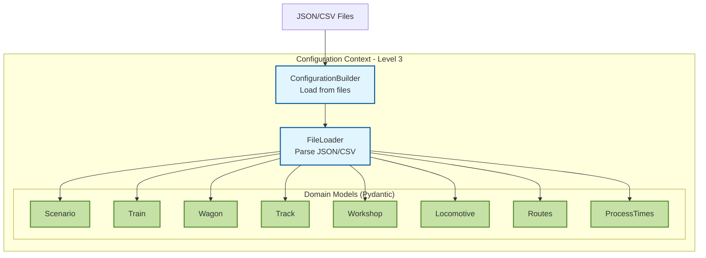
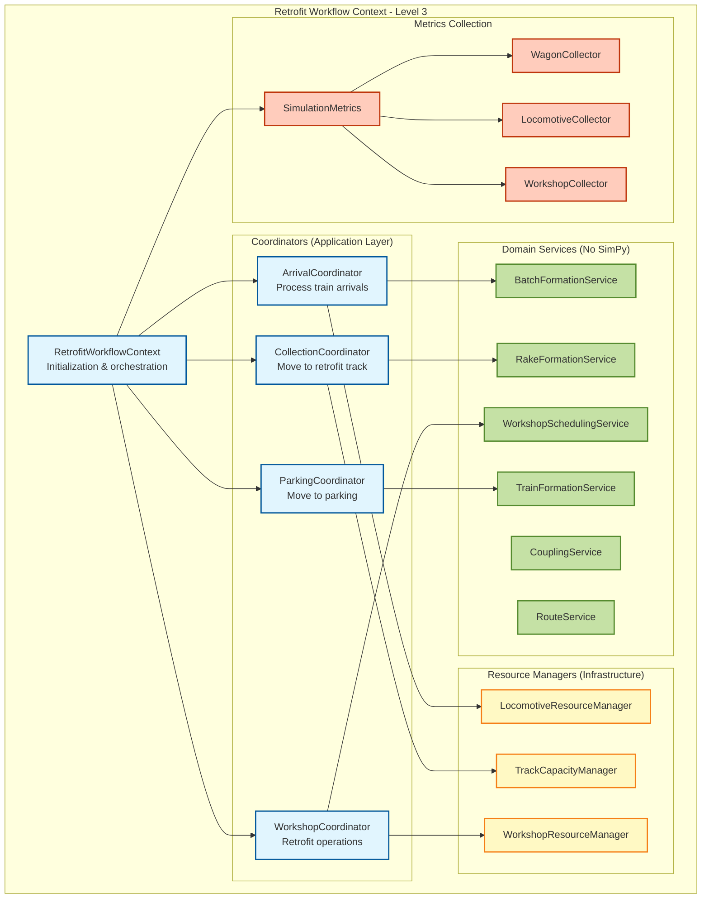
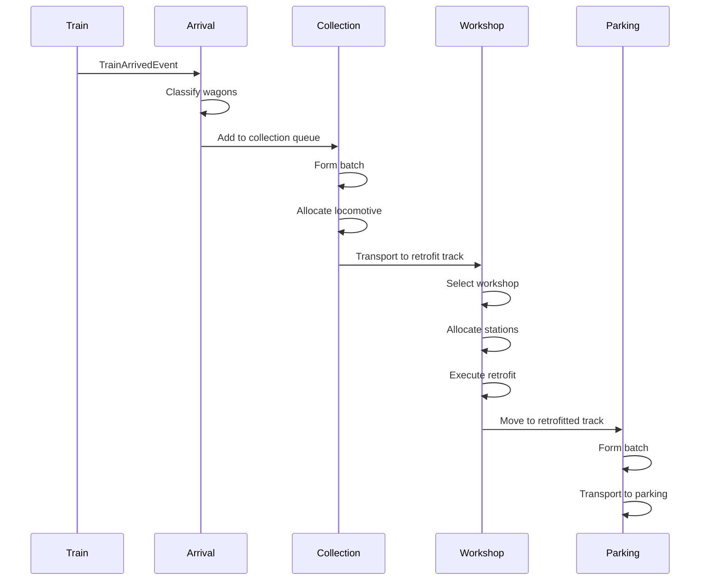
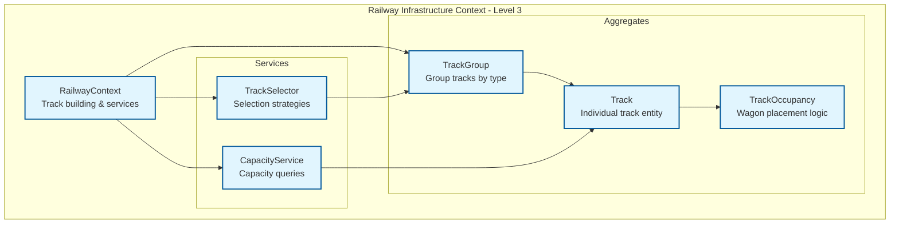
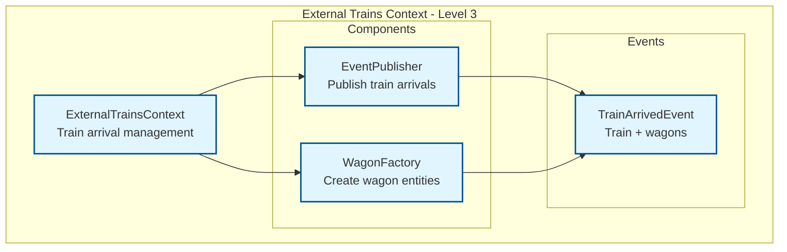
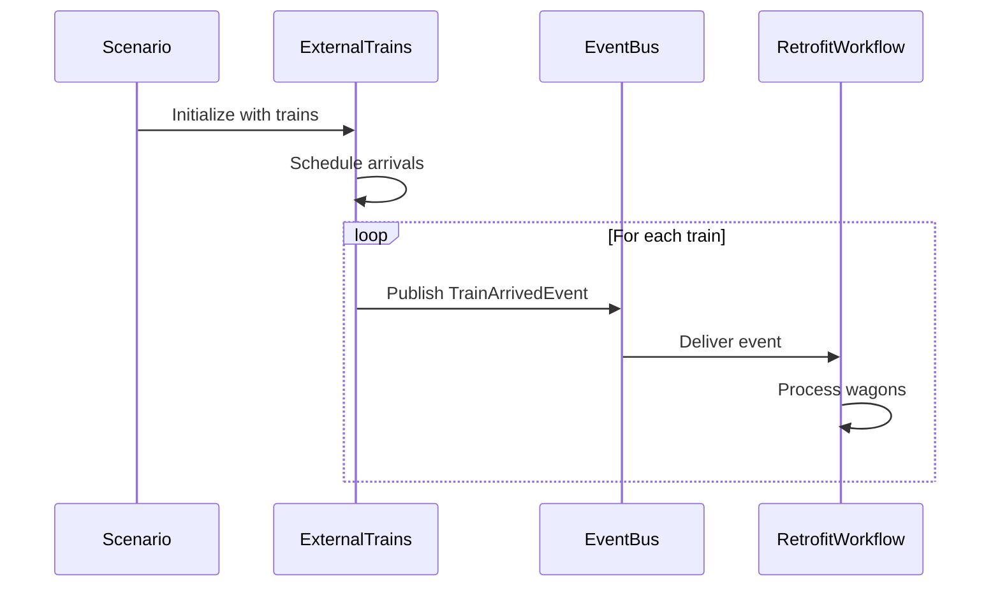
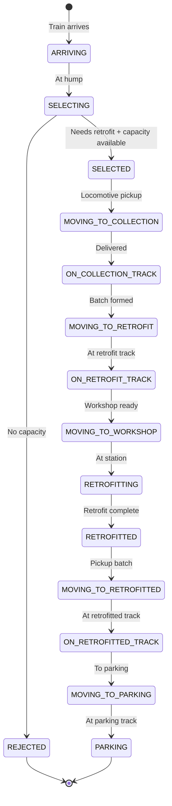

# 5a. Level 3 Implementation Details

## Overview

This document provides Level 3 architectural details for the actual MVP implementation with 4 bounded contexts: Configuration, Retrofit Workflow, Railway Infrastructure, and External Trains.

## 5a.1 Configuration Context - Level 3

### Component Diagram



### Components

| Component | File | Responsibility |
|-----------|------|----------------|
| **ConfigurationBuilder** | `configuration_builder.py` | Load scenario from file path |
| **FileLoader** | `file_loader.py` | Parse JSON/CSV files, handle references |
| **Scenario** | `scenario.py` | Root configuration model with validation |
| **ProcessTimes** | `process_times.py` | Timing configuration for operations |
| **DTOs** | `dtos/` | Input data transfer objects |

### Code Example

```python
from pathlib import Path
from contexts.configuration.domain.configuration_builder import ConfigurationBuilder

# Load scenario
scenario = ConfigurationBuilder(Path("scenario_dir")).build()

# Access configuration
print(f"Scenario: {scenario.id}")
print(f"Workshops: {len(scenario.workshops)}")
print(f"Trains: {len(scenario.trains)}")
```

---

## 5a.2 Retrofit Workflow Context - Level 3

### Component Diagram



### Coordinators (Application Layer)

| Coordinator | Responsibility | SimPy Process |
|-------------|----------------|---------------|
| **ArrivalCoordinator** | Receive trains, classify wagons, distribute to collection tracks | Yes |
| **CollectionCoordinator** | Form batches, allocate locomotive, transport to retrofit track | Yes |
| **WorkshopCoordinator** | Assign wagons to workshops, execute retrofit, return to retrofitted track | Yes |
| **ParkingCoordinator** | Transport completed wagons to parking tracks | Yes |

### Domain Services (No SimPy Dependencies)

| Service | Responsibility |
|---------|----------------|
| **BatchFormationService** | Create wagon batches based on capacity constraints |
| **RakeFormationService** | Form and dissolve wagon rakes with coupling logic |
| **TrainFormationService** | Assemble trains (locomotive + rake) with preparation times |
| **WorkshopSchedulingService** | Schedule wagon batches to available workshops |
| **CouplingService** | Calculate coupling/decoupling times |
| **RouteService** | Provide route durations between tracks |

### Resource Managers (Infrastructure Layer)

| Manager | Responsibility |
|---------|----------------|
| **LocomotiveResourceManager** | Allocate and release locomotives (SimPy Resource) |
| **TrackCapacityManager** | Manage track capacity and wagon placement |
| **WorkshopResourceManager** | Manage workshop station availability (SimPy Resource) |

### Workflow Sequence



---

## 5a.3 Railway Infrastructure Context - Level 3

### Component Diagram



### Components

| Component | Responsibility | Pattern |
|-----------|----------------|---------|
| **RailwayContext** | Build tracks from scenario, provide services | Context |
| **TrackGroup** | Group tracks by type (collection, retrofit, parking, workshop) | Aggregate |
| **Track** | Individual track with capacity and fill factor | Entity |
| **TrackOccupancy** | Manage wagon placement and capacity | Aggregate |
| **TrackSelector** | Select tracks based on strategies | Service |
| **CapacityService** | Query track capacity and availability | Service |

### Track Selection Strategies

- **LEAST_OCCUPIED**: Select track with lowest occupancy ratio
- **ROUND_ROBIN**: Cycle through available tracks
- **FIRST_AVAILABLE**: Select first track with capacity
- **RANDOM**: Random selection from available tracks

---

## 5a.4 External Trains Context - Level 3

### Component Diagram



### Components

| Component | Responsibility |
|-----------|----------------|
| **ExternalTrainsContext** | Initialize train arrivals from scenario |
| **EventPublisher** | Publish TrainArrivedEvent to event bus |
| **WagonFactory** | Create wagon entities from train data |

### Train Arrival Flow



---

## 5a.5 Integration Patterns

### Event Bus Communication

```python
from contexts.shared.domain.events import EventBus, TrainArrivedEvent

# External Trains publishes event
event_bus.publish(TrainArrivedEvent(
    train_id="T001",
    wagons=[wagon1, wagon2, wagon3],
    arrival_time=100.0
))

# Retrofit Workflow subscribes
event_bus.subscribe(TrainArrivedEvent, arrival_coordinator.handle_train_arrival)
```

### Track Capacity Queries

```python
from contexts.railway_infrastructure.application.railway_context import RailwayContext

# Query track capacity
railway = RailwayContext(scenario)
track = railway.track_selector.select_track_with_capacity('collection', required_length=50.0)

# Place wagons on track
railway.place_wagons_on_track(track.id, wagons)
```

### Resource Allocation

```python
from contexts.retrofit_workflow.infrastructure.resource_managers import LocomotiveResourceManager

# Allocate locomotive
loco_manager = LocomotiveResourceManager(env, locomotives)
locomotive = yield loco_manager.allocate()

# Use locomotive
yield from transport_wagons(locomotive, wagons, destination)

# Release locomotive
loco_manager.release(locomotive)
```

---

## 5a.6 File Organization

```
popupsim/backend/src/
├── main.py                                    # CLI entry point
├── application/
│   └── simulation_service.py                  # Orchestrates all contexts
├── contexts/
│   ├── configuration/                         # Configuration Context
│   │   ├── domain/
│   │   │   ├── configuration_builder.py       # Load from files
│   │   │   └── models/
│   │   │       ├── scenario.py
│   │   │       ├── process_times.py
│   │   │       └── ...
│   │   └── infrastructure/
│   │       └── file_loader.py                 # Parse JSON/CSV
│   ├── retrofit_workflow/                     # Retrofit Workflow Context
│   │   ├── application/
│   │   │   ├── retrofit_workflow_context.py   # Main context
│   │   │   └── coordinators/
│   │   │       ├── arrival_coordinator.py
│   │   │       ├── collection_coordinator.py
│   │   │       ├── workshop_coordinator.py
│   │   │       └── parking_coordinator.py
│   │   ├── domain/
│   │   │   └── services/
│   │   │       ├── batch_formation_service.py
│   │   │       ├── rake_formation_service.py
│   │   │       ├── train_formation_service.py
│   │   │       ├── workshop_scheduling_service.py
│   │   │       ├── coupling_service.py
│   │   │       └── route_service.py
│   │   └── infrastructure/
│   │       ├── resource_managers/
│   │       │   ├── locomotive_resource_manager.py
│   │       │   ├── track_capacity_manager.py
│   │       │   └── workshop_resource_manager.py
│   │       └── metrics/
│   │           ├── simulation_metrics.py
│   │           ├── wagon_collector.py
│   │           ├── locomotive_collector.py
│   │           └── workshop_collector.py
│   ├── railway_infrastructure/                # Railway Infrastructure Context
│   │   ├── application/
│   │   │   └── railway_context.py             # Track building & services
│   │   ├── domain/
│   │   │   ├── aggregates/
│   │   │   │   ├── track_group.py
│   │   │   │   ├── track.py
│   │   │   │   └── track_occupancy.py
│   │   │   └── services/
│   │   │       ├── track_selector.py
│   │   │       └── capacity_service.py
│   │   └── infrastructure/
│   │       └── track_repository.py
│   ├── external_trains/                       # External Trains Context
│   │   ├── application/
│   │   │   └── external_trains_context.py     # Train arrival management
│   │   ├── domain/
│   │   │   ├── wagon_factory.py
│   │   │   └── events/
│   │   │       └── train_arrived_event.py
│   │   └── infrastructure/
│   │       └── event_publisher.py
│   └── shared/                                # Shared Kernel
│       ├── domain/
│       │   ├── events/
│       │   │   └── event_bus.py
│       │   └── value_objects/
│       └── infrastructure/
│           └── simpy_adapter.py
└── tests/
    └── unit/
        ├── configuration/
        ├── retrofit_workflow/
        ├── railway_infrastructure/
        └── external_trains/
```

---

## 5a.7 Wagon State Machine



---

## 5a.8 Technology Integration

### SimPy Integration

**SimPyAdapter** provides abstraction:
```python
class SimPyAdapter:
    def delay(self, duration: float) -> Generator
    def run_process(self, process: Callable, *args) -> None
    def create_store(self, capacity: int) -> Any
    def create_event(self) -> Any
    def current_time(self) -> float
    def run(self, until: float) -> None
```

### Pydantic Integration

All domain models use Pydantic for:
- Type safety
- Automatic validation
- JSON serialization
- Field constraints
- Custom validators

### Event Bus Integration

```python
from contexts.shared.domain.events import EventBus

# Initialize event bus
event_bus = EventBus()

# Subscribe to events
event_bus.subscribe(TrainArrivedEvent, handler)

# Publish events
event_bus.publish(TrainArrivedEvent(...))
```

---
