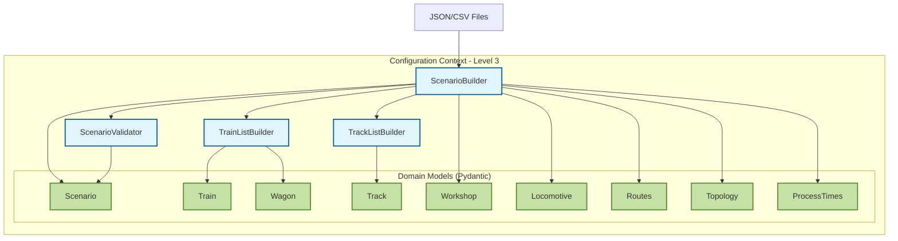
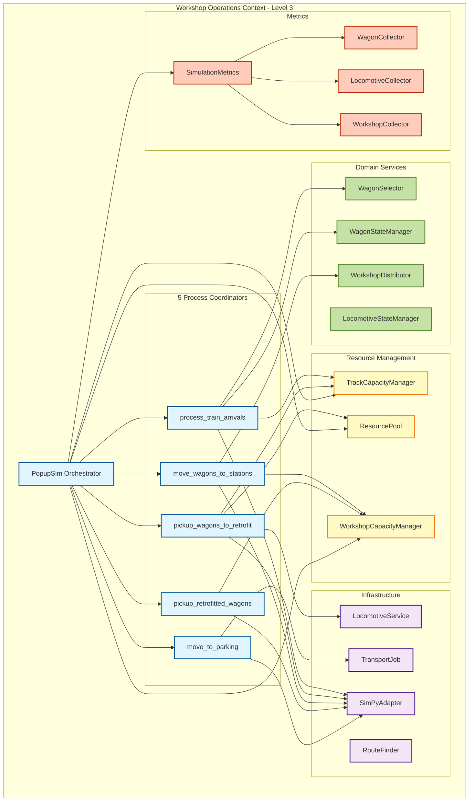
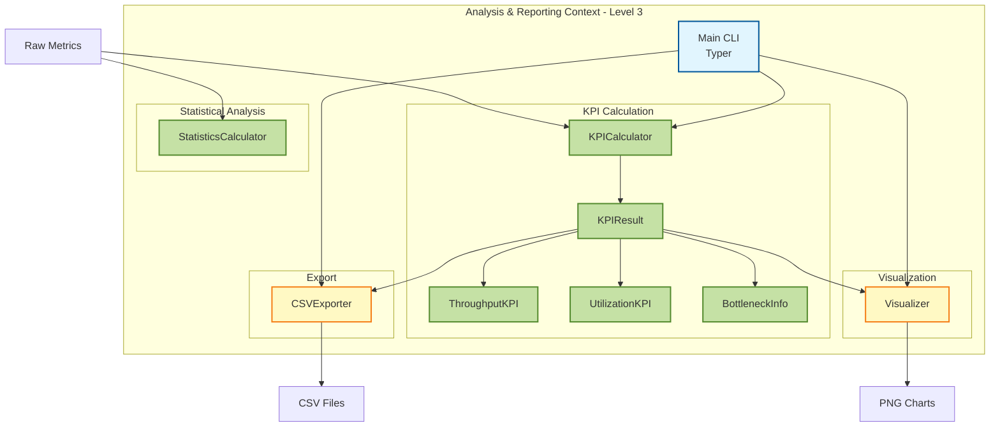
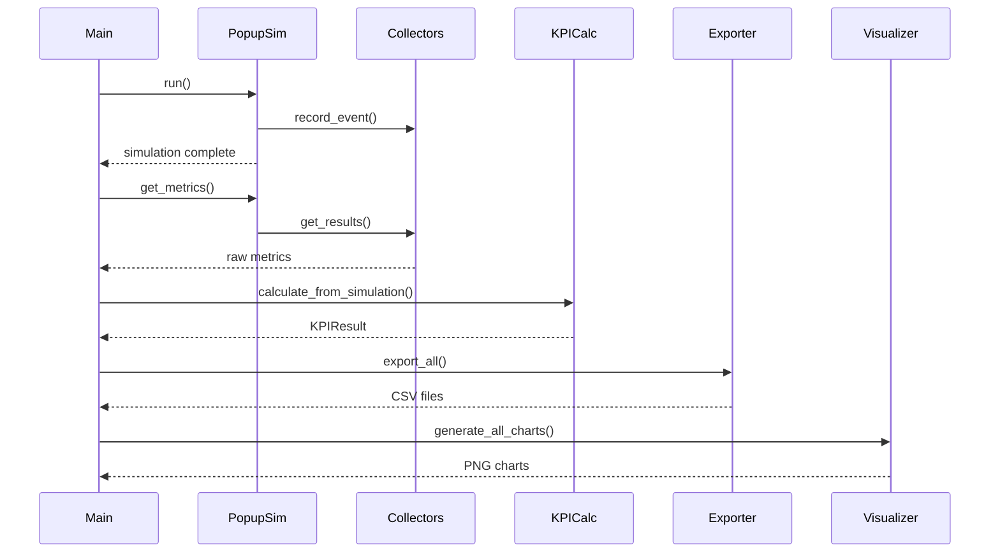
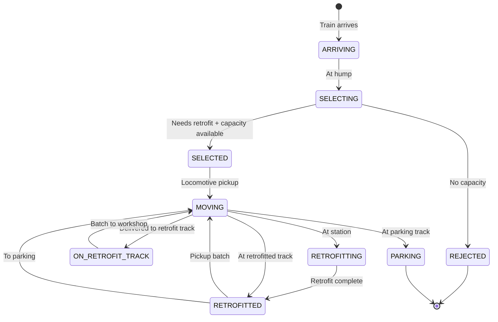

# 5a. Level 3 Implementation Details

## Overview

This document provides Level 3 architectural details for the actual MVP implementation, including all additional components beyond the simplified Level 2 view.

## 5a.1 Configuration Context - Level 3

### Component Diagram



### Components

| Component | File | Responsibility |
|-----------|------|----------------|
| **ScenarioBuilder** | `builders/scenario_builder.py` | Orchestrate loading of 7 referenced files, validate complete scenario |
| **TrainListBuilder** | `builders/train_list_builder.py` | Parse CSV train schedules, create Train and Wagon objects |
| **TrackListBuilder** | `builders/tracks_builder.py` | Parse JSON track configurations |
| **ScenarioValidator** | `validators/scenario_validation.py` | Cross-validate scenario consistency |
| **Scenario** | `models/scenario.py` | Main configuration model with strategy enums |
| **Train** | `models/train.py` | Train with wagons list |
| **Wagon** | `models/wagon.py` | Individual wagon with status tracking |
| **Track** | `models/track.py` | Track with type enum (COLLECTION, RETROFIT, RETROFITTED, PARKING, WORKSHOP) |
| **Workshop** | `models/workshop.py` | Workshop with retrofit_stations count |
| **Locomotive** | `models/locomotive.py` | Locomotive resource |
| **Routes** | `models/routes.py` | Route definitions with durations |
| **Topology** | `models/topology.py` | Network topology with edge lengths |
| **ProcessTimes** | `models/process_times.py` | All timing parameters |

### Key Patterns

**Builder Pattern:** ScenarioBuilder orchestrates loading of multiple files
**Strategy Pattern:** TrackSelectionStrategy, LocoDeliveryStrategy enums
**Validation:** Pydantic models + custom validators

## 5a.2 Workshop Operations Context - Level 3

### Component Diagram



### 5 Process Coordinators

| Coordinator | Function | Responsibility |
|-------------|----------|----------------|
| **Train Arrival** | `process_train_arrivals()` | Process arriving trains, select wagons at hump, assign to collection tracks based on strategy |
| **Wagon Pickup** | `pickup_wagons_to_retrofit()` | Wait for wagons ready, allocate locomotive, pickup from collection, deliver to retrofit tracks |
| **Workshop** | `move_wagons_to_stations()` | Collect batches, wait for workshop ready, deliver batch, decouple sequentially, spawn retrofit processes |
| **Retrofitted Pickup** | `pickup_retrofitted_wagons()` | Wait for full batch completed, allocate locomotive, couple sequentially, move to retrofitted track |
| **Parking** | `move_to_parking()` | Move wagons from retrofitted track to parking tracks using sequential fill strategy |

### Resource Management Components

| Component | File | Responsibility |
|-----------|------|----------------|
| **ResourcePool** | `simulation/resource_pool.py` | Generic resource pool with allocation tracking, utilization calculation |
| **TrackCapacityManager** | `simulation/track_capacity.py` | Track capacity based on length and fill factor, 4 selection strategies |
| **WorkshopCapacityManager** | `simulation/workshop_capacity.py` | Workshop station capacity using SimPy Resources |

**TrackCapacityManager Strategies:**
- ROUND_ROBIN: Cycle through available tracks
- LEAST_OCCUPIED: Select track with lowest occupancy ratio
- FIRST_AVAILABLE: Select first track with capacity
- RANDOM: Random selection

### Domain Services (No SimPy Dependencies)

| Service | File | Responsibility |
|---------|------|----------------|
| **WagonSelector** | `domain/wagon_operations.py` | Select wagons needing retrofit, filter by status, group by track |
| **WagonStateManager** | `domain/wagon_operations.py` | Manage wagon state transitions (SELECTING → SELECTED → MOVING → RETROFITTING → RETROFITTED → PARKING) |
| **LocomotiveStateManager** | `domain/locomotive_operations.py` | Manage locomotive state transitions |
| **WorkshopDistributor** | `domain/workshop_operations.py` | Distribute wagons to workshops based on capacity |

### Infrastructure Components

| Component | File | Responsibility |
|-----------|------|----------------|
| **SimPyAdapter** | `simulation/sim_adapter.py` | Abstraction layer for SimPy operations (delay, run_process, create_store, create_event) |
| **LocomotiveService** | `simulation/services.py` | Locomotive operations (allocate, release, move, couple, decouple) |
| **RouteFinder** | `simulation/route_finder.py` | Find routes between tracks |
| **TransportJob** | `simulation/jobs.py` | Execute transport jobs with locomotive |

### Metrics Collection

| Collector | File | Responsibility |
|-----------|------|----------------|
| **SimulationMetrics** | `analytics/collectors/metrics.py` | Aggregate all collectors, provide unified interface |
| **WagonCollector** | `analytics/collectors/wagon.py` | Track wagon flow times, waiting times, status changes |
| **LocomotiveCollector** | `analytics/collectors/locomotive.py` | Track locomotive utilization, trips, idle time |
| **WorkshopCollector** | `analytics/collectors/workshop.py` | Track station occupancy, throughput |

## 5a.3 Analysis & Reporting Context - Level 3

### Component Diagram



### Components

| Component | File | Responsibility |
|-----------|------|----------------|
| **Main CLI** | `main.py` | Typer-based CLI, orchestrate full pipeline, display results |
| **KPICalculator** | `analytics/kpi/calculator.py` | Calculate throughput, utilization, bottlenecks, flow times |
| **KPIResult** | `analytics/models/kpi_result.py` | Container for all KPI results |
| **ThroughputKPI** | `analytics/models/kpi_result.py` | Wagons processed, retrofitted, rejected, per hour, per day |
| **UtilizationKPI** | `analytics/models/kpi_result.py` | Workshop utilization, peak, idle time |
| **BottleneckInfo** | `analytics/models/kpi_result.py` | Bottleneck location, type, severity, impact |
| **StatisticsCalculator** | `analytics/reporting/statistics.py` | Pandas/NumPy statistical analysis (summary stats, percentiles, correlation) |
| **CSVExporter** | `analytics/reporting/csv_exporter.py` | Export KPIs to CSV files |
| **Visualizer** | `analytics/reporting/visualizer.py` | Generate Matplotlib charts (throughput, utilization, bottlenecks) |

### KPI Calculation Flow



## 5a.4 Additional Implementation Details

### Batch Processing

**Workshop Coordinator** implements sophisticated batch processing:

1. **Collect Batch:** Accumulate wagons up to batch_size (= retrofit_stations)
2. **Wait for Ready:** Block until workshop track and all stations empty
3. **Deliver Batch:** Allocate locomotive, travel to workshop
4. **Sequential Decoupling:** Decouple wagons one-by-one with timing
5. **Spawn Processing:** Each wagon gets independent retrofit process
6. **Return Locomotive:** Return to parking based on strategy

### Locomotive Delivery Strategies

**RETURN_TO_PARKING:**
- Locomotive returns to parking after each delivery
- Higher locomotive utilization
- More realistic for large sites

**STAY_AT_WORKSHOP:**
- Locomotive stays at workshop track
- Faster turnaround for next batch
- Suitable for small sites

### Track Selection Strategies

**LEAST_OCCUPIED:**
- Select track with lowest occupancy ratio
- Balances load across tracks
- Default strategy

**ROUND_ROBIN:**
- Cycle through available tracks
- Simple, predictable
- Good for uniform wagon sizes

**FIRST_AVAILABLE:**
- Select first track with capacity
- Fastest selection
- May cause uneven distribution

**RANDOM:**
- Random selection from available tracks
- Useful for testing

### Wagon State Machine



### Metrics Collection Events

**Wagon Events:**
- wagon_delivered: Wagon delivered to retrofit track
- wagon_retrofitted: Retrofit completed

**Locomotive Events:**
- loco_allocated: Locomotive allocated from pool
- loco_released: Locomotive returned to pool
- loco_moved: Locomotive moved between tracks

**Workshop Events:**
- station_occupied: Station starts processing
- station_released: Station completes processing

## 5a.5 Technology Integration

### SimPy Integration

**SimPyAdapter** provides abstraction:
```python
class SimPyAdapter:
    def delay(self, duration: float) -> Generator
    def run_process(self, process: Callable, *args) -> None
    def create_store(self, capacity: int) -> Any
    def create_event(self) -> Any
    def current_time(self) -> float
    def run(self, until: float) -> None
```

**Benefits:**
- Isolate SimPy dependencies
- Easier testing with mock adapter
- Potential to swap simulation engines

### Pydantic Integration

**All domain models use Pydantic:**
- Type safety
- Automatic validation
- JSON serialization
- Field constraints
- Custom validators

### Pandas/NumPy Integration

**StatisticsCalculator uses:**
- `pd.DataFrame.describe()` for summary statistics
- `pd.DataFrame.quantile()` for percentiles
- `pd.DataFrame.corr()` for correlation matrices
- `np.convolve()` for moving averages
- Z-score method for outlier detection

### Matplotlib Integration

**Visualizer generates:**
- Throughput charts (line plots)
- Utilization charts (bar charts)
- Bottleneck charts (horizontal bar charts)
- Time series plots

## 5a.6 File Organization

```
popupsim/backend/src/
├── main.py                          # CLI entry point
├── builders/                        # Configuration builders
│   ├── scenario_builder.py
│   ├── train_list_builder.py
│   └── tracks_builder.py
├── models/                          # Pydantic domain models
│   ├── scenario.py
│   ├── train.py
│   ├── wagon.py
│   ├── track.py
│   ├── workshop.py
│   ├── locomotive.py
│   ├── routes.py
│   ├── topology.py
│   └── process_times.py
├── validators/                      # Cross-validation
│   └── scenario_validation.py
├── simulation/                      # SimPy integration
│   ├── popupsim.py                 # Main orchestrator
│   ├── sim_adapter.py              # SimPy abstraction
│   ├── resource_pool.py            # Generic resource pool
│   ├── track_capacity.py           # Track capacity management
│   ├── workshop_capacity.py        # Workshop capacity management
│   ├── services.py                 # Locomotive service
│   ├── route_finder.py             # Route lookup
│   ├── jobs.py                     # Transport jobs
│   └── coordinators/               # Process coordinators (placeholder)
├── domain/                          # Domain services (no SimPy)
│   ├── wagon_operations.py
│   ├── locomotive_operations.py
│   └── workshop_operations.py
└── analytics/                       # Analysis & reporting
    ├── collectors/                  # Metrics collection
    │   ├── base.py
    │   ├── metrics.py
    │   ├── wagon.py
    │   ├── locomotive.py
    │   └── workshop.py
    ├── kpi/                         # KPI calculation
    │   └── calculator.py
    ├── models/                      # KPI result models
    │   └── kpi_result.py
    └── reporting/                   # Export & visualization
        ├── csv_exporter.py
        ├── visualizer.py
        └── statistics.py
```
