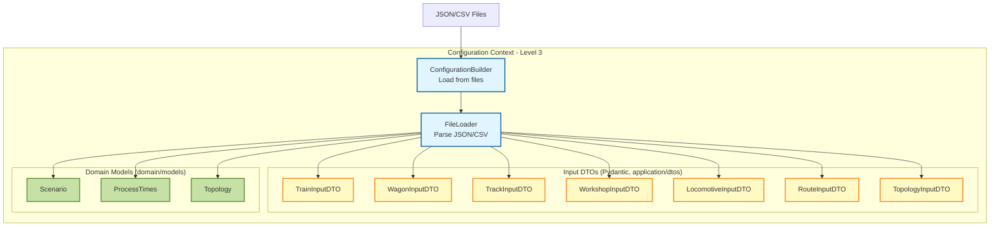
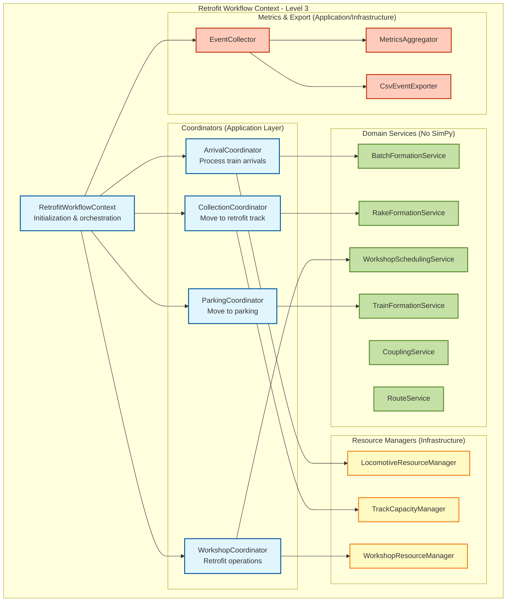
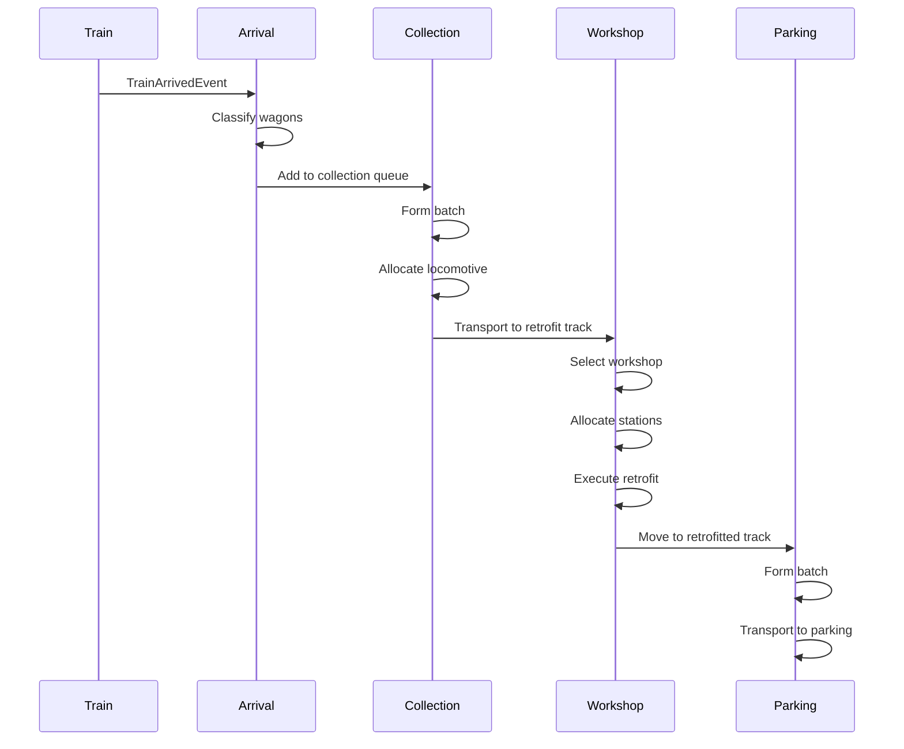
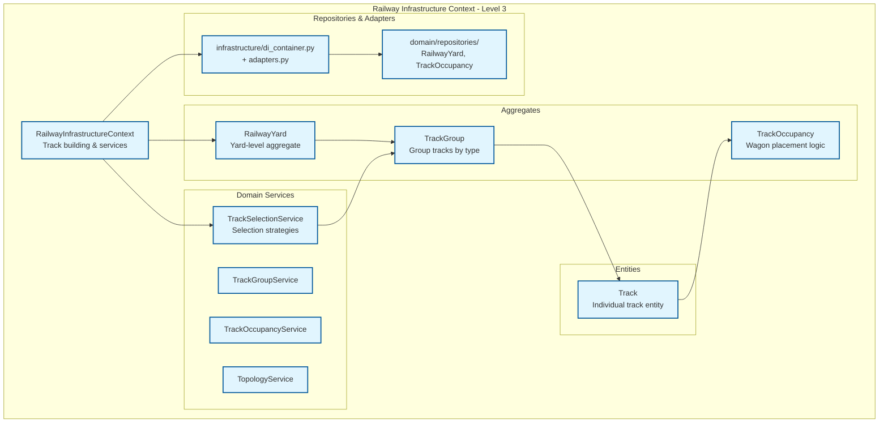
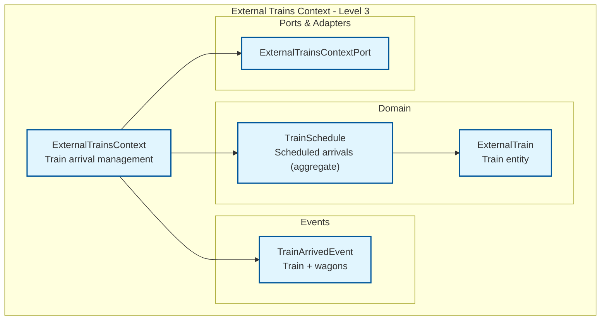
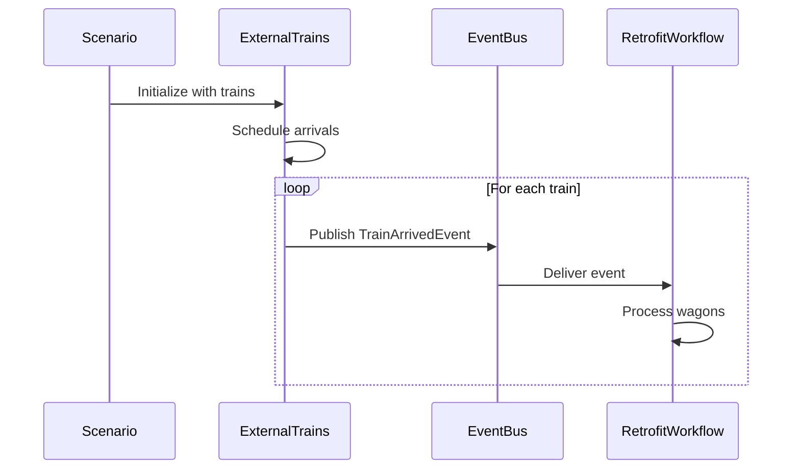
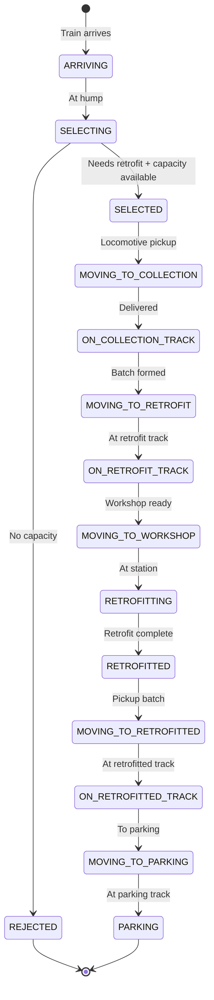

# 5a. Level 3 Implementation Details

## Overview

This document provides Level 3 architectural details for the actual MVP implementation with 4 bounded contexts: Configuration, Retrofit Workflow, Railway Infrastructure, and External Trains.

## 5a.1 Configuration Context - Level 3

### Component Diagram


```mermaid
graph TB
    subgraph "Configuration Context - Level 3"
        Builder["ConfigurationBuilder<br/>Load from files"]
        Loader["FileLoader<br/>Parse JSON/CSV"]

        subgraph "Input DTOs (Pydantic, application/dtos)"
            TrainDTO[TrainInputDTO]
            WagonDTO[WagonInputDTO]
            TrackDTO[TrackInputDTO]
            WorkshopDTO[WorkshopInputDTO]
            LocoDTO[LocomotiveInputDTO]
            RouteDTO[RouteInputDTO]
            TopologyDTO[TopologyInputDTO]
        end

        subgraph "Domain Models (domain/models)"
            Scenario[Scenario]
            ProcessTimes[ProcessTimes]
            Topology[Topology]
        end
    end
    
    Files[JSON/CSV Files] --> Builder
    Builder --> Loader
    Loader --> TrainDTO
    Loader --> WagonDTO
    Loader --> TrackDTO
    Loader --> WorkshopDTO
    Loader --> LocoDTO
    Loader --> RouteDTO
    Loader --> TopologyDTO
    Loader --> Scenario
    Loader --> ProcessTimes
    Loader --> Topology

    classDef builder fill:#e1f5fe,stroke:#01579b,stroke-width:2px
    classDef dto fill:#fff9c4,stroke:#f57f17,stroke-width:2px
    classDef model fill:#c5e1a5,stroke:#558b2f,stroke-width:2px
    
    class Builder,Loader builder
    class TrainDTO,WagonDTO,TrackDTO,WorkshopDTO,LocoDTO,RouteDTO,TopologyDTO dto
    class Scenario,ProcessTimes,Topology model
```

### Components

| Component | File | Responsibility |
|-----------|------|----------------|
| **ConfigurationBuilder** | `configuration_builder.py` | Load scenario from file path |
| **FileLoader** | `file_loader.py` | Parse JSON/CSV files, handle references |
| **Scenario** | `scenario.py` | Root configuration model with validation |
| **ProcessTimes** | `process_times.py` | Timing configuration for operations |
| **DTOs** | `dtos/` | Input data transfer objects |

### Code Example

```python
from pathlib import Path
from contexts.configuration.domain.configuration_builder import ConfigurationBuilder

# Load scenario
scenario = ConfigurationBuilder(Path('scenario_dir')).build()

# Access configuration
print(f'Scenario: {scenario.id}')
print(f'Workshops: {len(scenario.workshops)}')
print(f'Trains: {len(scenario.trains)}')
```

---

## 5a.2 Retrofit Workflow Context - Level 3

### Component Diagram


```mermaid
graph TB
    subgraph "Retrofit Workflow Context - Level 3"
        Context["RetrofitWorkflowContext<br/>Initialization & orchestration"]
        
        subgraph "Coordinators (Application Layer)"
            Arrival["ArrivalCoordinator<br/>Process train arrivals"]
            Collection["CollectionCoordinator<br/>Move to retrofit track"]
            Workshop["WorkshopCoordinator<br/>Retrofit operations"]
            Parking["ParkingCoordinator<br/>Move to parking"]
        end
        
        subgraph "Domain Services (No SimPy)"
            Batch["BatchFormationService"]
            Rake["RakeFormationService"]
            TrainForm["TrainFormationService"]
            Schedule["WorkshopSchedulingService"]
            Coupling["CouplingService"]
            Route["RouteService"]
        end
        
        subgraph "Resource Managers (Infrastructure)"
            LocoMgr["LocomotiveResourceManager"]
            TrackMgr["TrackCapacityManager"]
            WorkshopMgr["WorkshopResourceManager"]
        end
        
        subgraph "Metrics & Export (Application/Infrastructure)"
            Collector["EventCollector"]
            Aggregator["MetricsAggregator"]
            Exporter["CsvEventExporter"]
        end
    end
    
    Context --> Arrival
    Context --> Collection
    Context --> Workshop
    Context --> Parking
    
    Arrival --> Batch
    Collection --> Rake
    Workshop --> Schedule
    Parking --> TrainForm
    
    Arrival --> LocoMgr
    Collection --> TrackMgr
    Workshop --> WorkshopMgr
    
    Context --> Collector
    Collector --> Aggregator
    Collector --> Exporter
    
    classDef coord fill:#e1f5fe,stroke:#01579b,stroke-width:2px
    classDef domain fill:#c5e1a5,stroke:#558b2f,stroke-width:2px
    classDef resource fill:#fff9c4,stroke:#f57f17,stroke-width:2px
    classDef metrics fill:#ffccbc,stroke:#bf360c,stroke-width:2px
    
    class Context,Arrival,Collection,Workshop,Parking coord
    class Batch,Rake,TrainForm,Schedule,Coupling,Route domain
    class LocoMgr,TrackMgr,WorkshopMgr resource
    class Collector,Aggregator,Exporter metrics
```

### Coordinators (Application Layer)

| Coordinator | Responsibility | SimPy Process |
|-------------|----------------|---------------|
| **ArrivalCoordinator** | Receive trains, classify wagons, distribute to collection tracks | Yes |
| **CollectionCoordinator** | Form batches, allocate locomotive, transport to retrofit track | Yes |
| **WorkshopCoordinator** | Assign wagons to workshops, execute retrofit, return to retrofitted track | Yes |
| **ParkingCoordinator** | Transport completed wagons to parking tracks | Yes |

### Domain Services (No SimPy Dependencies)

| Service | Responsibility |
|---------|----------------|
| **BatchFormationService** | Create wagon batches based on capacity constraints |
| **RakeFormationService** | Form and dissolve wagon rakes with coupling logic |
| **TrainFormationService** | Assemble trains (locomotive + rake) with preparation times |
| **WorkshopSchedulingService** | Schedule wagon batches to available workshops |
| **CouplingService** | Calculate coupling/decoupling times |
| **RouteService** | Provide route durations between tracks |

### Resource Managers (Infrastructure Layer)

| Manager | Responsibility |
|---------|----------------|
| **LocomotiveResourceManager** | Allocate and release locomotives (SimPy Resource) |
| **TrackCapacityManager** | Manage track capacity and wagon placement |
| **WorkshopResourceManager** | Manage workshop station availability (SimPy Resource) |

### Workflow Sequence


```mermaid
sequenceDiagram
    participant Train
    participant Arrival
    participant Collection
    participant Workshop
    participant Parking
    
    Train->>Arrival: TrainArrivedEvent
    Arrival->>Arrival: Classify wagons
    Arrival->>Collection: Add to collection queue
    Collection->>Collection: Form batch
    Collection->>Collection: Allocate locomotive
    Collection->>Workshop: Transport to retrofit track
    Workshop->>Workshop: Select workshop
    Workshop->>Workshop: Allocate stations
    Workshop->>Workshop: Execute retrofit
    Workshop->>Parking: Move to retrofitted track
    Parking->>Parking: Form batch
    Parking->>Parking: Transport to parking
```

---

## 5a.3 Railway Infrastructure Context - Level 3

### Component Diagram


```mermaid
graph TB
    subgraph "Railway Infrastructure Context - Level 3"
        Context["RailwayInfrastructureContext<br/>Track building & services"]
        
        subgraph "Aggregates"
            Yard["RailwayYard<br/>Yard-level aggregate"]
            TrackGroup["TrackGroup<br/>Group tracks by type"]
            Occupancy["TrackOccupancy<br/>Wagon placement logic"]
        end

        subgraph "Entities"
            Track["Track<br/>Individual track entity"]
        end
        
        subgraph "Domain Services"
            Selection["TrackSelectionService<br/>Selection strategies"]
            GroupSvc["TrackGroupService"]
            OccSvc["TrackOccupancyService"]
            Topology["TopologyService"]
        end

        subgraph "Repositories & Adapters"
            Repos["domain/repositories/<br/>RailwayYard, TrackOccupancy"]
            DI["infrastructure/di_container.py<br/>+ adapters.py"]
        end
    end
    
    Context --> Yard
    Yard --> TrackGroup
    TrackGroup --> Track
    Track --> Occupancy
    Context --> Selection
    Context --> DI
    DI --> Repos
    Selection --> TrackGroup
    
    classDef component fill:#e1f5fe,stroke:#01579b,stroke-width:2px
    
    class Context,Yard,TrackGroup,Track,Occupancy,Selection,GroupSvc,OccSvc,Topology,Repos,DI component
```

### Components

| Component | Responsibility | Pattern |
|-----------|----------------|---------|
| **RailwayInfrastructureContext** | Build tracks from scenario, provide services | Context |
| **RailwayYard** | Yard-level aggregate over track groups | Aggregate |
| **TrackGroup** | Group tracks by type (collection, retrofit, parking, workshop) | Aggregate |
| **Track** | Individual track with capacity and fill factor | Entity |
| **TrackOccupancy** | Manage wagon placement and capacity | Aggregate |
| **TrackSelectionService** | Select tracks based on strategies | Domain Service |
| **TrackGroupService / TrackOccupancyService / TopologyService** | Track grouping, occupancy, and topology queries | Domain Services |

Repositories (`domain/repositories/`) and their adapters/DI wiring
(`infrastructure/di_container.py`, `infrastructure/adapters.py`) provide persistence-style
access to yard and occupancy state.

### Track Selection Strategies

Track selection uses the shared `SelectionStrategy` value object:

- **FIRST_AVAILABLE**: Select first track with available capacity
- **LEAST_OCCUPIED**: Select track with lowest occupancy ratio
- **ROUND_ROBIN**: Cycle through available tracks
- **BEST_FIT**: Select the track that best fits the required length
- **RANDOM**: Random selection from available tracks

---

## 5a.4 External Trains Context - Level 3

### Component Diagram


```mermaid
graph TB
    subgraph "External Trains Context - Level 3"
        Context["ExternalTrainsContext<br/>Train arrival management"]
        
        subgraph "Domain"
            Schedule["TrainSchedule<br/>Scheduled arrivals (aggregate)"]
            Train["ExternalTrain<br/>Train entity"]
        end
        
        subgraph "Events"
            TrainEvent["TrainArrivedEvent<br/>Train + wagons"]
        end

        subgraph "Ports & Adapters"
            Port["ExternalTrainsContextPort"]
        end
    end
    
    Context --> Schedule
    Schedule --> Train
    Context --> TrainEvent
    Context --> Port
    
    classDef component fill:#e1f5fe,stroke:#01579b,stroke-width:2px
    
    class Context,Schedule,Train,TrainEvent,Port component
```

### Components

| Component | File | Responsibility |
|-----------|------|----------------|
| **ExternalTrainsContext** | `application/external_trains_context.py` | Schedule train arrivals, create wagons, publish events |
| **TrainSchedule** | `domain/aggregates/train_schedule.py` | Manage scheduled train arrivals |
| **ExternalTrain** | `domain/entities/external_train.py` | Train entity with arrival time and wagons |
| **Train events** | `domain/events/train_events.py` | Train arrival/departure domain events |
| **ExternalTrainsContextPort** | `application/ports/external_trains_context_port.py` | Port exposing the context to other contexts |

The context publishes the shared `TrainArrivedEvent`
(`shared/domain/events/wagon_lifecycle_events.py`) onto the event bus; wagon entities are
created directly by the context (there is no separate `WagonFactory`/`EventPublisher`).

### Train Arrival Flow


```mermaid
sequenceDiagram
    participant Scenario
    participant ExternalTrains
    participant EventBus
    participant RetrofitWorkflow
    
    Scenario->>ExternalTrains: Initialize with trains
    ExternalTrains->>ExternalTrains: Schedule arrivals
    loop For each train
        ExternalTrains->>EventBus: Publish TrainArrivedEvent
        EventBus->>RetrofitWorkflow: Deliver event
        RetrofitWorkflow->>RetrofitWorkflow: Process wagons
    end
```

---

## 5a.5 Integration Patterns

### Event Bus Communication

```python
from infrastructure.event_bus.event_bus import EventBus
from shared.domain.events.wagon_lifecycle_events import TrainArrivedEvent

# External Trains publishes an event onto the shared bus
event_bus.publish(TrainArrivedEvent(...))

# Retrofit Workflow subscribes
event_bus.subscribe(TrainArrivedEvent, handler)
```

> The concrete `EventBus` lives in `infrastructure/event_bus/event_bus.py`; the shared
> domain events (including `TrainArrivedEvent`) live in `shared/domain/events/`.

### Track Selection

```python
from contexts.railway_infrastructure.application.railway_context import RailwayInfrastructureContext

# Build the railway context (via its DI factory in practice — see di_container.py)
railway = RailwayInfrastructureContext(...)

# Track selection is provided by TrackSelectionService using a SelectionStrategy
# (see contexts/retrofit_workflow/domain/services/track_selection_service.py)
```

### Resource Allocation

```python
from contexts.retrofit_workflow.infrastructure.resources.locomotive_resource_manager import (
    LocomotiveResourceManager,
)

# Locomotive allocation/release is coordinated through the resource manager
# and driven as a SimPy process by the coordinators.
```

---

## 5a.6 File Organization

```
popupsim/backend/src/
├── main.py                                    # CLI entry point
├── application/
│   └── simulation_service.py                  # Orchestrates all contexts
├── contexts/
│   ├── configuration/                         # Configuration Context
│   │   ├── domain/
│   │   │   ├── configuration_builder.py       # Load from files
│   │   │   └── models/
│   │   │       ├── scenario.py                # Root Scenario model
│   │   │       ├── process_times.py
│   │   │       └── topology.py
│   │   ├── application/
│   │   │   └── dtos/                           # Input DTOs (train, wagon, track, workshop, ...)
│   │   └── infrastructure/
│   │       └── file_loader.py                 # Parse JSON/CSV
│   ├── retrofit_workflow/                     # Retrofit Workflow Context
│   │   ├── application/
│   │   │   ├── retrofit_workflow_context.py   # Main context
│   │   │   └── coordinators/
│   │   │       ├── arrival_coordinator.py
│   │   │       ├── collection_coordinator.py
│   │   │       ├── workshop_coordinator.py
│   │   │       └── parking_coordinator.py
│   │   ├── domain/
│   │   │   └── services/
│   │   │       ├── batch_formation_service.py
│   │   │       ├── rake_formation_service.py
│   │   │       ├── train_formation_service.py
│   │   │       ├── workshop_scheduling_service.py
│   │   │       ├── coupling_service.py
│   │   │       └── route_service.py
│   │   └── infrastructure/
│   │       ├── resources/
│   │       │   ├── locomotive_resource_manager.py
│   │       │   ├── track_capacity_manager.py
│   │       │   └── workshop_resource_manager.py
│   │       ├── exporters/
│   │       │   ├── csv_event_exporter.py
│   │       │   └── dual_stream_csv_exporter.py
│   │       ├── adapters/
│   │       └── di_container.py
│   ├── railway_infrastructure/                # Railway Infrastructure Context
│   │   ├── application/
│   │   │   ├── railway_context.py             # RailwayInfrastructureContext
│   │   │   └── track_occupancy_event_handler.py
│   │   ├── domain/
│   │   │   ├── aggregates/
│   │   │   │   ├── railway_yard.py
│   │   │   │   ├── track_group.py
│   │   │   │   └── track_occupancy.py
│   │   │   ├── entities/
│   │   │   │   └── track.py
│   │   │   ├── repositories/
│   │   │   │   ├── railway_yard_repository.py
│   │   │   │   └── track_occupancy_repository.py
│   │   │   └── services/
│   │   │       ├── track_selection_service.py
│   │   │       ├── track_group_service.py
│   │   │       ├── track_occupancy_service.py
│   │   │       └── topology_service.py
│   │   └── infrastructure/
│   │       ├── di_container.py                # RailwayContextFactory
│   │       └── adapters.py
│   ├── external_trains/                       # External Trains Context
│   │   ├── application/
│   │   │   ├── external_trains_context.py     # Train arrival management
│   │   │   └── ports/
│   │   │       └── external_trains_context_port.py
│   │   ├── domain/
│   │   │   ├── aggregates/
│   │   │   │   └── train_schedule.py
│   │   │   ├── entities/
│   │   │   │   └── external_train.py
│   │   │   ├── events/
│   │   │   │   └── train_events.py
│   │   │   └── value_objects/
│   │   │       ├── train_id.py
│   │   │       └── arrival_metrics.py
│   │   └── infrastructure/
│   │       └── adapters/
│   └── shared/                                # Shared Kernel
│       ├── domain/
│       │   ├── events/                        # Shared domain events (wagon lifecycle, ...)
│       │   └── value_objects/                 # e.g. selection_strategy.py
│       └── infrastructure/
│           └── simulation/
│               └── engines/
│                   └── simpy_adapter.py       # SimPyEngineAdapter
├── infrastructure/                            # Technical infrastructure (outside contexts)
│   ├── event_bus/
│   │   └── event_bus.py                       # EventBus
│   └── tracking/                              # Process/state tracking + export helpers
└── optimizer/                                 # Two-phase scenario optimization
```

Tests live under `popupsim/backend/tests/` (not `src/tests/`):

```
popupsim/backend/tests/
├── unit/
│   ├── contexts/
│   │   ├── configuration/
│   │   ├── retrofit_workflow/
│   │   ├── railway_infrastructure/
│   │   └── optimizer_search/
│   └── ...
├── validation/
└── fixtures/
```

---

## 5a.7 Wagon State Machine


```mermaid
stateDiagram-v2
    [*] --> ARRIVING: Train arrives
    ARRIVING --> SELECTING: At hump
    SELECTING --> SELECTED: Needs retrofit + capacity available
    SELECTING --> REJECTED: No capacity
    SELECTED --> MOVING_TO_COLLECTION: Locomotive pickup
    MOVING_TO_COLLECTION --> ON_COLLECTION_TRACK: Delivered
    ON_COLLECTION_TRACK --> MOVING_TO_RETROFIT: Batch formed
    MOVING_TO_RETROFIT --> ON_RETROFIT_TRACK: At retrofit track
    ON_RETROFIT_TRACK --> MOVING_TO_WORKSHOP: Workshop ready
    MOVING_TO_WORKSHOP --> RETROFITTING: At station
    RETROFITTING --> RETROFITTED: Retrofit complete
    RETROFITTED --> MOVING_TO_RETROFITTED: Pickup batch
    MOVING_TO_RETROFITTED --> ON_RETROFITTED_TRACK: At retrofitted track
    ON_RETROFITTED_TRACK --> MOVING_TO_PARKING: To parking
    MOVING_TO_PARKING --> PARKING: At parking track
    REJECTED --> [*]
    PARKING --> [*]
```

---

## 5a.8 Technology Integration

### SimPy Integration

**SimPyEngineAdapter** (`shared/infrastructure/simulation/engines/simpy_adapter.py`)
wraps SimPy behind a port (`SimulationEnginePort`):
```python
class SimPyEngineAdapter(SimulationEnginePort):
    def current_time(self) -> float
    def delay(self, duration: float | timedelta) -> Generator
    def schedule_process(self, process: Generator | Callable) -> Any
    def create_resource(self, capacity: int, name: str | None = None) -> simpy.Resource
    def create_store(self, capacity: int | None = None, name: str | None = None) -> Any
    def create_event(self) -> Any
    def run(self, until: float | None = None) -> None
```

### Pydantic Integration

All domain models use Pydantic for:
- Type safety
- Automatic validation
- JSON serialization
- Field constraints
- Custom validators

### Event Bus Integration

```python
from infrastructure.event_bus.event_bus import EventBus
from shared.domain.events.wagon_lifecycle_events import TrainArrivedEvent

# Initialize event bus
event_bus = EventBus()

# Subscribe to events
event_bus.subscribe(TrainArrivedEvent, handler)

# Publish events
event_bus.publish(TrainArrivedEvent(...))
```

---
