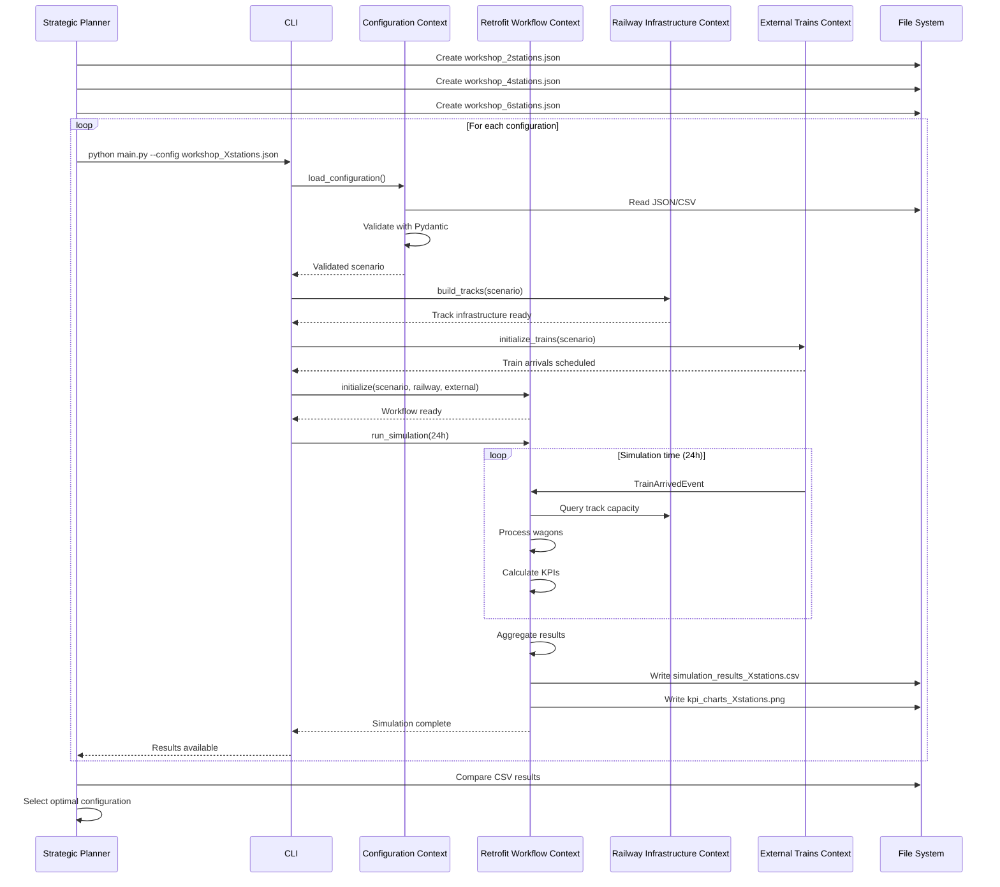
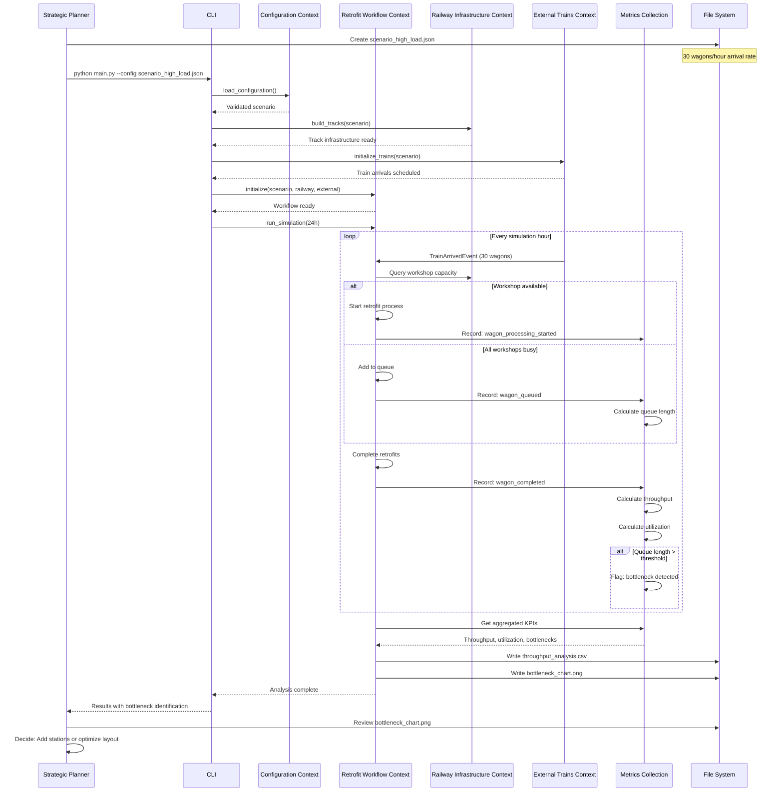
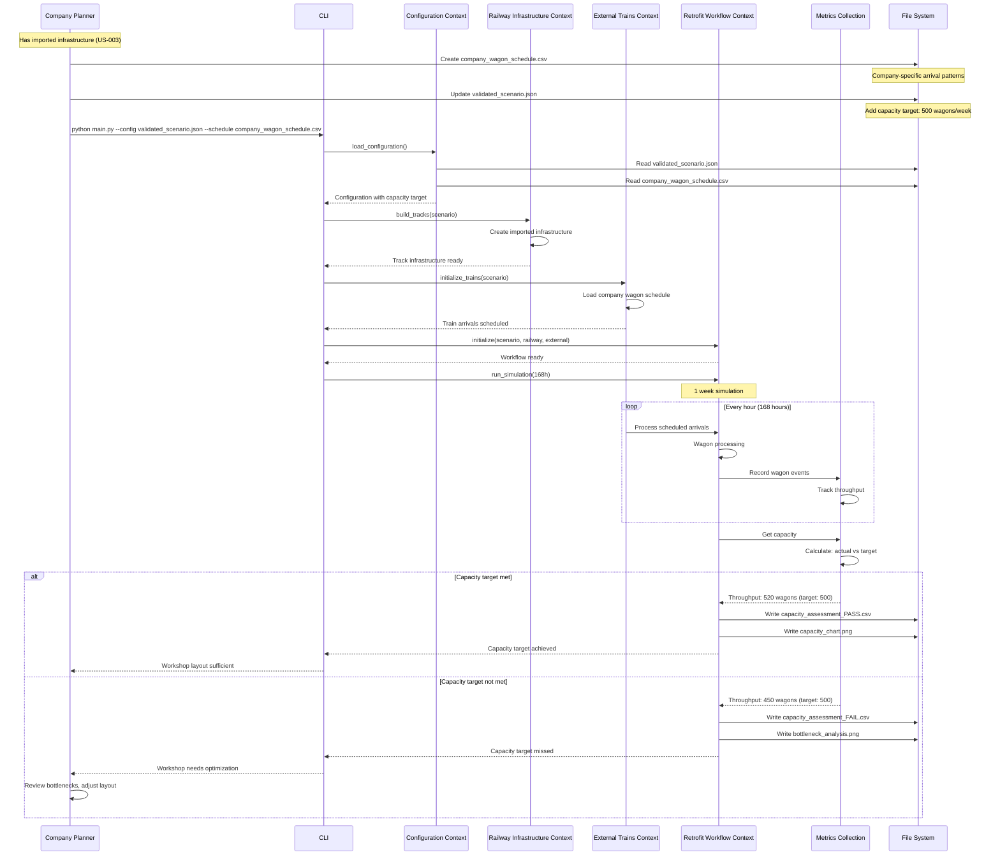
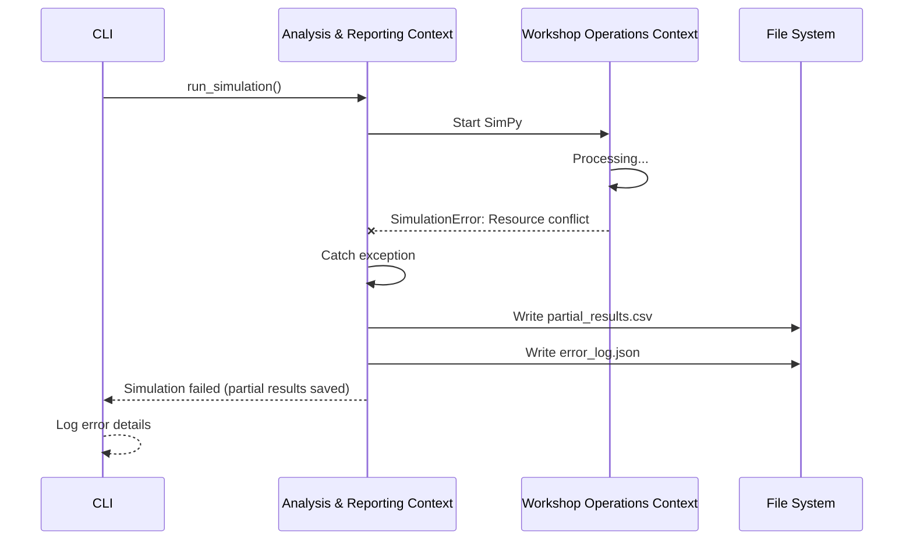

# 6. Runtime View (MVP)

## 6.1 Runtime Scenario: Develop Standardized Pop-Up Workshop (US-001)

**Use Case:** [US-001](../../requirements/use-cases.md#us-001) - Strategic Migration Planner develops standardized workshop designs

**Goal:** Test different workshop configurations to find optimal standardized design

### Scenario Description

Strategic planner creates multiple workshop configuration variants (2 stations, 4 stations, 6 stations) and runs simulations to compare throughput and identify optimal design.

### Runtime Interaction

### Key Runtime Aspects

| Aspect | Description | Quality Goal |
|--------|-------------|-------------|
| **Configuration Validation** | Pydantic validates workshop parameters before simulation starts | Reliability |
| **Iterative Testing** | Planner runs multiple configurations sequentially | Usability |
| **Real-time KPI Calculation** | Analysis Engine calculates metrics during simulation | Accuracy |
| **File-based Comparison** | Results exported to CSV for manual comparison | Simplicity |

### Performance Characteristics

> **Note:** Performance metrics will be measured during MVP implementation. Estimates are placeholders for architecture documentation.

---

## 6.2 Runtime Scenario: Estimate Workshop Throughput (US-002)

**Use Case:** [US-002](../../requirements/use-cases.md#us-002) - Strategic planner estimates throughput capacity

**Goal:** Determine maximum wagon throughput for a given workshop layout

### Scenario Description

Strategic planner runs simulation with increasing wagon arrival rates to find throughput limits and identify bottlenecks.

### Runtime Interaction

### Key Runtime Aspects

| Aspect | Description | Quality Goal |
|--------|-------------|-------------|
| **Real-time Bottleneck Detection** | Analysis Engine identifies bottlenecks during simulation | Accuracy |
| **Queue Monitoring** | Tracks queue length at each station | Reliability |
| **Utilization Tracking** | Calculates station utilization continuously | Accuracy |
| **Threshold-based Alerts** | Flags when queue exceeds acceptable limits | Usability |

### State Transitions: Wagon Processing

> **Note:** This needs to be updated since it does not reflect the process correctly.

### Performance Characteristics

> **Note:** Performance metrics will be measured during MVP implementation. Actual timing depends on hardware and simulation complexity.

---

## 6.3 Runtime Scenario: Import Infrastructure Data (US-003)

**Use Case:** [US-003](../../requirements/use-cases.md#us-003) - Company Planner imports existing infrastructure data

**Goal:** Import track topology and workshop layout from existing railway infrastructure data

### Scenario Description

Company planner has existing infrastructure data (track layouts, station locations) in CSV format and wants to import it into PopUpSim for capacity assessment.

### Runtime Interaction

### Key Runtime Aspects

| Aspect | Description | Quality Goal |
|--------|-------------|-------------|
| **CSV Parsing** | Flexible parsing of company-specific CSV formats | Usability |
| **Data Validation** | Validates infrastructure consistency (track connections, locations) | Reliability |
| **Error Reporting** | Clear feedback on data quality issues | Usability |
| **JSON Export** | Converts imported data to PopUpSim format | Accessibility |

### Data Validation Checks

**Infrastructure Consistency:**
- Track connections form valid network (no orphaned tracks)
- Workshop locations reference existing tracks
- Station capacities are positive integers
- Track lengths are positive values

**Business Rules:**
- At least one workshop station defined
- Track network is connected (no isolated segments)
- Workshop locations don't overlap

### Performance Characteristics

> **Note:** Import performance depends on infrastructure size. Will be measured during MVP implementation.

---

## 6.4 Runtime Scenario: Assess Planned Workshop Capacity (US-004)

**Use Case:** [US-004](../../requirements/use-cases.md#us-004) - Company Planner assesses capacity for planned workshop

**Goal:** Evaluate if planned workshop layout meets company's retrofit capacity requirements

### Scenario Description

Company planner has imported infrastructure data (US-003) and now runs simulation with company-specific wagon schedules to assess if planned workshop meets capacity targets.

### Runtime Interaction

### Key Runtime Aspects

| Aspect | Description | Quality Goal |
|--------|-------------|-------------|
| **Company-Specific Schedules** | Uses actual wagon arrival patterns from company data | Accuracy |
| **Capacity Target Comparison** | Compares simulation results against company requirements | Reliability |
| **Pass/Fail Assessment** | Clear indication if workshop meets capacity needs | Usability |
| **Bottleneck Identification** | Identifies specific constraints when target not met | Accuracy |

### Capacity Assessment Logic

### Performance Characteristics

> **Note:**  Performance will be measured during MVP implementation.

---

## 6.5 Error Scenarios

### 6.5.1 Invalid Configuration

**Trigger:** User provides configuration with multiple validation errors

**Key Behavior:**
- Pydantic collects ALL validation errors before reporting
- User sees complete list of issues in one summary
- Enables fixing all problems in single iteration

**Recovery:** User corrects all configuration errors based on comprehensive error summary

### 6.5.2 Simulation Failure

**Trigger:** Unexpected error during simulation execution

**Recovery:** Partial results saved for debugging, user can adjust configuration

## 6.6 Performance Considerations

> **Note:** Performance requirements and actual measurements will be determined during MVP implementation. The following aspects will be evaluated:

### Performance Aspects to Measure

| Aspect | Measurement Goal | Rationale |
|--------|------------------|----------|
| **Configuration Loading** | Time to load and validate JSON/CSV files | Affects user experience for iterative testing |
| **Domain Setup** | Time to create simulation entities | Impacts startup time |
| **Simulation Execution** | Time to run 24h simulation with varying wagon counts | Core performance metric |
| **Output Generation** | Time to create CSV files and charts | Affects result availability |

### Scalability Testing Plan

**Test scenarios to evaluate:**
- Small workshop (one Workshop with two retrofit stations, low wagon volume)
- Standard workshop (two workshops with three retrofit stations, medium wagon volume)
- High-load scenario (four workshops with three, high wagon volume)

**Success criteria:**
- Simulation completes without errors
- Results are accurate and reproducible
- User experience is acceptable for iterative testing (see Quality Goal 1: Rapid development)

---

