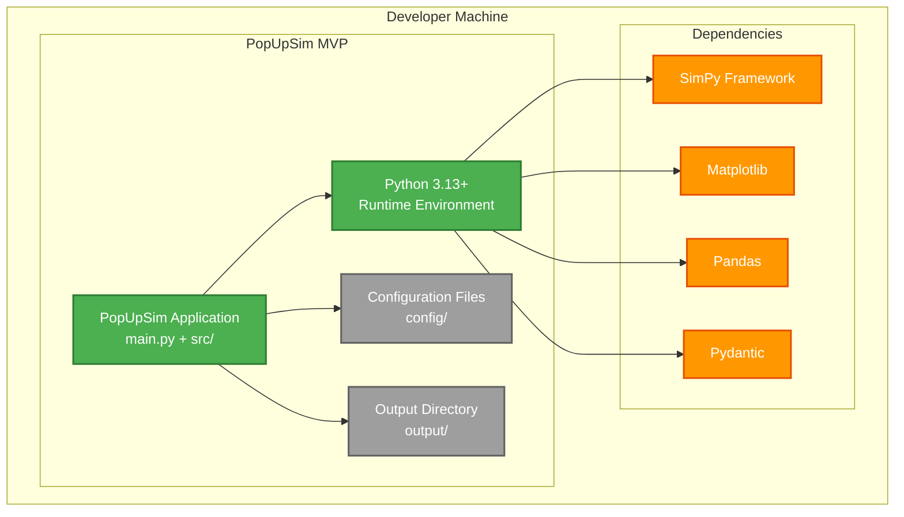
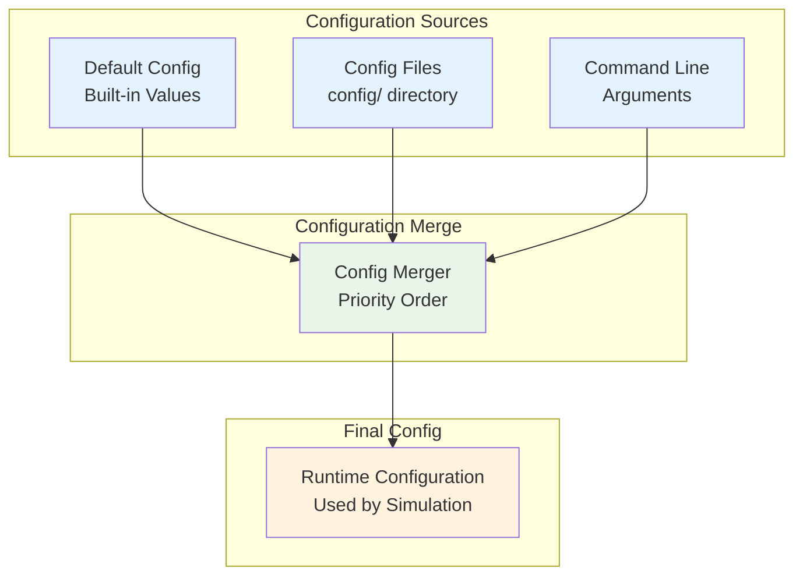
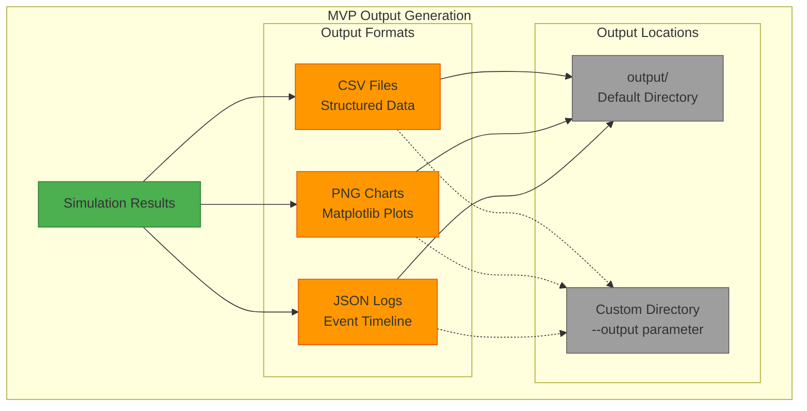
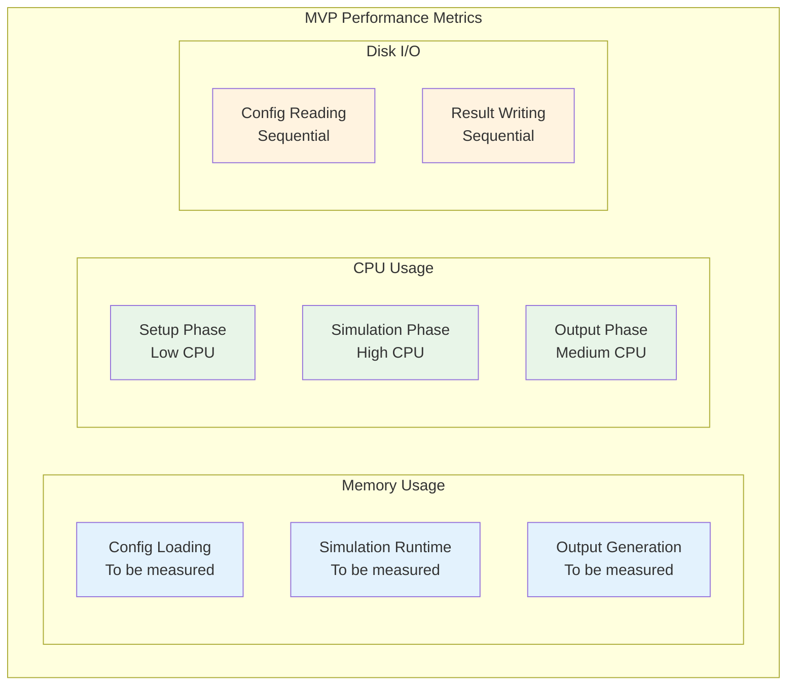
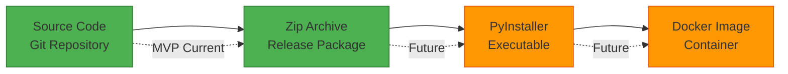

# 7. Deployment View (MVP)

## 7.1 Deployment Overview

### Desktop Application Architecture



## 7.2 Installation

### Setup Process

| Step | Command | Description |
|------|---------|-------------|
| **1. Python Setup** | `python --version` | Verify Python 3.13+ installed |
| **2. uv Installation** | `pip install uv` | Install uv package manager |
| **3. Dependencies** | `uv sync` | Install packages and create lock file |
| **4. Test Run** | `uv run python main.py --help` | Verify installation |

### Dependencies

**Core dependencies** are managed in `pyproject.toml`. Key requirements:

- **Python 3.13+** - Latest stable Python version (October 2024), provides improved type system and performance
- **SimPy 4.0.1+** - Discrete event simulation ([ADR MVP-001](09-architecture-decisions.md#adr-mvp-001-simpy-for-discrete-event-simulation))
- **Pydantic 2.0.0+** - Data validation ([ADR MVP-003](09-architecture-decisions.md#adr-mvp-003-pydantic-for-data-validation))
- **Matplotlib 3.7.0+** - Visualization ([ADR MVP-004](09-architecture-decisions.md#adr-mvp-004-matplotlib-for-visualization))
- **Pandas 2.0.0+** - CSV processing
- **NumPy 1.24.0+** - Numerical operations

**Development tools:**
- Ruff (formatting & linting)
- MyPy (type checking with `disallow_untyped_defs = true`)
- Pytest (unit testing)

**Optional dependencies:**
- MkDocs toolchain (documentation generation)

See `pyproject.toml` and [Section 7.10](#710-technology-stack-summary) for complete dependency list.

## 7.3 Directory Structure

### Current Project Structure

```
dac-migration-dss-popupsim/
├── popupsim/                   # Main Package
│   ├── backend/               # Backend Application
│   │   ├── src/               # Source Code
│   │   │   ├── configuration/ # Configuration Context
│   │   │   │   ├── __init__.py
│   │   │   │   ├── service.py         # Configuration service
│   │   │   │   ├── validation.py      # Pydantic validators
│   │   │   │   ├── model_scenario.py  # Scenario model
│   │   │   │   ├── model_workshop.py  # Workshop model
│   │   │   │   ├── model_track.py     # Track model
│   │   │   │   ├── model_route.py     # Route model
│   │   │   │   ├── model_routes.py    # Routes collection
│   │   │   │   ├── model_train.py     # Train model
│   │   │   │   └── model_wagon.py     # Wagon model
│   │   │   ├── simulation/        # Simulation Control Context
│   │   │   │   ├── __init__.py
│   │   │   │   ├── popupsim.py        # Main simulation orchestrator
│   │   │   │   └── sim_adapter.py     # SimPy adapter
│   │   │   ├── core/              # Core utilities
│   │   │   │   ├── __init__.py
│   │   │   │   └── i18n/              # Internationalization
│   │   │   ├── main.py            # Entry point
│   │   │   └── __init__.py
│   │   ├── tests/             # Unit Tests
│   │   │   ├── unit/          # Unit test modules
│   │   │   │   ├── test_model_*.py    # Model tests
│   │   │   │   ├── test_service.py    # Service tests
│   │   │   │   ├── test_validation.py # Validation tests
│   │   │   │   └── test_sim_*.py      # Simulation tests
│   │   │   ├── fixtures/      # Test fixtures
│   │   │   │   └── config/        # Test configuration files
│   │   │   └── conftest.py    # Pytest configuration
│   │   └── README.md          # Backend documentation
│   └── __init__.py
├── Data/                       # Example Data
│   ├── examples/              # Example scenarios
│   │   ├── small_scenario/
│   │   ├── medium_scenario/
│   │   └── large_scenario/
│   └── README.md
├── docs/                       # Documentation
│   ├── architecture/          # Full architecture docs
│   ├── mvp/                   # MVP architecture docs
│   │   ├── architecture/
│   │   └── development/
│   ├── requirements/          # Requirements & use cases
│   └── README.md
├── .github/                    # GitHub Configuration
│   ├── workflows/             # CI/CD workflows
│   │   ├── python-backend.yaml    # Backend CI
│   │   └── docs.yml               # Docs deployment
│   └── actions/               # Custom actions
├── setup/                      # Setup Scripts
│   └── dev/
│       └── set_commit_msg_hooks.py
├── pyproject.toml              # Project configuration
├── uv.lock                     # Dependency lock file
├── mkdocs.yml                  # Documentation config
├── README.md                   # Project README
├── LICENSE                     # Apache 2.0 License
└── CONTRIBUTING.md             # Contribution guidelines
```

### Building Block to Deployment Mapping

This table maps the bounded contexts from [Section 5](05-building-blocks.md) to their deployment locations:

| Building Block (Section 5) | Deployed As | Runtime Location | Process | Storage |
|----------------------------|-------------|------------------|---------|----------|
| **Configuration Context** | Python module | `popupsim/backend/src/configuration/` | Main process memory | N/A |
| └─ File Reader | Python class | `configuration/service.py` | Main process memory | N/A |
| └─ Data Parser | Python class | `configuration/service.py` | Main process memory | N/A |
| └─ Configuration Validator | Pydantic models | `configuration/validation.py` | Main process memory | N/A |
| └─ Domain Models | Pydantic classes | `configuration/model_*.py` | Main process memory | N/A |
| **Simulation Domain Context** | Python module | `popupsim/backend/src/domain/` (planned) | Main process memory | N/A |
| └─ Simulation Engine | Python class | `domain/service.py` (planned) | Main process memory | N/A |
| └─ Analysis Engine | Python class | `domain/analysis/` (planned) | Main process memory | N/A |
| └─ Domain Logic | Python classes | `domain/processes/` (planned) | Main process memory | N/A |
| └─ Domain Entities | Python classes | `domain/entities/` (planned) | Main process memory | N/A |
| **Simulation Control Context** | Python module | `popupsim/backend/src/simulation/` | Main process memory | N/A |
| └─ Simulation Orchestrator | Python class | `simulation/popupsim.py` | Main process memory | N/A |
| └─ KPI Aggregator | Python class | `simulation/popupsim.py` | Main process memory | N/A |
| └─ Output Formatter | Python class | `simulation/output/` (planned) | Main process memory | N/A |
| └─ Chart Generator | Python class | `simulation/output/` (planned) | Main process memory | N/A |
| **External Dependencies** | | | | |
| └─ SimPy Framework | Python library | Virtual environment | Main process memory | N/A |
| └─ Pydantic | Python library | Virtual environment | Main process memory | N/A |
| └─ Matplotlib | Python library | Virtual environment | Main process memory | N/A |
| **Data Artifacts** | | | | |
| └─ Configuration Files | JSON/CSV files | `Data/examples/` or custom path | N/A | File system |
| └─ Result Files | CSV/PNG/JSON | `output/` directory | N/A | File system |

**Key Observations:**
- All bounded contexts run in **single Python process** (desktop application)
- All components reside in **process memory** (no distributed deployment)
- Only **data artifacts** (config files, results) use **file system storage**
- **No database** - all state is transient or file-based
- **No network** - all communication is in-process method calls

### Planned Implementation

**To be implemented during MVP development:**

| Component | Status | Directory | Purpose |
|-----------|--------|-----------|----------|
| **Simulation Domain Context** | Planned | `popupsim/backend/src/domain/` | Core simulation logic |
| └─ Domain Entities | Planned | `domain/entities/` | Wagon, Track, Workshop, Route models |
| └─ SimPy Processes | Planned | `domain/processes/` | Discrete event simulation processes |
| └─ Analysis Engine | Planned | `domain/analysis/` | Real-time KPI calculation |
| └─ Domain Service | Planned | `domain/service.py` | Domain orchestration |
| **Output Generation** | Planned | `popupsim/backend/src/simulation/output/` | Result formatting |
| └─ CSV Exporter | Planned | `simulation/output/csv_exporter.py` | Export KPI data to CSV |
| └─ Chart Generator | Planned | `simulation/output/chart_generator.py` | Generate Matplotlib charts |
| └─ JSON Logger | Planned | `simulation/output/json_logger.py` | Export event timeline |
| **Output Directory** | Planned | `output/` (gitignored) | Generated simulation results |

## 7.4 Execution Environment

### Runtime Requirements

> **Note:** Resource requirements will be measured during MVP implementation with realistic scenarios. The following are known requirements:

| Component | Requirement | Notes |
|-----------|-------------|-------|
| **Python** | 3.13+ | Latest stable version (October 2024) |
| **OS** | Windows 10+, macOS 10.15+, Ubuntu 20.04+ | Cross-platform support |
| **RAM** | To be measured | Depends on scenario size (wagon count, simulation duration) |
| **CPU** | To be measured | Single-threaded SimPy execution |
| **Storage** | ~100 MB + results | Dependencies ~50 MB, code ~10 MB, results vary by scenario |

### Command Line Interface

```bash
# Basic execution
uv run python main.py

# With custom configuration
uv run python main.py --config custom_config/

# With custom output directory
uv run python main.py --output results/

# Import infrastructure data (US-003)
uv run python main.py --import-infra topology.csv workshop.csv

# Debug mode
uv run python main.py --debug --verbose

# Help
uv run python main.py --help
```

## 7.5 Configuration Management

### Configuration File Locations



### Configuration Priority

1. **Command Line Arguments** (Highest Priority)
2. **Config Files** (config/ directory)
3. **Default Values** (Built-in)

## 7.6 Output Management

### Result Files



## 7.7 Error Handling & Logging

### Logging Configuration

```python
# Logging Setup
import logging
from typing import NoReturn

logging.basicConfig(
    level=logging.INFO,
    format='%(asctime)s - %(name)s - %(levelname)s - %(message)s',
    handlers=[
        logging.FileHandler('output/simulation.log'),
        logging.StreamHandler()  # Console output
    ]
)
```

### Error Recovery Strategy

| Error Type | MVP Behavior | Recovery Action |
|------------|--------------|----------------|
| **Configuration Error** | Exit with comprehensive error summary | Fix all reported configuration issues |
| **Simulation Error** | Save partial results | Check system resources, adjust configuration |
| **Output Error** | Continue without failed output | Check file permissions |
| **Dependency Error** | Exit with installation instructions | Install missing packages with `uv sync` |

## 7.8 Performance Monitoring

### Resource Usage

> **Note:** Actual resource usage will be measured during MVP implementation. The following aspects will be monitored:



## 7.9 Distribution Strategy

### Packaging Options

| Option | Advantages | Disadvantages | Use Case |
|--------|-----------|---------------|----------|
| **Source Code** | Simple development, full control | Requires Python setup | Development team |
| **Zip Archive** | Easy distribution | Still requires Python | Internal testing |
| **PyInstaller** | Single executable file | Large file size | End users (future) |
| **Docker** | Consistent environment | Overhead | Cloud deployment (future) |

### Distribution Flow



---

## 7.10 Technology Stack Summary

### Core Technologies

| Technology | Version | Purpose | Decision Reference |
|------------|---------|---------|-------------------|
| **Python** | 3.13+ | Runtime environment | Latest stable version with improved type system |
| **uv** | Latest | Package manager | Fast, reliable dependency management |
| **SimPy** | 4.0.1+ | Discrete event simulation | [ADR MVP-001](09-architecture-decisions.md#adr-mvp-001-simpy-for-discrete-event-simulation) |
| **Pydantic** | 2.0.0+ | Data validation | [ADR MVP-003](09-architecture-decisions.md#adr-mvp-003-pydantic-for-data-validation) |
| **Matplotlib** | 3.7.0+ | Visualization | [ADR MVP-004](09-architecture-decisions.md#adr-mvp-004-matplotlib-for-visualization) |
| **Pandas** | 2.0.0+ | CSV processing | Data manipulation |
| **NumPy** | 1.24.0+ | Numerical operations | KPI calculations |

### Development Tools

| Tool | Purpose | Configuration |
|------|---------|---------------|
| **Ruff** | Formatting & linting | `pyproject.toml` |
| **MyPy** | Type checking | `disallow_untyped_defs = true` |
| **Pytest** | Unit testing | `tests/` directory |
| **MkDocs** | Documentation | Optional dependency group |

### Deployment Model

**MVP:** Desktop application (local execution)
- File-based configuration (JSON/CSV)
- File-based output (CSV/PNG/JSON)
- No network dependencies
- Single-user, single-threaded

**Future:** Web application (cloud-ready)
- Web interface
- Database storage
- Multi-user support
- Distributed execution

---

## 7.11 Quality Goals and Deployment

The MVP deployment model directly supports the quality goals defined in [Section 1.2](01-introduction-goals.md#12-quality-goals):

| Quality Goal | Deployment Decision | How It Supports | Trade-offs |
|--------------|-------------------|-----------------|------------|
| **Rapid Development** (Priority 1) | Desktop application, no server setup, local execution | Developers run simulations locally with immediate feedback, no deployment pipeline needed, fast iteration cycles | Limited to single user, no real-time collaboration, no shared simulation state |
| **Simulation Accuracy & Reliability** (Priority 2) | Single-threaded SimPy execution, deterministic event processing | Reproducible results, no race conditions, predictable behavior, easier debugging | Cannot leverage multi-core CPUs for parallel execution, slower for large scenarios |
| **Usability & Accessibility** (Priority 3) | File-based configuration (JSON/CSV), command-line interface, example scenarios in `Data/` | Familiar file formats, easy to edit with any text editor, version control friendly, no GUI learning curve | Requires text editor skills, no visual configuration, command-line knowledge needed |
| **Simple Installation** (Priority 4) | uv package manager, Python 3.13+ (latest stable), no database, no web server | One-command installation (`uv sync`), minimal dependencies, no infrastructure setup, works offline | Requires Python 3.13+ (latest stable) installed, command-line familiarity, no installer wizard |
| **Testability** (Priority 5) | Pytest in same environment, test fixtures in repository, CI/CD with GitHub Actions | Tests run in identical setup as production, fast feedback, easy to reproduce issues, automated testing | No separate test infrastructure, tests share same environment as development |

### Deployment Rationale

The desktop deployment model was chosen to maximize **rapid development** (Priority 1) and **simple installation** (Priority 4) for the MVP phase:

- **No infrastructure complexity** - Eliminates server setup, database configuration, and network dependencies
- **Fast feedback loops** - Developers can test changes immediately without deployment
- **Minimal barriers** - Strategic planners can run simulations with basic Python knowledge
- **Version control friendly** - All configuration is text-based and can be tracked in Git

**Future evolution:** The full version will add web interface and database storage while maintaining the core simulation engine developed in the MVP.

---

## 7.12 Deployment Scenarios

### Scenario 1: Developer Deployment

**User:** Software developer working on PopUpSim MVP

**Goal:** Set up development environment for implementing new features

**Prerequisites:**
- Git installed
- Python 3.13+ installed
- Text editor or IDE

**Deployment Steps:**

```bash
# 1. Clone repository
git clone https://github.com/open-rail-association/dac-migration-dss-popupsim.git
cd dac-migration-dss-popupsim

# 2. Install uv package manager
pip install uv

# 3. Install dependencies
uv sync

# 4. Run tests to verify setup
uv run pytest

# 5. Run simulation with example data
uv run python popupsim/backend/src/main.py --config Data/examples/small_scenario/

# 6. Set up pre-commit hooks (optional)
uv run python setup/dev/set_commit_msg_hooks.py
```

**Environment:**
- Full source code access
- Read/write permissions
- Can modify code and run tests
- CI/CD runs on push to GitHub

**Typical Workflow:**
1. Create feature branch
2. Implement changes with type hints
3. Run `uv run ruff format .` and `uv run mypy backend/src/`
4. Run `uv run pytest` to verify tests pass
5. Commit and push for CI/CD validation

---

### Scenario 2: Strategic Planner Deployment

**User:** Strategic Migration Planner testing standardized workshop designs (US-001, US-002)

**Goal:** Run simulations to compare different workshop configurations

**Prerequisites:**
- Python 3.13+ installed
- Basic command-line knowledge
- Received PopUpSim release package (zip archive)

**Deployment Steps:**

```bash
# 1. Extract release package
unzip popupsim-mvp-v0.1.0.zip
cd popupsim-mvp-v0.1.0

# 2. Install uv package manager
pip install uv

# 3. Install dependencies
uv sync

# 4. Verify installation
uv run python popupsim/backend/src/main.py --help

# 5. Run simulation with example scenario
uv run python popupsim/backend/src/main.py --config Data/examples/medium_scenario/

# 6. Review results
ls output/
# simulation_results.csv, kpi_charts.png, simulation_log.json
```

**Environment:**
- Read-only source code
- Can create custom configuration files
- Can run simulations with different parameters
- Results saved to `output/` directory

**Typical Workflow (US-001):**
1. Copy example scenario: `cp -r Data/examples/medium_scenario/ my_workshop_4stations/`
2. Edit `my_workshop_4stations/scenario.json` (change station count to 4)
3. Run simulation: `uv run python popupsim/backend/src/main.py --config my_workshop_4stations/`
4. Repeat for 2 stations and 6 stations
5. Compare results in `output/` directory
6. Select optimal configuration

---

### Scenario 3: Company Planner Deployment

**User:** Company Planner assessing capacity for planned workshop (US-003, US-004)

**Goal:** Import company infrastructure data and assess if workshop meets capacity targets

**Prerequisites:**
- Python 3.13+ installed
- Company infrastructure data (CSV files)
- Received PopUpSim release package

**Deployment Steps:**

```bash
# 1-3. Same as Strategic Planner (extract, install uv, uv sync)

# 4. Prepare company data
mkdir my_company_data
cp company_track_topology.csv my_company_data/topology.csv
cp company_workshop_layout.csv my_company_data/workshop.csv
cp company_train_schedule.csv my_company_data/schedule.csv

# 5. Import infrastructure data (US-003)
uv run python popupsim/backend/src/main.py --import-infra \
  my_company_data/topology.csv \
  my_company_data/workshop.csv

# 6. Run capacity assessment (US-004)
uv run python popupsim/backend/src/main.py \
  --config validated_scenario.json \
  --schedule my_company_data/schedule.csv

# 7. Review capacity assessment
cat output/capacity_assessment.csv
# Check if actual throughput >= target throughput
```

**Environment:**
- Read-only source code
- Company-specific data files
- Can import and validate infrastructure
- Results show pass/fail for capacity targets

**Typical Workflow (US-004):**
1. Import company infrastructure (US-003)
2. Set capacity target in scenario (e.g., 500 wagons/week)
3. Run week-long simulation (168 hours)
4. Review capacity assessment results
5. If target not met, analyze bottlenecks
6. Adjust workshop layout and re-run

---

### Deployment Comparison

| Aspect | Developer | Strategic Planner | Company Planner |
|--------|-----------|-------------------|----------------|
| **Source Access** | Full (read/write) | Read-only | Read-only |
| **Installation** | Git clone | Zip archive | Zip archive |
| **Data** | Example scenarios | Example + custom configs | Company infrastructure |
| **Typical Use Cases** | US-001, US-002, US-003, US-004 | US-001, US-002 | US-003, US-004 |
| **Output** | Test results + simulation | Simulation results | Capacity assessment |
| **Environment** | Development | Production-like | Production-like |
| **Updates** | Git pull | New zip release | New zip release |

---


