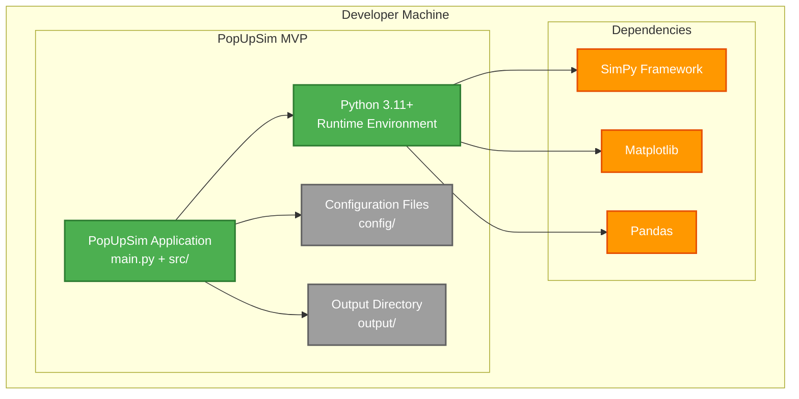
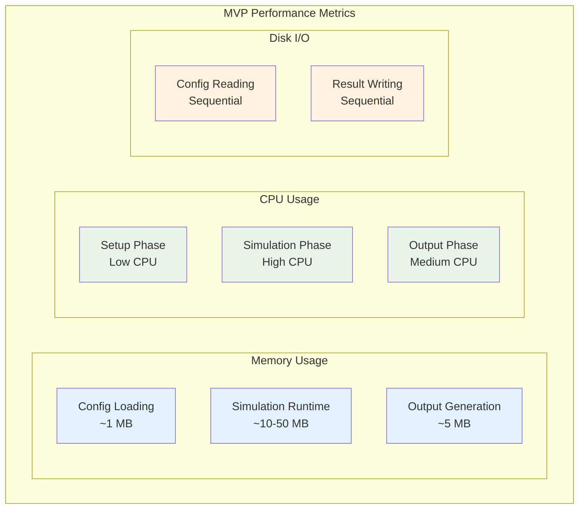

# 7. Verteilungssicht (MVP)

## 7.1 MVP Deployment-Überblick

### MVP Desktop Application



## 7.2 MVP Installation

### MVP Setup Process

| Schritt | Kommando | Beschreibung |
|---------|----------|--------------|
| **1. Python Setup** | `python --version` | Python 3.11+ erforderlich |
| **2. uv Installation** | `pip install uv` | uv Paketmanager installieren |
| **3. Dependencies** | `uv sync` | Pakete installieren und Lock-Datei erstellen |
| **4. Test Run** | `uv run python main.py --help` | Installation testen |

### MVP pyproject.toml

```toml
[project]
name = "popupsim-mvp"
version = "0.1.0"
requires-python = ">=3.11"
dependencies = [
    "simpy>=4.0.1",
    "matplotlib>=3.7.0",
    "pandas>=2.0.0",
    "pydantic>=2.0.0",
]

[build-system]
requires = ["hatchling"]
build-backend = "hatchling.build"
```

## 7.3 MVP Verzeichnisstruktur

### MVP File Layout

```
popupsim-mvp/
├── main.py                     # Entry Point
├── pyproject.toml              # uv Dependencies
├── uv.lock                     # uv Lock File
├── README.md                   # Setup Instructions
├── config/                     # Configuration Files
│   ├── scenario.json          # Simulation Parameters
│   ├── workshop_config.csv    # Workshop Setup
│   └── train_schedule.csv     # Train Schedule
├── src/                        # Source Code
│   ├── __init__.py
│   ├── configuration/         # Configuration Context
│   │   ├── __init__.py
│   │   ├── service.py
│   │   └── models.py
│   ├── workshop/              # Workshop Context
│   │   ├── __init__.py
│   │   ├── service.py
│   │   └── models.py
│   ├── simulation/            # Simulation Control Context
│   │   ├── __init__.py
│   │   ├── service.py
│   │   └── output.py
│   └── shared/                # Shared Utilities
│       ├── __init__.py
│       └── file_utils.py
├── output/                     # Generated Results
│   ├── simulation_results.csv
│   ├── kpi_charts.png
│   └── simulation_log.json
├── tests/                      # Unit Tests
│   ├── __init__.py
│   ├── test_configuration.py
│   ├── test_workshop.py
│   └── test_simulation.py
└── docs/                       # Documentation
    └── mvp_usage.md
```

## 7.4 MVP Execution Environment

### MVP Runtime Requirements

| Komponente | Minimum | Empfohlen | Zweck |
|------------|---------|-----------|-------|
| **Python** | 3.13 | 3.12 | Runtime Environment |
| **RAM** | 2 GB | 4 GB | Simulation Data |
| **CPU** | 2 Cores | 4 Cores | SimPy Processing |
| **Storage** | 500 MB | 1 GB | Code + Results |
| **OS** | Windows 10, macOS 10.15, Ubuntu 20.04 | Latest | Cross-Platform |

### MVP Command Line Interface

```bash
# Einfache Ausführung
uv run python main.py

# Mit benutzerdefinierter Konfiguration
uv run python main.py --config custom_config/

# Mit Ausgabeverzeichnis
uv run python main.py --output results/

# Debug-Modus
uv run python main.py --debug --verbose

# Hilfe
uv run python main.py --help
```

## 7.5 MVP Configuration Management

### MVP Config File Locations


### MVP Configuration Priority

1. **Command Line Arguments** (Highest Priority)
2. **Config Files** (config/ directory)
3. **Default Values** (Built-in)

## 7.6 MVP Output Management

### MVP Result Files


## 7.7 MVP Error Handling & Logging

### MVP Log Configuration

```python
# MVP Logging Setup
import logging

logging.basicConfig(
    level=logging.INFO,
    format='%(asctime)s - %(name)s - %(levelname)s - %(message)s',
    handlers=[
        logging.FileHandler('output/simulation.log'),
        logging.StreamHandler()  # Konsolenausgabe
    ]
)
```

### MVP Error Recovery

| Fehlertyp | MVP Verhalten | Wiederherstellungsaktion |
|-----------|---------------|-------------------------|
| **Konfigurationsfehler** | Beenden mit Fehlermeldung | Konfigurationsdateien korrigieren |
| **Simulationsfehler** | Teilergebnisse speichern | Systemressourcen prüfen |
| **Ausgabefehler** | Fortfahren ohne fehlgeschlagene Ausgabe | Berechtigungen prüfen |
| **Abhängigkeitsfehler** | Beenden mit Installationshilfe | Fehlende Pakete installieren |

## 7.8 MVP Performance Monitoring

### MVP Resource Usage



## 7.9 MVP Distribution Strategy

### MVP Packaging Options

| Option | Vorteile | Nachteile | Anwendungsfall |
|--------|----------|-----------|----------------|
| **Source Code** | Einfache Entwicklung, volle Kontrolle | Benötigt Python-Setup | Entwicklungsteam |
| **Zip-Archiv** | Einfache Verteilung | Benötigt noch Python | Internes Testen |
| **PyInstaller** | Einzelne ausführbare Datei | Große Dateigröße | Endbenutzer (Zukunft) |
| **Docker** | Konsistente Umgebung | Overhead | Cloud-Deployment (Zukunft) |

### MVP Distribution Flow


---

**Navigation:** [← MVP Laufzeitsicht](06-runtime.md) | [MVP Querschnittliche Konzepte →](08-concepts.md)
