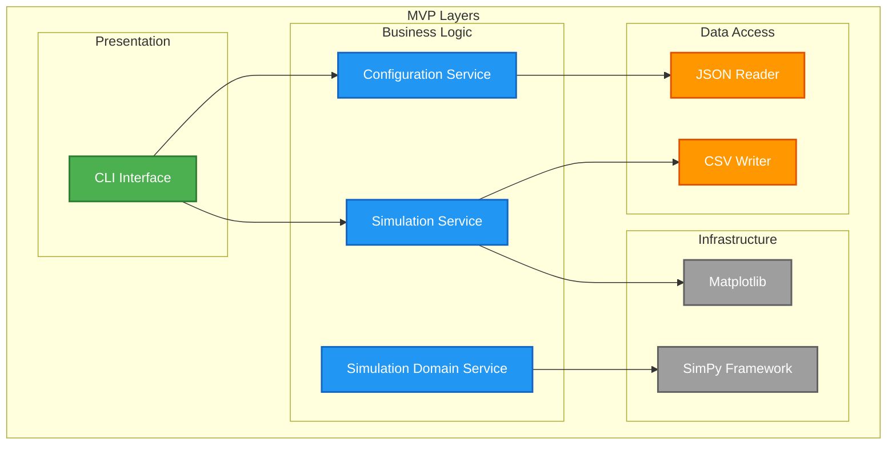
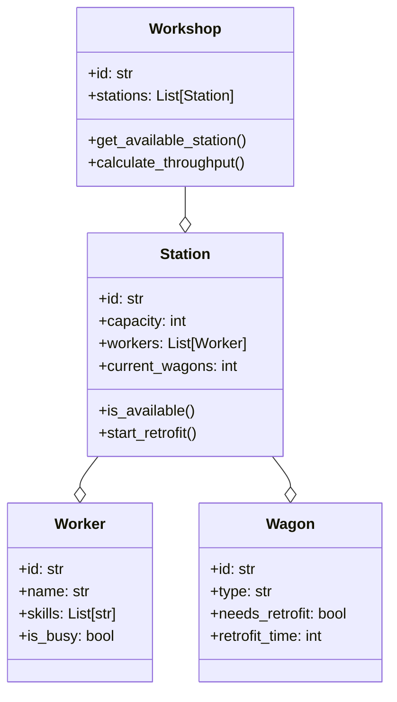
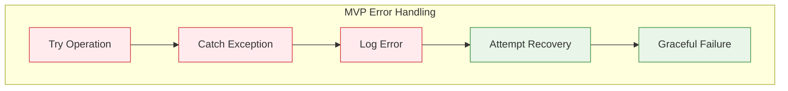
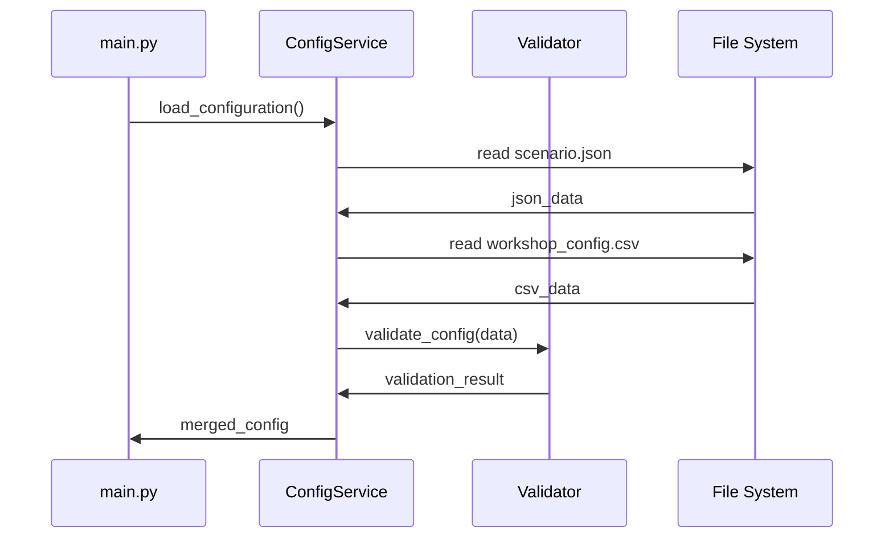
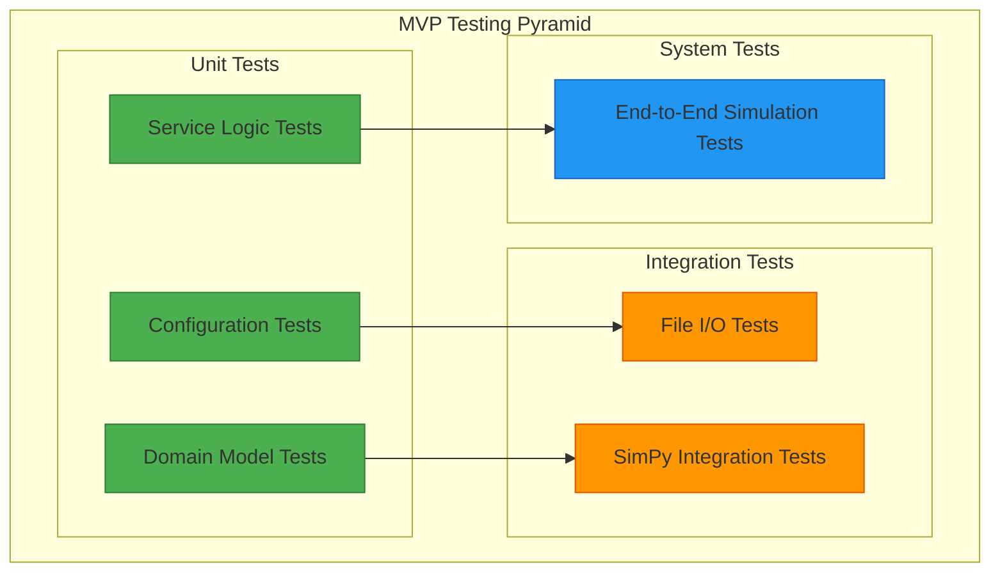

# 8. Cross-Cutting Concepts (MVP)

This section describes architectural concepts and patterns that apply across multiple building blocks. Code examples illustrate these concepts but are **not production code**.

## 8.1 Layered Architecture

**Note:** Each bounded context follows a layered architecture pattern ([ADR MVP-005](09-architecture-decisions.md#adr-mvp-005-layered-architecture)).

### Layer Structure (Applied to Each Context)



| Layer | Responsibility | Components |
|-------|----------------|------------|
| **Presentation** | User interaction, file I/O | CLI, File readers/writers |
| **Business Logic** | Domain logic, services | Configuration validator, Simulation engine, Orchestrator |
| **Domain** | Domain entities and models | Wagon, Track, Workshop, ScenarioConfig |
| **Infrastructure** | External frameworks | SimPy, Matplotlib, Pydantic, Pandas |

**Rationale:** Layered architecture provides clear separation of concerns within each bounded context, enabling rapid MVP development while maintaining code organization. See [Section 4.3](04-solution-strategy.md#43-technical-architecture-pattern) for architectural pattern decision.

---

## 8.2 Domain Model

> **WARNING:** Code examples in this section are **simplified illustrations for architecture documentation only**. They are **NOT production-ready** and lack:
> - Complete validation logic
> - Full type hints and error handling
> - Business rules and edge cases
> - Comprehensive docstrings
>
> **DO NOT copy-paste these examples into production code.**

### MVP Core Entities



### MVP Configuration Models

**Actual implementation:** `popupsim/backend/src/configuration/model_*.py`

```python
# SIMPLIFIED EXAMPLE - See actual files for complete implementation
from datetime import date
from pydantic import BaseModel, Field

class ScenarioConfig(BaseModel):
    """Configuration model for simulation scenarios."""
    scenario_id: str = Field(pattern=r'^[a-zA-Z0-9_-]+$', min_length=1, max_length=50)
    start_date: date
    end_date: date
    random_seed: int | None = Field(default=None, ge=0)  # Optional for reproducibility
    workshop: Workshop | None = None
    train_schedule_file: str
    routes_file: str | None = None
    workshop_tracks_file: str | None = None
    # ... additional fields and validators in actual implementation

class Workshop(BaseModel):
    """Workshop configuration with available tracks."""
    tracks: list[WorkshopTrack] = Field(min_length=1)
    # ... additional validators in actual implementation

class WorkshopTrack(BaseModel):
    """Individual track within workshop."""
    id: str
    function: TrackFunction
    capacity: int = Field(ge=1)
    retrofit_time_min: int = Field(ge=0)
    # ... additional fields in actual implementation
```

### MVP Result Models

```python
# SIMPLIFIED EXAMPLE - Actual structure to be defined during implementation
class SimulationResults(BaseModel):
    total_wagons_processed: int
    simulation_duration_hours: float
    throughput_per_hour: float
    average_waiting_time: float
    station_utilization: float
    # ... additional KPIs to be determined

class KPIData(BaseModel):
    timestamp: str
    throughput: float
    utilization: float
    queue_length: int
    waiting_time: float
    # ... additional metrics to be determined
```

## 8.3 Error Handling

Error handling strategy supports the quality goals defined in [Section 1.2](01-introduction-goals.md#12-quality-goals), particularly **Simulation Accuracy & Reliability** (Priority 2). See [Section 6](06-runtime.md) for error scenarios in runtime view.

### MVP Exception Hierarchy

```python
# CONCEPTUAL EXAMPLE - Illustrates exception hierarchy pattern
class PopUpSimError(Exception):
    """Base exception for PopUpSim MVP"""
    pass

class ConfigurationError(PopUpSimError):
    """Configuration loading/validation errors"""
    pass

class SimulationError(PopUpSimError):
    """Simulation runtime errors"""
    pass

class OutputError(PopUpSimError):
    """Output generation errors"""
    pass
```

### MVP Error Handling Strategy



## 8.4 Logging Concept

Logging configuration is defined in [Section 7.7](07-deployment.md#77-error-handling-logging).

### MVP Logging Levels

| Level | MVP Usage | Example |
|-------|-----------|----------|
| **DEBUG** | Detailed development info | SimPy event details |
| **INFO** | Normal program execution | "Simulation started" |
| **WARNING** | Potential problems | "High queue length detected" |
| **ERROR** | Errors with recovery | "Config file not found, using defaults" |
| **CRITICAL** | Severe errors | "Simulation failed completely" |

### MVP Log Format

```python
# CONCEPTUAL EXAMPLE - Illustrates logging pattern
LOG_FORMAT = '%(asctime)s - %(name)s - %(levelname)s - %(message)s'

# Example log output:
# 2025-10-15 10:00:00,123 - ConfigService - INFO - Loading scenario.json
# 2025-10-15 10:00:01,456 - WorkshopService - INFO - Created 4 stations
# 2025-10-15 10:00:02,789 - SimulationService - INFO - Starting simulation
# 2025-10-15 10:05:30,012 - SimulationService - WARNING - Queue length: 25
# 2025-10-15 10:10:45,345 - OutputService - INFO - Generated results.csv
```

## 8.5 Configuration Management

Configuration management supports **Usability & Accessibility** (Priority 3) through file-based configuration. See [Section 5.2](05-building-blocks.md#52-level-2-configuration-context) for Configuration Context details.

### MVP Configuration Loading



### MVP Configuration Validation

```python
# CONCEPTUAL EXAMPLE - Illustrates validation pattern
def validate_scenario_config(config: dict) -> List[str]:
    """MVP Configuration Validation"""
    errors = []

    # Basic validation rules
    if config.get('duration_hours', 0) <= 0:
        errors.append("Duration must be positive")

    if config.get('stations', 0) < 1:
        errors.append("At least one station required")

    if config.get('workers_per_station', 0) < 1:
        errors.append("At least one worker per station required")

    return errors
```

## 8.6 Testing Concept

Testing strategy supports **Testability** (Priority 5) quality goal. See [Section 7.10](07-deployment.md#710-technology-stack-summary) for testing tools (Pytest, MyPy, Ruff).

### MVP Test Strategy



### MVP Test Examples

```python
# CONCEPTUAL EXAMPLES - Illustrate testing patterns

# Unit Test Example
def test_workshop_station_availability():
    station = Station(id="WS001", capacity=2, workers=[], current_wagons=1)
    assert station.is_available() == True

    station.current_wagons = 2
    assert station.is_available() == False

# Integration Test Example
def test_configuration_loading():
    config_service = ConfigurationService()
    config = config_service.load_scenario("test_data/")
    assert config.duration_hours > 0
    assert len(config.workshop.stations) > 0
```

## 8.7 Performance Concept

Performance monitoring will measure actual resource usage during MVP implementation. See [Section 7.8](07-deployment.md#78-performance-monitoring) for performance metrics.

### MVP Performance Monitoring

```python
# CONCEPTUAL EXAMPLE - Illustrates performance monitoring pattern
import time
from functools import wraps
from typing import Any, Callable, TypeVar

T = TypeVar('T')

def measure_time(func: Callable[..., T]) -> Callable[..., T]:
    """MVP Performance Decorator"""
    @wraps(func)
    def wrapper(*args: Any, **kwargs: Any) -> T:
        start_time = time.time()
        result = func(*args, **kwargs)
        end_time = time.time()

        duration = end_time - start_time
        logging.info(f"{func.__name__} took {duration:.2f} seconds")

        return result
    return wrapper

# Usage
@measure_time
def run_simulation(duration_hours: int) -> None:
    # Simulation logic
    pass
```

### MVP Memory Management

```python
# CONCEPTUAL EXAMPLE - Illustrates memory monitoring pattern
import gc
import psutil
import os

def log_memory_usage(phase: str) -> None:
    """MVP Memory Monitoring"""
    process = psutil.Process(os.getpid())
    memory_mb = process.memory_info().rss / 1024 / 1024

    logging.info(f"Memory usage in {phase}: {memory_mb:.1f} MB")

    # Force garbage collection for MVP
    gc.collect()
```

## 8.8 Data Validation

Data validation uses Pydantic 2.0+ ([ADR MVP-003](09-architecture-decisions.md#adr-mvp-003-pydantic-for-data-validation)) to ensure **Simulation Accuracy & Reliability** (Priority 2).

### MVP Input Validation

```python
# CONCEPTUAL EXAMPLE - Illustrates Pydantic validation pattern
from pydantic import BaseModel, field_validator

class WorkshopStation(BaseModel):
    id: str
    capacity: int
    workers: int
    retrofit_time_min: int

    @field_validator('capacity')
    @classmethod
    def capacity_must_be_positive(cls, v: int) -> int:
        if v <= 0:
            raise ValueError('Capacity must be positive')
        return v

    @field_validator('retrofit_time_min')
    @classmethod
    def retrofit_time_reasonable(cls, v: int) -> int:
        if v < 10 or v > 300:
            raise ValueError('Retrofit time must be between 10-300 minutes')
        return v
```

### MVP Output Validation

```python
# CONCEPTUAL EXAMPLE - Illustrates result validation pattern
def validate_simulation_results(results: SimulationResults) -> bool:
    """MVP Result Validation"""

    # Plausibility checks for MVP
    if results.throughput_per_hour < 0:
        logging.error("Negative throughput detected")
        return False

    if results.station_utilization > 1.0:
        logging.warning("Station utilization > 100%")

    if results.total_wagons_processed == 0:
        logging.error("No wagons processed")
        return False

    return True
```

## 8.9 Security Concept

Security measures for MVP desktop application focus on input validation and safe file handling.

### MVP Security Considerations

| Area | MVP Measure | Rationale |
|------|-------------|------------|
| **Input Validation** | Pydantic Models | Prevents invalid data |
| **File Access** | Relative Paths Only | Prevents directory traversal |
| **Error Messages** | No system paths | Prevents information disclosure |
| **Logging** | No credentials | Prevents credential leakage |

### MVP File Security

```python
# CONCEPTUAL EXAMPLE - Illustrates path traversal prevention pattern
import os
from pathlib import Path

def safe_file_path(base_dir: str, filename: str) -> Path:
    """MVP Safe File Path Resolution"""
    base_path = Path(base_dir).resolve()
    file_path = (base_path / filename).resolve()

    # Ensure file is within base directory
    if not str(file_path).startswith(str(base_path)):
        raise ValueError(f"Invalid file path: {filename}")

    return file_path
```

---


