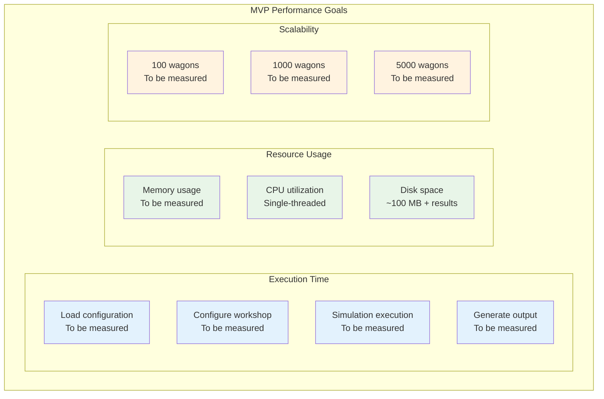
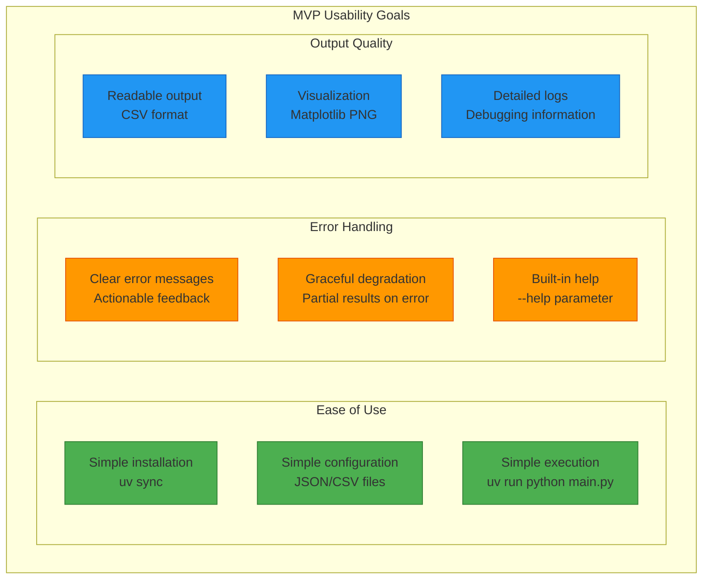
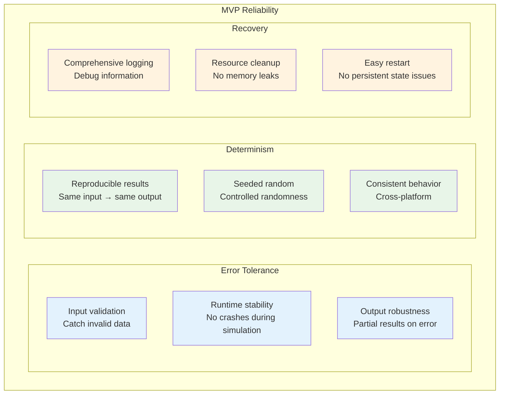
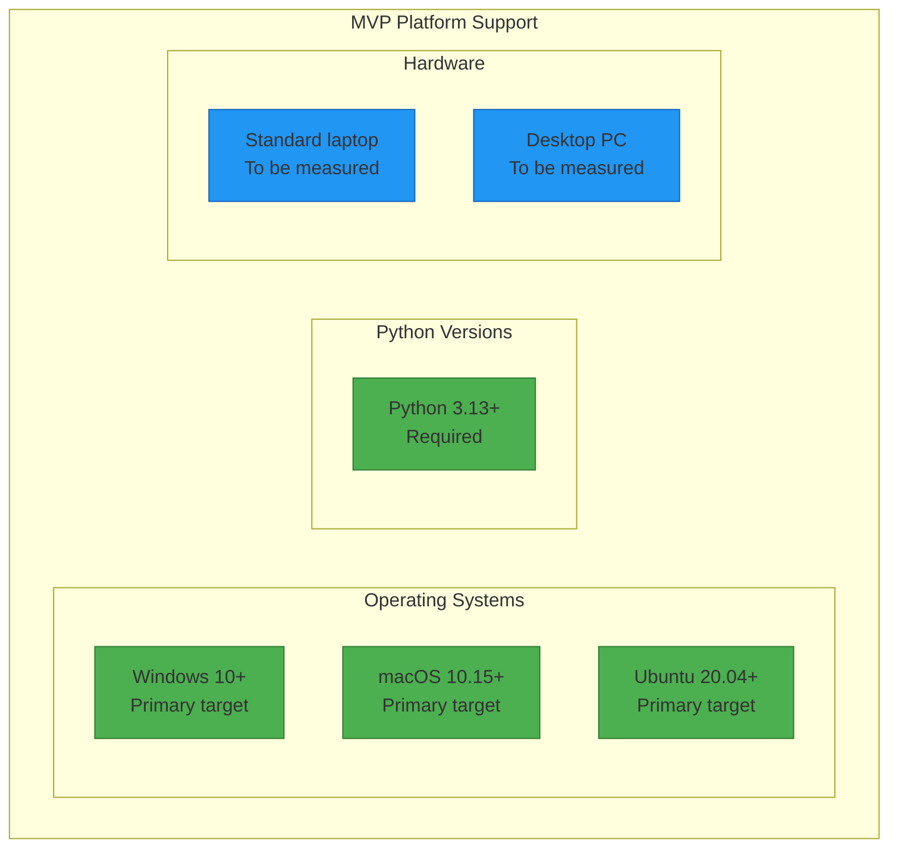
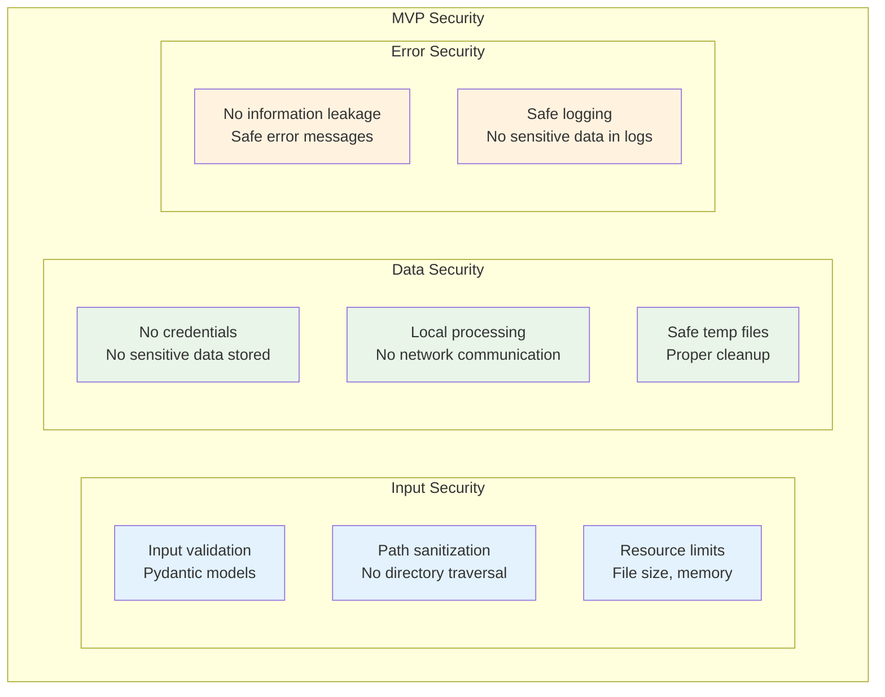
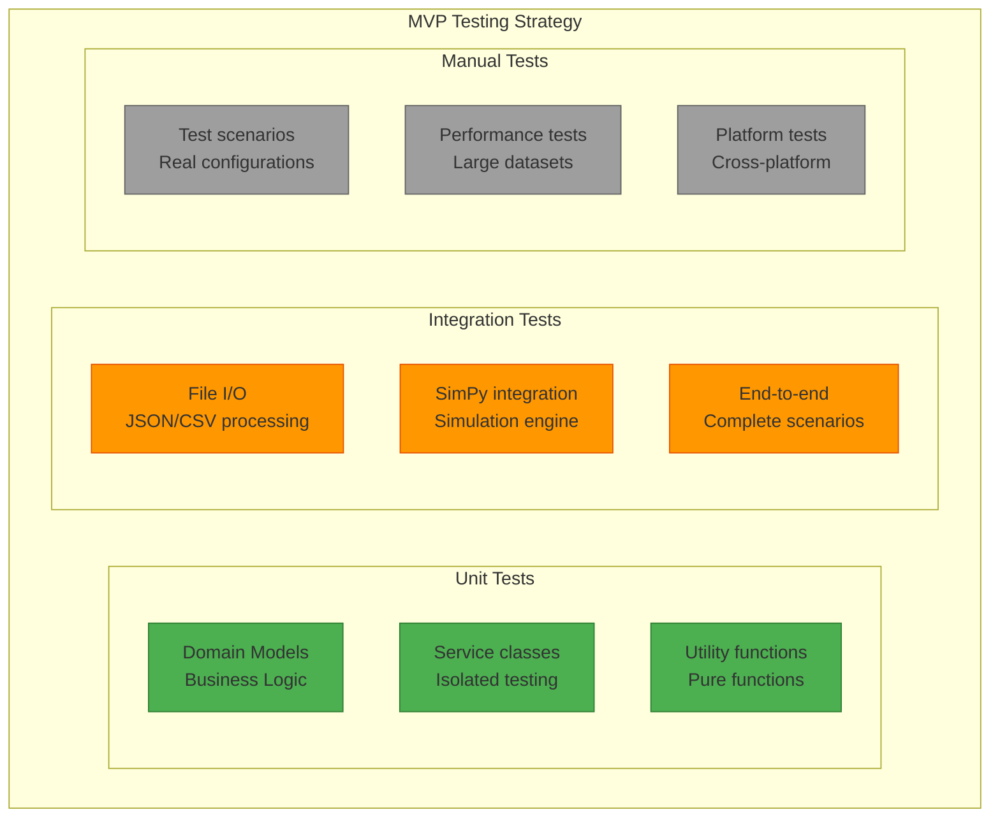

# 10. Quality Requirements (MVP)

## 10.1 MVP Quality Goals

Quality goals are defined in [Section 1.2](01-introduction-goals.md#12-quality-goals). This section details how they are measured and implemented.

### MVP Quality Priorities

| Priority | Quality Goal | MVP Scenario | Measurability |
|----------|--------------|--------------|---------------|
| **1** | **Rapid Development** | MVP deliverable in 5 weeks | Functional prototype |
| **2** | **Simulation Accuracy & Reliability** | Same inputs → identical results | Reproducible simulation runs |
| **3** | **Usability & Accessibility** | No complex installation | File-based configuration |
| **4** | **Simple Installation** | One-command setup | `uv sync` |
| **5** | **Testability** | Business logic isolated | Unit tests possible |

## 10.2 MVP Performance Requirements

> **Note:** Performance targets will be measured during MVP implementation. See [Section 7.8](07-deployment.md#78-performance-monitoring) for monitoring approach.

### MVP Performance Goals



### MVP Performance Measurements

| Metric | Measurement Method | Acceptance Criterion |
|--------|-------------------|---------------------|
| **Startup time** | `time python main.py --help` | To be measured on standard laptop |
| **Configuration loading** | Logging timestamps | JSON/CSV parsing |
| **Simulation speed** | SimPy profiling | Discrete event processing |
| **Memory usage** | `psutil` monitoring | To be measured |
| **Output generation** | File creation time | CSV + PNG generation |

## 10.3 MVP Usability Requirements

### MVP Usability Goals



### MVP Usability Criteria

| Aspect | MVP Requirement | Measurement Criterion |
|--------|----------------|----------------------|
| **Installation** | < 5 minutes setup | Documented steps |
| **Configuration** | Example files available | Template files in `Data/examples/` |
| **Execution** | One command starts simulation | `uv run python main.py` |
| **Error messages** | Understandable descriptions | Pydantic comprehensive error summary |
| **Help** | Integrated documentation | `--help` parameter |

## 10.4 MVP Reliability Requirements

### MVP Reliability Goals



### MVP Reliability Metrics

| Category | MVP Goal | Measurement Method |
|----------|----------|-------------------|
| **Crash rate** | < 1% with valid inputs | Automated tests |
| **Determinism** | 100% identical results | Repeated execution with same seed |
| **Error handling** | Graceful handling of all input errors | Negative tests |
| **Memory leaks** | No memory leaks | Memory profiling |

## 10.5 MVP Maintainability Requirements

### MVP Code Quality Standards

```python
# MVP Code Quality Standards
class CodeQualityMetrics:
    MAX_FUNCTION_LENGTH = 50      # Lines per function
    MAX_CLASS_LENGTH = 200        # Lines per class
    MAX_COMPLEXITY = 10           # Cyclomatic complexity
    MIN_TEST_COVERAGE = 70        # Percent
    MAX_DEPENDENCIES = 5          # Per module
```

### MVP Maintainability Metrics

| Aspect | MVP Goal | Measurement Method |
|--------|----------|-------------------|
| **Code coverage** | > 70% for business logic | pytest-cov |
| **Documentation** | All public APIs documented | Docstring coverage |
| **Complexity** | Cyclomatic complexity < 10 | radon |
| **Dependencies** | < 10 external packages | pyproject.toml |
| **Refactoring** | Easy extension possible | Architecture review |

## 10.6 MVP Portability Requirements

### MVP Platform Support



### MVP Portability Tests

| Platform | Test Status | Critical Features |
|----------|-------------|-------------------|
| **Windows 10+** | ✅ Primary | File paths, CSV encoding |
| **macOS 10.15+** | ✅ Primary | Path separators, matplotlib |
| **Ubuntu 20.04+** | ✅ Primary | Dependencies, file permissions |

## 10.7 MVP Security Requirements

### MVP Security Goals



### MVP Security Measures

| Area | MVP Measure | Implementation |
|------|-------------|----------------|
| **Input validation** | Pydantic models | Automatic type validation |
| **File access** | Relative paths only | Path sanitization |
| **Error handling** | Safe error messages | No system paths in errors |
| **Logging** | No sensitive data | Filtered logging |
| **Dependencies** | Known packages only | pyproject.toml with versions |

## 10.8 MVP Testability Requirements

### MVP Test Strategy



### MVP Test Metrics

| Test Type | MVP Goal | Automation |
|-----------|----------|------------|
| **Unit tests** | > 80% coverage | ✅ pytest |
| **Integration tests** | All main paths | ✅ pytest |
| **Performance tests** | Benchmark scenarios | ⚠️ Manual |
| **Platform tests** | Windows + Linux + macOS | ⚠️ Manual (can be automated via GitHub Actions matrix) |

---


