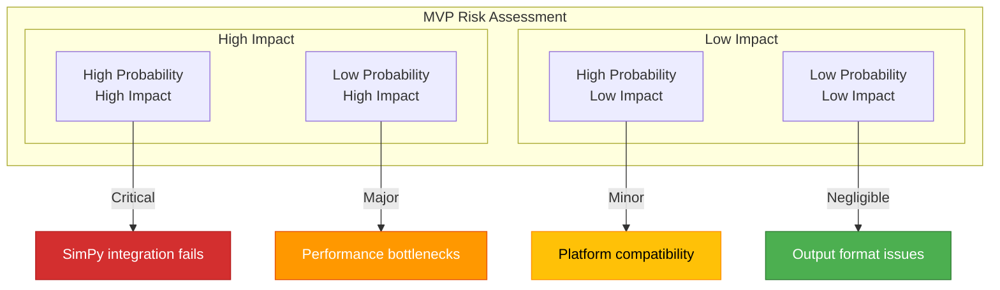
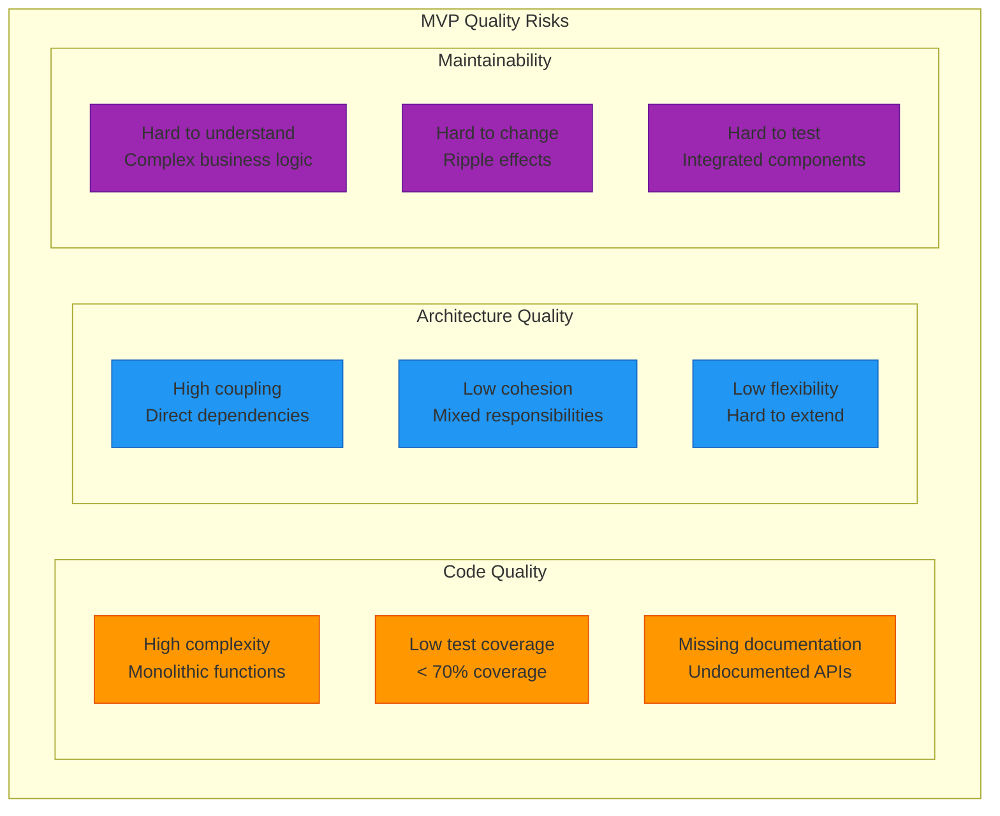
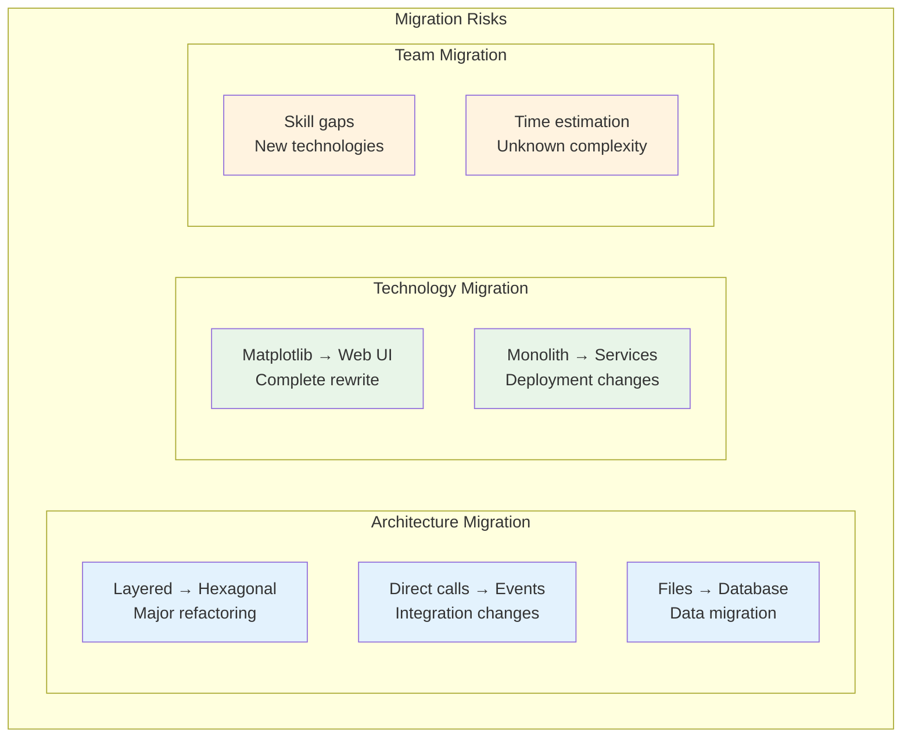
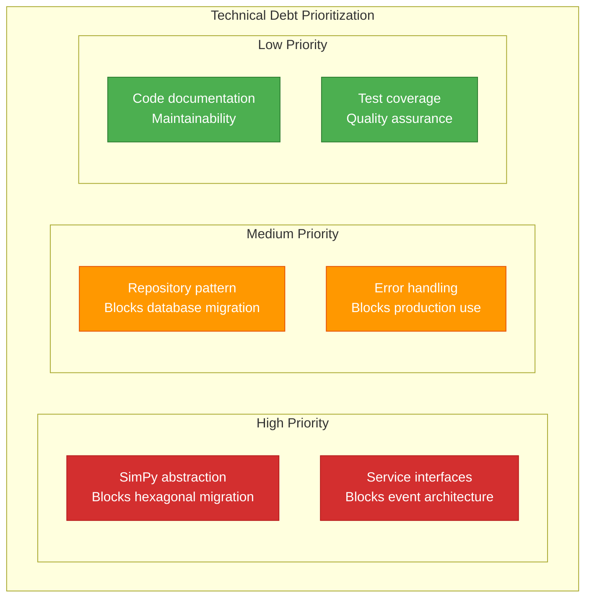

# 11. Risks and Technical Debt (MVP)

## 11.1 MVP Risk Overview

### MVP Risk Matrix



## 11.2 MVP Technical Risks

### Risk 1: SimPy Integration Complexity

| Aspect | Details |
|--------|----------|
| **Description** | Direct SimPy integration could become too complex |
| **Probability** | Medium (40%) |
| **Impact** | High - Simulation doesn't work |
| **Symptoms** | Unexpected SimPy behavior, hard-to-debug processes |

**Mitigation:**
- ✅ **Simple SimPy processes**: Use only basic events
- ✅ **Early prototyping**: Implement SimPy integration first (validated in 3-Länderhack POC)
- ✅ **Documentation**: Document SimPy patterns
- ✅ **Team expertise**: Leverage POC experience from hackathon

### Risk 2: Performance Issues with Larger Scenarios

| Aspect | Details |
|--------|----------|
| **Description** | MVP could become too slow with > 1000 wagons |
| **Probability** | Medium (30%) |
| **Impact** | Medium - Limited scenario size |
| **Symptoms** | Long execution times, high memory usage |

**Mitigation:**
- ✅ **Profiling**: Early performance measurements
- ✅ **Optimization**: Algorithm improvements
- ✅ **Limits**: Define accepted scenario sizes
- ✅ **Monitoring**: Memory/CPU monitoring

### Risk 3: Schedule Overrun

| Aspect | Details |
|--------|----------|
| **Description** | 5-week development time might not be sufficient |
| **Probability** | High (60%) |
| **Impact** | High - MVP goals not achieved |
| **Symptoms** | Milestone delays, unfinished features |

**Mitigation:**
- ✅ **Scope reduction**: Cut additional features if necessary
- ✅ **Parallel development**: Optimize team coordination
- ✅ **Weekly reviews**: Early risk detection
- ✅ **Minimum MVP**: Define absolutely minimal functionality

## 11.3 MVP Technical Debt

### Debt 1: Direct Framework Dependencies

```python
# MVP: Direct SimPy usage (Technical Debt)
import simpy

class WorkshopService:
    def __init__(self):
        self.env = simpy.Environment()  # Direct dependency

    def run_process(self):
        self.env.process(self.retrofit_process())  # Tight coupling

# Future: Abstracted interface
class WorkshopService:
    def __init__(self, simulation_engine: SimulationEnginePort):
        self._sim_engine = simulation_engine  # Dependency injection
```

**Debt Details:**
- **Type**: Architecture debt
- **Priority**: High
- **Effort**: Estimated 2-3 days refactoring (to be validated)
- **Created by**: [ADR MVP-001](09-architecture-decisions.md#adr-mvp-001-simpy-for-discrete-event-simulation) (SimPy decision)
- **Full version solution**: Hexagonal architecture with ports

### Debt 2: Missing Event Architecture

```python
# MVP: Direct service calls (Technical Debt)
class SimulationService:
    def run(self):
        config = self.config_service.load()  # Direct call
        workshop = self.workshop_service.setup(config)  # Direct call
        results = self.workshop_service.run(workshop)  # Direct call

# Future: Event-driven
class SimulationService:
    def run(self):
        self.event_bus.publish(ConfigurationRequested())
        # Asynchronous event handling
```

**Debt Details:**
- **Type**: Integration debt
- **Priority**: Medium
- **Effort**: Estimated 1-2 weeks refactoring (to be validated)
- **Created by**: [ADR MVP-007](09-architecture-decisions.md#adr-mvp-007-direct-method-calls-between-contexts) (Direct calls decision)
- **Full version solution**: Event-driven architecture

### Debt 3: File-Based Persistence

```python
# MVP: File-based storage (Technical Debt)
class ConfigurationService:
    def load_scenario(self, path: str):
        with open(f"{path}/scenario.json") as f:  # Direct file access
            return json.load(f)

# Future: Repository pattern
class ConfigurationService:
    def __init__(self, repo: ConfigurationRepository):
        self._repo = repo  # Abstracted storage

    def load_scenario(self, id: str):
        return self._repo.find_by_id(id)  # Storage-agnostic
```

**Debt Details:**
- **Type**: Persistence debt
- **Priority**: Low
- **Effort**: Estimated 3-5 days refactoring (to be validated)
- **Created by**: [ADR MVP-002](09-architecture-decisions.md#adr-mvp-002-file-based-data-storage) (File storage decision)
- **Full version solution**: Database + Repository pattern

## 11.4 MVP Quality Risks

### Code Quality Risks



### Quality Metrics Monitoring

| Metric | MVP Goal | Current Status | Risk |
|--------|----------|----------------|------|
| **Cyclomatic complexity** | < 10 | TBD | Medium |
| **Test coverage** | > 70% | TBD | High |
| **Documentation coverage** | > 80% | TBD | Low |
| **Number of dependencies** | < 10 | 7 | Low |

## 11.5 MVP Migration Risks

### Migration to Full Version



### Migration Effort Estimation

> **Note:** Effort estimates are preliminary and will be refined during MVP implementation based on actual complexity.

| Migration | Estimated Effort | Risk | Mitigation |
|-----------|-----------------|------|------------|
| **Layered → Hexagonal** | 2-3 weeks | High | Interface preparation |
| **Direct → Event-driven** | 1-2 weeks | Medium | Define event interfaces |
| **Files → Database** | 3-5 days | Low | Repository pattern |
| **Matplotlib → Web** | 4-6 weeks | High | Prepare JSON API |

## 11.6 MVP Risk Mitigation

### Risk Monitoring

```python
# MVP Risk Monitoring
class RiskMonitor:
    def check_performance_risk(self, execution_time: float):
        if execution_time > 60:  # seconds
            logging.warning(f"Performance risk: {execution_time}s execution")

    def check_memory_risk(self, memory_mb: float):
        if memory_mb > 100:  # MB
            logging.warning(f"Memory risk: {memory_mb}MB usage")

    def check_complexity_risk(self, function_lines: int):
        if function_lines > 50:
            logging.warning(f"Complexity risk: {function_lines} lines")
```

### Continuous Risk Assessment

| Week | Risk Review | Actions |
|------|-------------|----------|
| **Week 1** | SimPy integration | Create prototype |
| **Week 2** | Performance tests | Initial benchmarks |
| **Week 3** | Code quality | Refactoring if needed |
| **Week 4** | Migration preparation | Interface preparation |
| **Week 5** | Final review | Document debt |

## 11.7 MVP Debt Repayment

### Debt Prioritization



### Debt Repayment Plan

> **Note:** Effort estimates are preliminary and will be refined after MVP completion based on actual codebase complexity.

| Phase | Debt | Estimated Effort | Benefit |
|-------|------|-----------------|----------|
| **Post-MVP** | SimPy abstraction | ~3 days | Hexagonal architecture possible |
| **Pre-Full** | Service interfaces | ~5 days | Event-driven architecture possible |
| **Full-Dev** | Repository pattern | ~3 days | Database integration possible |
| **Production** | Error handling | ~2 days | Production readiness |

---


