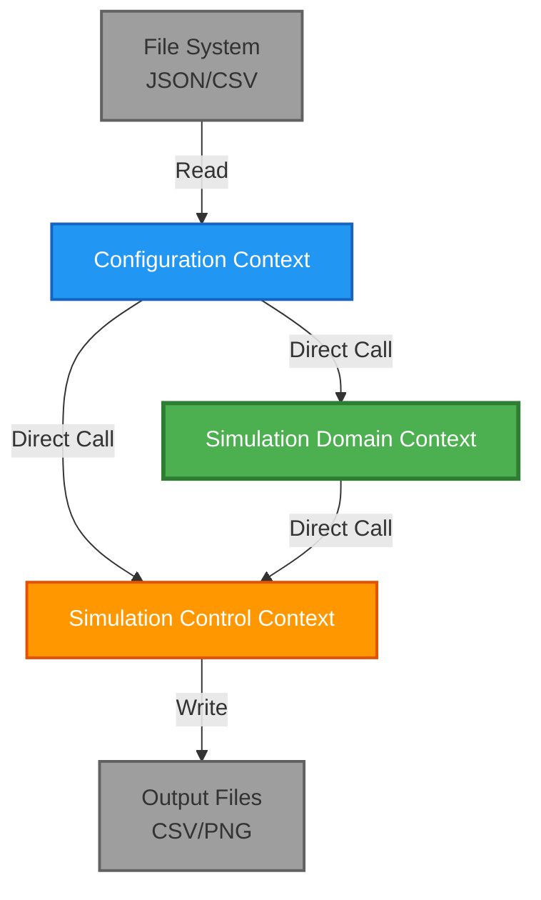
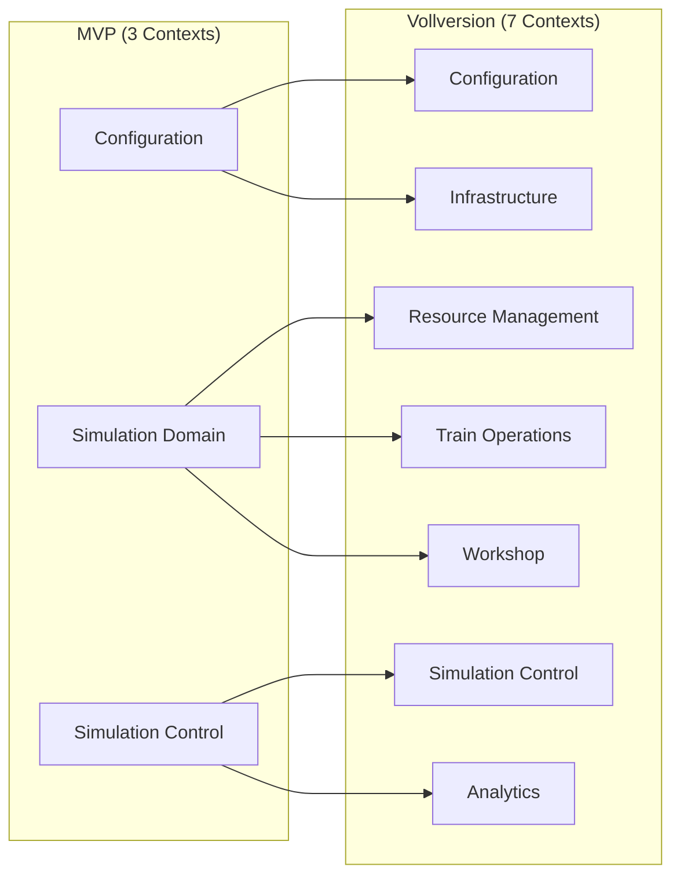

# PopUpSim MVP - Context Map

## Übersicht

Die PopUpSim MVP-Version besteht aus **3 Bounded Contexts** für schnelle Prototypenerstellung (4-5 Wochen Entwicklungszeit).

## MVP Context Map Diagramm



## MVP Context Relationships

### **Core Domain** (Geschäftskritisch)

#### **Simulation Domain Context**
- **DDD-Klassifikation**: Core Domain
- **Rolle**: Kern-Geschäftslogik
- **Verantwortung**:
  - DAK-Umrüstungsprozesse (Workshop-Operationen)
  - Zugbewegungen und Rangieroperationen (Train Operations)
  - Infrastruktur (Gleise, Weichen, Topologie)
  - Ressourcenverwaltung (Lokomotiven, Personal)
  - SimPy-Integration für gesamte Simulation
- **Abhängigkeiten**: Configuration Context (für Setup-Daten)
- **Integration**: Direkte Service-Aufrufe
- **SimPy**: Domain Processes, Event Scheduling, Resource Management
- **Vereinfachung**: Kombiniert Workshop + Train Operations + Resource Management + Infrastructure aus Vollversion

### **Supporting Subdomain** (Notwendig)

#### **Configuration Context**
- **DDD-Klassifikation**: Supporting Subdomain
- **Rolle**: Gateway & Validation Context
- **Verantwortung**:
  - JSON/CSV Import
  - Datenvalidierung (syntaktisch + fachlich)
  - Szenario-Setup
- **Kunden**: Workshop Context, Simulation Control Context
- **Integration**: Direkte Service-Aufrufe, Pydantic Models
- **Validierung**: Eingabedaten-Konsistenz, Plausibilitätsprüfungen
- **Vereinfachung**: Kombiniert Configuration + Infrastructure aus Vollversion

### **Generic Subdomain** (Standard)

#### **Simulation Control Context**
- **DDD-Klassifikation**: Generic Subdomain
- **Rolle**: Orchestrator & Output Generator
- **Verantwortung**:
  - SimPy Environment Management
  - Orchestrierung der Simulation
  - KPI-Berechnung
  - Matplotlib-Visualisierung
  - CSV-Export
- **Abhängigkeiten**: Configuration Context, Workshop Context
- **Integration**: Direkte Service-Aufrufe
- **SimPy**: Environment, Process Orchestration, Time Management
- **Vereinfachung**: Kombiniert Simulation Control + Analytics aus Vollversion

## DDD Context Map Patterns (MVP)

### **1. Customer/Supplier Development** ✅
**Angewendet zwischen**: Configuration → Simulation Domain, Configuration → Simulation Control
- **Upstream**: Configuration Context
- **Downstream**: Simulation Domain Context, Simulation Control Context
- **Implementierung**: Direkte Python-Methodenaufrufe
- **Charakteristik**: Configuration stellt Setup-Daten bereit

### **2. Conformist** ✅
**Angewendet zwischen**: Simulation Domain → Configuration
- **Downstream**: Simulation Domain Context
- **Upstream**: Configuration Context
- **Charakteristik**: Simulation Domain akzeptiert Configuration-Modelle ohne Anpassung
- **Grund**: Einfachheit für MVP

### **3. Published Language** ✅
**Angewendet für**: Pydantic Models als gemeinsame Datenstrukturen
- **Sprache**: Pydantic-basierte DTOs
- **Bereiche**: ScenarioConfig, WorkshopConfig, SimulationResults
- **Format**: Type-safe Python Dataclasses

### **Nicht angewendete Patterns (MVP):**
- **Anti-Corruption Layer**: Zu komplex für MVP
- **Open Host Service**: Keine externen Consumer
- **Separate Ways**: Monolithische Architektur
- **Partnership**: Keine gegenseitigen Abhängigkeiten
- **Shared Kernel**: Vermieden zugunsten klarer Grenzen

## Team-Beziehungen (3 Entwickler)

### **Team Structure & Responsibilities**

#### **Developer 1: Configuration Team**
**Verantwortung**: Configuration Context
- **Team-Beziehung**: **Upstream** (andere abhängig)
- **Zeitkritisch**: Muss zuerst fertig werden
- **Deliverables**:
  - JSON/CSV Reader
  - Pydantic Models
  - Validierungslogik
  - File I/O Utilities

#### **Developer 2: Core Simulation Team**
**Verantwortung**: Simulation Domain Context
- **Team-Beziehung**: **Downstream** von Dev 1, **Upstream** von Dev 3
- **Kern-Rolle**: SimPy-Integration und Geschäftslogik
- **Deliverables**:
  - Domain Models (Wagon, Loco, Track, Workshop)
  - SimPy Processes
  - Umrüstungslogik
  - Zugbewegungen
  - Ressourcenverwaltung

#### **Developer 3: Control & Output Team**
**Verantwortung**: Simulation Control Context
- **Team-Beziehung**: **Downstream** (abhängig von beiden)
- **Spezialisierung**: Orchestrierung und Visualisierung
- **Deliverables**:
  - SimPy Environment Management
  - KPI-Berechnung
  - Matplotlib Charts
  - CSV Export

### **Koordinations-Matrix**

| Team Pair | Beziehung | Koordinationsaufwand | Kritische Interfaces |
|-----------|-----------|---------------------|---------------------|
| Dev 1 ↔ Dev 2 | Upstream/Downstream | Hoch | Pydantic Models, Configuration DTOs |
| Dev 2 ↔ Dev 3 | Upstream/Downstream | Mittel | SimPy State, Simulation Results |
| Dev 1 ↔ Dev 3 | Upstream/Downstream | Niedrig | Configuration DTOs |

### **Entwicklungsreihenfolge**

#### **Woche 1-2: Foundation (Dev 1 führt)**
- **Dev 1**: Configuration Context (JSON/CSV Import, Validation)
- **Dev 2**: Simulation Domain Models, SimPy Setup
- **Dev 3**: Simulation Control Framework, Output-Design

#### **Woche 2-3: Core Implementation (Dev 2 führt)**
- **Dev 1**: Configuration finalisieren, Test-Daten
- **Dev 2**: Simulation Domain Context, SimPy Integration
- **Dev 3**: KPI-Berechnung, Matplotlib Setup

#### **Woche 3-4: Integration (Dev 3 führt)**
- **Dev 1**: Validierung erweitern
- **Dev 2**: Domain-Logik finalisieren
- **Dev 3**: Orchestrierung, Output-Generierung

#### **Woche 4-5: Testing & Polish (Alle parallel)**
- **Alle**: Integration Testing, Bug Fixes, Dokumentation

## Integration Patterns (MVP)

### **Direkte Service-Aufrufe**
```python
# Configuration → Simulation Domain
class SimulationDomainService:
    def __init__(self, config_service: ConfigurationService):
        self._config = config_service

    def setup_domain(self):
        scenario = self._config.load_scenario()  # Direkter Aufruf
        return self._create_domain(scenario)

# Simulation Domain → Simulation Control
class SimulationService:
    def __init__(self, domain_service: SimulationDomainService):
        self._domain = domain_service

    def run_simulation(self):
        domain = self._domain.setup_domain()  # Direkter Aufruf
        return self._execute_simulation(domain)
```

### **Pydantic Models als Shared Language**
```python
from pydantic import BaseModel

class ScenarioConfig(BaseModel):
    duration_hours: int
    random_seed: int

class WorkshopConfig(BaseModel):
    stations: int
    workers_per_station: int
    retrofit_time_minutes: int

class SimulationResults(BaseModel):
    total_wagons_processed: int
    throughput_per_hour: float
    average_waiting_time: float
```

## Context Boundaries (MVP)

### **Fachliche Abgrenzung**

#### **Configuration Context**
- **Innerhalb**: JSON/CSV Import, Datenvalidierung, Szenario-Setup
- **Außerhalb**: Geschäftslogik, Simulation, Visualisierung

#### **Simulation Domain Context**
- **Innerhalb**: DAK-Umrüstung, Zugbewegungen, Infrastruktur, Ressourcen, SimPy Processes
- **Außerhalb**: Datenimport, Orchestrierung, Output-Generierung

#### **Simulation Control Context**
- **Innerhalb**: SimPy Environment, Orchestrierung, KPI-Berechnung, Output
- **Außerhalb**: Geschäftslogik, Datenimport

### **Technische Abgrenzung**
- **Separate Python-Module** pro Context
- **Eigene Domain Models** und Services
- **Direkte Methodenaufrufe** (keine APIs)
- **Dateibasierte Persistierung** (CSV/JSON)
- **Keine Datenbank** erforderlich

## Vereinfachungen gegenüber Vollversion

| Vollversion (7 Contexts) | MVP (3 Contexts) | Begründung |
|--------------------------|------------------|------------|
| Infrastructure Context | → Configuration Context | Einfache Topologie in Config-Dateien |
| Resource Management Context | → Simulation Domain Context | Ressourcen direkt in Domain verwaltet |
| Train Operations Context | → Simulation Domain Context | Vereinfachte Zugabfertigung |
| Workshop Context | → Simulation Domain Context | Workshop-Operationen |
| Analytics Context | → Simulation Control Context | KPIs direkt berechnen |
| Configuration Context | ✅ Configuration Context | Beibehalten |
| Simulation Domain Context | ✅ Simulation Domain Context | Neu (kombiniert 4 Contexts) |
| Simulation Control Context | ✅ Simulation Control Context | Beibehalten |

## Migration zur Vollversion

### **MVP → Vollversion Mapping**



### **Migration Path**
1. **Phase 1**: Configuration Context aufteilen → Configuration + Infrastructure
2. **Phase 2**: Simulation Domain Context aufteilen → Workshop + Train Operations + Resource Management
3. **Phase 3**: Simulation Control aufteilen → Simulation Control + Analytics
4. **Phase 4**: Event-driven Architecture einführen
5. **Phase 5**: Hexagonal Architecture implementieren

## Technical Stack (MVP)

### **Backend**
- **Python 3.13** - Einfache Entwicklung
- **SimPy** - Discrete Event Simulation
- **Pydantic** - Type-safe Models
- **Matplotlib** - Visualisierung
- **Pandas** - CSV-Verarbeitung (optional)

### **Datenhaltung**
- **JSON** - Konfigurationsdateien
- **CSV** - Tabellarische Daten
- **PNG** - Matplotlib-Charts
- **Keine Datenbank** - Nur Dateien

### **Deployment**
- **Python Script** - Einfache Ausführung
- **uv** - Schneller Paketmanager
- **Cross-Platform** - Windows/Mac/Linux

## Nächste Schritte

1. ✅ **MVP Context Map erstellt**
2. **Python-Projekt** Setup mit 3 Modulen
3. **Configuration Context** implementieren (Dev 1)
4. **Simulation Domain Context** implementieren (Dev 2)
5. **Simulation Control Context** implementieren (Dev 3)
6. **Integration Testing** (Alle)
7. **Dokumentation** finalisieren

Die **3 MVP Contexts** sind bereit für **schnelle Implementierung** mit **direkten Service-Aufrufen** und **dateibasierter Speicherung**.
