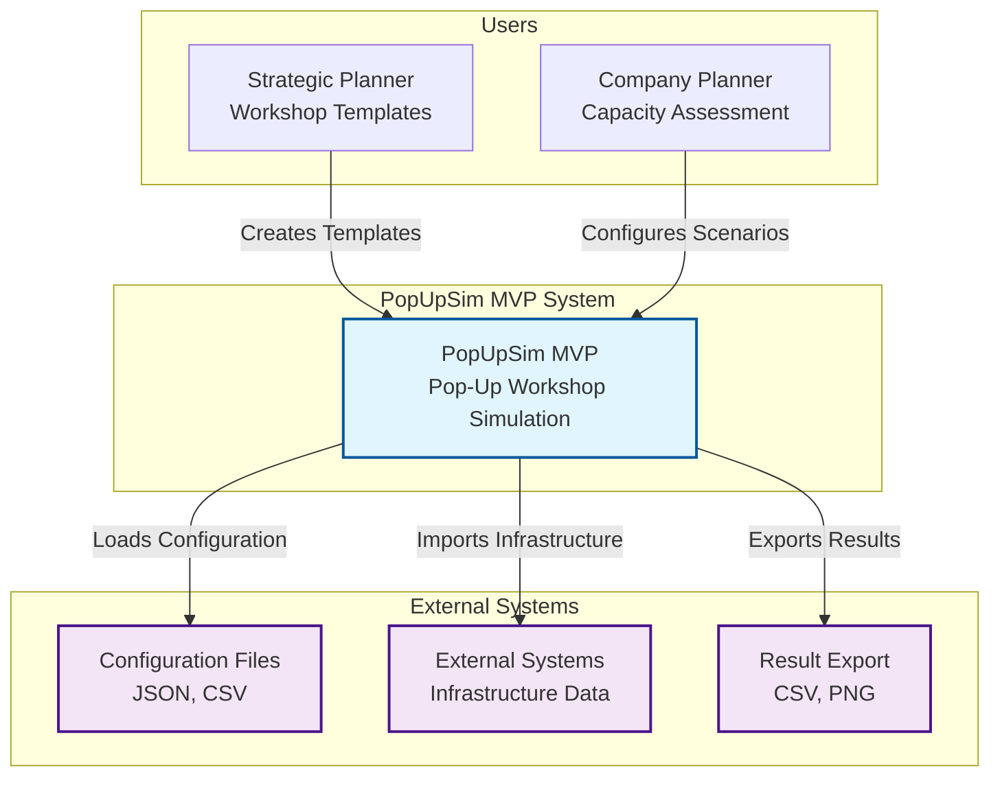
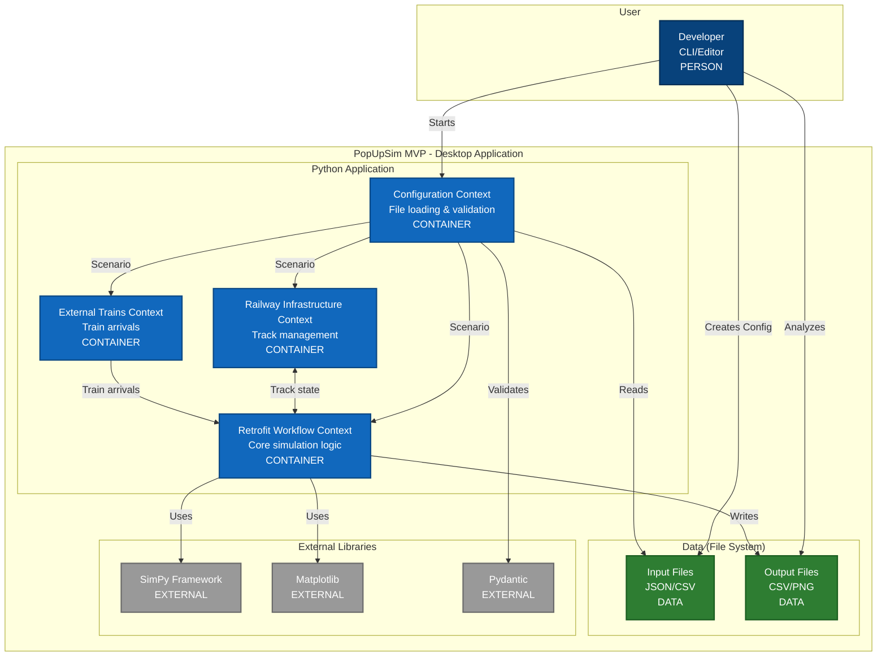
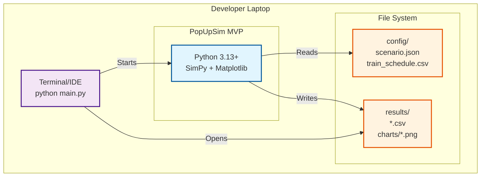

# 1. MVP System Overview

## 1.1 MVP Scope and Goals

### Primary Goal
Functional prototype for Pop-Up workshop simulation that **solves real business problems** and serves as foundation for community development.

### MVP User Stories (Priority 1)
- **US-001**: Develop standardized Pop-Up workshops (Templates)
- **US-002**: Estimate throughput for workshop layouts
- **US-003**: Import infrastructure data (CSV/JSON)
- **US-004**: Assess capacity for planned workshop

### Not in MVP Scope
- **US-005-008**: Advanced visualization and real-time features
- **Web UI**: CLI-only, no web interface
- **Database**: File-based configuration only
- **Advanced Security**: Local application without authentication

## 1.2 System Context

**Note:** See [Architecture Section 3](../architecture/03-context.md) for detailed context diagram.

## 1.3 Container Architecture (C4 Level 2)

**Note:** See [Architecture Section 5](../architecture/05-building-blocks.md) for detailed building blocks.

## 1.4 Technology Stack

**Note:** See [Architecture Section 7.10](../architecture/07-deployment.md#710-technology-stack-summary) for complete stack.

### Core
- **Python 3.13+**: Main language
- **SimPy**: Discrete event simulation
- **Pydantic 2.0+**: Data validation
- **Matplotlib**: Visualization (charts)
- **Pandas**: Data processing (CSV)

### Development
- **uv**: Package manager
- **pytest**: Testing framework
- **Ruff**: Code formatting and linting
- **MyPy**: Type checking
- **Pylint**: Static analysis

### Not in MVP
- ❌ **Web Frontend**: CLI/Desktop only
- ❌ **REST API**: Direct Python calls
- ❌ **Database**: File-based only

## 1.5 Deployment Architecture

**Note:** See [Architecture Section 7](../architecture/07-deployment.md) for detailed deployment view.

### Installation Requirements
- **Python 3.13+** with uv
- **RAM**: To be measured during implementation
- **Disk**: ~500MB for installation and data
- **No web browser** required

## 1.6 Quality Attributes MVP

**Note:** See [Architecture Section 1.2](../architecture/01-introduction-goals.md#12-quality-goals) for quality goals.

### Performance Goals
- **Startup Time**: To be measured
- **Simulation Speed**: To be measured
- **Chart Generation**: To be measured
- **Memory Usage**: To be measured

### Functional Goals
- **Determinism**: Identical results with same inputs
- **Accuracy**: Plausible throughput estimates
- **Completeness**: All MVP user stories covered
- **Usability**: Quick scenario setup

### Technical Goals
- **Testability**: High code coverage for domain logic
- **Maintainability**: Clear separation between contexts
- **Extensibility**: Easy to add new features
- **Portability**: Runs on Windows, macOS, Linux

## 1.7 Constraints and Assumptions

**Note:** See [Architecture Section 2](../architecture/02-constraints.md) for detailed constraints.

### Technical Constraints
- **Desktop Application**: No web interface
- **File-based I/O**: No database
- **CLI-based**: No graphical user interface
- **Synchronous Processing**: No async/parallel processing

### Business Constraints
- **Pop-Up Workshops**: Focus on DAC retrofit
- **Microscopic Simulation**: Individual wagons and resources
- **Deterministic**: Reproducible results
- **Planning Tool**: Not for real-time operations

### Assumptions
- **Users**: Developers and technical planners
- **Data Quality**: Correct and complete input data
- **Hardware**: Standard business laptop
- **Network**: No network dependencies
- **Editor**: Users can manually edit JSON/CSV

## 1.8 Risks and Mitigation

**Note:** See [Architecture Section 11](../architecture/11-risks-technical-debt.md) for detailed risks.

### Technical Risks
| Risk | Probability | Impact | Mitigation |
|------|-------------|--------|------------|
| **Performance with large scenarios** | Medium | High | Early benchmarking |
| **SimPy learning curve** | High | Medium | Prototyping and documentation |
| **Matplotlib limitations** | Low | Low | Simple 2D charts sufficient |

### Business Risks
| Risk | Probability | Impact | Mitigation |
|------|-------------|--------|------------|
| **Incomplete domain model** | Medium | High | Close alignment with domain experts |
| **Unrealistic results** | Medium | High | Validation with real data |
| **User acceptance** | Low | High | Focus on visualization |

## 1.9 Success Criteria

### Technical Metrics
- **Development Time:** 5 weeks
- **Simulation Speed:** To be measured
- **Scalability:** To be measured
- **Portability:** Runs on Windows/Mac/Linux with uv

### Functional Metrics
- **Functionality:** Basic retrofitting simulation works
- **Output:** KPIs are correctly calculated and exported
- **Visualization:** Matplotlib charts display simulation results
- **Extensibility:** Architecture foundation for full version established

### Acceptance Criteria
- ✅ **Template Creation**: Standardized workshop templates can be created
- ✅ **Throughput Estimation**: Plausible throughput calculations
- ✅ **Data Import**: CSV/JSON import works without errors
- ✅ **Capacity Analysis**: Capacity bottlenecks are identified
- ✅ **Stability**: Multiple simulations run consecutively without crashes
- ✅ **Usability**: Developer creates scenario quickly
- ✅ **Expert Validation**: Positive evaluation by domain experts
