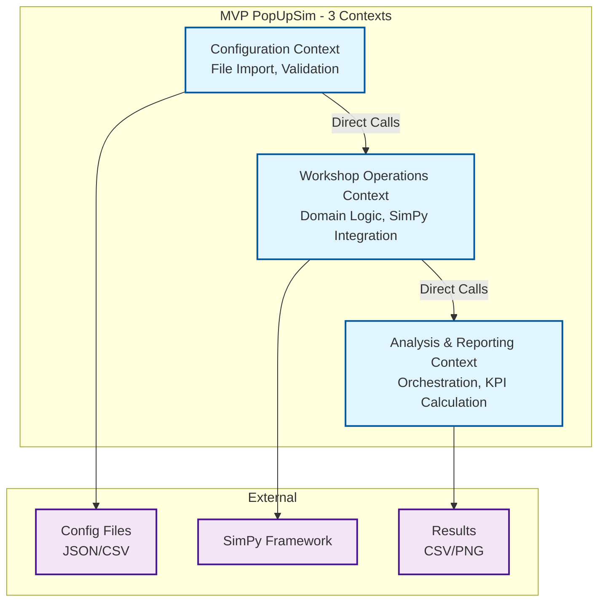
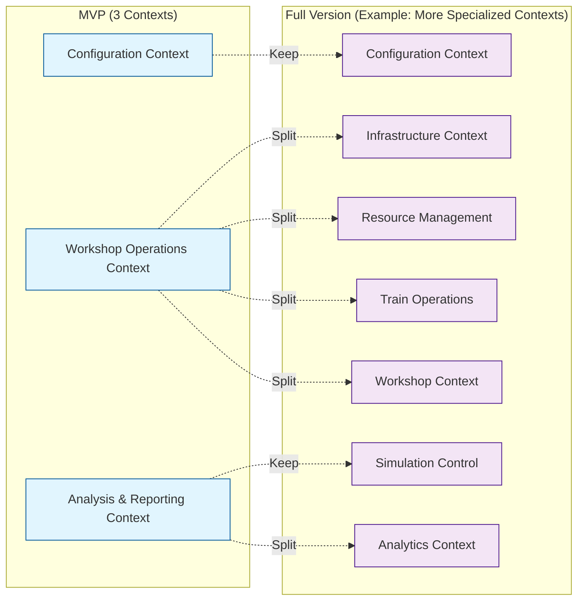

# 2. MVP Bounded Contexts

## 2.1 Context Overview

**Note:** See [Architecture Section 5](../architecture/05-building-blocks.md) for detailed building blocks.

The MVP uses **3 bounded contexts** that cover core functionality:



## 2.2 Configuration Context

### Responsibilities
- **File Import**: Read JSON/CSV configuration files
- **Data Validation**: Validate input data with Pydantic
- **Scenario Building**: Create complete scenario configuration from multiple files
- **Cross-Validation**: Ensure consistency across all configuration components

### Key Components

**Actual implementation:** `popupsim/backend/src/builders/`, `popupsim/backend/src/models/`, `popupsim/backend/src/validators/`

**Directory Structure:**
```
builders/
├── scenario_builder.py      # Main orchestrator
├── train_list_builder.py    # CSV train parsing
└── tracks_builder.py        # JSON track parsing

models/
├── scenario.py              # Main scenario model
├── train.py                 # Train and wagon models
├── workshop.py              # Workshop configuration
├── track.py                 # Track models
├── locomotive.py            # Locomotive models
├── routes.py                # Route definitions
├── topology.py              # Network topology
└── process_times.py         # Timing parameters

validators/
└── scenario_validation.py   # Cross-validation logic
```

### Actual Implementation

**File:** `popupsim/backend/src/models/scenario.py`

```python
from datetime import datetime
from enum import Enum
from pydantic import BaseModel

class TrackSelectionStrategy(str, Enum):
    ROUND_ROBIN = 'round_robin'
    LEAST_OCCUPIED = 'least_occupied'
    FIRST_AVAILABLE = 'first_available'
    RANDOM = 'random'

class LocoDeliveryStrategy(str, Enum):
    RETURN_TO_PARKING = 'return_to_parking'
    STAY_AT_WORKSHOP = 'stay_at_workshop'

class Scenario(BaseModel):
    """Complete scenario configuration."""
    scenario_id: str
    start_date: datetime
    end_date: datetime
    
    trains: list[Train] | None = None
    tracks: list[Track] | None = None
    workshops: list[Workshop] | None = None
    locomotives: list[Locomotive] | None = None
    routes: list[Route] | None = None
    topology: Topology | None = None
    process_times: ProcessTimes | None = None
    
    track_selection_strategy: TrackSelectionStrategy = TrackSelectionStrategy.LEAST_OCCUPIED
    retrofit_selection_strategy: TrackSelectionStrategy = TrackSelectionStrategy.LEAST_OCCUPIED
    loco_delivery_strategy: LocoDeliveryStrategy = LocoDeliveryStrategy.RETURN_TO_PARKING

    def validate_simulation_requirements(self) -> None:
        """Validate all required components are loaded."""
        if not self.trains:
            raise ValueError('Scenario must have trains configured')
        if not self.workshops:
            raise ValueError('Scenario must have workshops configured')
```

**File:** `popupsim/backend/src/models/workshop.py`

```python
from pydantic import BaseModel, Field

class Workshop(BaseModel):
    """Workshop configuration."""
    workshop_id: str
    track_id: str
    retrofit_stations: int = Field(gt=0)
    name: str | None = None
    description: str | None = None
```

### Builder Service

**File:** `popupsim/backend/src/builders/scenario_builder.py`

```python
from pathlib import Path
from builders.tracks_builder import TrackListBuilder
from builders.train_list_builder import TrainListBuilder
from models.scenario import Scenario

class BuilderError(Exception):
    """Configuration-related errors."""

class ScenarioBuilder:
    """Main service for loading and validating configuration files."""

    def __init__(self, scenario_path: Path):
        self.scenario_path = scenario_path
        self.scenario: Scenario | None = None
        self.references: dict = {}

    def build(self) -> Scenario:
        """Build complete scenario from multiple files."""
        self.__load_scenario()  # Load scenario.json
        
        if isinstance(self.scenario, Scenario):
            # Load all referenced files
            self.__load_locomotives()
            self.__load_tracks()
            self.__load_trains()
            self.__load_routes()
            self.__load_topology()
            self.__load_process_times()
            self.__load_workshops()
            
            # Validate complete scenario
            self.scenario.validate_simulation_requirements()
        
        return self.scenario
```

## 2.3 Workshop Operations Context

### Responsibilities
- **Simulation Orchestration**: Coordinate 5 concurrent processes
- **Domain Logic**: Business rules for Pop-Up workshop simulation (no SimPy dependencies)
- **Resource Management**: Locomotives, tracks, workshops
- **Process Coordination**: Wagon flow through 5-stage pipeline
- **Metrics Collection**: Real-time event tracking

### Key Components

**Actual implementation:** `popupsim/backend/src/simulation/`, `popupsim/backend/src/domain/`, `popupsim/backend/src/analytics/collectors/`

**Directory Structure:**
```
simulation/
├── popupsim.py                    # Main orchestrator
├── coordinators/
│   ├── train_coordinator.py       # Train arrival process
│   ├── wagon_pickup_coordinator.py # Pickup to retrofit
│   ├── workshop_coordinator.py    # Workshop processing
│   ├── retrofitted_pickup_coordinator.py # Pickup completed
│   └── parking_coordinator.py     # Move to parking
├── resource_pool.py               # Generic resource pool
├── track_capacity.py              # Track capacity management
├── workshop_capacity.py           # Workshop capacity management
├── services.py                    # Locomotive service
├── sim_adapter.py                 # SimPy abstraction
├── route_finder.py                # Route lookup
└── jobs.py                        # Transport jobs

domain/
├── wagon_operations.py            # WagonSelector, WagonStateManager
├── locomotive_operations.py       # LocomotiveStateManager
└── workshop_operations.py         # WorkshopDistributor

analytics/collectors/
├── base.py                        # MetricCollector base
├── wagon.py                       # WagonCollector
├── locomotive.py                  # LocomotiveCollector
└── workshop.py                    # WorkshopCollector
```

### Actual Implementation: Main Orchestrator

**File:** `popupsim/backend/src/simulation/popupsim.py`

```python
from simulation.sim_adapter import SimulationAdapter
from models.scenario import Scenario

class PopupSim:
    """High-level simulation orchestrator for PopUp-Sim."""

    def __init__(self, sim: SimulationAdapter, scenario: Scenario) -> None:
        self.sim = sim
        self.scenario = scenario
        
        # Resource pools
        self.locomotives = ResourcePool(self.sim, self.locomotives_queue, 'Locomotives')
        
        # Capacity managers
        self.track_capacity = TrackCapacityManager(
            scenario.tracks or [],
            scenario.topology,
            collection_strategy=scenario.track_selection_strategy,
            retrofit_strategy=scenario.retrofit_selection_strategy,
        )
        self.workshop_capacity = WorkshopCapacityManager(sim, self.workshops_queue)
        
        # Domain services (no SimPy dependencies)
        self.wagon_selector = WagonSelector()
        self.wagon_state = WagonStateManager()
        self.loco_state = LocomotiveStateManager()
        self.workshop_distributor = WorkshopDistributor()
        
        # Metrics collection
        self.metrics = SimulationMetrics()
        self.metrics.register(WagonCollector())

    def run(self, until: float | None = None) -> None:
        """Run simulation by spawning 5 coordinator processes."""
        self.sim.run_process(process_train_arrivals, self)
        self.sim.run_process(pickup_wagons_to_retrofit, self)
        self.sim.run_process(move_wagons_to_stations, self)
        self.sim.run_process(pickup_retrofitted_wagons, self)
        self.sim.run_process(move_to_parking, self)
        self.sim.run(until)
```

### Actual Implementation: Resource Management

**File:** `popupsim/backend/src/simulation/resource_pool.py`

```python
class ResourcePool:
    """Generic resource pool with allocation tracking."""

    def __init__(self, sim: Any, resources: list[Trackable], name: str) -> None:
        self.sim = sim
        self.name = name
        self.all_resources: dict[str, Trackable] = {r.locomotive_id: r for r in resources}
        self.store = sim.create_store(capacity=len(resources))
        self.allocated: dict[str, float] = {}
        self.allocation_history: list[tuple[float, str, str, str | None]] = []

    def get(self) -> Any:
        """Get resource from pool (blocks until available)."""
        return self.store.get()

    def put(self, resource: Trackable) -> Any:
        """Return resource to pool."""
        return self.store.put(resource)

    def get_utilization(self, total_time: float) -> dict[str, float]:
        """Calculate utilization per resource."""
        # Calculate time spent allocated vs idle
        pass
```

**File:** `popupsim/backend/src/simulation/track_capacity.py`

```python
class TrackCapacityManager:
    """Manages track capacity based on length and fill factor."""

    def __init__(
        self,
        tracks: list[Track],
        topology: Topology,
        fill_factor: float = 0.75,
        collection_strategy: TrackSelectionStrategy = TrackSelectionStrategy.LEAST_OCCUPIED,
        retrofit_strategy: TrackSelectionStrategy = TrackSelectionStrategy.LEAST_OCCUPIED,
    ) -> None:
        self.fill_factor = fill_factor
        self.collection_strategy = collection_strategy
        self.track_capacities: dict[str, float] = {}
        self.current_occupancy: dict[str, float] = {}
        self._calculate_capacities(tracks, topology)

    def can_add_wagon(self, track_id: str, wagon_length: float) -> bool:
        """Check if wagon can be added to track."""
        return self.current_occupancy[track_id] + wagon_length <= self.track_capacities[track_id]

    def select_collection_track(self, wagon_length: float) -> str | None:
        """Select collection track based on configured strategy."""
        return self._select_track(self.collection_tracks, wagon_length, self.collection_strategy)
```

### Actual Implementation: Domain Services

**File:** `popupsim/backend/src/domain/wagon_operations.py`

```python
class WagonSelector:
    """Select wagons for retrofit (no SimPy dependencies)."""

    @staticmethod
    def needs_retrofit(wagon: Wagon) -> bool:
        """Check if wagon needs retrofit."""
        return wagon.needs_retrofit and wagon.coupler_type == CouplerType.SCREW

    @staticmethod
    def filter_selected_wagons(wagons: list[Wagon]) -> dict[str, list[Wagon]]:
        """Group selected wagons by collection track."""
        result: dict[str, list[Wagon]] = {}
        for wagon in wagons:
            if wagon.status == WagonStatus.SELECTED and wagon.track_id:
                if wagon.track_id not in result:
                    result[wagon.track_id] = []
                result[wagon.track_id].append(wagon)
        return result

class WagonStateManager:
    """Manage wagon state transitions (no SimPy dependencies)."""

    @staticmethod
    def select_for_retrofit(wagon: Wagon, track_id: str) -> None:
        """Mark wagon as selected for retrofit."""
        wagon.status = WagonStatus.SELECTED
        wagon.track_id = track_id

    @staticmethod
    def reject_wagon(wagon: Wagon) -> None:
        """Mark wagon as rejected."""
        wagon.status = WagonStatus.REJECTED
```

## 2.4 Analysis & Reporting Context

### Responsibilities
- **Main Orchestration**: CLI entry point, coordinate full pipeline
- **KPI Calculation**: Calculate throughput, utilization, bottlenecks
- **Statistical Analysis**: Pandas/NumPy analysis
- **Result Export**: Export results to CSV
- **Visualization**: Generate charts with Matplotlib

### Key Components

**Actual implementation:** `popupsim/backend/src/main.py`, `popupsim/backend/src/analytics/`

**Directory Structure:**
```
main.py                          # CLI entry point (Typer)

analytics/
├── kpi/
│   └── calculator.py            # KPI calculation
├── models/
│   └── kpi_result.py            # KPI result models
├── reporting/
│   ├── csv_exporter.py          # CSV export
│   ├── visualizer.py            # Chart generation
│   └── statistics.py            # Statistical analysis
└── collectors/
    ├── base.py                  # Base collector
    ├── metrics.py               # Metrics aggregator
    ├── wagon.py                 # Wagon metrics
    ├── locomotive.py            # Locomotive metrics
    └── workshop.py              # Workshop metrics
```

### Actual Implementation: Main Orchestrator

**File:** `popupsim/backend/src/main.py`

```python
from analytics.kpi import KPICalculator
from analytics.reporting import CSVExporter, Visualizer
from builders.scenario_builder import ScenarioBuilder
from simulation.popupsim import PopupSim
from simulation.sim_adapter import SimPyAdapter
import typer

app = typer.Typer(name='popupsim')

@app.command()
def main(
    scenario_path: Path | None = None,
    output_path: Path | None = None,
    verbose: bool = False,
    debug: str = 'INFO',
) -> None:
    """Main entry point for PopUpSim application."""
    # 1. Configuration Context - Load and validate
    scenario = ScenarioBuilder(scenario_path).build()
    typer.echo(f'Scenario loaded: {scenario.scenario_id}')
    
    # 2. Workshop Operations Context - Run simulation
    sim_adapter = SimPyAdapter.create_simpy_adapter()
    popup_sim = PopupSim(sim_adapter, scenario)
    popup_sim.run()
    
    # Get raw metrics from collectors
    metrics = popup_sim.get_metrics()
    
    # 3. Analysis & Reporting Context - Calculate KPIs
    kpi_calculator = KPICalculator()
    kpi_result = kpi_calculator.calculate_from_simulation(
        metrics, scenario, popup_sim.wagons_queue,
        popup_sim.rejected_wagons_queue, popup_sim.workshops_queue
    )
    
    # Export results
    csv_exporter = CSVExporter()
    csv_files = csv_exporter.export_all(kpi_result, output_path)
    
    # Generate charts
    visualizer = Visualizer()
    chart_paths = visualizer.generate_all_charts(kpi_result, output_path)
```

### Actual Implementation: KPI Calculator

**File:** `popupsim/backend/src/analytics/kpi/calculator.py`

```python
from analytics.models.kpi_result import KPIResult, ThroughputKPI, UtilizationKPI

class KPICalculator:
    """Calculate KPIs from simulation results."""

    def calculate_from_simulation(
        self,
        metrics: dict[str, list[dict[str, Any]]],
        scenario: Scenario,
        wagons: list[Wagon],
        rejected_wagons: list[Wagon],
        workshops: list[Workshop],
    ) -> KPIResult:
        """Calculate all KPIs from simulation results."""
        throughput = self._calculate_throughput(scenario, wagons, rejected_wagons)
        utilization = self._calculate_utilization(workshops, wagons)
        bottlenecks = self._identify_bottlenecks(throughput, utilization)
        avg_flow_time = self._calculate_avg_flow_time(metrics)
        avg_waiting_time = self._calculate_avg_waiting_time(wagons)

        return KPIResult(
            scenario_id=scenario.scenario_id,
            throughput=throughput,
            utilization=utilization,
            bottlenecks=bottlenecks,
            avg_flow_time_minutes=avg_flow_time,
            avg_waiting_time_minutes=avg_waiting_time,
        )

    def _calculate_throughput(
        self, scenario: Scenario, wagons: list[Wagon], rejected_wagons: list[Wagon]
    ) -> ThroughputKPI:
        """Calculate throughput metrics."""
        duration_hours = (scenario.end_date - scenario.start_date).total_seconds() / 3600.0
        retrofitted = sum(1 for w in wagons if w.status == WagonStatus.RETROFITTED)
        wagons_per_hour = retrofitted / duration_hours if duration_hours > 0 else 0.0

        return ThroughputKPI(
            total_wagons_processed=len(wagons),
            total_wagons_retrofitted=retrofitted,
            total_wagons_rejected=len(rejected_wagons),
            simulation_duration_hours=duration_hours,
            wagons_per_hour=round(wagons_per_hour, 2),
            wagons_per_day=round(wagons_per_hour * 24.0, 2),
        )
```

### Actual Implementation: Metrics Collector

**File:** `popupsim/backend/src/analytics/collectors/base.py`

```python
from abc import ABC, abstractmethod
from dataclasses import dataclass

@dataclass
class MetricResult:
    """Single metric result."""
    name: str
    value: float | int | str
    unit: str
    category: str

class MetricCollector(ABC):
    """Base class for metric collectors."""

    @abstractmethod
    def record_event(self, event_type: str, data: dict[str, Any]) -> None:
        """Record an event for metric computation."""

    @abstractmethod
    def get_results(self) -> list[MetricResult]:
        """Get computed metrics."""

    @abstractmethod
    def reset(self) -> None:
        """Reset collector state."""
```

## 2.5 Context Interactions

### Direct Service Calls (MVP Simplification)

**Actual implementation in main.py:**

```python
# Direct calls instead of event-driven architecture
def main(scenario_path: Path, output_path: Path) -> None:
    # 1. Configuration Context
    scenario = ScenarioBuilder(scenario_path).build()
    
    # 2. Workshop Operations Context
    sim_adapter = SimPyAdapter.create_simpy_adapter()
    popup_sim = PopupSim(sim_adapter, scenario)
    popup_sim.run()
    metrics = popup_sim.get_metrics()
    
    # 3. Analysis & Reporting Context
    kpi_calculator = KPICalculator()
    kpi_result = kpi_calculator.calculate_from_simulation(
        metrics, scenario, popup_sim.wagons_queue,
        popup_sim.rejected_wagons_queue, popup_sim.workshops_queue
    )
    
    csv_exporter = CSVExporter()
    csv_exporter.export_all(kpi_result, output_path)
    
    visualizer = Visualizer()
    visualizer.generate_all_charts(kpi_result, output_path)
```

## 2.6 Implementation Status

| Component | Status | Location |
|-----------|--------|----------|
| Configuration Context | ✅ Implemented | `popupsim/backend/src/builders/`, `popupsim/backend/src/models/` |
| Workshop Operations Context | ✅ Implemented | `popupsim/backend/src/simulation/`, `popupsim/backend/src/domain/` |
| Analysis & Reporting Context | ✅ Implemented | `popupsim/backend/src/main.py`, `popupsim/backend/src/analytics/` |
| SimPy Integration | ✅ Implemented | `popupsim/backend/src/simulation/popupsim.py`, `popupsim/backend/src/simulation/sim_adapter.py` |
| Resource Management | ✅ Implemented | `popupsim/backend/src/simulation/resource_pool.py`, `track_capacity.py`, `workshop_capacity.py` |
| Metrics Collection | ✅ Implemented | `popupsim/backend/src/analytics/collectors/` |
| Testing | 🚧 In Progress | `popupsim/backend/tests/` |

## 2.7 Migration Path to Full Version

After MVP, the 3 contexts can be split into more specialized contexts. The exact number and boundaries will be determined based on MVP learnings.

**One possible evolution:**



**Effort for migration:** To be estimated after MVP (depends on chosen architecture)
