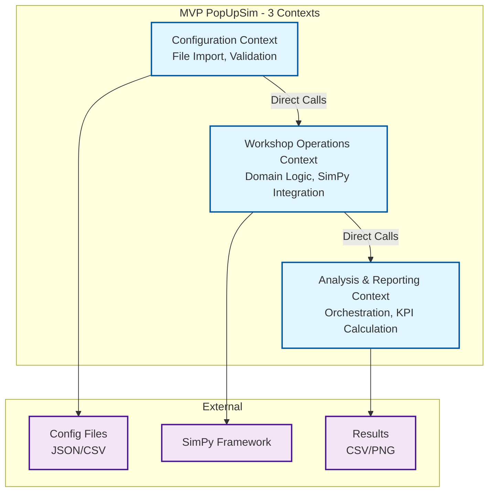
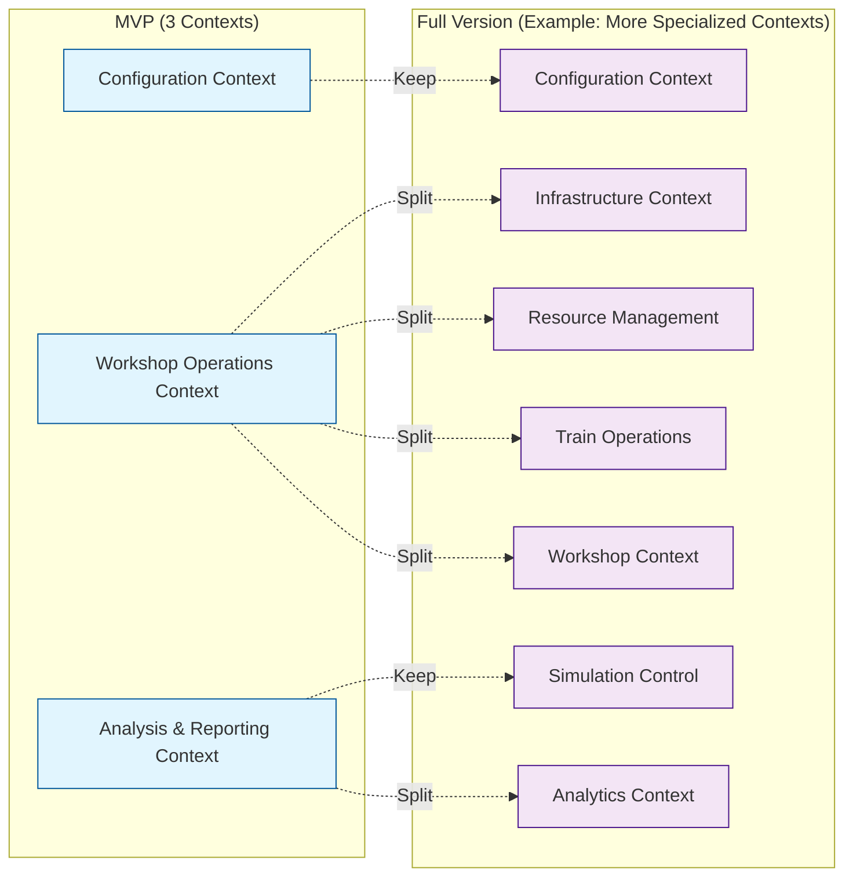

# 2. MVP Bounded Contexts

## 2.1 Context Overview

**Note:** See [Architecture Section 5](../architecture/05-building-blocks.md) for detailed building blocks.

The MVP uses **3 bounded contexts** that cover core functionality:



## 2.2 Configuration Context

### Responsibilities
- **File Import**: Read JSON/CSV configuration files
- **Data Validation**: Validate input data with Pydantic
- **Scenario Building**: Create complete scenario configuration

### Key Components

**Actual implementation:** `popupsim/backend/src/configuration/`

```python
# Simplified example - see actual implementation
from pydantic import BaseModel, Field
from datetime import date

class ScenarioConfig(BaseModel):
    scenario_id: str
    start_date: date
    end_date: date
    workshop: Workshop | None = None
    train_schedule_file: str
    routes_file: str | None = None
    workshop_tracks_file: str | None = None

class Workshop(BaseModel):
    tracks: list[WorkshopTrack] = Field(min_length=1)

class WorkshopTrack(BaseModel):
    id: str
    function: TrackFunction
    capacity: int = Field(ge=1)
    retrofit_time_min: int = Field(ge=0)
```

### Services

```python
class ConfigurationService:
    """Main service for configuration"""

    def load_scenario_from_file(self, file_path: str) -> ScenarioConfig:
        """Loads scenario from JSON/CSV file"""
        pass

    def validate_scenario(self, config: ScenarioConfig) -> ValidationResult:
        """Validates scenario configuration"""
        pass
```

## 2.3 Workshop Operations Context

### Responsibilities
- **Domain Logic**: Business rules for Pop-Up workshop simulation
- **SimPy Integration**: Discrete event simulation
- **Resource Management**: Tracks, workshops, wagons
- **Process Orchestration**: Wagon flow through workshop process

### Key Components

**Actual implementation:** `popupsim/backend/src/domain/`

```python
# Simplified example - see actual implementation
@dataclass
class Wagon:
    """Individual freight wagon"""
    id: str
    train_id: str
    length: float
    needs_retrofit: bool
    status: str = "arriving"
    arrival_time: float | None = None

@dataclass
class Train:
    """Train with multiple wagons"""
    id: str
    arrival_time: datetime
    wagons: list[Wagon]

@dataclass
class WorkshopTrack:
    """Workshop track with processing capacity"""
    id: str
    capacity: int
    retrofit_time_min: int
    current_wagons: int = 0
```

### SimPy Integration

```python
class SimulationService:
    """Main service for simulation"""

    def __init__(self, sim_engine: SimPyAdapter):
        self.sim_engine = sim_engine

    def run_simulation(self, scenario: ScenarioConfig, 
                      duration_hours: int) -> SimulationResult:
        """Runs complete simulation"""
        pass

    def process_train_arrival(self, train: Train) -> None:
        """Processes train arrival"""
        pass
```

## 2.4 Analysis & Reporting Context

### Responsibilities
- **Simulation Orchestration**: Start, run, complete simulation
- **KPI Calculation**: Calculate throughput, utilization metrics
- **Result Export**: Export results to CSV
- **Visualization**: Generate charts with Matplotlib

### Key Components

```python
class AnalysisReportingService:
    """Service for analysis and reporting"""

    def start_simulation(self, scenario_id: str) -> str:
        """Starts simulation"""
        pass

    def get_simulation_results(self, simulation_id: str) -> SimulationResult:
        """Returns simulation results"""
        pass

class VisualizationService:
    """Service for data visualization"""

    def generate_throughput_chart(self, results: SimulationResult) -> None:
        """Creates throughput chart"""
        pass

class ExportService:
    """Service for data export"""

    def export_results_csv(self, results: SimulationResult, 
                          file_path: str) -> None:
        """Exports results as CSV"""
        pass
```

## 2.5 Context Interactions

### Direct Service Calls (MVP Simplification)

```python
# Direct calls instead of event-driven architecture
class PopUpSimApplication:
    """Main application orchestrating all contexts"""

    def __init__(self):
        self.config_service = ConfigurationService()
        self.simulation_service = SimulationService(SimPyAdapter())
        self.control_service = AnalysisReportingService()

    def run_complete_analysis(self, config_file: str) -> AnalysisResult:
        # 1. Configuration Context
        scenario = self.config_service.load_scenario_from_file(config_file)
        validation = self.config_service.validate_scenario(scenario)

        if not validation.is_valid:
            raise ValidationError(validation.errors)

        # 2. Simulation Domain Context
        sim_results = self.simulation_service.run_simulation(
            scenario, duration_hours=24
        )

        # 3. Analysis & Reporting Context
        self.control_service.export_results(sim_results)
        self.control_service.generate_charts(sim_results)

        return AnalysisResult(
            scenario=scenario,
            simulation_results=sim_results
        )
```

## 2.6 Migration Path to Full Version

After MVP, the 3 contexts can be split into more specialized contexts. The exact number and boundaries will be determined based on MVP learnings.

**One possible evolution:**



**Effort for migration:** To be estimated after MVP (depends on chosen architecture)
