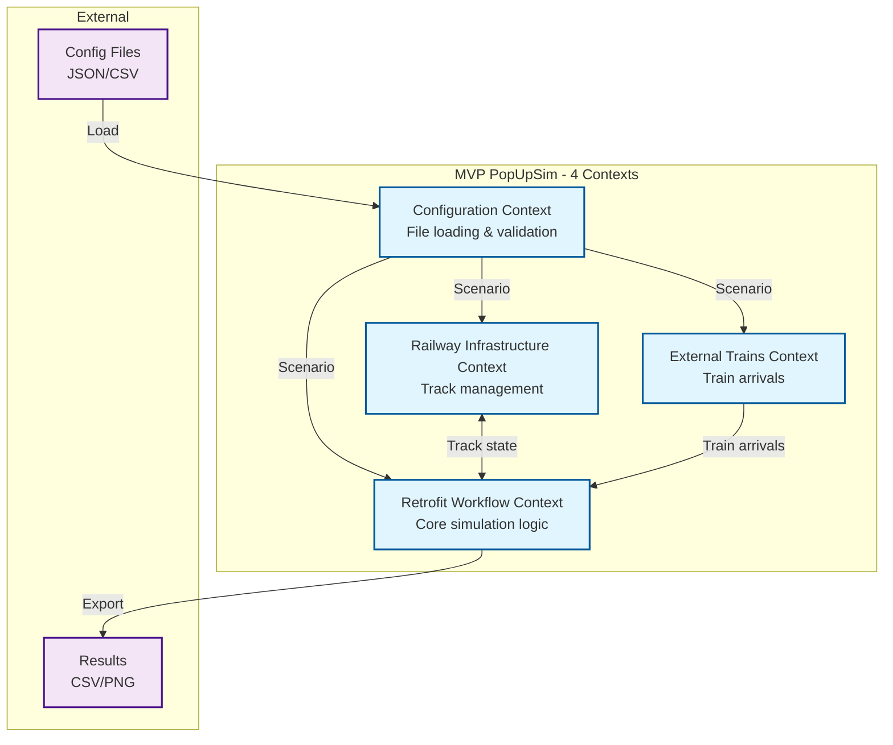

# 2. MVP Bounded Contexts

## 2.1 Context Overview

**Note:** See [Architecture Section 5](../architecture/05-building-blocks.md) for detailed building blocks.

The MVP uses **4 bounded contexts** following Domain-Driven Design principles:



## 2.2 Configuration Context

### Responsibilities
- Load scenario configuration from files
- Validate using Pydantic models
- Provide validated scenario to other contexts

### Key Components

**Location:** `popupsim/backend/src/contexts/configuration/`

```
configuration/
├── domain/
│   ├── configuration_builder.py    # Entry point
│   └── models/
│       ├── scenario.py
│       ├── process_times.py
│       └── dtos/
└── infrastructure/
    └── file_loader.py              # Parse JSON/CSV
```

### Implementation

**File:** `contexts/configuration/domain/configuration_builder.py`

```python
from pathlib import Path
from contexts.configuration.infrastructure.file_loader import FileLoader
from contexts.configuration.domain.models.scenario import Scenario

class ConfigurationBuilder:
    """Load scenario from file path."""
    
    def __init__(self, path: Path):
        self.path = path
    
    def build(self) -> Scenario:
        """Load and validate scenario."""
        loader = FileLoader()
        return loader.load_scenario(self.path)
```

---

## 2.3 Retrofit Workflow Context

### Responsibilities
- Execute discrete event simulation
- Coordinate wagon flow through 4 coordinators
- Manage resources (locomotives, tracks, workshops)
- Collect metrics during simulation
- Export results and generate reports

### Key Components

**Location:** `popupsim/backend/src/contexts/retrofit_workflow/`

```
retrofit_workflow/
├── application/
│   ├── retrofit_workflow_context.py    # Main context
│   └── coordinators/
│       ├── arrival_coordinator.py      # Process train arrivals
│       ├── collection_coordinator.py   # Move to retrofit track
│       ├── workshop_coordinator.py     # Retrofit operations
│       └── parking_coordinator.py      # Move to parking
├── domain/
│   └── services/
│       ├── batch_formation_service.py
│       ├── rake_formation_service.py
│       ├── train_formation_service.py
│       ├── workshop_scheduling_service.py
│       ├── coupling_service.py
│       └── route_service.py
└── infrastructure/
    ├── resource_managers/
    │   ├── locomotive_resource_manager.py
    │   ├── track_capacity_manager.py
    │   └── workshop_resource_manager.py
    └── metrics/
        ├── simulation_metrics.py
        ├── wagon_collector.py
        ├── locomotive_collector.py
        └── workshop_collector.py
```

### Implementation: Main Context

**File:** `contexts/retrofit_workflow/application/retrofit_workflow_context.py`

```python
from typing import Generator, Any
from contexts.configuration.domain.models.scenario import Scenario
from contexts.railway_infrastructure.application.railway_context import RailwayContext
from contexts.external_trains.application.external_trains_context import ExternalTrainsContext

class RetrofitWorkflowContext:
    """Main retrofit workflow simulation context."""
    
    def __init__(
        self,
        env: Any,
        scenario: Scenario,
        railway: RailwayContext,
        external_trains: ExternalTrainsContext,
    ):
        self.env = env
        self.scenario = scenario
        self.railway = railway
        self.external_trains = external_trains
        
        # Initialize coordinators
        self.arrival_coordinator = ArrivalCoordinator(...)
        self.collection_coordinator = CollectionCoordinator(...)
        self.workshop_coordinator = WorkshopCoordinator(...)
        self.parking_coordinator = ParkingCoordinator(...)
        
        # Initialize metrics
        self.metrics = SimulationMetrics()
    
    def run(self) -> None:
        """Start all coordinators."""
        self.arrival_coordinator.start()
        self.collection_coordinator.start()
        self.workshop_coordinator.start()
        self.parking_coordinator.start()
        
        # Run simulation
        self.env.run()
    
    def get_metrics(self) -> dict[str, Any]:
        """Get collected metrics."""
        return self.metrics.get_all()
    
    def export_events(self, output_path: Path) -> None:
        """Export simulation events."""
        self.metrics.export_to_csv(output_path)
```

### Implementation: Coordinator Example

**File:** `contexts/retrofit_workflow/application/coordinators/collection_coordinator.py`

```python
from typing import Generator, Any

class CollectionCoordinator:
    """Coordinates wagon movement from collection to retrofit track."""
    
    def __init__(self, config: CollectionCoordinatorConfig):
        self.config = config
        self.batch_counter = 0
    
    def start(self) -> None:
        """Start coordinator process."""
        self.config.env.process(self._collection_process())
    
    def _collection_process(self) -> Generator[Any, Any, None]:
        """Main collection process loop."""
        while True:
            # Wait for wagons
            wagon = yield self.config.collection_queue.get()
            
            # Collect batch
            wagons = yield from self._collect_batch(wagon)
            
            # Select retrofit track
            retrofit_track = self.config.track_selector.select_track_with_capacity('retrofit')
            
            # Transport batch
            yield from self._transport_batch(wagons, retrofit_track)
```

### Implementation: Domain Service Example

**File:** `contexts/retrofit_workflow/domain/services/batch_formation_service.py`

```python
class BatchFormationService:
    """Form wagon batches (no SimPy dependencies)."""
    
    @staticmethod
    def can_form_batch(
        wagons: list[Wagon],
        min_batch_size: int,
        max_batch_size: int,
    ) -> bool:
        """Check if batch can be formed."""
        return min_batch_size <= len(wagons) <= max_batch_size
    
    @staticmethod
    def form_batch(
        wagons: list[Wagon],
        batch_size: int,
    ) -> list[Wagon]:
        """Form batch of specified size."""
        return wagons[:batch_size]
```

---

## 2.4 Railway Infrastructure Context

### Responsibilities
- Build track infrastructure from scenario
- Manage track capacity and occupancy
- Provide track selection services
- Track wagon placement

### Key Components

**Location:** `popupsim/backend/src/contexts/railway_infrastructure/`

```
railway_infrastructure/
├── application/
│   └── railway_context.py          # Track building & services
├── domain/
│   ├── aggregates/
│   │   ├── track_group.py
│   │   ├── track.py
│   │   └── track_occupancy.py
│   └── services/
│       ├── track_selector.py
│       └── capacity_service.py
└── infrastructure/
    └── track_repository.py
```

### Implementation

**File:** `contexts/railway_infrastructure/application/railway_context.py`

```python
from contexts.configuration.domain.models.scenario import Scenario
from contexts.railway_infrastructure.domain.aggregates.track_group import TrackGroup
from contexts.railway_infrastructure.domain.services.track_selector import TrackSelector

class RailwayContext:
    """Railway infrastructure management context."""
    
    def __init__(self, scenario: Scenario):
        self.scenario = scenario
        
        # Build track groups
        self.track_groups = self._build_track_groups(scenario.tracks)
        
        # Initialize services
        self.track_selector = TrackSelector(self.track_groups)
        self.capacity_service = CapacityService(self.track_groups)
    
    def _build_track_groups(self, tracks: list[Track]) -> dict[str, TrackGroup]:
        """Group tracks by type."""
        groups = {}
        for track in tracks:
            if track.track_type not in groups:
                groups[track.track_type] = TrackGroup(track.track_type)
            groups[track.track_type].add_track(track)
        return groups
    
    def place_wagons_on_track(self, track_id: str, wagons: list[Wagon]) -> None:
        """Place wagons on specified track."""
        track = self._find_track(track_id)
        track.occupancy.add_wagons(wagons)
    
    def remove_wagons_from_track(self, track_id: str, wagons: list[Wagon]) -> None:
        """Remove wagons from specified track."""
        track = self._find_track(track_id)
        track.occupancy.remove_wagons(wagons)
```

---

## 2.5 External Trains Context

### Responsibilities
- Initialize train arrivals from scenario
- Publish TrainArrivedEvent to event bus
- Create wagon entities from train data

### Key Components

**Location:** `popupsim/backend/src/contexts/external_trains/`

```
external_trains/
├── application/
│   └── external_trains_context.py  # Train arrival management
├── domain/
│   ├── wagon_factory.py
│   └── events/
│       └── train_arrived_event.py
└── infrastructure/
    └── event_publisher.py
```

### Implementation

**File:** `contexts/external_trains/application/external_trains_context.py`

```python
from contexts.configuration.domain.models.scenario import Scenario
from contexts.shared.domain.events.event_bus import EventBus
from contexts.external_trains.domain.events.train_arrived_event import TrainArrivedEvent

class ExternalTrainsContext:
    """External train arrival management."""
    
    def __init__(self, env: Any, scenario: Scenario, event_bus: EventBus):
        self.env = env
        self.scenario = scenario
        self.event_bus = event_bus
    
    def initialize_arrivals(self) -> None:
        """Schedule all train arrivals."""
        for train in self.scenario.trains or []:
            arrival_time = self._calculate_arrival_time(train)
            self.env.process(self._arrival_process(train, arrival_time))
    
    def _arrival_process(self, train: Train, arrival_time: float) -> Generator[Any, Any, None]:
        """Process single train arrival."""
        yield self.env.timeout(arrival_time)
        
        # Create event
        event = TrainArrivedEvent(
            train_id=train.id,
            wagons=train.wagons,
            arrival_time=self.env.now,
        )
        
        # Publish to event bus
        self.event_bus.publish(event)
```

---

## 2.6 Context Interactions

### Main Orchestration

**File:** `popupsim/backend/src/application/simulation_service.py`

```python
from pathlib import Path
from contexts.configuration.domain.configuration_builder import ConfigurationBuilder
from contexts.railway_infrastructure.application.railway_context import RailwayContext
from contexts.external_trains.application.external_trains_context import ExternalTrainsContext
from contexts.retrofit_workflow.application.retrofit_workflow_context import RetrofitWorkflowContext
from contexts.shared.domain.events.event_bus import EventBus
from contexts.shared.infrastructure.simpy_adapter import SimPyAdapter

class SimulationService:
    """Orchestrates all contexts for simulation execution."""
    
    def run_simulation(self, scenario_path: Path, output_path: Path) -> None:
        """Run complete simulation pipeline."""
        
        # 1. Configuration Context - Load scenario
        config_builder = ConfigurationBuilder(scenario_path)
        scenario = config_builder.build()
        
        # 2. Initialize SimPy environment
        env = SimPyAdapter.create_environment()
        event_bus = EventBus()
        
        # 3. Railway Infrastructure Context - Build tracks
        railway = RailwayContext(scenario)
        
        # 4. External Trains Context - Schedule arrivals
        external_trains = ExternalTrainsContext(env, scenario, event_bus)
        external_trains.initialize_arrivals()
        
        # 5. Retrofit Workflow Context - Main simulation
        retrofit_workflow = RetrofitWorkflowContext(
            env, scenario, railway, external_trains
        )
        retrofit_workflow.run()
        
        # 6. Export results
        retrofit_workflow.export_events(output_path)
        metrics = retrofit_workflow.get_metrics()
        
        # Generate reports
        self._generate_reports(metrics, output_path)
```

### Event Bus Communication

```python
from contexts.shared.domain.events.event_bus import EventBus
from contexts.external_trains.domain.events.train_arrived_event import TrainArrivedEvent

# External Trains publishes event
event_bus.publish(TrainArrivedEvent(
    train_id="T001",
    wagons=[wagon1, wagon2, wagon3],
    arrival_time=100.0
))

# Retrofit Workflow subscribes
event_bus.subscribe(TrainArrivedEvent, arrival_coordinator.handle_train_arrival)
```

---

## 2.7 Implementation Status

| Context | Status | Location |
|---------|--------|----------|
| Configuration Context | ✅ Implemented | `contexts/configuration/` |
| Retrofit Workflow Context | ✅ Implemented | `contexts/retrofit_workflow/` |
| Railway Infrastructure Context | ✅ Implemented | `contexts/railway_infrastructure/` |
| External Trains Context | ✅ Implemented | `contexts/external_trains/` |
| Event Bus | ✅ Implemented | `contexts/shared/domain/events/` |
| SimPy Adapter | ✅ Implemented | `contexts/shared/infrastructure/` |
| Testing | ✅ Complete | 374 tests passing |

---

## 2.8 Migration Path to Full Version

The 4-context architecture provides a solid foundation for future evolution. Possible enhancements:

- **Event-driven architecture**: Replace direct calls with async messaging
- **Database integration**: Add repository pattern for persistence
- **Web interface**: Add API layer and frontend
- **Distributed simulation**: Split contexts into microservices

**Current architecture supports these migrations** through:
- Clear context boundaries
- Event bus infrastructure
- Domain services without SimPy dependencies
- Layered architecture within each context

---
