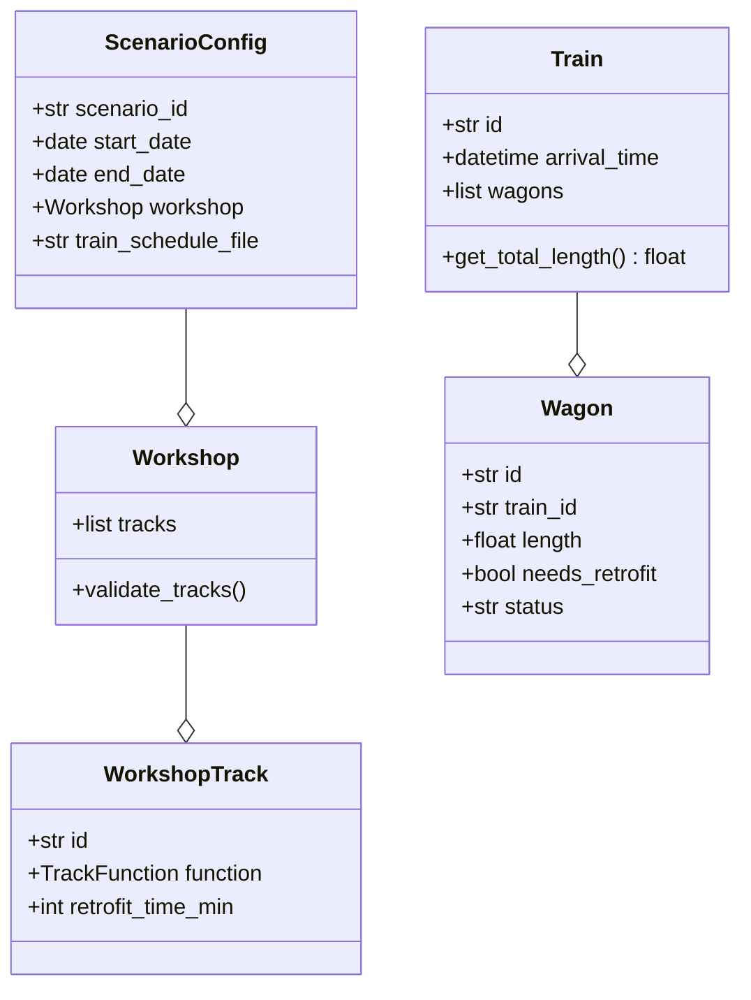

# 3. MVP Domain Model

## 3.1 Domain Model Overview

**Note:** See actual implementation in `popupsim/backend/src/contexts/`

The MVP domain model follows Domain-Driven Design principles across 4 bounded contexts.



## 3.2 Configuration Context Models

**Actual implementation:** `popupsim/backend/src/contexts/configuration/domain/models/`

### Scenario

```python
from pydantic import BaseModel
from datetime import datetime

class Scenario(BaseModel):
    """Root configuration model."""
    id: str
    start_date: datetime
    end_date: datetime
    trains: list[Train] | None = None
    tracks: list[Track] | None = None
    workshops: list[Workshop] | None = None
    locomotives: list[Locomotive] | None = None
    routes: list[Route] | None = None
    process_times: ProcessTimes | None = None
```

### Workshop

```python
class Workshop(BaseModel):
    """Workshop configuration."""
    workshop_id: str
    track_id: str
    retrofit_stations: int
    name: str | None = None
```

## 3.3 Retrofit Workflow Domain Services

**Actual implementation:** `popupsim/backend/src/contexts/retrofit_workflow/domain/services/`

### Batch Formation Service

```python
class BatchFormationService:
    """Form wagon batches (no SimPy dependencies)."""
    
    @staticmethod
    def can_form_batch(
        wagons: list[Wagon],
        min_batch_size: int,
        max_batch_size: int,
    ) -> bool:
        """Check if batch can be formed."""
        return min_batch_size <= len(wagons) <= max_batch_size
```

### Workshop Scheduling Service

```python
class WorkshopSchedulingService:
    """Schedule wagon batches to workshops (no SimPy dependencies)."""
    
    @staticmethod
    def select_workshop(
        workshops: list[Workshop],
        batch_size: int,
    ) -> Workshop | None:
        """Select workshop with sufficient capacity."""
        for workshop in workshops:
            if workshop.retrofit_stations >= batch_size:
                return workshop
        return None
```

## 3.4 Value Objects

```python
from dataclasses import dataclass

@dataclass(frozen=True)
class ValidationResult:
    """Result of validation"""
    is_valid: bool
    errors: list[str]
    warnings: list[str]

    def has_errors(self) -> bool:
        return len(self.errors) > 0

@dataclass(frozen=True)
class SimulationResult:
    """Result of simulation"""
    scenario_id: str
    duration_hours: int
    total_trains_processed: int
    total_wagons_processed: int
    average_processing_time_minutes: float
    throughput_per_hour: float
```

## 3.5 Domain Services

```python
class ThroughputCalculationService:
    """Service for throughput calculations"""

    def calculate_theoretical_throughput(
        self,
        workshop: Workshop
    ) -> float:
        """Calculates theoretical workshop throughput"""
        total_capacity = sum(t.capacity for t in workshop.tracks)
        avg_processing_time = sum(
            t.retrofit_time_min for t in workshop.tracks
        ) / len(workshop.tracks)

        wagons_per_hour = (total_capacity * 60) / avg_processing_time
        return wagons_per_hour

class ValidationService:
    """Service for data validation"""

    def validate_scenario(
        self,
        config: ScenarioConfig
    ) -> ValidationResult:
        """Validates scenario models"""
        errors = []
        warnings = []

        # Date validation
        if config.end_date <= config.start_date:
            errors.append("end_date must be after start_date")

        # Workshop validation
        if config.workshop and not config.workshop.tracks:
            errors.append("Workshop must have at least one track")

        return ValidationResult(
            is_valid=len(errors) == 0,
            errors=errors,
            warnings=warnings
        )
```

## 3.6 Exceptions

```python
class PopUpSimDomainError(Exception):
    """Base for domain-specific errors"""
    pass

class ValidationError(PopUpSimDomainError):
    """Configuration validation error"""
    pass

class SimulationRuntimeError(PopUpSimDomainError):
    """Error during simulation"""
    pass

class InsufficientCapacityError(PopUpSimDomainError):
    """Insufficient track/workshop capacity"""
    pass
```

## 3.7 Type Hints

All code must include explicit type annotations per project rules:

```python
from typing import Optional

def process_wagon(
    wagon: Wagon,
    track: WorkshopTrack
) -> Optional[float]:
    """Process wagon on track, returns completion time"""
    if not track.capacity > 0:
        raise InsufficientCapacityError(f"Track {track.id} is full")

    completion_time = track.retrofit_time_min
    return completion_time

def validate_configuration(
    config: ScenarioConfig
) -> ValidationResult:
    """Validate scenario models"""
    # Implementation
    pass
```

## 3.8 Migration Path

The simplified MVP domain model can be extended to full DDD implementation:

### Phase 1 (Post-MVP): Rich Domain Model
- Aggregate roots with invariants
- Domain services for complex business logic
- Repository pattern for persistence

### Phase 2: Event Sourcing
- Event store implementation
- Event-driven state reconstruction
- Temporal queries

### Phase 3: Advanced DDD
- Specification pattern for complex queries
- Domain events with saga pattern
- CQRS for read/write separation

**Effort:** Estimated 2-3 weeks for full DDD migration (to be validated)
