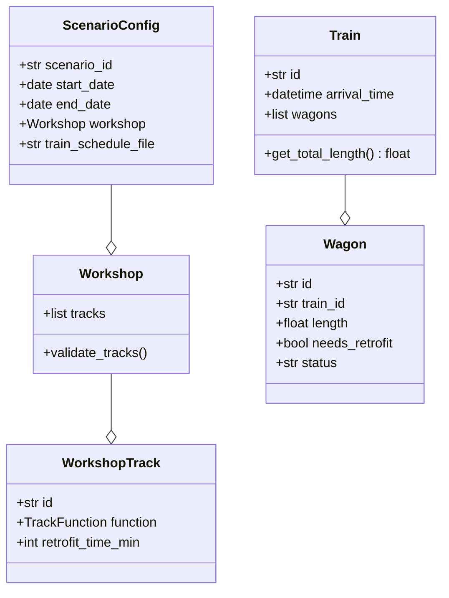

# 3. MVP Domain Model

## 3.1 Domain Model Overview

**Note:** See actual implementation in `popupsim/backend/src/domain/` and `popupsim/backend/src/configuration/`

The MVP domain model focuses on **core business logic** for Pop-Up workshop simulation with simplified patterns for rapid development.



## 3.2 Configuration Models

**Actual implementation:** `popupsim/backend/src/configuration/model_*.py`

### ScenarioConfig

```python
from pydantic import BaseModel, Field
from datetime import date

class ScenarioConfig(BaseModel):
    """Configuration model for simulation scenarios"""
    scenario_id: str = Field(
        pattern=r'^[a-zA-Z0-9_-]+$',
        min_length=1,
        max_length=50
    )
    start_date: date
    end_date: date
    workshop: Workshop | None = None
    train_schedule_file: str
    routes_file: str | None = None
    workshop_tracks_file: str | None = None
```

### Workshop

```python
class Workshop(BaseModel):
    """Workshop configuration with available tracks"""
    tracks: list[WorkshopTrack] = Field(min_length=1)

    @field_validator('tracks')
    @classmethod
    def validate_unique_track_ids(cls, tracks: list[WorkshopTrack]) -> list[WorkshopTrack]:
        """Ensures all track IDs are unique"""
        track_ids = [t.id for t in tracks]
        if len(track_ids) != len(set(track_ids)):
            raise ValueError("Track IDs must be unique")
        return tracks

    @field_validator('tracks')
    @classmethod
    def validate_track_functions(cls, tracks: list[WorkshopTrack]) -> list[WorkshopTrack]:
        """Ensures at least one WERKSTATTGLEIS exists"""
        functions = [t.function for t in tracks]
        if TrackFunction.WERKSTATTGLEIS not in functions:
            raise ValueError("At least one WERKSTATTGLEIS required")
        return tracks
```

### WorkshopTrack

```python
from enum import Enum

class TrackFunction(str, Enum):
    """Track function types"""
    WERKSTATTGLEIS = "werkstattgleis"  # Main retrofit tracks
    SAMMELGLEIS = "sammelgleis"  # Collection tracks
    PARKGLEIS = "parkgleis"  # Parking tracks
    WERKSTATTZUFUEHRUNG = "werkstattzufuehrung"  # Feeder tracks
    WERKSTATTABFUEHRUNG = "werkstattabfuehrung"  # Exit tracks
    BAHNHOFSKOPF = "bahnhofskopf"  # Station head tracks

class WorkshopTrack(BaseModel):
    """Individual track within workshop"""
    id: str
    function: TrackFunction
    retrofit_time_min: int = Field(ge=0)
```

## 3.3 Domain Entities

**Actual implementation:** `popupsim/backend/src/domain/`

### Train and Wagon

```python
from dataclasses import dataclass
from datetime import datetime

@dataclass
class Train:
    """Train with multiple wagons"""
    id: str
    arrival_time: datetime
    wagons: list[Wagon]
    origin: str
    destination: str

    def get_total_length(self) -> float:
        """Calculates total train length"""
        return sum(wagon.length for wagon in self.wagons)

    def get_retrofit_wagons(self) -> list[Wagon]:
        """Returns wagons needing retrofit"""
        return [w for w in self.wagons if w.needs_retrofit]

@dataclass
class Wagon:
    """Individual freight wagon"""
    id: str
    train_id: str
    length: float
    needs_retrofit: bool
    status: str = "arriving"
    arrival_time: float | None = None
    retrofit_start_time: float | None = None
    retrofit_end_time: float | None = None
```

## 3.4 Value Objects

```python
from dataclasses import dataclass

@dataclass(frozen=True)
class ValidationResult:
    """Result of validation"""
    is_valid: bool
    errors: list[str]
    warnings: list[str]

    def has_errors(self) -> bool:
        return len(self.errors) > 0

@dataclass(frozen=True)
class SimulationResult:
    """Result of simulation"""
    scenario_id: str
    duration_hours: int
    total_trains_processed: int
    total_wagons_processed: int
    average_processing_time_minutes: float
    throughput_per_hour: float
```

## 3.5 Domain Services

```python
class ThroughputCalculationService:
    """Service for throughput calculations"""

    def calculate_theoretical_throughput(
        self,
        workshop: Workshop
    ) -> float:
        """Calculates theoretical workshop throughput"""
        total_capacity = sum(t.capacity for t in workshop.tracks)
        avg_processing_time = sum(
            t.retrofit_time_min for t in workshop.tracks
        ) / len(workshop.tracks)

        wagons_per_hour = (total_capacity * 60) / avg_processing_time
        return wagons_per_hour

class ValidationService:
    """Service for data validation"""

    def validate_scenario(
        self,
        config: ScenarioConfig
    ) -> ValidationResult:
        """Validates scenario configuration"""
        errors = []
        warnings = []

        # Date validation
        if config.end_date <= config.start_date:
            errors.append("end_date must be after start_date")

        # Workshop validation
        if config.workshop and not config.workshop.tracks:
            errors.append("Workshop must have at least one track")

        return ValidationResult(
            is_valid=len(errors) == 0,
            errors=errors,
            warnings=warnings
        )
```

## 3.6 Exceptions

```python
class PopUpSimDomainError(Exception):
    """Base for domain-specific errors"""
    pass

class ValidationError(PopUpSimDomainError):
    """Configuration validation error"""
    pass

class SimulationRuntimeError(PopUpSimDomainError):
    """Error during simulation"""
    pass

class InsufficientCapacityError(PopUpSimDomainError):
    """Insufficient track/workshop capacity"""
    pass
```

## 3.7 Type Hints

All code must include explicit type annotations per project rules:

```python
from typing import Optional

def process_wagon(
    wagon: Wagon,
    track: WorkshopTrack
) -> Optional[float]:
    """Process wagon on track, returns completion time"""
    if not track.capacity > 0:
        raise InsufficientCapacityError(f"Track {track.id} is full")

    completion_time = track.retrofit_time_min
    return completion_time

def validate_configuration(
    config: ScenarioConfig
) -> ValidationResult:
    """Validate scenario configuration"""
    # Implementation
    pass
```

## 3.8 Migration Path

The simplified MVP domain model can be extended to full DDD implementation:

### Phase 1 (Post-MVP): Rich Domain Model
- Aggregate roots with invariants
- Domain services for complex business logic
- Repository pattern for persistence

### Phase 2: Event Sourcing
- Event store implementation
- Event-driven state reconstruction
- Temporal queries

### Phase 3: Advanced DDD
- Specification pattern for complex queries
- Domain events with saga pattern
- CQRS for read/write separation

**Effort:** Estimated 2-3 weeks for full DDD migration (to be validated)
