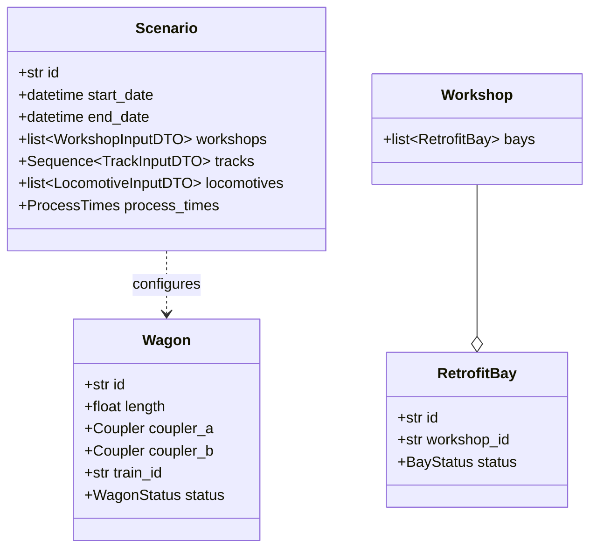

# 3. MVP Domain Model

## 3.1 Domain Model Overview

**Note:** See actual implementation in `popupsim/backend/src/contexts/`

The MVP domain model follows Domain-Driven Design principles across 4 bounded contexts.

The Configuration context uses Pydantic models/DTOs for input; the Retrofit Workflow
context uses plain dataclass entities and aggregates for the simulation domain. The diagram
below shows the main simulation-domain types (see the linked files for the authoritative
definitions).


```mermaid
classDiagram
    class Scenario {
        +str id
        +datetime start_date
        +datetime end_date
        +list~WorkshopInputDTO~ workshops
        +Sequence~TrackInputDTO~ tracks
        +list~LocomotiveInputDTO~ locomotives
        +ProcessTimes process_times
    }

    class Wagon {
        +str id
        +float length
        +Coupler coupler_a
        +Coupler coupler_b
        +str train_id
        +WagonStatus status
    }

    class Workshop {
        +list~RetrofitBay~ bays
    }

    class RetrofitBay {
        +str id
        +str workshop_id
        +BayStatus status
    }

    Scenario ..> Wagon : configures
    Workshop --o RetrofitBay
```

**Authoritative definitions:**
- `Scenario`, `ProcessTimes`, `Topology`: `contexts/configuration/domain/models/`
- Input DTOs (`WorkshopInputDTO`, `TrackInputDTO`, ...): `contexts/configuration/application/dtos/`
- `Wagon`, `Workshop`, `RetrofitBay`: `contexts/retrofit_workflow/domain/entities/`

## 3.2 Configuration Context Models

**Actual implementation:** `popupsim/backend/src/contexts/configuration/domain/models/`

### Scenario (abridged)

The real `Scenario` model carries more than shown here (selection strategies, parking
thresholds, locomotive strategies, and a `task_priorities` map). See `scenario.py` for the
full definition.

```python
from datetime import datetime
from pydantic import BaseModel


class Scenario(BaseModel):
    """Scenario configuration for simulation (abridged)."""

    id: str
    start_date: datetime
    end_date: datetime
    workshops: list[WorkshopInputDTO] | None = None
    tracks: Sequence[TrackInputDTO] = []
    locomotives: list[LocomotiveInputDTO] | None = None
    routes: list[RouteInputDTO] | None = None
    process_times: ProcessTimes | None = None
    trains: Any | None = None
    # ... plus selection strategies, parking thresholds, task_priorities, etc.
```

### WorkshopInputDTO

Workshops are provided as input DTOs (`application/dtos/workshop_input_dto.py`):

```python
class WorkshopInputDTO(BaseModel):
    """Workshop configuration input."""

    id: str
    track: str
    retrofit_stations: int
```

## 3.3 Retrofit Workflow Domain Services

**Actual implementation:** `popupsim/backend/src/contexts/retrofit_workflow/domain/services/`

Domain services are pure business logic (no SimPy dependencies). The signatures below are
representative; see the linked files for the authoritative definitions.

### Batch Formation Service

`batch_formation_service.py` builds batches for the different transport legs, e.g.
`form_batch_for_retrofit_track(...)`, `form_batch_for_workshop(...)`,
`form_batch_for_parking_track(...)`, plus `create_batch_aggregate(...)` and `can_form_batch(...)`:

```python
class BatchFormationService:
    """Form wagon batches (no SimPy dependencies)."""

    def form_batch_for_workshop(self, wagons: list[Wagon], ...) -> Batch:
        """Form a batch of wagons for workshop processing."""
        ...
```

### Workshop Scheduling Service

`workshop_scheduling_service.py` schedules a batch onto a workshop and returns a
`SchedulingResult`:

```python
class WorkshopSchedulingService:
    """Schedule wagon batches to workshops (no SimPy dependencies)."""

    def schedule_batch(self, wagons: list[Wagon], workshop: Workshop) -> SchedulingResult:
        """Schedule wagons for workshop processing."""
        ...

    def can_workshop_handle_batch(self, batch_size: int, workshop: Workshop) -> bool:
        """Check whether the workshop can accept a batch of this size."""
        ...
```

## 3.4 Validation Result

Configuration validation uses `ValidationResult` from `shared/validation/base.py`, which
collects a list of `ValidationIssue`s (each with a level) rather than separate error/warning
string lists:

```python
from dataclasses import dataclass, field


@dataclass
class ValidationResult:
    """Result of validation process."""

    is_valid: bool
    issues: list[ValidationIssue] = field(default_factory=list)

    def has_errors(self) -> bool:
        return any(i.level == ValidationLevel.ERROR for i in self.issues)

    def get_errors(self) -> list[ValidationIssue]:
        return [i for i in self.issues if i.level == ValidationLevel.ERROR]
```

The multi-layer validation pipeline lives under `shared/validation/`
(see [ADR-002](../architecture/decisions/ADR-002-4-layer-validation-framework.md)).

## 3.5 Simulation Result

The simulation result is defined in `application/simulation_service.py`:

```python
from dataclasses import dataclass
from typing import Any


@dataclass
class SimulationResult:
    """Result of simulation execution."""

    metrics: dict[str, Any]
    duration: float
    success: bool
```

Aggregated KPIs (completion rate, throughput, workshop/locomotive statistics) are written to
`summary_metrics.json` by the event collector and exporters; see
[Running the Simulation](../../tutorial/10-running-simulation.md#output-files).

## 3.6 Type Hints

All code includes explicit type annotations per project rules
([ADR-005](../architecture/decisions/ADR-005-type-hints-mandatory.md)); MyPy runs in strict
mode (`disallow_untyped_defs = true`). Example:

```python
def can_workshop_handle_batch(self, batch_size: int, workshop: Workshop) -> bool:
    """Check whether the workshop can accept a batch of this size."""
    ...
```

## 3.7 Migration Path

The simplified MVP domain model can be extended to full DDD implementation:

### Phase 1 (Post-MVP): Rich Domain Model
- Aggregate roots with invariants
- Domain services for complex business logic
- Repository pattern for persistence

### Phase 2: Event Sourcing
- Event store implementation
- Event-driven state reconstruction
- Temporal queries

### Phase 3: Advanced DDD
- Specification pattern for complex queries
- Domain events with saga pattern
- CQRS for read/write separation

**Effort:** Estimated 2-3 weeks for full DDD migration (to be validated)
