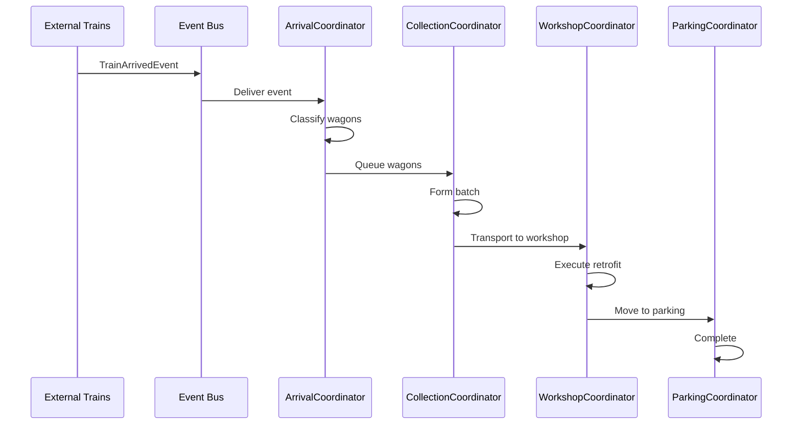

# 5. MVP Data Flow

## Overview

Data flows through 4 bounded contexts: Configuration → Railway Infrastructure → External Trains → Retrofit Workflow.

## End-to-End Flow

```
┌─────────────────────────────────────────┐
│   1. Configuration Context              │
│   Load & validate scenario              │
└──────────────┬──────────────────────────┘
               │ Scenario
               ├──────────────────────────┐
               │                          │
┌──────────────▼──────────┐  ┌───────────▼──────────┐
│ 2. Railway Infrastructure│  │ 3. External Trains   │
│    Build tracks          │  │    Schedule arrivals │
└──────────────┬──────────┘  └───────────┬──────────┘
               │ Track state              │ Events
               │                          │
               └──────────┬───────────────┘
                          │
               ┌──────────▼──────────────────────┐
               │ 4. Retrofit Workflow            │
               │    Execute simulation           │
               │    Collect metrics              │
               └──────────┬──────────────────────┘
                          │ Results
                          ▼
                    CSV + Charts
```

## Phase 1: Configuration Loading

### Input
```
scenario_dir/
├── scenario.json
├── tracks.json
├── workshops.json
├── locomotives.json
├── routes.json
└── trains.csv
```

### Process

```python
from contexts.configuration.domain.configuration_builder import ConfigurationBuilder

builder = ConfigurationBuilder(Path("scenario_dir"))
scenario = builder.build()
```

### Output

```python
Scenario(
    id="demo",
    start_date=datetime(2025, 1, 1),
    end_date=datetime(2025, 1, 2),
    trains=[...],
    tracks=[...],
    workshops=[...],
    locomotives=[...],
    routes=[...]
)
```

## Phase 2: Railway Infrastructure Setup

### Input: Scenario

### Process

```python
from contexts.railway_infrastructure.application.railway_context import RailwayContext

railway = RailwayContext(scenario)
# Builds track groups, initializes capacity management
```

### Output

```python
RailwayContext(
    track_groups={
        'collection': TrackGroup([Track(...), Track(...)]),
        'retrofit': TrackGroup([Track(...)]),
        'parking': TrackGroup([Track(...)])
    },
    track_selector=TrackSelector(...),
    capacity_service=CapacityService(...)
)
```

## Phase 3: External Trains Initialization

### Input: Scenario

### Process

```python
from contexts.external_trains.application.external_trains_context import ExternalTrainsContext

external_trains = ExternalTrainsContext(env, scenario, event_bus)
external_trains.initialize_arrivals()
# Schedules train arrival events
```

### Output

Scheduled SimPy processes that publish TrainArrivedEvent at specified times.

## Phase 4: Retrofit Workflow Execution

### Input: Scenario + Railway + External Trains

### Process

```python
from contexts.retrofit_workflow.application.retrofit_workflow_context import RetrofitWorkflowContext

workflow = RetrofitWorkflowContext(env, scenario, railway, external_trains)
workflow.run()
```

### Data Flow Within Workflow

```
TrainArrivedEvent
    ↓
ArrivalCoordinator
    ↓ (classify wagons)
CollectionCoordinator
    ↓ (form batches)
WorkshopCoordinator
    ↓ (retrofit)
ParkingCoordinator
    ↓ (to parking)
Metrics Collection
```

### Output

```python
{
    'wagon_events': [...],
    'locomotive_events': [...],
    'workshop_events': [...]
}
```

## Phase 5: Results Export

### Input: Metrics

### Process

```python
metrics = workflow.get_metrics()
workflow.export_events(output_path)
```

### Output

```
output/
├── wagon_events.csv
├── locomotive_events.csv
├── workshop_events.csv
└── charts/
    ├── throughput.png
    └── utilization.png
```

## Data Transformations

| Phase | Input | Output | Context |
|-------|-------|--------|---------|
| 1 | JSON/CSV files | Scenario | Configuration |
| 2 | Scenario | Track infrastructure | Railway Infrastructure |
| 3 | Scenario | Scheduled arrivals | External Trains |
| 4 | All above | Metrics | Retrofit Workflow |
| 5 | Metrics | CSV/Charts | Retrofit Workflow |

## Event Flow



## Error Handling

```python
try:
    # Load configuration
    scenario = builder.build()
except ValidationError as e:
    logger.error(f"Configuration error: {e}")
    sys.exit(1)

try:
    # Run simulation
    workflow.run()
except SimulationError as e:
    logger.error(f"Simulation error: {e}")
    # Export partial results
    workflow.export_events(output_path)
    sys.exit(2)
```

---
