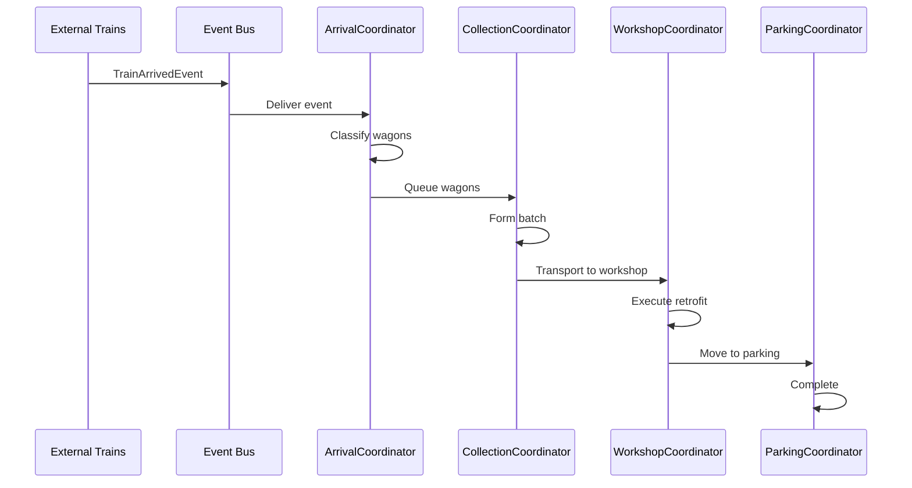

# 5. MVP Data Flow

## Overview

Data flows through 4 bounded contexts: Configuration → Railway Infrastructure → External Trains → Retrofit Workflow.

## End-to-End Flow

```
┌─────────────────────────────────────────┐
│   1. Configuration Context              │
│   Load & validate scenario              │
└──────────────┬──────────────────────────┘
               │ Scenario
               ├──────────────────────────┐
               │                          │
┌──────────────▼──────────┐  ┌───────────▼──────────┐
│ 2. Railway Infrastructure│  │ 3. External Trains   │
│    Build tracks          │  │    Schedule arrivals │
└──────────────┬──────────┘  └───────────┬──────────┘
               │ Track state              │ Events
               │                          │
               └──────────┬───────────────┘
                          │
               ┌──────────▼──────────────────────┐
               │ 4. Retrofit Workflow            │
               │    Execute simulation           │
               │    Collect metrics              │
               └──────────┬──────────────────────┘
                          │ Results
                          ▼
                    CSV + JSON files
```

Orchestration is driven by `SimulationApplicationService`
(`application/simulation_service.py`), which registers the four contexts and runs the SimPy
engine.

## Phase 1: Configuration Loading

### Input
```
scenario_dir/
├── scenario.json
├── topology.json
├── tracks.json
├── workshops.json
├── locomotive.json
├── process_times.json
├── routes.json
└── train_schedule.csv
```

### Process

```python
from contexts.configuration.domain.configuration_builder import ConfigurationBuilder

builder = ConfigurationBuilder(Path('scenario_dir'))
scenario = builder.build()
```

### Output

```python
Scenario(
    id='demo',
    start_date=datetime(2025, 12, 1, tzinfo=timezone.utc),
    end_date=datetime(2025, 12, 20, tzinfo=timezone.utc),
    workshops=[...],
    tracks=[...],
    locomotives=[...],
    routes=[...],
    process_times=ProcessTimes(...),
    trains=[...],
    # ... plus selection strategies, parking thresholds, task_priorities
)
```

## Phase 2: Context Wiring & Railway Infrastructure Setup

The application service builds the SimPy engine and the shared infrastructure, then registers
the contexts.

### Process

```python
from application.simulation_service import SimulationApplicationService

service = SimulationApplicationService(scenario, output_dir)
# Internally: creates the SimPy engine, event bus, and registers
# the railway (via create_railway_context / di_container), external_trains,
# and retrofit_workflow contexts.
```

The Railway Infrastructure context is built through its DI factory
(`contexts/railway_infrastructure/infrastructure/di_container.py`) and exposes
`RailwayInfrastructureContext`, which manages `RailwayYard` / `TrackGroup` / `TrackOccupancy`
and provides track selection via `TrackSelectionService`.

## Phase 3: External Trains Initialization

### Process

```python
from contexts.external_trains.application.external_trains_context import ExternalTrainsContext

external_trains = ExternalTrainsContext(event_bus)
external_trains.initialize(infra)
external_trains.start_processes()
# Schedules a SimPy process per train that publishes TrainArrivedEvent at its arrival time
```

### Output

Scheduled SimPy processes that publish `TrainArrivedEvent` at the configured arrival times.

## Phase 4: Retrofit Workflow Execution

### Process

The `RetrofitWorkshopContext` subscribes to train-arrival events and runs its coordinators as
SimPy processes. Execution is driven by the application service:

```python
from shared.infrastructure.simpy_time_converters import timedelta_to_sim_ticks

until = timedelta_to_sim_ticks(scenario.end_date - scenario.start_date)
result = service.execute(until)   # runs the SimPy engine until `until`
```

### Data Flow Within Workflow

```
TrainArrivedEvent
    ↓
ArrivalCoordinator
    ↓ (classify wagons)
CollectionCoordinator
    ↓ (form batches, transport to retrofit track)
WorkshopCoordinator
    ↓ (retrofit)
ParkingCoordinator
    ↓ (to parking)
EventCollector (metrics)
```

### Output

A `SimulationResult` (`metrics: dict`, `duration: float`, `success: bool`), with events held
by the `EventCollector` for export.

## Phase 5: Results Export

### Process

```python
# From main.py after a successful run:
retrofit_context.export_events(str(output_path))
```

### Output

Flat CSV/JSON files in the output directory (no chart images). Key files:

```
output/
├── summary_metrics.json
├── wagon_journey.csv
├── rejected_wagons.csv
├── locomotive_movements.csv
├── workshop_metrics.csv
├── resource_states.csv
├── resource_locations.csv
└── resource_processes.csv
```

See [Running the Simulation](../../tutorial/10-running-simulation.md#output-files) for the
full file list and column descriptions.

## Data Transformations

| Phase | Input | Output | Context |
|-------|-------|--------|---------|
| 1 | JSON/CSV files | Scenario | Configuration |
| 2 | Scenario | Track infrastructure | Railway Infrastructure |
| 3 | Scenario | Scheduled arrivals | External Trains |
| 4 | All above | SimulationResult + collected events | Retrofit Workflow |
| 5 | Collected events | CSV/JSON files | Retrofit Workflow |

## Event Flow


```mermaid
sequenceDiagram
    participant ET as External Trains
    participant EB as Event Bus
    participant AC as ArrivalCoordinator
    participant CC as CollectionCoordinator
    participant WC as WorkshopCoordinator
    participant PC as ParkingCoordinator
    
    ET->>EB: TrainArrivedEvent
    EB->>AC: Deliver event
    AC->>AC: Classify wagons
    AC->>CC: Queue wagons
    CC->>CC: Form batch
    CC->>WC: Transport to workshop
    WC->>WC: Execute retrofit
    WC->>PC: Move to parking
    PC->>PC: Complete
```

## Error Handling

Configuration problems surface during `ConfigurationBuilder.build()` (Pydantic validation
errors / the validation pipeline). The `run` command reports them and exits non-zero.

The simulation reports success via `SimulationResult.success`; `main.run()` checks it and
exits with a non-zero code on failure:

```python
result = service.execute(until)
if not result.success:
    typer.echo('\nSIMULATION FAILED')
    raise typer.Exit(1)
```

If the engine stops before the requested `until` time, the application service logs a warning
about a likely deadlock or early completion.

---
