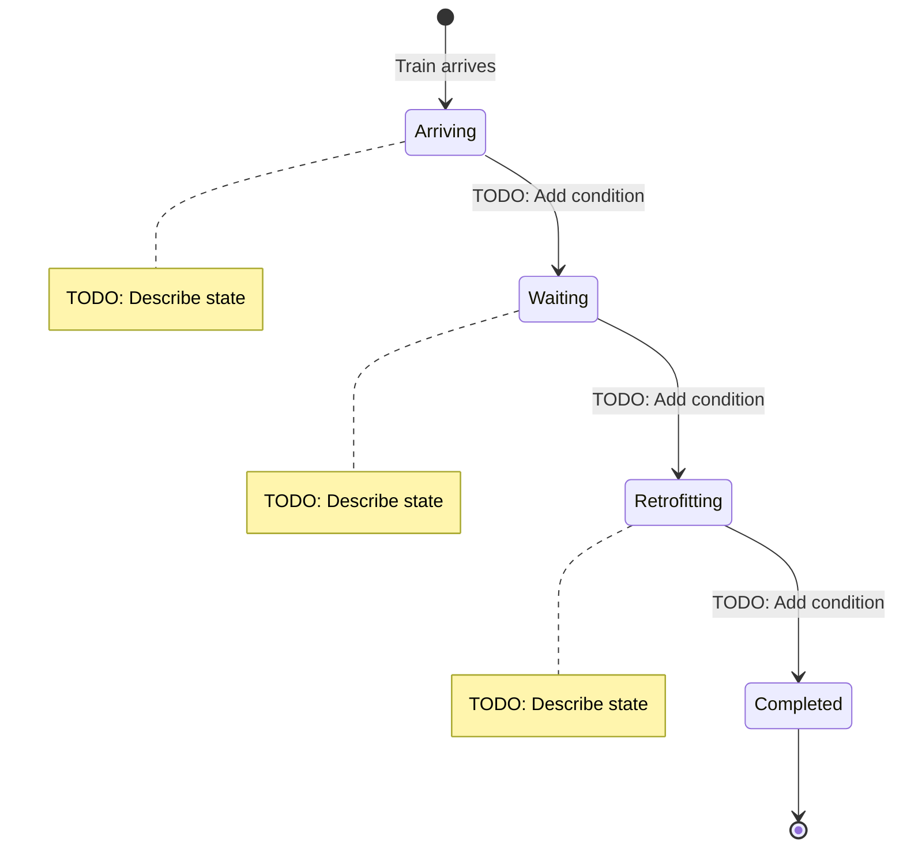
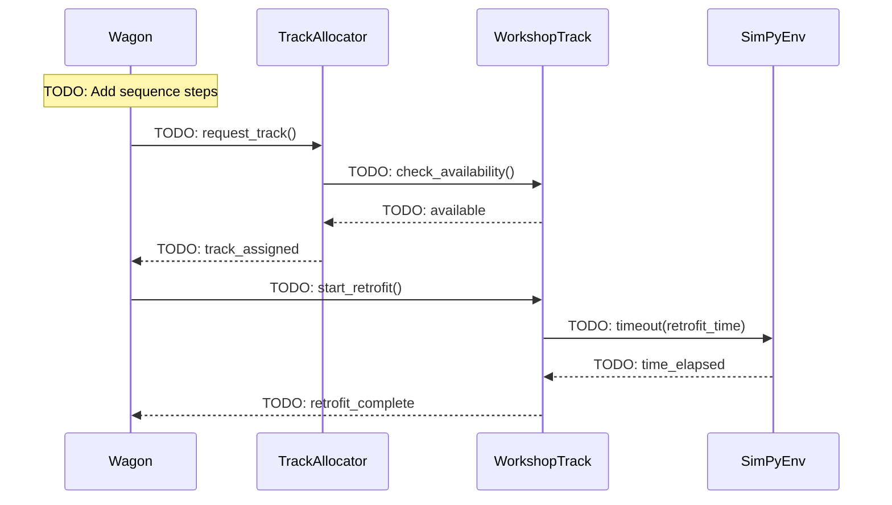
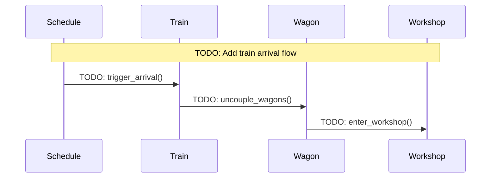
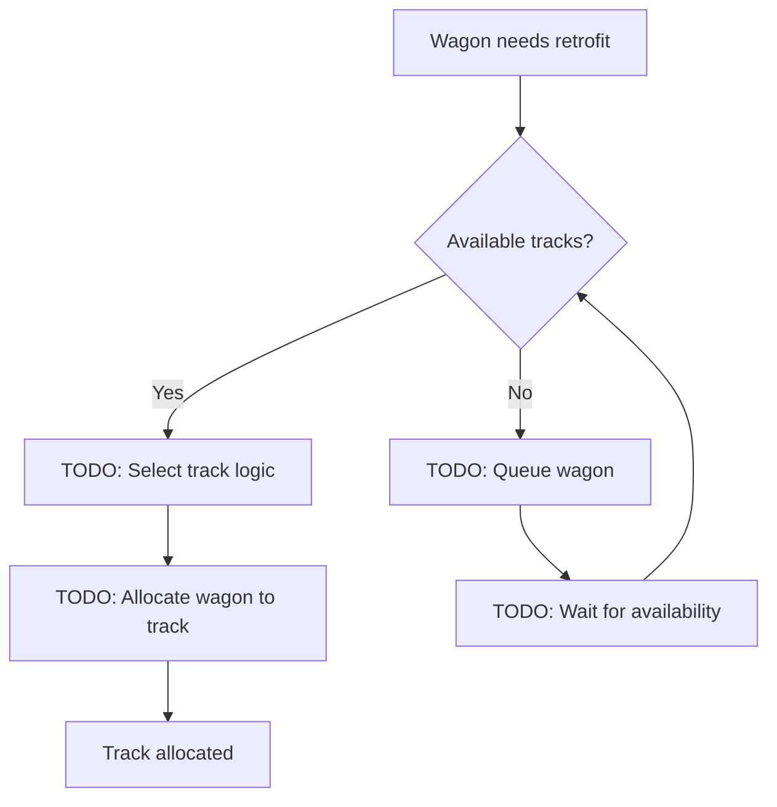

# 11. MVP Domain Processes

## Overview

This document describes the core domain processes and workflows in the MVP simulation.

**Note:** See [Domain Model](03-mvp-domain-model.md) for entity definitions.

---

## 11.1 Wagon Lifecycle

### Wagon State Machine

### State Descriptions

| State | Description | Entry Condition | Exit Condition |
|-------|-------------|-----------------|----------------|
| **Arriving** | TODO | TODO | TODO |
| **Waiting** | TODO | TODO | TODO |
| **Retrofitting** | TODO | TODO | TODO |
| **Completed** | TODO | TODO | TODO |

---

## 11.2 Wagon Retrofit Process

### Sequence Diagram

### Process Steps

1. **TODO: Step 1**
   - Input: TODO
   - Action: TODO
   - Output: TODO

2. **TODO: Step 2**
   - Input: TODO
   - Action: TODO
   - Output: TODO

3. **TODO: Step 3**
   - Input: TODO
   - Action: TODO
   - Output: TODO

---

## 11.3 Train Arrival Process

### Sequence Diagram

### Process Steps

TODO: Describe train arrival process

---

## 11.4 Track Allocation Process

### Decision Flow

### Allocation Rules

TODO: Describe track allocation rules:
- Priority rules
- Capacity checks
- Selection criteria

---

## 11.5 Workshop Capacity Management

### Capacity Check Process

TODO: Describe how workshop capacity is managed

### Overflow Handling

TODO: Describe what happens when workshop is at capacity

---

## 11.6 Error Scenarios

### Scenario 1: Workshop at Capacity

**Trigger:** TODO

**Process:**
1. TODO: Step 1
2. TODO: Step 2
3. TODO: Step 3

**Recovery:** TODO

### Scenario 2: Invalid Track Assignment

**Trigger:** TODO

**Process:**
1. TODO: Step 1
2. TODO: Step 2

**Recovery:** TODO

### Scenario 3: Retrofit Timeout

**Trigger:** TODO

**Process:**
1. TODO: Step 1
2. TODO: Step 2

**Recovery:** TODO

---

## 11.7 Performance Complexity

### Algorithmic Complexity

| Operation | Complexity | Notes |
|-----------|------------|-------|
| **Configuration Loading** | O(n) | n = number of tracks |
| **Simulation Execution** | O(w × t) | w = wagons, t = time steps |
| **Track Allocation** | O(k) | k = number of tracks |
| **KPI Calculation** | O(w) | w = wagons processed |

### Scalability Considerations

TODO: Describe scalability limits and bottlenecks

---

## See Also

- **[Business Rules](business-rules.md)** - Consolidated business rules (FOR REVIEW)
- **[Examples](examples.md)** - Synthetic workshop scenarios and test data
- **[Domain Model](03-mvp-domain-model.md)** - Entity definitions

