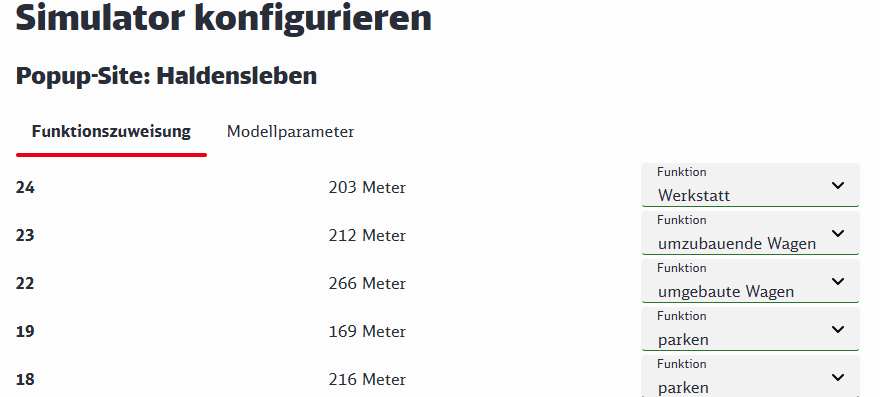
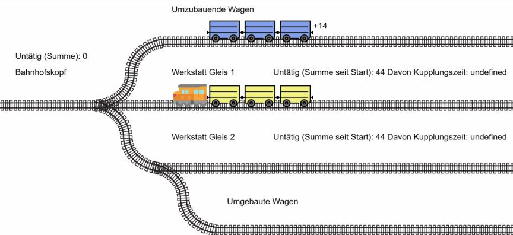

# Konzept PopUpSim

zur Simulation der schlagartigen Umrüstung auf DAK

**April 2025**

Frederik Schäfer
DB Cargo AG

---

## Änderungshistorie

| Version | Datum | Beschreibung |
|---------|-------|--------------|
| 1.0 | 28.03.2025 | Erster Entwurf |

---

## Inhaltsverzeichnis

1. [Zusammenfassung](#1-zusammenfassung)
2. [Abkürzungen / Glossar](#2-abkurzungen-glossar)
3. [Einordnung und Zusammenhänge](#3-einordnung-und-zusammenhange)
   - 3.1 [DAK Migration: ca. 500 Tsd. Wagen sind umzubauen](#31-dak-migration-ca-500-tsd-wagen-sind-umzubauen)
   - 3.2 [DAK Migration DSS: Unterstützung von Planung & Durchführung](#32-dak-migration-dss-unterstutzung-von-planung-durchfuhrung)
   - 3.3 [PopUp Sim: Erste Demo für Big-Bang-Simulation vorhanden](#33-popup-sim-erste-demo-fur-big-bang-simulation-vorhanden)
4. [PopUpSim: Die Zielvision](#4-popupsim-die-zielvision)
   - 4.1 [User-Stories aus verschiedenen Phasen der Migration](#41-user-stories-aus-verschiedenen-phasen-der-migration)
   - 4.2 [Ablauf der Anwendung](#42-ablauf-der-anwendung)
5. [MVP: Geschäftslogik zuerst](#5-mvp-geschaftslogik-zuerst)
6. [Ausblick: Mit fachlich relevanten Ergebnissen nächste Schritte anstoßen](#6-ausblick-mit-fachlich-relevanten-ergebnissen-nachste-schritte-anstossen)

## Abbildungsverzeichnis

- Abb. 1: Ablauf der Anwendung
- Abb. 2: Konfiguration im Prototyp von PopUpSim
- Abb. 3: Visualisierung des Simulationsablaufs in PopUpSim Prototyp
- Abb. 4: Mock-Up Visualisierung Simulationsablauf in PopUpSim
- Abb. 5: Mock-Up Ansicht Statistik

---

## 1 Zusammenfassung

Der kurze Zeitraum der europaweiten, schlagartigen Umrüstung einer Teilflotte von Güterwagen, genannt „Big Bang", im Rahmen der DAK Migration ist ein kritischer Moment, der durch eine Simulation sowohl strategisch als auch im Detail zu planen und validieren ist.

Dafür wurde bereits ein Prototyp „PopUpSim" erstellt, der zu einem Minimal Viable Product (MVP) ausgebaut werden soll. Da der Big-Bang methodisch weitgehend getrennt von der übrigen DAK Migration betrachtet werden kann, eignet er sich für ein separates Modul im Rahmen eines größeren „DAC Migration DSS".

Im Rahmen der MVP Entwicklung steht die Simulation (=Geschäftslogik, Abbildung der Abläufe) im Vordergrund. Eine angemessene Visualisierung der Ergebnisse („Film" Simulationsablauf, Statistiken) soll ebenfalls umgesetzt werden. Die Benutzer:innen Schnittstelle, insbesondere für den Aufbau der Szenarien (Komfort Dateneingabe, Anlage von Gleistopologie usw.) kann auf sehr niedrigen Niveau gehalten werden, um Aufwände gering zu halten. Ebenso können auf Ebene MVP die nicht-funktionalen Anforderungen auf ein sehr geringes Maß reduziert werden.

---

## 2 Abkürzungen / Glossar

| Abkürzung | Erklärung |
|-----------|-----------|
| **Big-Bang** | Zeitraum von wenigen Wochen in denen eine Vielzahl von vorgerüsteten Wagen von Schraubkupplung auf Digitale Automatische Kupplung umgerüstet werden. |
| **DAK / DAC** | Digital Automatische Kupplung |
| **DAC-Ready** | Migrationsmethode bei der der Umbau zweischrittig erfolgt. Zuerst werden die Wagen für die DAK vorgerüstet, behalten aber äußerlich die Schraubkupplungen. In einem zweiten, vom Arbeitsaufwand her auf ein Minimum reduziertem Schritt (→Big Bang) werden Schraubkupplungen entfernt und DAK-Kupplungsköpfe aufgesetzt. |
| **DSS** | Decision Support System, Entscheidungsunterstützungssystem |
| **MVP** | Minimal Viable Product (minimales gebrauchstaugliches Produkt) |
| **Pop-Up-Werkstatt** | Werkstatt, in der vorgerüstete Wagen in großer Anzahl von Schraubkupplung auf Digitale Automatische Kupplung umgerüstet werden. Häufig sind diese Werkstätten nur vorübergehend für diesen Zweck eingerichtet. |

---

## 3 Einordnung und Zusammenhänge

### 3.1 DAK Migration: ca. 500 Tsd. Wagen sind umzubauen

Im Rahmen der DAK Migration werden europaweit rund 500 Tsd. Güterwagen, Lokomotiven und Arbeitsfahrzeuge von der Schraubkupplung auf die Digitale Automatische Kupplung (DAK) umgerüstet. Stand heute findet die flächendeckende Migration in den Jahren 2029-2034 statt.

Für die Durchführung der DAK-Migration wurden verschiedene Methoden entwickelt. Eine aussichtsreiche, aber auch sehr anspruchsvolle Methode, ist DAC Ready. Diese sieht vor, dass aufwändige Umbauarbeiten über einen längeren Zeitraum (z.B. 4 Jahre) verteilt in den üblichen Werkstätten durchgeführt werden. Die Wagen verlassen die Werkstatt wieder mit Schraubkupplungen. In einem kurzen Zeitraum (z.B. 3 Wochen), dem sogenannten Big-Bang, wird die Schraubkupplung entfernt und mit nur noch vergleichsweise geringem Aufwand der DAK-Kupplungskopf eingesetzt. So werden längere Betriebsunterbrechungen oder -erschwernisse durch inkompatible Kupplungen an Wagen vermieden. Die Abläufe im Big-Bang allerdings sind zeitkritisch und erfordern die Behandlung vieler Wagen.

### 3.2 DAK Migration DSS: Unterstützung von Planung & Durchführung

Die Planung der DAK-Migration bedarf aufgrund der Größe des Vorhabens, der Vielzahl der Beteiligten, der hohen verkehrlichen Verflechtungen im Güterverkehr sowie der hohen Bedeutung einer reibungslosen Migration eines besonderen Entscheidungsunterstützungssysteme („DAC Migration DSS").

Das konzipierte DAC Migration DSS soll mehrere Module umfassen, die auf die verschiedenen Phasen (Strategische Planung, Detailplanung, Umsetzungsmonitoring) der Migration ausgelegt sind.

Die Kernfunktionalität des DAC Migration DSS besteht in einem mathematischen Modell, dass die Zusammenhänge zwischen den Kapazitäten der Kupplungshersteller und Werkstätten, den Umbaubedarfen unter Berücksichtigung der Anzahl der Wagen und ihrer verkehrlichen Verwendung sowie den strategischen Zielen der Migration auf makroskopische Ebene abbildet und optimiert.

Eine andere wichtige Funktionalität ist die Simulation der Vorgänge im Big-Bang, an dieser Stelle setzt PopUpSim an. Dieser Funktionalität kommt in allen Phasen eine hohe Bedeutung zu. Da hier methodisch ein anderer Ansatz zum Einsatz kommt (mikroskopisch, Simulation) und die vorhandenen Bezüge zur Kernfunktionalität sich reduzieren lassen, eignet sich die Simulation sehr gut für eine gesonderte Entwicklung.

Das DAC Migration DSS ist als Open-Source-Software (Apache 2.0 Lizenz) konzipiert. Es soll allen Interessierten möglich sein, die Arbeitsweise des Systems zu verstehen und eigene Untersuchungen mit eigenen Daten und Parametern durchzuführen. In der Detailplanungsphase soll es allen Betroffenen für unternehmensinterne Planungen sowie für die übergeordnete Planung auf europäischer Ebene zur Verfügung stehen und für besondere unternehmensspezifische Sachverhalte anpassbar sein. Selbes gilt für die Umsetzungsphase, wobei hier Erweiterungen für Echtzeitdaten erforderlich sind.

Das DAC Migration DSS ist ein von der Open-Rail-Association angenommenes Projekt, ein Repository auf Git-Hub wurde bereits eingerichtet.

**🔗 Repository:** https://github.com/OpenRailAssociation/dac-migration-dss

### 3.3 PopUp Sim: Erste Demo für Big-Bang-Simulation vorhanden

Im Rahmen des gemeinsamen Hackatons von DB, SBB und ÖBB „3-Länderhack" wurde 2024 unter dem Namen „PopUpSim" ein funktionsfähiger aber vom Umfang her sehr stark reduzierter Prototyp für eine Big-Bang-Simulation entwickelt.

**🔗 Demo:** https://openrail-playground.github.io/PopupSim/ („Statische Daten Laden" klicken)

---

## 4 PopUpSim: Die Zielvision

### 4.1 User-Stories aus verschiedenen Phasen der Migration

Die Funktionalität von PopUpSim wird in allen Phasen der Migration benötigt. Hier eine Auswahl von typischen User-Stories von PopUpSim:

#### Strategische Phase

• Als strategische:r Migrationsplaner:in möchte ich standardisierte Entwürfe für Pop-Up Werkstätten entwickeln, um diese dem Projekt zur Verfügung zu stellen.

• Als strategische:r Migrationsplaner:in möchte ich abschätzen, welcher Durchsatz von Wagen in einer Pop-Up-Werkstatt mit bestimmten Layout möglich ist, um zu sehen, wie viele Werkstätten benötigt werden.

#### Detailplanungsphase

• Als Planer:in in einem Unternehmen möchte ich einfach Infrastrukturdaten importieren und den Gleisen komfortabel Funktionen zuweisen, um schnell weiter arbeiten zu können.

• Als Planer:in im Unternehmen möchte ich eine Abschätzung, wie viele Wagen die von mir geplante Werkstatt umrüsten kann, um zu sehen, ob die Kapazität ausreichend ist oder weiter erhöht werden muss.

• Als Planer:in im Unternehmen möchte ich den Output grafisch und tabellarisch übersichtlich dargestellt bekommen, damit ich die Ergebnisse schnell verstehe.

• Als Deployment Manger:in möchte ich sehen, ob die Planungen der einzelnen Unternehmen zusammenpassen, um zu erkennen, ob auf europäischer Ebene das strategische Ziel erreichbar ist.

#### Umsetzungsphase

• Als Disponent:in möchte ich wissen, welche Wagen als nächstes der Werkstatt zugeführt werden sollen, damit ich Dispositionsentscheidungen treffen kann.

• Als Deployment Manger:in möchte ich den Fortschritt überwachen um ggf. Gegenmaßnahmen einleiten zu können.

### 4.2 Ablauf der Anwendung

*Infrastrukturdaten → Datenvorbereitung → Simulation (=Geschäftslogik) → Ergebnisvisualisierung*

#### 4.2.1 Datenvorbereitung & Szenarioaufbau

Am Anfang einer Anwendung von PopUpSim steht der Aufbau der für die Simulation zur Verfügung stehenden Gleisinfrastruktur und die Festlegung von Ressource und Parametern. Das beinhaltet:

• Aufbau der Gleistopologie (ggf. Import aus bestehender Quelle, z.B. DaVit)

• Die Zuweisung von spezifischen Funktionalitäten im Rahmen der DAK-Migration (z.B. Gl. 12 in Musterstadt ist auf 455 m Länge Sammelgleis)

• Anlegen von Ressourcen wie Werkstätte, Loks und Wagenmeister:innen

• Konfiguration weiterer Parameter wie z.B. Zeitverbräuche (Die Werkstatt braucht x min zur Umrüstung eines Wagens, die Fahrt von Beispielstadt nach Musterort dauert 85 min.)

• Missionen für Betriebsmittel festlegen (z.B. Lok 1 holt Wagen ab, sobald Gleis 12 in Musterstadt zu 80% voll ist und fährt zu Werkstattbahnhof Beispielort)

#### 4.2.2 Simulation: Vom Betrieb in die Werkstatt und zurück

Die Simulation besteht auf folgenden wesentlichen Teilen:

• **Selektionsmechanismus:** Die Auswahl von Wagen für die Zuführung zur Umrüstung an bestimmten Punkten.

• **Das Bewegen von Wagen** zwischen einzelnen Standorten im Rahmen des Umbauvorgangs (Sammelgleis, Zuführungsgleis, Werkstatt, Sammelgleis für Parkplatz, Parkplatz) unter Verwendung von Ressourcen wie Gleiskapazität, Rangierlokomotiven, Werkstattkapazität, Personalen für Zugvorbereitung sowie Zeitverbräuchen.

• **Rückführen der Wagen** in den Betrieb.

**Nicht abgebildet werden:**
- Die einzelnen Umrüstungshandlungen am Wagen sofern der Wagen nicht bewegt wird (Abgrenzung zu einer allgemeinen Werkstattsimulation)
- Fahrzeiten zwischen verschiedenen Gleisen nur pauschalisiert angenommen und keine tiefergehende Berechnung z.B. aufgrund von Streckenbelegung durch andere Züge oder Fahrdynamik (Abgrenzung zu eisenbahnbetriebswissenschaftlicher Simulation)

#### 4.2.3 Ergebnisvisualisierung: „Film" und „Statistik"

Sowohl der Ablauf der Simulation kann als „Film Simulationsablauf" verfolgt werden und es steht eine Ansicht mit Kennzahlen, Graphen und Diagrammen zur Verfügung.

---

## 5 MVP: Geschäftslogik zuerst

Mit dem im Rahmen des 3-LH erstellten Prototypen von PopUpSim ist es gelungen, die Aufgaben der Simulation des „Big-Bangs" zu verdeutlichen und auch zu zeigen, dass alle benötigten Bestandteile auf einem noch unterhalb der Gebrauchstauglichkeit liegendem Niveau in kurzer Zeit implementierbar sind.

Der nächste Schritt der Entwicklung ist ein „Minimal Viable Produkt", das eine Gebrauchstauglichkeit aufweisen muss, d.h. es muss in der Lage sein, reale Probleme zu lösen und die Ergebnisse angemessen darzustellen.

Dementsprechend liegt der Schwerpunkt auf der Implementierung der Geschäftslogik (=Simulation). Bei Nutzerschnittstelle und -erfahrung sind, insbesondere bei der Dateneingabe, deutliche Abstriche möglich. Die Visualisierung sollte hingegen einen gewissen Reifegrad erreichen, da dies ein zentraler Hebel für die Akzeptanz durch Praktiker:innen und damit weiterer Entwicklungsschritte ist.

### Nicht-funktionale Anforderungen

| Aspekt | Anforderung |
|--------|-------------|
| **Ziel der Anwendung** | Erstellen und Bewerten von Beispielplänen für Pop-Up-Workshops im begrenzten Umfang |
| **Art der Anwendung** | Einfach, z.B. auf lokalen Rechner der Anwender:innen |
| **Schutzklasse** | Niedrig, Output dient der unternehmensübergreifenden Diskussion. Späteres Anheben der Schutzklasse soll ohne übermäßigen Aufwand möglich sein. |
| **Vertraulichkeitsklasse** | Vergleichbar DB offen, relevante Ergebnisse werden veröffentlicht. Späteres Anheben der Vertraulichkeitsklasse soll ohne übermäßigen Aufwand möglich sein. |
| **Anwender:innen** | Stark begrenzte Anzahl versierter Anwender:innen |
| **Sprache Schnittstelle** | Deutsch, Englisch zulässig (z.B. bei Weitergabe von Fehlermeldungen aus Datenbanken, Paketen u.Ä.). Spätere Mehrsprachigkeit soll herstellbar sein. |

### Datenaufbereitung & Szenarioaufbau

| Funktion | Anforderung |
|----------|-------------|
| **Gleistopologie aufbauen** | Manuell über z.B. csv, json, …. Rendern (optional: in Echtzeit) des Gleisplans möglich. Optional: Eingabemaske, rudimentäre Plausibilitätskontrolle |
| **Funktionszuweisung der Gleise** | Manuell über z.B. csv, json, …. Optional: Eingabemaske |
| **Anlage Ressourcen** | Manuell über. z.B. csv, json, …. Optional: Eingabemaske |
| **Konfiguration & Zeitverbräuche** | Manuell über z.B. csv, json, …. Optional: Eingabemaske, Berechnungshilfe |
| **Definition von Missionen / Entscheidungsregeln** | Manuell über z.B. csv, json, Begrenzte Anzahl an Entscheidungsmöglichkeiten. Optional: rudimentäre Plausibilitätskontrolle, Eingabemaske |

### Simulation

| Aspekt | Anforderung |
|--------|-------------|
| **Anzahl der Elemente (Wagen usw.)** | Ca. 10.000 (wenn möglich von vornherein Simulation effizient anlegen um spätere Erweiterung zu vereinfachen) |
| **Vollständigkeit** | Vollständige Abbildung der Geschäftslogik aufgrund von vorgegebenen Zeitverbräuchen, Entscheidungsregeln usw. |
| **Verhalten an Grenzen des simulierten Bereichs** | Keine eisenbahnbetriebliche Simulation. Keine Simulation von Eisenbahnverkehr außerhalb des definierten Simulationsmodells. Einfach Regeln |

### Visualisierung

| Funktion | Anforderung |
|----------|-------------|
| **Ablaufdarstellung** | Ja, Darstellung vorgegebener Gleisplan, Ressourcen und zentraler Kennzahlen. Hervorhebung bestimmter Elemente (z.B. ausgewählter Wagen). Optional: Durch Klicken auf z.B. Wagen weitere Informationen |
| **Statistiken** | Statistiken inkl. Visualisierung zu wichtigen Kenngrößen |

---

## 6 Ausblick: Mit fachlich relevanten Ergebnissen nächste Schritte anstoßen

Mit dem oben definierten MVP kann ein begrenzter Anwender:innenkreis relevante fachliche Ergebnisse erzeugen, die bei ansprechender Visualisierung auf großes Interesse stoßen werden.

Für die flächendeckende Planung der Migration, ist eine Simulation für jede einzelne Werkstatt anzulegen. Hierfür eignet sich das skizzierte MVP noch nicht, weitere Entwicklungsschritte sind notwendig, die beauftragt oder durch die Community geleistet werden müssen.

Das skizzierte MVP ist dazu geeignet, Impulse für die Entwickler:innen-Community als auch die Anwender:innen-Community zu setzen.

---

*Konzept PopUpSim | Frederik Schäfer DB Cargo | April 2025*
