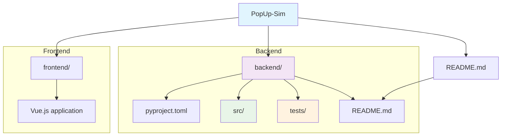

# PopUp-Sim

PopUp-Sim is a microscopic simulation tool that models the European freight rail industry's transition to Digital Automatic Couplers (DAC), simulating the complex logistics of retrofitting 500,000 freight wagons during a critical 3-week "big bang" migration period. The tool helps railway operators test different scenarios for temporary "pop-up" workshops, optimize locomotive schedules, and identify bottlenecks before real-world implementation to avoid costly mistakes during the actual migration.

## Installation
Currently installation is only possible from source. Installation using PyPi maybe added in the future.

### From Source

**Using uv:**
```bash
git clone https://github.com/jhw-db/PopUp-Sim.git
cd PopUp-Sim
uv sync --frozen
```

## Development Setup

### Prerequisites

- Python 3.13 or higher
- [uv](https://docs.astral.sh/uv/) package manager

### Setup Development Environment

1. **Clone the repository:**
   ```bash
   git clone https://github.com/jhw-db/PopUp-Sim.git
   cd PopUp-Sim
   ```

2. **Install uv (if not already installed):**
   ```bash
   # On macOS and Linux
   curl -LsSf https://astral.sh/uv/install.sh | sh

   # On Windows
   powershell -c "irm https://astral.sh/uv/install.ps1 | iex"
   ```

3. **Install dependencies:**
   ```bash
   uv sync --all-extras --dev
   ```

4. **Activate the virtual environment:**
   ```bash
   # On Unix/macOS
   source .venv/bin/activate

   # On Windows
   .venv\Scripts\activate
   ```

5. **Install pre-commit hooks for developers:**
   ```bash
   # in project root
   uv pip install pre-commit
   pre-commit install
   uv run ./setup/dev/set_commit_msg_hooks.py
   ```

### Development Commands

- **Run tests:**
  ```bash
  # in project root/popupsim/backend
  uv run pytest
  ```

- **Format code:**
  ```bash
  uv run ruff format .
  ```

- **Lint code:**
  ```bash
  uv run ruff check .
  ```

- **Type checking:**
  ```bash
  uv run mypy backend/src/
  ```

- **Code quality analysis:**
  ```bash
  uv run pylint backend/src/
  ```

- **Run all checks (format, lint, type check, test):**
  ```bash
  uv run ruff format . && uv run ruff check . && uv run mypy backend/src/ && uv run pylint backend/src/ && uv run pytest
  ```

### Code Quality & Pre-commit Hooks

The project uses pre-commit hooks to ensure code quality. These run automatically on every commit:

- **File checks:** Trailing whitespace, end-of-file fixes, YAML/TOML validation
- **Code formatting:** Ruff formatter (tabs, single quotes, 120 char lines)
- **Linting:** Ruff linter with complexity metrics (bugs, unused code, simplifications, McCabe complexity)
- **Type checking:** MyPy for static type analysis with error codes and column numbers
- **Code quality:** Pylint for comprehensive code quality analysis

**Manual pre-commit run:**
```bash
uv run pre-commit run --all-files
```

### Project Structure



## Example Scenarios

The project includes example scenarios to help you get started:

- **[Small Scenario](../../Data/examples/small_scenario/README.md)** - Minimal simulation with 2 trains (20 wagons) and 1 workshop track for quick testing
- **[Medium Scenario](../../Data/examples/medium_scenario/README.md)** - Medium-scale simulation with 4 trains (160 wagons) and 2 workshop tracks
- **[Large Scenario](../../Data/examples/large_scenario/README.md)** - Large-scale simulation with 10 trains (500 wagons) and 2 workshop tracks, demonstrating high operational complexity

Each example scenario includes:
- `scenario.json` - Main configuration file
- `train_schedule.csv` - Train arrival schedule and wagon details
- `workshop_tracks.csv` - Workshop track configuration
- `routes.csv` - Route network between tracks
- `README.md` - Detailed scenario documentation

## Contributing

1. Fork the repository
2. Create a feature branch (`git checkout -b feature/amazing-feature`)
3. Make your changes
4. Run the development checks to ensure code quality
5. Commit your changes (`git commit -m 'Add amazing feature'`)
6. Push to the branch (`git push origin feature/amazing-feature`)
7. Open a Pull Request

## License

This project is licensed under the Apache 2.0 License - see the [LICENSE](LICENSE) file for details.

## Acknowledgments

- The initial version used as foundation was created during Dreiländerhack 2024 with support of ÖBB, DB, and SBB
